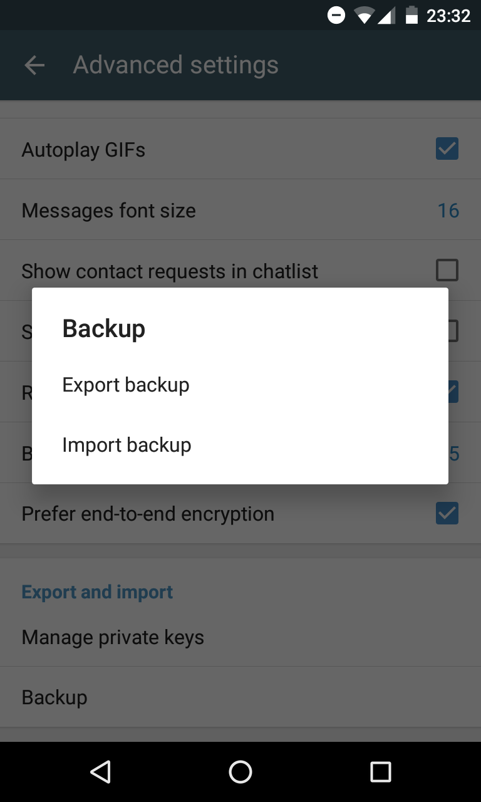

اینجا Delta Chat 0.9.5 با قابلیت **پشتیبان‌گیری** جدید است.
این تابع همهٔ داده‌های مرتبط را در یک فایل واحد می‌نویسد — شامل همهٔ چت‌ها، تصاویر، مخاطبین، ویدیوها، پیام‌های صوتی، همهٔ فایل‌ها و بیشتر.
وقتی بعداً اپ را دوباره نصب کنید — روی دستگاهی دیگر یا از منبعی دیگر — می‌توانید فایل صادرشده را درست در صفحهٔ «خوش‌آمد» وارد کنید.
خیلی مفید :)

تغییرات بیشتر ...

* تابع صدور و ورود پشتیبان
* پرسیدن رمز عبور قبل از صدور
* انتقال پاسخ‌ها از کلاینت‌های عادی ایمیل به پوشهٔ «Chats»
* بهبود کمک به MUAها در نمایش رشته‌های چت
* بهبود onboarding
* افزودن URL به پاورقی پیش‌فرض
* آزمایش رویکردی متفاوت برای صرفه‌جویی باتری در این انتشار
* به‌روزرسانی ترجمه‌های فرانسوی، ایتالیایی، آلمانی، لهستانی، پرتغالی، روسی و اوکراینی

... مسائل «کاهش پیام‌های ناخواسته» را تمام نکردیم و هنوز چیزهایی برای آزمایش باتری هست — با این حال، نمی‌خواستیم برای
سایر قابلیت‌ها زیاد منتظر بمانید — پس، اینجاست — مثل همیشه به‌زودی روی [F-Droid](https://f-droid.org/packages/com.b44t.messenger/) در دسترس.

ضمناً: این صفحهٔ خانگی هم قابل ترجمه است — جدیدترین زبان ما روسی است — [delta.chat/ru](https://delta.chat/ru) — Спасибо, Dmitry!

و یک چیز دیگر: همیشه به‌دنبال **دستگاه‌های آزمایشی** هستیم.
اگر دستگاه‌های قدیمی‌تر اما کارآمد Android یا iOS (!) در کشو دارید — اگر دیگر به آن‌ها نیاز ندارید، آزادانه آن‌ها را به
_Delta Chat, Friedrich-Ebert-Str. 1 B, 25348 Glückstadt, Germany_ بفرستید
