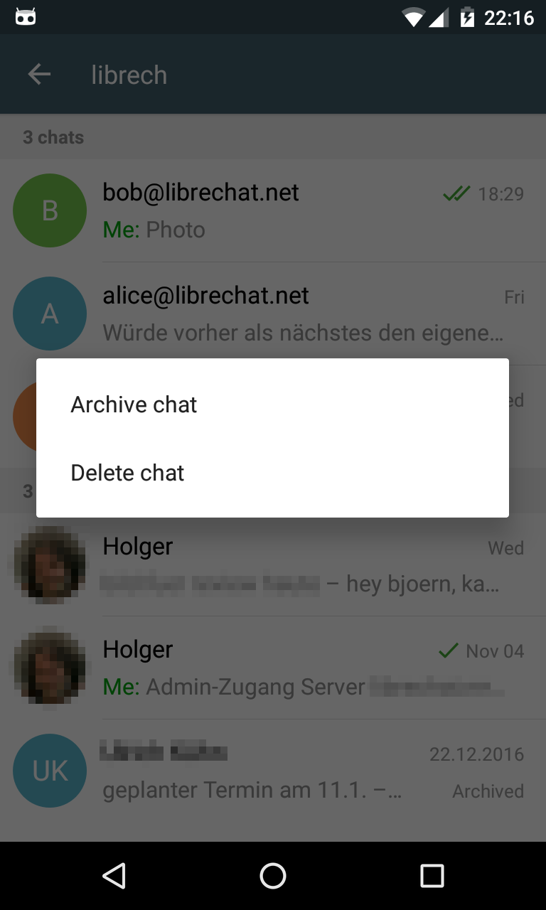

همین الان Delta Chat 0.9.7 را با چند قابلیت مهم جدید منتشر کردیم:

* **آرشیو کردن چت‌ها** با فشار طولانی
* اطلاع‌رسانی به کاربر در فهرست چت‌ها درباره درخواست‌های تماس از کاربران شناخته‌شده یا دیگر کلاینت‌های Delta Chat
* نمایش پیام‌ها فقط برای چت‌هایی که صراحتاً خواسته شده‌اند
* [و بیشتر ...]()

مثل همیشه، این نسخه به‌زودی روی [F-Droid](https://f-droid.org/packages/com.b44t.messenger/) در دسترس خواهد بود.

علاوه بر این، خبر خوبی برای همه کاربران **iPhone و iPad** داریم: Jonas و Basti کار روی Delta Chat برای iOS را شروع کرده‌اند :)

البته این کار زمان می‌برد، اما در حال انجام است. من هم از این فرصت استفاده کردم و کتابخانه هسته (که روی Android و iOS یکی است) را مرتب کردم
و شروع به مستندسازی آن کردم - [deltachat.github.io/deltachat-core/html](https://deltachat.github.io/deltachat-core/html/) -
که امیدواریم برای bindingهای آینده به زبان‌ها و سیستم‌های دیگر مفید باشد (بله، برنامه‌هایی هم داریم :)

ویرایش: فقط چند ساعت پس از 0.9.7، نسخه 0.9.8 را با یک [رفع باگ](changelog) منتشر کردم؛ فکر می‌کنم نسخه دوم از نسخه باگ‌دار روی F-Droid جلو بزند. گاهی خوب است که F-Droid _آن‌قدرها_ سریع نباشد :)
