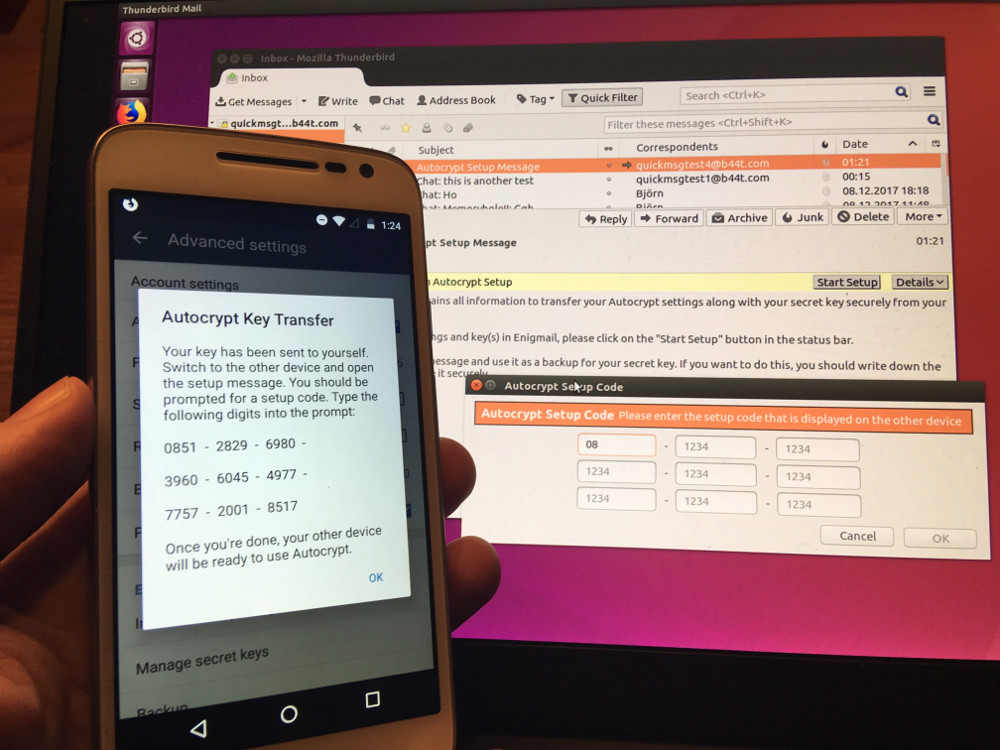

## جلسات در 34C3

بله - Autocrypt و Delta Chat در _سی‌وچهارمین کنگره ارتباطات Chaos_ در لایپزیگ، آلمان حضور دارند.

اگر می‌خواهید درباره این پروژه‌ها بیشتر بدانید یا مشارکت کنید، خوشحال می‌شویم آنجا ببینمتان.

رویدادهای مشخص عبارت‌اند از:

* [Autocrypt - معرفی و نمایش عملی Autocrypt، مشخصه‌ای پیاده‌سازی‌شده برای رمزنگاری سرتاسری فرصت‌طلبانه ایمیل](https://events.ccc.de/congress/2017/wiki/index.php/Session:Autocrypt)

* [Delta Chat - Delta Chat را با ما امتحان کنید ... قابل‌استفاده مثل Telegram، اما غیرمتمرکز و با جامعه باز](https://events.ccc.de/congress/2017/wiki/index.php/Session:Delta_Chat)

از Xeniax و compl4xx برای ثبت‌نام سپاسگزاریم :)

## انتقال کلیدتان به Thunderbird

آخرین نسخه بتا از Delta Chat (APK در [Downloads](download) در دسترس است، نسخه F-Droid در انتظار) به شما اجازه می‌دهد کلیدتان را از Delta Chat به دیگر دستگاه‌های سازگار با Autocrypt منتقل کنید.

همین امروز، این کار با Thunderbird و [Enigmail Nightly Build](https://autocrypt.org/install-autocrypt-enigmail.html) کار می‌کند - از Patrick از Enigmail برای کار عالی‌اش سپاسگزاریم.

در آینده نزدیک انتظار داریم این با کلاینت‌های دیگر هم کار کند و Delta Chat هم آماده _دریافت_ کلیدها خواهد بود.

## نسخه نهایی Autocrypt Level 1

بله - و مشخصه Autocrypt نهایی شد. از [لیست پستی](https://lists.mayfirst.org/pipermail/autocrypt/2017-December/000286.html):

_«در این روز انقلاب زمستانی، یک سال پس از تأسیس تلاش Autocrypt در OnionSpace در برلین، به نظر می‌رسد اولین مشخصه Autocrypt به نسخه نهایی "1.0" می‌رسد.»_

خیلی خوشحالیم که Delta Chat بخشی از این است :)

[Heise](https://www.heise.de/ix/meldung/Einfache-Mail-Verschluesselung-PGP-Helfer-Autocrypt-in-Version-1-0-vorgestellt-3924855.html) (یک سایت خبری بزرگ IT در آلمان) از قبل درباره آن گزارش داده و [Posteo اعلام کرده که هدرهای سازگار با Autocrypt ارسال خواهد کرد](https://posteo.de/blog/neu-vereinfachte-e-mail-verschl%C3%BCsselung-mit-autocrypt-und-openpgp-header).

همه این تلاش‌ها به کاربران Delta Chat اجازه می‌دهد با افراد بیشتری به‌صورت رمزنگاری‌شده ارتباط بگیرند - چه از Delta Chat استفاده کنند و چه از کلاینت دیگری.

## و در آخر

با ترجمه جدید آلبانیایی، جامعه Delta Chat اپ را به ۲۰ زبان ترجمه کرده است.

بدون این جامعه در حال رشد، که در باگ‌ها، قابلیت‌های جدید، تست و توسعه هم کمک می‌کند - اینجا، روی github و در زندگی واقعی - Delta Chat ممکن نمی‌بود.

روزهای خوبی داشته باشید - و در 34C3 می‌بینمتان - یا هر جای دیگر :)
