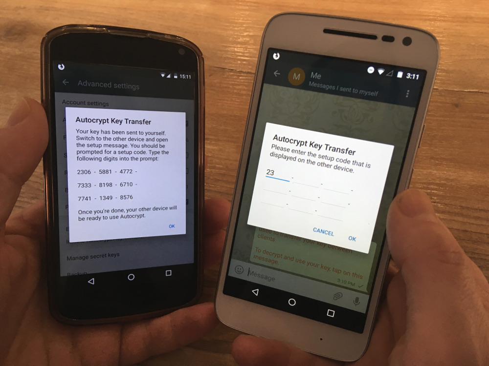

پس از ماه‌ها کار روی چیزهای مختلف به‌جز Autocrypt Setup Message، خب، بالاخره تمام شد :)

اما صبر کنید - **اصلاً Autocrypt Setup Message _چیست_؟**

خب، Autocrypt Setup Message مشکل **انتقال داده‌های کلید مخفی به‌شکلی راحت و امن** به دستگاه دیگر را حل می‌کند.

برای این کار، فقط انتقال را روی _دستگاه مبدأ_ (چپ) شروع می‌کنید و کد نمایش‌داده‌شده را روی _دستگاه مقصد_ (راست) وارد می‌کنید:

این با همه کلاینت‌هایی که استاندارد جدید Autocrypt را پیاده‌سازی کرده‌اند کار می‌کند، مثلاً از _Delta Chat_ (چپ) به _Thunderbird/Enigmail_ (راست):

اما قابلیت‌های جدید بیشتری هم در این انتشار هست، مثلاً با تابع **Gossip**
در یک چت گروهی همه کلیدهای عمومی همه گیرندگان همراه با
پیام‌های رمزنگاری‌شده ارسال می‌شوند. این به همه اعضای گروه اجازه می‌دهد بدون
نگرانی درباره کلیدها به‌صورت رمزنگاری‌شده پاسخ دهند.  
قابلیت gossip دیده نمی‌شود و کاملاً خودکار در پس‌زمینه کار می‌کند - اما در چت‌های گروهی با توانایی پاسخ رمزنگاری‌شده متوجهش خواهید شد :)

این نسخه هم‌اکنون در [بخش Downloads](download) در دسترس است
و به‌زودی روی [F-Droid](https://f-droid.org/packages/com.b44t.messenger/).

## چه خبرهای دیگری؟

* در [Internet Freedom Festival](https://internetfreedomfestival.org/) در والنسیا،
  یک [جلسه معرفی + نمایش Autocrypt](https://platform.internetfreedomfestival.org/en/IFF2018/public/schedule/custom/238) برگزار خواهد شد
* Delta Chat حالا یک [صفحه اصلی فرانسوی](https://delta.chat/fr/) دارد - Merci, Arnaud :)
* صفحات اصلی Delta Chat حالا به‌صورت پیش‌فرض از _HTTPS_ استفاده می‌کنند و از [HTTP Strict Transport Security](https://en.wikipedia.org/wiki/HTTP_Strict_Transport_Security) برای محافظت در برابر حملات downgrade پروتکل بهره می‌برند
