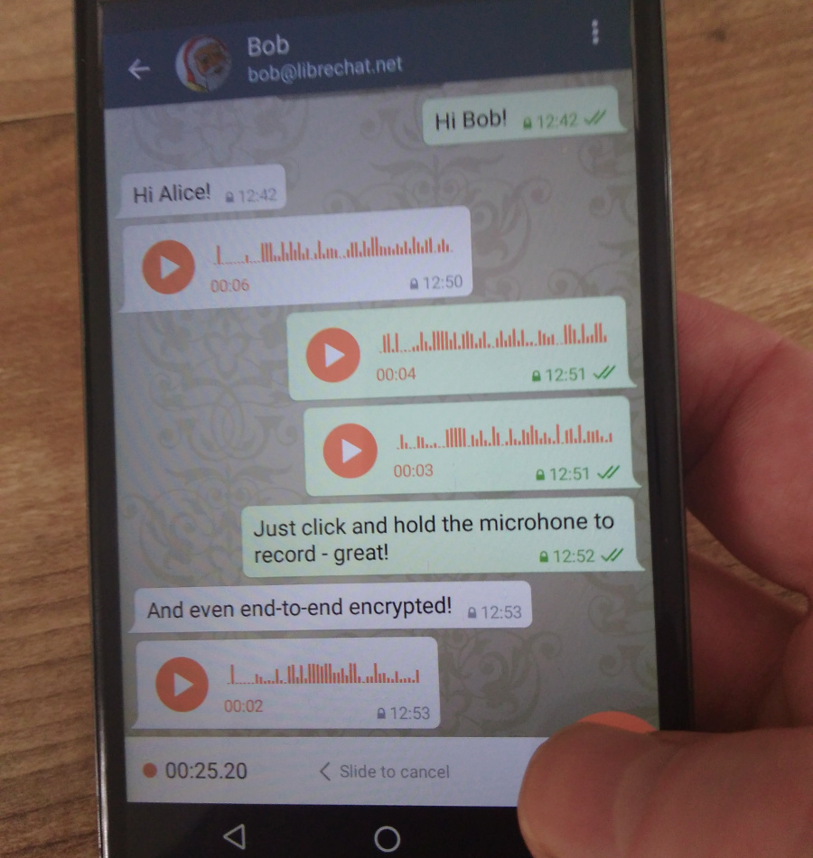

Delta Chat مدتی است از **پیام‌های صوتی** پشتیبانی می‌کند، با این حال
مشکلاتی با آن‌ها وجود داشت که در [Delta Chat 0.15.0](download) برطرف کرده‌ایم.

پیام‌های صوتی حالا باید روی همه دستگاه‌ها کار کنند و شکل موج باید
درست رندر شود. برای ضبط و ارسال یک پیام صوتی، فقط
**میکروفون گوشه پایین راست را کلیک کنید و نگه دارید:**

تغییرات بیشتر را می‌توانید در [Changelog]() ببینید
و مثل همیشه، چند روز طول می‌کشد تا نسخه F-Droid به‌روزرسانی شود.

## Elevate Festival

Xenia و Holger در یک پنل
["Risk a radical shift"](https://elevate.at/diskursprogramm/e18radicalshift/)
و یک جلسه
[“Riot in the Matrix – What’s next?”](https://elevate.at/diskursprogramm/e18riotmatrix/)
شرکت خواهند کرد که Autocrypt و Delta Chat از موضوعات آن‌هاست.

«[Elevate Festival](https://elevate.at/) یک جشنواره سالانه است که
در اطراف Schloßberg در گراتس، اتریش برگزار می‌شود. هدف جشنواره
ایجاد درک بهتر از مهم‌ترین مسائل زمان ما و
بحث درباره جایگزین‌های پیشگام، پروژه‌های نوآورانه و ابتکارات مختلف
در حوزه جامعه مدنی، جنبش‌های اجتماعی و کنشگری متعهد است.»
\[[Wikipedia](https://en.wikipedia.org/wiki/Elevate_Festival)\]

## چه خبرهای دیگری؟

* Delta Chat یک **صفحه اصلی آلبانیایی** جدید در <https://delta.chat/sq/> دارد، ممنون Besnik!
* در [Internet Freedom Festival](https://internetfreedomfestival.org/) در والنسیا،
  یک [جلسه معرفی + نمایش Autocrypt](https://platform.internetfreedomfestival.org/en/IFF2018/public/schedule/custom/238) برگزار خواهد شد
