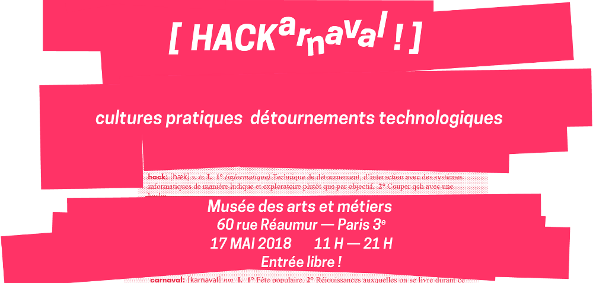

Janka و Holger جلسه‌ای در بخش «Securité Informatique» در
HACKarnaval پاریس خواهند داشت: ["Delta.chat, introduction pratique"](https://hackarnaval.online/abstracts-fr/delta-chat.html)

موضوعات برنامه‌ریزی‌شده شامل معرفی سریع نحوه کار Delta.chat و چگونگی رعایت مقررات عمومی حفاظت از داده اتحادیه اروپا (GDPR) و سپس یک جلسه عملی است.

جلسه پنج‌شنبه ۱۷ مه ساعت ۱۱ صبح در Musée des arts et métiers، ۶۰ rue Réaumur، پاریس شروع می‌شود. ورود رایگان است.

به‌روزرسانی: جلسه دیگری هم درباره Autocrypt و احتمالاً [EFAIL](2018-05-15-delta-chat-not-vulnerable-to-efail) هست: اعلامیه خدماتی Holger: _قصد دارم در این جلسه درباره EFAIL و «آسمان در حال فرو ریختن» حرف بزنم:_ [Securing Autocrypt: Reversing the Panopticon](https://hackarnaval.online/abstracts-fr/autocrypt.html)
