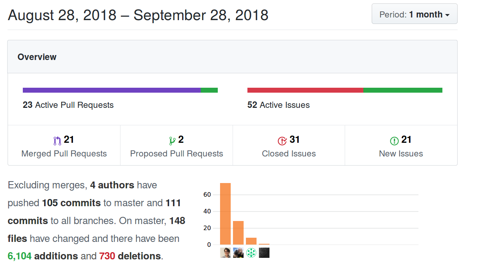
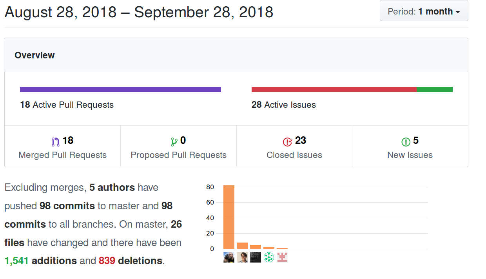
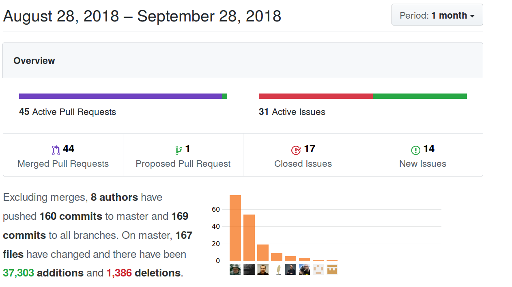
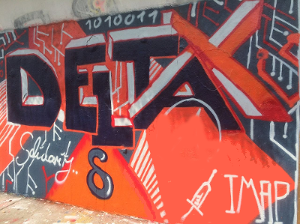

اگر این بلاگ یا لیست پستی را دنبال کنید ممکن است فکر کنید اتفاق زیادی
با Delta.Chat نمی‌افتد اما ... چیزی از حقیقت دورتر نیست :)
اتفاقات باورنکردنی‌ای افتاده و در حال افتادن است اما ارتباط
از راه‌های دیگری بوده:

- **در issueها/pull-requestها در [مخازن توسعه
  مختلف](https://github.com/deltachat)**
  بعضی مخازن نسبتاً جدیدند، مثل Delta/Desktop که از node-bindingهای
  Delta/Node استفاده می‌کند. اینجا «اسکرین‌شات‌های فعالیت» از سه مخزن اصلی github
  برای ماه گذشته آمده:

  **فعالیت github deltachat-desktop سپتامبر ۲۰۱۸**
  

  **فعالیت github bindingهای deltachat-node سپتامبر ۲۰۱۸**
  

  **فعالیت github deltachat-core و bindingهای پایتون سپتامبر ۲۰۱۸**
  

- **در چت غیررسمی‌مان** -- با ۴۸۱۴ خط پست‌شده توسط انسان فقط در
  کانال freenode #deltachat در سپتامبر ۲۰۱۸. ضمناً،
  می‌توانید [از طریق وب به چت بپیوندید](https://webchat.freenode.net/?channels=deltachat)
  اما برای پست کردن باید با تایپ
  `/msg nickserv register PASSWORD EMAIL` ثبت‌نام کنید که یک ایمیل تأیید
  می‌خواهد. بدون ثبت‌نام می‌توانید بخوانید اما پیام پست نکنید.

- **طی یک گردهمایی یک‌هفته‌ای «Delta-X» با ۲۰–۳۰ نفر اواخر ژوئیه
  ۲۰۱۸** در فرایبورگ (پایین‌تر کمی بیشتر اطلاعات هست). هیچ چیز مثل
  ملاقات حضوری در محیطی محرک و آرام و دور شدن
  از نشستن منزوی جلوی صفحه‌ها نیست. فقط حرف زدن
  درباره اتفاقات این هفته خودش یک پست بلاگ «به‌روزرسانی بزرگ»
  دیگر می‌بود.

- **حدود ۴۰ جلسه صوت/ویدئو** و تماس تلفنی بین افراد
  چون گاهی ارتباطات مبتنی بر صفحه‌کلید کافی نیست.

- **در [انجمن پشتیبانی کاربران](https://support.delta.chat) آزمایشی**
  که در آن کمی کمک (اداری و اجتماعی) می‌توانیم استفاده کنیم.
  کمتر از چیزهایی مثل issue trackerهای github ترسناک است
  اما احتمالاً چیدمان انجمن مبتنی بر «discourse» می‌توانست ساده‌تر شود
  (آن‌ها به‌صورت پیش‌فرض کمی با «نشان‌ها» دیوانه می‌شوند).

اما بیایید از «آمار فراداده» آنچه اتفاق افتاد دور شویم و به خود
اتفاقات برسیم. برخلاف باور رایج، فراداده آن‌قدرها هم چیز زیادی نمی‌گوید، این‌طور نیست؟

پایین گزارش «ژوئیه–سپتامبر ۲۰۱۸» است که دیروز با
پروژه‌های مختلف [Open-Technology-Fund (OTF)](https://opentech.fund) به اشتراک گذاشتیم. اگر نمی‌دانستید -- پیشنهاد **پایداری و قابلیت استفاده Delta.Chat** ما توسط OTF پذیرفته شد
و **حدود دویست هزار دلار آمریکا را دریافت و بین
افراد مختلف درگیر توزیع خواهیم کرد**، در طول یک سال (ژوئیه ۲۰۱۸–ژوئن ۲۰۱۹).
گزارش زیر روی این پیشنهاد OTF متمرکز است -- در واقع
چندین پیشرفت و پس‌زمینه دیگر هم هست ... منتظر
به‌روزرسانی‌های «بزرگ» بیشتری به‌زودی باشید ;)

# نکات برجسته توسعه Delta.Chat ژوئیه–سپتامبر ۲۰۱۸

## خلاصه چکیده پیشنهاد OTF

**[Delta.Chat](https://delta.chat) تلاش منحصربه‌فردی در اکوسیستم پیام‌رسانی است که
رابط کاربری پیام‌رسانی مدرن و «چتی» را روی ایمیل ارائه می‌دهد. Delta.Chat
سرور خود را ندارد بلکه از زیرساخت عظیم موجود ارائه‌دهندگان ایمیل
برای ارسال و دریافت پیام استفاده مجدد می‌کند. رمزنگاری سرتاسری با
[Autocrypt](https://autocrypt.org) حاصل می‌شود که از عملیات رمزنگاری استاندارد مبتنی بر OpenPGP
استفاده می‌کند (اما از `gpg` استفاده نمی‌کند). تلاش‌های OTF ما برای تحویل یک
اپ Android قابل‌استفاده و پایدار و یک برنامه Desktop
چندسکویی تازه‌توسعه‌یافته است. پیشرفت‌های فنی‌مان را
با فعالیت‌های needfinding و تست کاربری در اوکراین پیش می‌بریم.**

## Needfinding در اوکراین

بیایید با needfinding شروع کنیم. در ماه گذشته ۱۶ مصاحبه با
مربیان، روزنامه‌نگاران و کنشگران در اوکراین انجام دادیم.
مصاحبه‌ها روی ۳ جنبه کلیدی متمرکز بودند:

1. شناسایی گردش‌کارهای روزمره (استفاده از موبایل در مقابل دسکتاپ، سیستم‌عامل،
   عادت‌های کاربر، برنامه‌های پیام‌رسان رمزنگاری‌شده محبوب و کلاینت‌های ایمیل،
   استفاده از چت‌های گروهی و غیره)؛

2. شناسایی درک کاربران از ریسک‌ها و دشمنان؛

3. درک نیازها و جمع‌آوری قابلیت‌های مطلوب، ویژگی‌های امنیتی و
   UI یک ابزار پیام‌رسانی امن مناسب برای کار و کنشگری‌شان.

فعلاً در حال رونویسی و تحلیل مطالب هستیم، طرح کلی را
کشیده‌ایم و می‌خواهیم تا نوامبر ۲۰۱۸ گزارش needfinding را منتشر کنیم.

## انتشارهای Android/Desktop/Node/Python

در چندین جبهه سخت توسعه دادیم و سایت‌ها و بسته‌های جدیدی منتشر کردیم
که زیربنای ماه‌های آینده را می‌گذارند:

- **دو انتشار نگهداری Delta/Android 0.19.0 و 0.20.0** که مسائل قابلیت استفاده را رفع کردند
  و ترجمه‌های جدید افزودند (حالا بیش از ۲۰ ترجمه اما با کیفیت متفاوت).
  روی پایداری بهتر و برخی بازسازی‌های داخلی مقدماتی کار کردیم.

- **انتشارهای اولیه پیش‌نمایش Delta/Desktop** که پیام‌رسانی متنی
  و یک UI پایه را از قبل برای همگام‌سازی چنددستگاهی امکان‌پذیر می‌کنند.
  دانلودها برای Linux و Mac (Windows در حال کار) را در
  [https://github.com/deltachat/deltachat-desktop/releases/](https://github.com/deltachat/deltachat-desktop/releases/) پیدا می‌کنید.

  Delta/Desktop می‌تواند به‌صورت standalone اجرا شود،
  بدون اجرای Delta/Android روی گوشی. باقی
  پروژه به‌طور مداوم دسکتاپ را بهبود می‌دهد که هنوز
  سطح آلفا می‌دانیم و فقط برای امتحان مناسب است.

- **bindingهای Node به Delta/Core** به‌صورت تدریجی ساخته و به‌طور مداوم
  در وب‌سایت جامعه node-js منتشر شدند:
  [https://www.npmjs.com/package/deltachat-node](https://www.npmjs.com/package/deltachat-node)
  در حالی که برخی مسائل عمدتاً در مورد یکپارچگی Electron/Desktop
  باقی مانده، bindingها از قبل برای Delta/Desktop خوب کار می‌کنند.

- **bindingها و تست‌های پایتون** در برابر کتابخانه C
  Delta/Core در یک انتشار اول منتشر شدند؛ ببینید:
  [https://py.delta.chat](https://py.delta.chat)
  برای چگونگی شروع نوشتن ربات یا تعامل‌های دیگر (یا UIها)
  با اپ‌های Delta.Chat. از pytest برای اجرای یک مجموعه تست در حال رشد
  در برابر Delta/Core استفاده می‌کنیم تا پایداری و قابلیت اطمینان را افزایش دهیم؛ اینجا
  مثالی برای ایجاد دو مخاطب، یک چت گروهی و بررسی
  عضویت است:
  [https://github.com/deltachat/deltachat-core/blob/master/python/tests/test_account.py#L155](https://github.com/deltachat/deltachat-core/blob/master/python/tests/test_account.py#L155)

## Delta-X: اسپرینت جامعه با پروژه‌های همکار

بخش زیادی از کارهای بالا در گردهمایی «Delta-X»
در فرایبورگ ۱۶–۲۴ ژوئیه رخ داد و بحث شد. به‌ویژه در روز unconference شنبه‌اش
بحث‌های سازنده و سرگرم‌کننده‌ای با حدود ۳۰ نفر از پروژه‌ها و زمینه‌های
مختلف داشتیم، از برنامه‌ریزی پروژه OTF، یک پیاده‌سازی جدید PGP/Rust
تا سؤالات GDPR یا طرح‌های رمزنگاری جدید برای جلوگیری از نشت فراداده. وقت‌گذرانی
در آفتاب با مبل‌ها روی تراس، یا در Cafe Bicicletta (کاپوچینو عالی!)،
یا جلسه kickoff OTF کنار رودخانه سرد «Dreisam»، شنا
و خواب شبانه کنار یک دریاچه دورافتاده ... حتی کسانی که شرکت کردند
نمی‌توانستند خلاصه کاملی از این هفته بدهند، شرط می‌بندم ;)

یک تلاش قابل‌توجه جامعه آنجا شروع شد که حمایتش می‌کنیم و امیدواریم
به‌زودی به ثمر برسد: Delta-Dev/Android که از کد UI
Signal/Android استفاده می‌کند چون پایه بهتری نسبت به کد Telegram-UI
ارائه می‌دهد که Delta/Android هنوز در انتشارهای فعلی F-Droid از آن استفاده می‌کند.
علاوه بر این، تلاش دیگری مستقل از OTF هم هست، یعنی Delta/iOS. برای
دریافت دعوت testflight این نسخه اولیه iPhone، به ios@getdelta.org ایمیل بزنید.

## مخازن Git برای همه فعالیت‌ها

مخازن هر یک از تلاش‌ها و انتشارهای بالا را
زیر [سازمان github deltachat](https://github.com/deltachat) پیدا می‌کنید.
اگر کنجکاوید ... شاید بخواهیم به چیزی غیر از github مهاجرت کنیم --
ضمناً خیلی خوش‌آمدید اگر در مراقبت از
مسائل sysadmin/زیرساخت/بسته‌بندی/مستندات/css/UX/ترجمه/یکپارچگی/حریم‌خصوصی/حقوقی
کمک کنید، همان‌قدر که در برنامه‌نویسی C/JS/Python/Swift/Java/Rust مشارکت کنید :)

# تبریک

ممنون، تا پایان این پست بلاگ خیلی طولانی رسیدید :)
