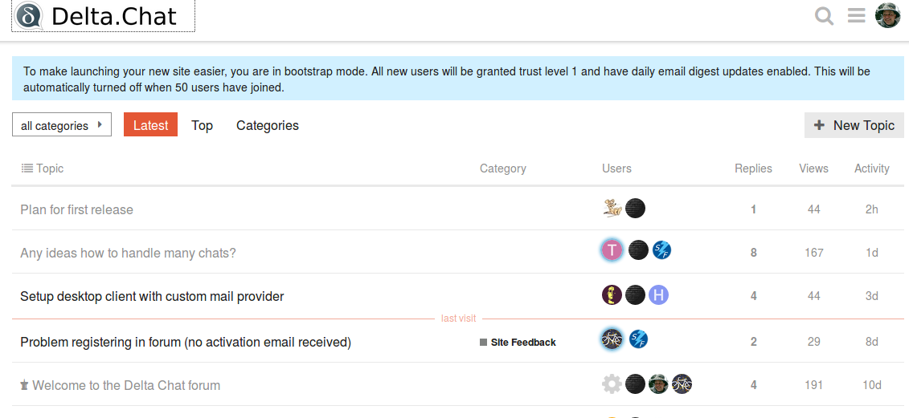

دو ماه پیش، [سایت support.delta.chat](https://support.delta.chat) را به‌صورت آزمایشی راه‌اندازی کردیم
اما تازه اکنون مشکلات مربوط به تحویل ایمیل و در نتیجه ثبت‌نام را برطرف کرده‌ایم. این سایت پشتیبانی قرار است نقطه ورود آسان‌تری برای کاربرانی باشد که با git یا github آشنا نیستند.

یکی از راه‌های عالی کمک به [توسعه‌های جاری delta.chat](https://delta.chat/en/2018-09-28-big-update)
این است که در این انجمن پشتیبانی ثبت‌نام کنید و حضور داشته باشید.
به‌طور ایده‌آل، بر پایهٔ بحث‌های آنجا، در یکی از [مخازن deltachat](https://github.com/deltachat)
issueهای github می‌سازیم و بحث‌های مرتبط انجمن پشتیبانی را لینک می‌کنیم.

و هر کسی که می‌تواند یا می‌خواهد در مدیریت نرم‌افزار زیرساخت،
[discourse](https://discourse.org)، کمک کند، خوش‌آمد است. خود ما هم
در مدیریت این سایت تازه‌کار هستیم. برای چگونگی مشارکت، [کانال‌های تماس](https://delta.chat/en/contribute) را ببینید
و به‌ویژه چگونگی پیوستن به #deltachat در freenode IRC را، جایی که بسیاری از
اهالی DeltaChat روز و شب حضور دارند.

  **تصویر صفحه [https://support.delta.chat](https://support.delta.chat)**
  
