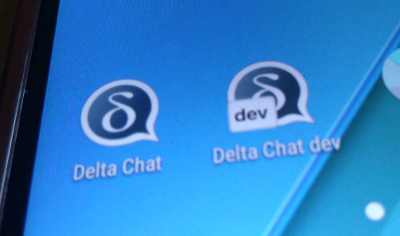

در حال حاضر روی یک اپلیکیشن اندروید جدید برای Delta Chat کار می‌کنیم،
[android-dev](https://github.com/deltachat/deltachat-android-ii/issues).

اپ جدید رابط کاربری را از نو می‌سازد، اما هسته عمدتاً بدون تغییر می‌ماند؛
ضمناً همین هسته برای deltachat-desktop و deltachat-ios هم استفاده می‌شود.

دلیل این بازنویسی این است که کد UI موجود،
که بر پایهٔ یک پیام‌رسان محبوب دیگر است،
در بسیاری از موارد از روش‌های برنامه‌نویسی غیراستاندارد استفاده می‌کند.
این کار نگهداری و گسترش را سخت می‌کند، به‌ویژه برای مشارکت‌کنندگان جدید.

ماه‌ها به این گام فکر می‌کردیم، اما بالاخره شروع شده :)

در حالی که با این گام پایهٔ کد خیلی بهتری خواهیم داشت،
این را فرصتی می‌دانیم تا بسیاری از چیزها را در UI جدید بهتر کنیم، مثلاً:

* ارسال متن همراه با تصاویر
* ویرایش تصاویر قبل از ارسال، مثلاً علامت‌گذاری چیزی
* بازبینی پیام‌ها قبل از ارسال
* یک دکمهٔ ارسال مرکزی (گزینه‌هایی مثل اجبار رمزنگاری‌شده/رمزنگاری‌نشده را می‌دهد)
* تم تاریک
* رفتار سازگارتر در اپ،
  مثلاً کلیک طولانی در همهٔ activityها مشابه کار کند
* دسترس‌پذیری بهتر، Always-show-date، swipe-to-archive و
  [خیلی چیزهای دیگر](https://github.com/deltachat/deltachat-android-ii/issues/25)

بسیاری از این موارد هنوز کاملاً تمام نشده‌اند،
اما در مسیر درست است و هر روز پیشرفت سریعی هست.

وقتی نسخهٔ بتای تقریباً feature-complete داشته باشیم،
پست دیگری به این وبلاگ اضافه می‌کنیم.

اگر نمی‌توانید صبر کنید، نسخهٔ پیش‌نمایش را در
<https://github.com/deltachat/deltachat-android-ii/releases/>
می‌یابید
(هر چند روز یک‌بار APKهای جدید هم آنجا آپلود می‌کنیم).

لطفاً توجه کنید که این نسخه حتی «آلفا» هم نیست —
**با مسئولیت خودتان استفاده کنید** و لطفاً بازخورد را به
[github](https://github.com/deltachat/deltachat-pages/issues) بدهید،
نه به [انجمن پشتیبانی کاربران](https://support.delta.chat).

سلام!
