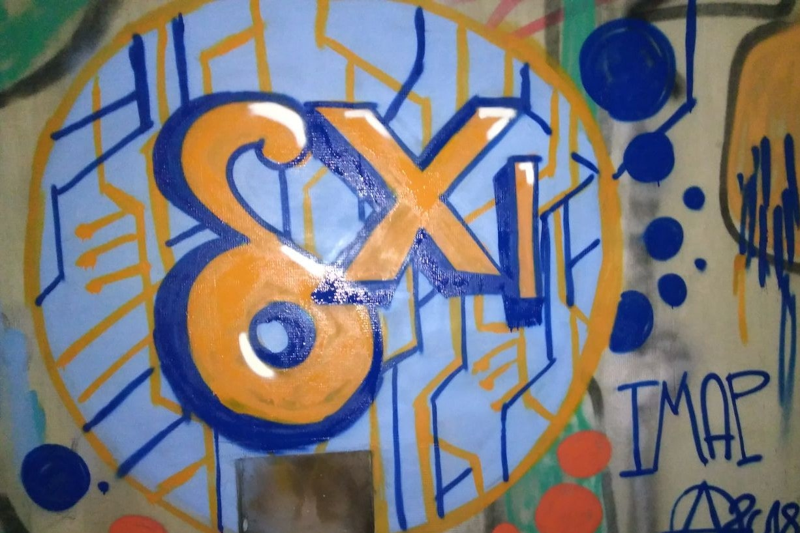 
بیش از دوازده نفر برای یک هفته در کی‌یف، اوکراین
برای «Delta-XI» گرد آمدند، با چیزهای بیشتری از آنچه بتوان گزارش کرد…
این پست کوششی است هم برای دادن چند تصویر از
گردهمایی و هم برجسته‌کردن پیشرفت‌های فنی و نتایج
بحث و همکاری غنی که در کی‌یف در پایان
اکتبر/آغاز نوامبر ۲۰۱۸ شکل گرفت. گردهمایی عمداً
با دو جلسهٔ آزمایش کاربر درهم‌تنیده بود که Xenia و
Vadym به‌صورت حرفه‌ای با گروه‌های منتخب روزنامه‌نگاران،
مربیان و فعالان اوایل هفتهٔ گردهمایی برگزار کردند. نتایج
مهم دیگری هم بود که فقط کوتاه
در ابتدا گزارش می‌کنیم:

- پس از پژوهش حقوقی قابل‌توجه دربارهٔ مجوزها و چندین بحث
  deltachat-core را دوباره مجوزدهی کردیم و 0.24.1 را تحت
  [Mozilla Public License](https://github.com/deltachat/deltachat-core/blob/master/LICENSE) منتشر کردیم.
  حرکت از GPL به MPL برای دعوت بیشتر از
  همکاران تجاری هم هست چون حالا آسان‌تر است هستهٔ
  چت/مخاطب و پیاده‌سازی‌های IMAP/SMTP/Autocrypt مربوط به DeltaChat را در انواع پیشنهادها بگنجانند.
  «چت روی ایمیل» فضای باز بزرگی با تنوع زیاد
  بازیگران بالقوه است، هم غیرانتفاعی و هم تجاری. با استفاده از deltachat-core
  یک کتابخانهٔ C مبتنی بر استانداردهای محکم می‌گیرید که با موفقیت در
  اپ‌های واقعی چت-ایمیل استفاده می‌شود و پیوسته پالایش و نگهداری می‌شود.
  بیایید همکاری کنیم :)

- [نقطهٔ عطف
  single-folder](https://github.com/deltachat/deltachat-core/milestone/2?closed=1)
  به تکمیل رسید و در
  [انتشارهای پیش‌نمایش Android-dev](https://github.com/deltachat/deltachat-android-ii/releases)
  موجود است و به‌زودی در انتشارهای پیش‌نمایش دسکتاپ هم. آنچه قبل از این‌که
  انتشار رسمی F-Droid شود باقی مانده، جمع‌بندی چگونگی پشتیبانی از استفادهٔ
  «حساب مشترک» است که اوایل اکتبر بحث بزرگی در فهرست پستی ایجاد کرد،
  اساساً حول این‌که آیا DeltaChat را روی حساب‌های ایمیل استاندارد موجود
  یا اختصاصی توصیه/هدف کنیم.

- بسیاری از بهبودهای UI و دیگر موارد برای Delta/Desktop که در نتیجه
  هرچه بیشتر برای استفادهٔ واقعی قابل‌اتکا می‌شود. [انتشارهای دسکتاپ](https://github.com/deltachat/deltachat-desktop/releases) هنوز پیش‌نمایش برچسب خورده‌اند و تلاش‌های جاری برای
  کار روی macOS و Windows هست — اگر می‌توانید راهنمایی کنید یا کمک کنید
  با بسته‌بندی OpenSSL در اپ‌های Electron، لطفاً ما را در GitHub
  یا در #deltachat IRC در freenode ببینید.

قهوهٔ صبح و اطراف دیگر
-----------------------------------------

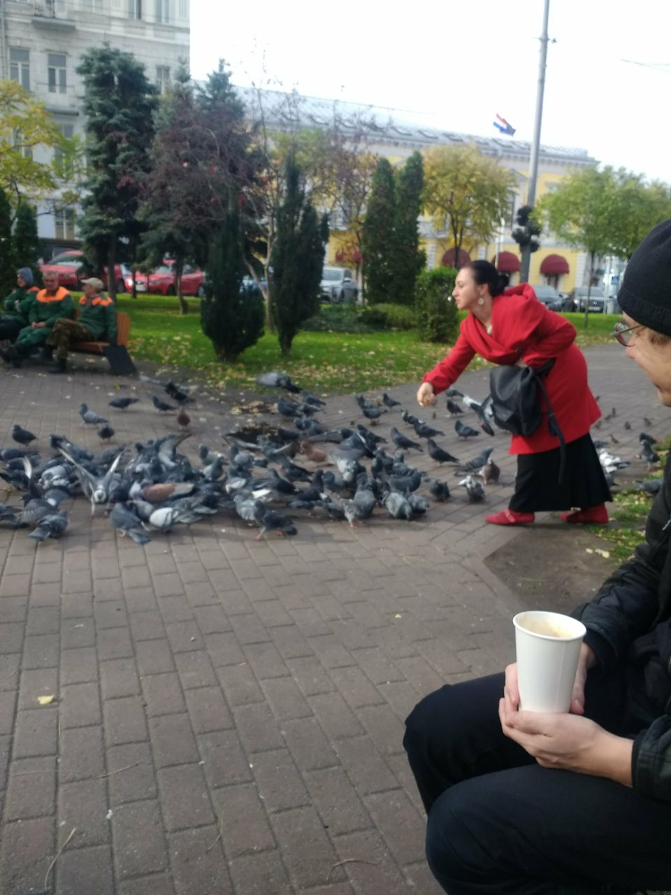 
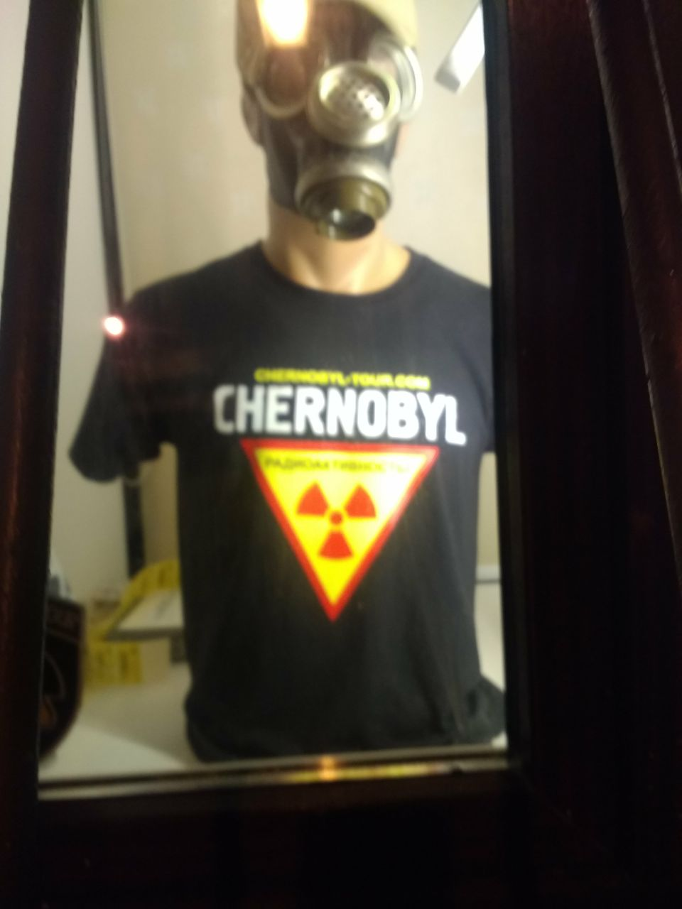 

صبح‌ها اغلب دور «اتوبوس قهوه» و میدان مجاور شروع می‌شد.
در حالی که بسیاری از ما با اضطراب برای زمستان اتمی آماده شده بودیم،
معلوم شد بیشتر وقت می‌توانستیم خوب بیرون بنشینیم.
آخرین روزهای گرم را گرفتیم چون فقط یک هفته بعد از رفتن ما
برف شروع شد.

در میان بحث‌های اجتماعی و فنی در «basecamp» و جاهای
دیگر وقت گذاشتیم تا از پارک‌ها، تپه‌ها، پل‌های رهاشده رد شویم،
یادمان‌های شوروی را ببینیم و از تپه‌ها و جنگل‌های خلوت
که تصادفی هنگام کاوش در پیشنهادهای فرهنگی و تاریخی
یک پایتخت سابق شوروی پیدا می‌کردیم قدردانی کنیم.

آزمایش، گفت‌وگو و قدم‌زدن با کاربران در معرض خطر
-----------------------------------------------

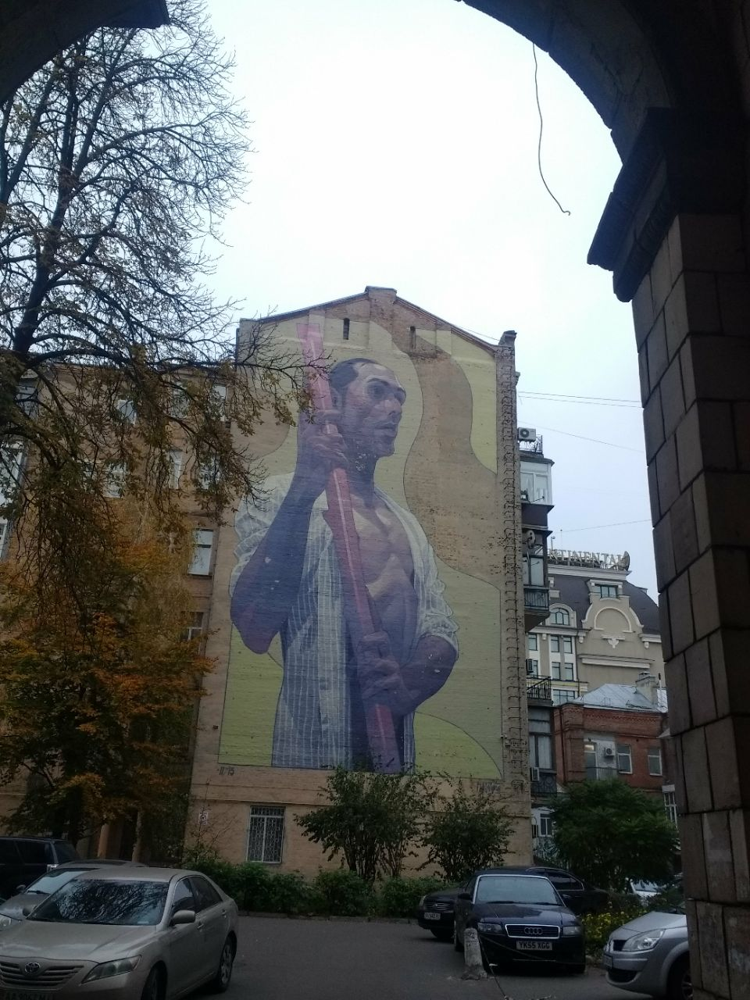 
غیرمتمرکزسازی فقط یک ایدهٔ فنی نیست بلکه دربارهٔ
مرکززدایی اجتماعی و جغرافیایی هم هست. اوکراین اکنون
فرآیند چالش‌برانگیز دگرگونی سیاسی را طی می‌کند. چهار سال پس از
انقلاب، مردم چگونه زیرساخت‌ها را نگه داشتند و با آن کار کردند؟
یکی از اهداف Delta-XI ملاقات با کسانی بود که واقعاً به
فناوری‌های ما نیاز دارند و از آن استفاده می‌کنند: روزنامه‌نگاران محلی که به مناطق جنگی شرق
اوکراین یا کریمهٔ ضمیمه‌شده می‌روند؛ فعالانی که با خیزش راست‌گرا
در شهرهای بزرگ مثل کی‌یف یا لووف روبه‌رو هستند؛ و مدافعان حقوق بشر
که هر روز با پناهندگان جنگ یا دیگر گروه‌های در معرض خطر کار می‌کنند.

هفته شامل دو عصر اختصاصی آزمایش کاربر
اپ اندروید Delta.Chat بود. کاربران واقعی از پروژه‌ها و
گروه‌های متنوع در اوکراین در یک مرکز فرهنگی محلی به ما پیوستند تا
نصب، ناوبری و استفاده از اپ را آزمایش کنند، زیر نظر
مربیان امنیت دیجیتال و پژوهشگران. مطلقاً هیچ وقفه،
راهنمایی یا حتی اشاره‌ای از سوی توسعه‌دهندگان هنگام کارشان مجاز نبود!

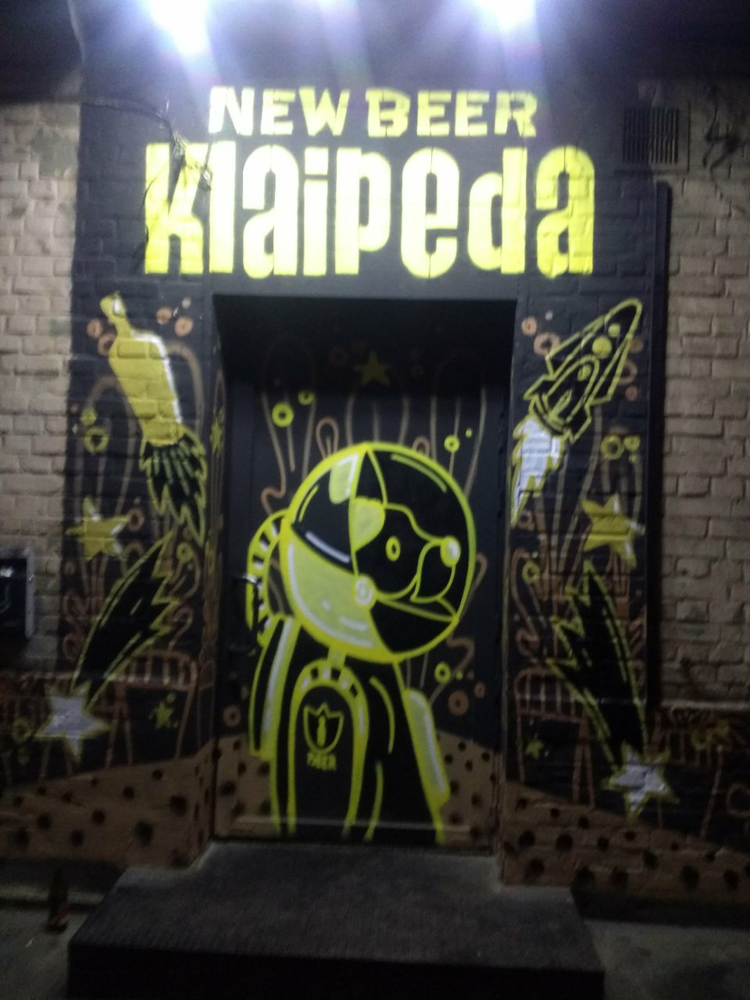 
پس از جلسه‌ها، آزمایش‌کنندگان و توسعه‌دهندگان در بارهای محلی
برای چت بیشتر و اشتراک بینش دربارهٔ ویژگی‌های مفید و مطلوب،
به‌روزرسانی‌های تجربهٔ کاربری و موارد استفادهٔ وابسته به زمینه دیدار کردند. هم سرگرم‌کننده
و هم آموزنده بود که با شرکت‌کنندگانی وقت بگذرانیم که بعداً
بارها به آپارتمان basecamp ما می‌پیوستند یا در گشت کی‌یف. در
پایان هفته این دیدارهای مکرر به درک مشترک بهتر
و مسیرهای جدیدی که DeltaChat در
چند ماه آینده هدف می‌گیرد ختم شد، همچنین پایین‌تر ببینید.

ویژگی‌های برنامه‌ریزی‌شدهٔ جدید برای کاربران در معرض خطر و دیگران
------------------------------------------------

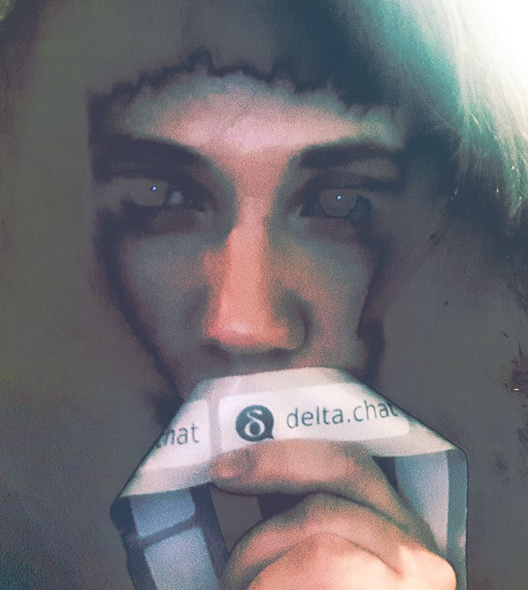 
تیم هماهنگی آزمایش کاربر نتایج
آزمایش کاربر و مصاحبه‌های needfinding را ترکیب کرد و ارائه‌ای عمیق
به تیم توسعه و مشارکت‌کنندگان داد. هم
نتایج needfinding و هم آزمایش کاربر به‌صورت مکتوب هم
عمومی می‌شود. از بحث‌های بعدی، با مشارکت
روزنامه‌نگاران و فعالان حقوق بشر، DeltaChat مسیرها و
ویژگی‌های جدیدی برنامه‌ریزی کرده که در بیشتر، اگر نه همه،
پیام‌رسان‌های چت دیگر امروز غایب است:

- **کانال‌های یک‌طرفهٔ زودگذر** که می‌توان به‌عنوان حالت کانال جدید
  تنظیم کرد. به‌محض این‌که ویدئو/صوت/پیام به سرور SMTP رسید، از
  دستگاه حذف می‌شود. فعالان این را خواستند چون وضعیت
  نامتقارن دارند: ۱–۲ نفر در فضای نسبتاً امن، اغلب
  خارج از کشور، و چندین نفر در میدان زیر تهدید مکرر
  ضبط دستگاه و بازداشت پلیس. چند گام پشتیبانی از این ویژگی
  پس از کی‌یف برداشته شد، بعد از پیشنهاد خوب Justus
  (که همراه Neal از پروژهٔ Seqouia Rust/PGP شرکت کرد)،
  یعنی این‌که deltachat-core فوراً همهٔ پیام‌های ارسالی را
  برای گیرندگان رمزنگاری کند — در حالت زودگذر یک‌طرفه
  فقط برای خودمان رمزنگاری نمی‌کنیم. حتی اگر دستگاه قبل از خالی‌شدن
  صف SMTP ضبط شود، پیام‌ها قابل رمزگشایی نیستند. اما «encrypt-immediately»
  انتقال پیام را هم سریع‌تر می‌کند و با شبکه‌های ناپایدار بهتر کار می‌کند،
  چون همین حالا پیام ایمیل واقعی هر بار که شبکه در دسترس می‌شود
  دوباره ساخته و دوباره رمزنگاری می‌شود.

- **جریان موقعیت GPS** تسهیلات دیگری است که می‌خواهیم معرفی کنیم.
  با این، تغییرات موقعیت GPS به‌طور منظم به یک مخاطب
  یا گروه گزارش می‌شود. این کمک می‌کند آخرین موقعیت افراد
  پس از بازداشت پیدا شود. اما می‌تواند برای
  دوستانی که با هم در شهر حرکت می‌کنند و می‌خواهند
  موقعیت‌شان را ارائه دهند هم مفید باشد. توجه کنید که با DeltaChat هرگز
  سرور یا «ابری» در میان نیست: موقعیت‌های GPS را end-to-end رمزنگاری‌شده
  به مخاطبان انتخابی خود گزارش می‌دهید.

- **ایجاد خودکار حساب burner** برای آسان‌کردن این‌که یک گروه
  حساب‌های ایمیل موقت و گروه‌های چت برای یک اقدام خاص بسازد
  مثلاً گزارش تظاهرات یا تحقیق دربارهٔ محل
  افراد گم‌شده. ایده این است که یک دستگاه deltachat «دعوت‌کننده»
  یک توکن از ارائه‌دهندهٔ ایمیل دریافت کند — دستگاه‌های دیگر deltachat
  توکن را اسکن کنند، حساب‌های تصادفی بگیرند که بعد از یک هفته حذف می‌شوند و فقط
  بتوانند نام نمایشی خود را انتخاب کنند. «پیوندندگان» همچنین در یک
  گروه تأییدشده فرود می‌آیند که قرار است در برابر حملات فعال شبکه/ارائه‌دهنده امن باشد.
  توجه کنید که اگر کسی مثلاً Delta Chat را از طریق Gmail استفاده کند (استفادهٔ زیاد Gmail در اوکراین)
  پیام‌ها در برابر حساب‌های burner با e2e رمزنگاری می‌شوند — آدرس‌های ایمیل موقت
  می‌توانند با هر آدرس ایمیل دیگری از وکلا،
  شبکه‌های رادیویی و غیره استفاده شوند.

هیچ‌کدام از این ویژگی‌ها هنوز کاملاً پخته نشده‌اند. در حالی که
افراد واقعی در معرض خطر در کی‌یف را هنگام رفتن به‌سوی این ویژگی‌ها در ذهن داریم
هدفمان این است که توسعه پیرامون آن‌ها معماری عمومی
DeltaChat را بهتر کند. وقتی در انتشارهای پیش‌نمایش قابل‌استفاده ثابت شد، دوباره
با مردم در کی‌یف مشورت و آزمایش کاربر می‌کنیم…

کنفرانس آزاد شنبه و مهمانی ...
--------------------------------------------------

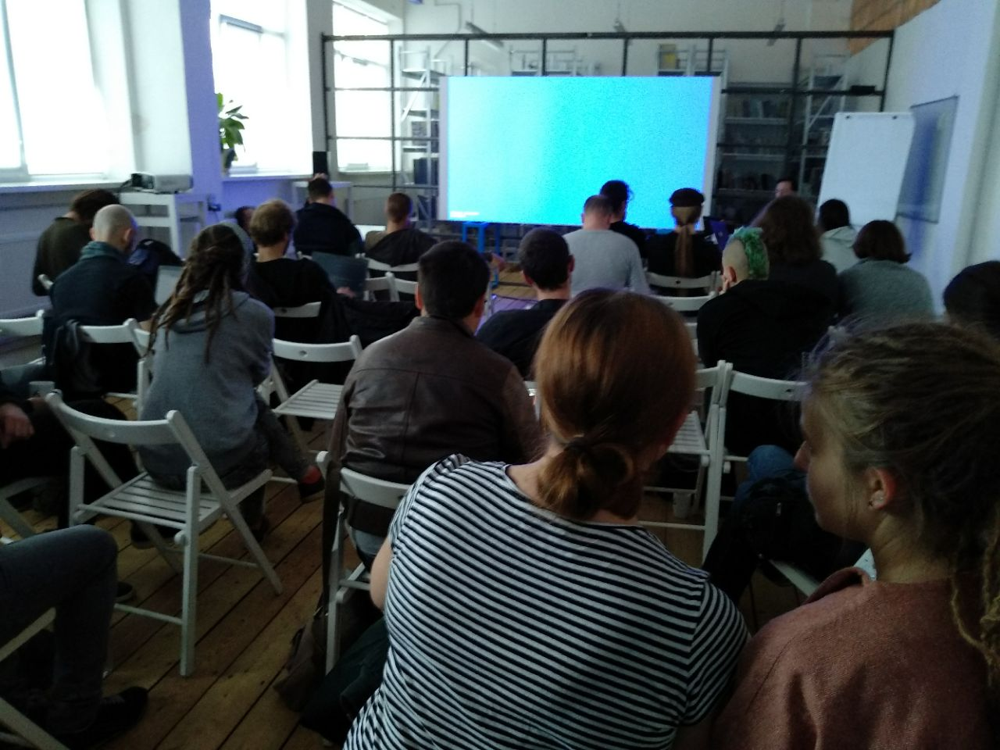 
[Decentralization Unchained](https://delta.chat/en/2018-10-28-decentralization-unchained)
توسعه‌دهندگان، مشارکت‌کنندگان، رمزنگاران، هکرها، پژوهشگرانی را که
در گردهمایی Delta.Chat بودند با مربیان امنیت دیجیتال محلی،
فعالان و NGOها برای یک روز سخنرانی، بحث و کارگاه
پیرامون غیرمتمرکزسازی زیرساخت‌ها و جوامع،
ساخت ابزارهای ارتباطی با کاربران و برای کاربران گرد آورد.

جدا از معرفی‌های DeltaChat، ارائه‌های کلیدی
دربارهٔ موضوعاتی بود که محلی‌ها و شرکت‌کنندگان مطرح کردند:

- حق کثرت: غیرمتمرکزسازی هویت‌ها، نام مستعار و امنیت.
- خواسته‌ها، خیال‌ها و نیازهای امنیت دیجیتال کاربران واقعی.
- خیزش افراط‌گرایی راست در کشورهای جهان:
  گفت‌وگویی به رهبری فعالان از اوکراین، برزیل، آلمان و آمریکا.
- پس‌زمینه‌هایی از ادارهٔ یک ارائه‌دهندهٔ ایمیل جمعی غیرانتفاعی فناوری

چون هالووین بود، کنفرانس آزاد با afterparty در یک
بار DIY محلی بسته شد جایی که با موسیقی الکترونیک آزمایشی و
ویدئوهای علمی‌تخیلی سایکدلیک رقصیدیم، مشروبات خانگی نوشیدیم و در یک
بازی تیمی داستانی گمانه‌زنانه دربارهٔ «آخرالزمان سایبری» دیرهنگام و چگونگی نجات
جهان از ربات‌ها شرکت کردیم!

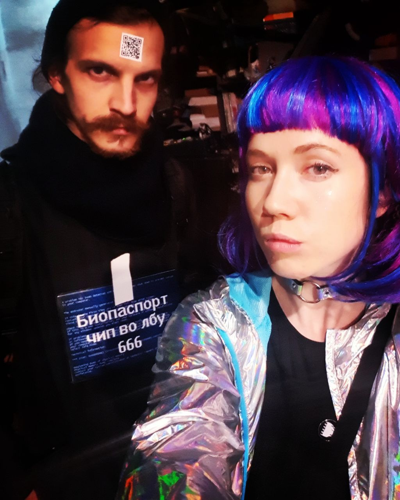 
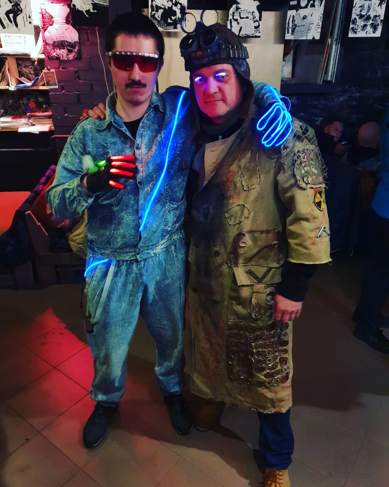 
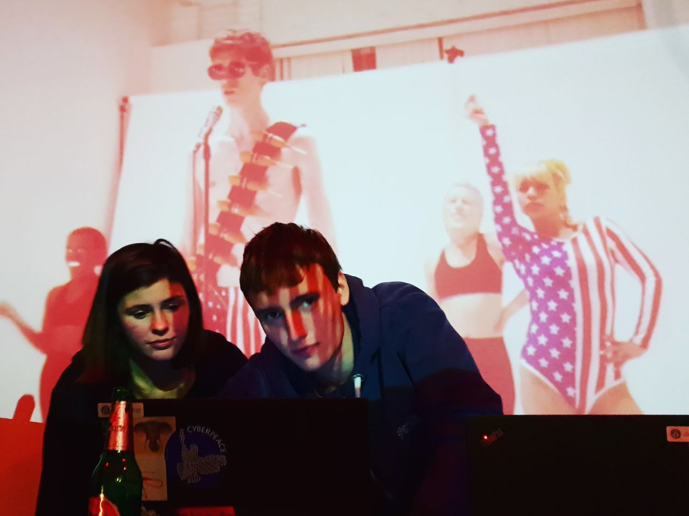 
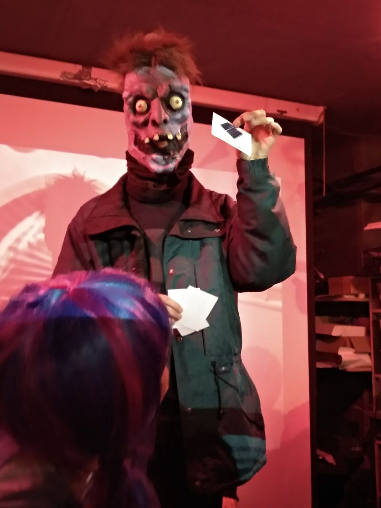 

بازگشت به کی‌یف در ۲۰۱۹
-------------------------

هفته‌ای بسیار لذت‌بخش و پربار بود… آن‌قدر که برنامه‌ها
از قبل برای رویداد پیگیری برای آزمایش پیشرفت‌های جدید در
بهار در حال شکل‌گیری است. می‌خواهیم به‌ویژه از Anna، هنرمند محلی، تشکر کنیم که بسیار
پیش و در طول جلسه در مسائل سازمانی کمک کرد.
همه را در کی‌یف، ۲۰۱۹ می‌بینیم!

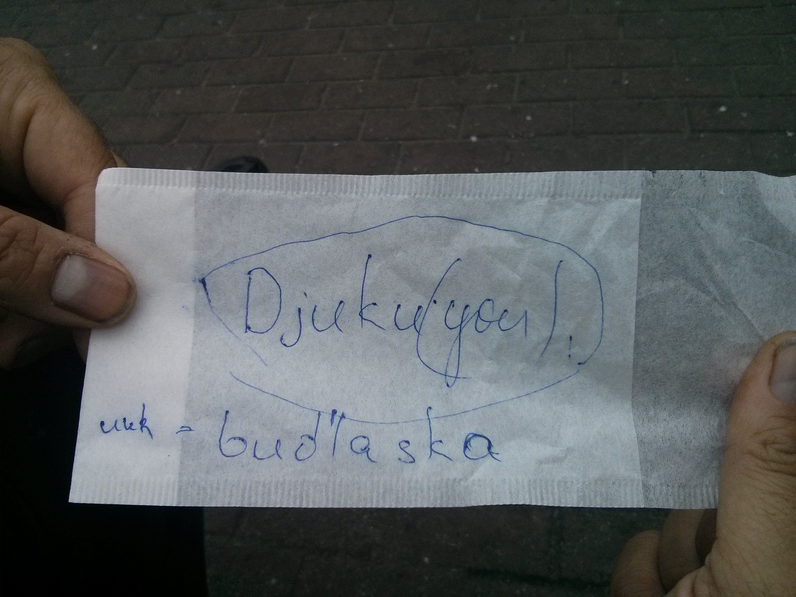
