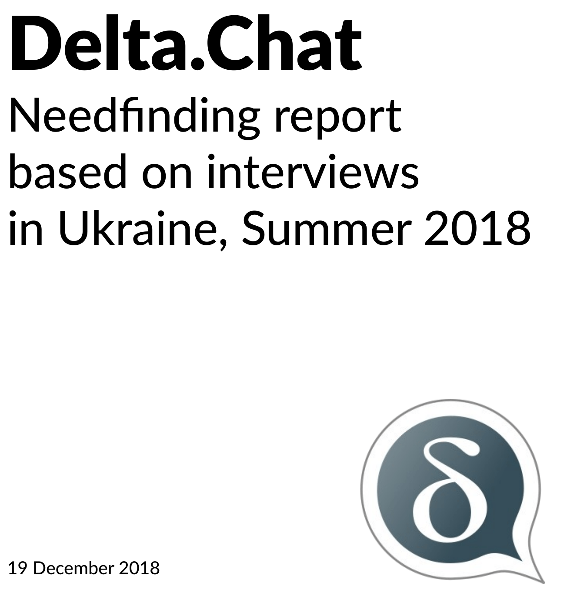

[گزارش اوکراین/needfinding](../assets/blog/dcneedfindingreport.pdf) ما
اکنون منتشر شده است. شامل ده یافته و «نکات کلیدی Delta.Chat» است. برخی از آن یافته‌ها
از قبل روی توسعه تأثیر گذاشته‌اند، «ویژگی‌های برنامه‌ریزی‌شدهٔ جدید» از پست وبلاگ نوامبر
دربارهٔ [گردهمایی یک‌هفته‌ای Delta-XI ما در کی‌یف](https://delta.chat/en/2018-11-17-deltaxi) را ببینید.
دیگران منتظر گفت‌وگوهای بیشترند که قرار است در [!decentral assembly در 35c3](https://signup.c3assemblies.de/assembly/c51983c8-b560-4d2b-95a1-f07a98c8e322) رخ دهد.

