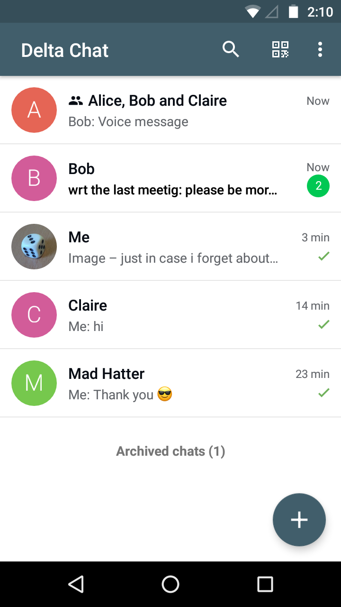
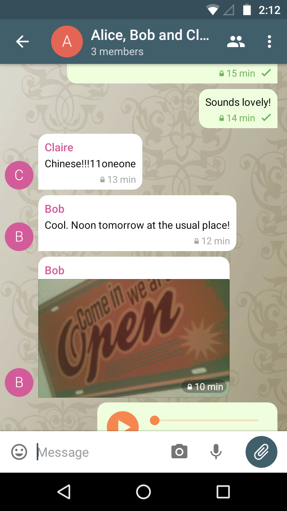
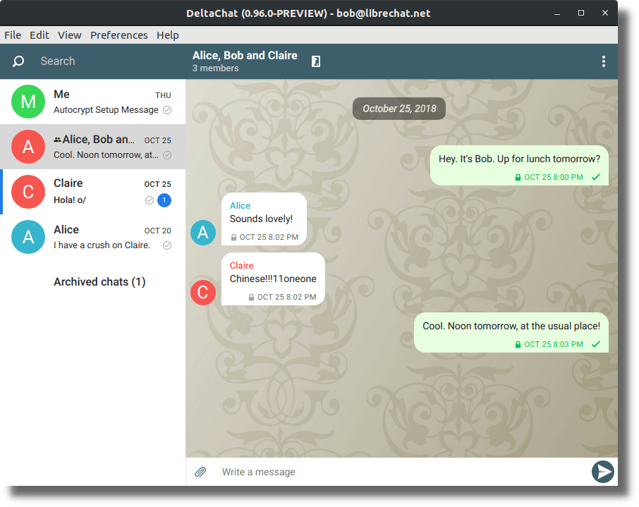
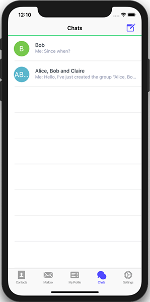
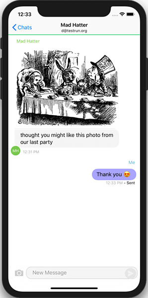

تلاش‌های زیاد نیم‌سال گذشته به ثمر می‌رسد ... وقت انتشار!
حالا می‌توانید DeltaChat را نه فقط روی اندروید بلکه روی دسکتاپ و iOS هم استفاده کنید
و چت‌ها معمولاً در تنظیمات چنددستگاهی رایج سریع همگام می‌شوند.
هیچ‌چیز هرگز کاملاً کامل کار نمی‌کند اما برای بسیاری که از انتشارهای
افزایشی هفته‌های اخیر استفاده کرده‌اند خوب کار می‌کند، از جمله برای ارتباطات خصوصی زیاد با دوستان.
انتشارهای ژانویهٔ ۲۰۱۹ را، حتی اگر نقطهٔ عطف مهمی باشند،
فقط آغازی دیگر برای چیزهای سرگرم‌کننده‌تر و جالب‌تر می‌دانیم ...

 
 

**Delta/Android 0.100.0**: کد کاملاً بازنگری شد و تازه
انتشار F-droid را فعال کردیم و به‌زودی (tm) به G-play هم
هدف می‌گیریم. [کد جدید اندروید](https://github.com/deltachat/deltachat-android)
بر پایهٔ کد UI سیگنال است به‌جای کد UI تلگرام که برای
انتشار قبلی 0.20 در F-droid استفاده می‌شد. با این نیمه‌بازنویسی جسورانه، ۲۰–۳۰ issue دیرینه بسته شد
و حالا پایهٔ کد خیلی قشنگ‌تر و قابل‌نگهداری‌تری داریم — یای!

توجه کنید که سخت کار کردیم تا ظاهر و حس UX
نسخهٔ تلگرام را برگردانیم و هنوز چیزهایی مانده.
هزاران سپاس به Bjoern Petersen، Angelo Fuchs، Daniel Boehrsi،
Florian Haar، Asiel Díaz Benítez، chklump، amplifier، testbird و بسیاری
دیگر که به‌طور مستمر کد و گزارش باگ مشارکت دادند!

اگر انتشارهای dev اندروید را نصب و استفاده کرده‌اید (ممنون!) باید یک
چرخهٔ export/import اجرا کنید اگر اپ F-Droid یا یک [انتشار apk dev جدید](https://github.com/deltachat/deltachat-android/releases) را نصب کنید. کاربران فعلی F-droid فقط ارتقا می‌یابند
و نیازی به export/import ندارند. وقتی Delta/Android واقعاً در F-droid ظاهر شود
(ممکن است طول بکشد) پست وبلاگ دیگری می‌نویسیم که بیشتر از چیزهای جدید بگوید.

 

**Delta/Desktop 0.99.0**: اپ کاملاً جدید دسکتاپ با
[بسته‌های ازپیش‌ساخته برای Linux و Mac (کمک برای Windows لازم!)](/en/download).
تلاش Delta/Desktop طی ۶ ماه تکامل یافته و برای بسیاری از قبل خوب کار می‌کند.
بخش‌هایی از اپلیکیشن Signal/Desktop را دوباره استفاده می‌کند
اما باز سخت روی سمت UX کار کردیم تا حس بیشتر Delta/Android و
UX تلگرام را بگیریم. کudos بزرگ به Magnus/ralphtheninja، Karissa McKelvey،
Jikstra، Simon Laux و چندین نفر دیگر که کمک کردند Delta/Desktop واقعیت شود.

می‌توانید Delta/Desktop را standalone استفاده کنید، یعنی بدون موبایل، یا همراه
با یک اپ موبایل. پیام‌های چت و رمزنگاری می‌توانند بین اپ‌های Delta
با همان حساب ایمیل به اشتراک گذاشته شوند. دسکتاپ **پشتیبانی چندحسابی** ارائه می‌دهد که
بقیهٔ پلتفرم‌ها هنوز ندارند.

**Delta/iOS Preview 7**: یک اپ آیفون قابل نصب از طریق Testflight.
Delta/iOS راه‌اندازی پایه، چت (رمزنگاری‌شده) و ارسال و
نمایش تصاویر، و اسکن و تأیید کدهای QR را ارائه می‌دهد.

سپاس فراوان از Jonas و Alla Reinsch، Friedel Ziegelmayer، humanlikedesaster
و صدها نفری که انتشارهای قبلی TestFlight را امتحان کردند.

کمک به توسعهٔ iOS بسیار خوش‌آمد است. توسعهٔ فعلی آهسته پیش می‌رود
اما اگر بخواهید چیزی را درست یا بهتر کنید بازخورد سریع می‌گیرید.
لطفاً [مخزن github](https://github.com/deltachat/deltachat-ios) را ببینید
برای گزارش باگ یا مشارکت کد.

 
**deltachat-core در Debian**: Micah Anderson که در چندین سطح هم به DeltaChat مشاوره می‌دهد، موفق شد
[deltachat core 0.39.1 را به Debian/Unstable](https://tracker.debian.org/pkg/deltachat-core) بیاورد. سپاس فراوان از Drebs و Janka برای کمک به این تلاش!

[مخزن زبان جدید Transifex](https://www.transifex.com/delta-chat/delta-chat-app/dashboard/)
که حالا پایهٔ زبان جدید برای همهٔ اپ‌های Delta است. اگر
غیر انگلیسی صحبت می‌کنید لطفاً ببینید آیا می‌توانید مشارکت کنید. سپاس فراوان از Enrico
Bella که در سازمان‌دهی با مترجمان کمک کرد و همچنین
به‌عنوان رابط بین مترجمان و توسعه‌دهندگان شرکت می‌کند.

وقتی به تشکر و نام‌بردن افراد می‌رسد می‌خواهم چند نفر را مشخص‌تر ذکر کنم:

- Ksenia Ermoshina که سال‌هاست با DeltaChat (و Autocrypt!) است
  و به‌طور عمده در راه‌اندازی پروژهٔ «DeltaChat Robustness and Usability»
  که بودجه از OpenTechFund گرفت کمک کرد. Ksenia همچنین بسیاری از رویدادهای کلیدی
  پیرامون DeltaChat را پیش می‌برد، اخیراً [گزارش needfinding DeltaChat](https://delta.chat/en/2018-12-19-needfinding) و [گردهمایی Delta-XI کی‌یف](https://delta.chat/en/2018-11-17-deltaxi).
  و شایعاتی هست دربارهٔ چیزهای جالب جدید اواخر بهار ۲۰۱۹ در کی‌یف ;)

- Janka-X تقریباً یک سال است با DeltaChat است، در
  مرتب‌کردن مسائل مجوز و GDPR کمک کرده و همچنین شروع به مشارکت
  نه فقط گرافیک‌های زیبا بلکه مثلاً ارائهٔ DeltaChat و داستان حریم خصوصی‌اش
  به «DuD»، یک کنفرانس کلیدی حریم خصوصی آلمان اواسط ۲۰۱۸، کرده، [اینجا](https://github.com/deltachat/playground/blob/master/talks/dud-2018-delta.odp?raw=true) اسلایدهایی که تحسین زیادی گرفتند را ببینید.
  مراقب باشید، او همچنین وارد هک/کدنویسی می‌شود و اولین PRها را مشارکت داده.

- Floris Bruynooghe که عمده‌ای در کمک به سیستم ساخت
  (meson بر پایهٔ دسکتاپ و با هسته) و همچنین
  [python bindings](https://py.delta.chat) و قطعات مفهومی
  گوناگون با Deltachat-core مشارکت کرده.

- بسیاری از افراد پروژه‌های دوست که [به
  Delta-XI در کی‌یف آمدند](https://delta.chat/en/2018-11-17-deltaxi)،
  [OpenPGPsummit 2018](https://delta.chat/en/2018-10-22-openpgpsummit)
  و گردهمایی‌های دیگر. کمک و مشورت مفید زیاد دریافت کردیم و می‌کنیم
  و همکاری‌ها را با چندین نفر از پروژه‌هایی چون
  K-9 Mail، DAT، Autocrypt، Sequoia/pEp، Briar، IPFS، Secure Scuttlebut
  برای نام‌بردن چندتا ادامه می‌دهیم.

پس از همه ممنون و ببینیم چه انتشارها و
رویدادهای جالب دیگری در ۲۰۱۹ می‌آید — از همین حالا چندتایی را می‌توانم حدس بزنم،
اما این پست وبلاگ به اندازهٔ کافی طولانی است ;)
