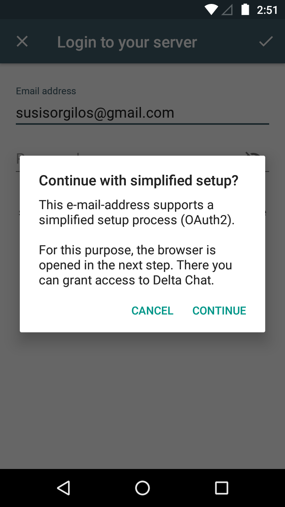
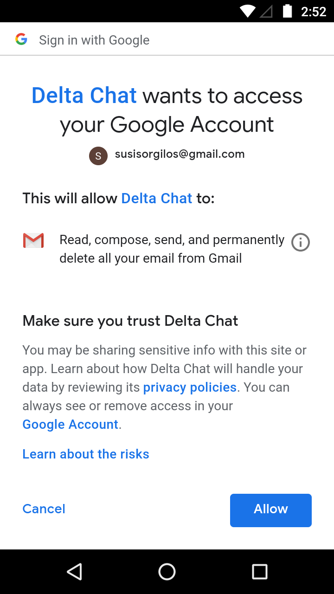

همان‌طور که شاید متوجه شده باشید، Delta Chat اکنون در
**کانال بتا Google Play** موجود است.

روزهای اخیر بازخورد زیادی به این گرفتیم
(از همه ممنون! و مراقبت را ادامه دهید :)
و فکر می‌کنم ایدهٔ خوبی از کارهایی که باید انجام شود تا
به یک انتشار واقعی هدف بگیریم داریم.

- به‌طور کلی، پیام‌های چت به **پوشهٔ DeltaChat** منتقل می‌شوند
  تا INBOX شلوغ نشود
  اگر Delta را همراه با یک اپ میل کلاسیک روی همان حساب استفاده کنید.
  با این حال، این انتقال در برخی موقعیت‌ها بیش از حد پیچیده به نظر می‌رسد
  و سعی می‌کنیم پیش‌فرضی پیاده کنیم که بهتر کار کند
  و فهمیدنش آسان‌تر باشد.

- همچنین، این‌که **ایمیل‌های عادی در Delta ظاهر شوند یا نه**
  گاهی گیج‌کننده است و به محبت بیشتری از برخی توسعه‌دهندگان نیاز دارد.
  این دفعهٔ بعد در [کانال‌های](contribute) شناخته‌شده بحث می‌شود.

- فرآیند onboarding و **حدس تنظیمات سرور** بهبود می‌یابد،
  اینجا هم از همه ممنون
  [که با issueها و pull-requestها در github کمک می‌کنند](https://github.com/deltachat/deltachat-core/).

از قبل انجام‌شده — و بزرگ‌ترین تغییر قابل‌مشاهده در فرآیند onboarding
**پشتیبانی جدید از OAuth2** است.

OAuth2 در حال حاضر برای آدرس‌های gmail.com و googlemail.com پشتیبانی می‌شود
(yandex به‌زودی می‌آید)
و کاربر را از وارد کردن رمز در Delta Chat آزاد می‌کند —
همچنین دیگر نیازی نیست «Less secure apps» را جایی
عمیق در تنظیمات گوگل فعال کنید.

راه‌اندازی جدید این‌طور به نظر می‌رسد:

 

OAuth2 را طوری پیاده کرده‌ایم که از کتابخانه‌های گوگل مستقل بمانیم،
پس خود اپ هنوز پاک است.
مجوزدهی فقط مرورگرهای سیستم را باز می‌کند
و هنوز انتخاب دارید که از OAuth2 استفاده نکنید.

دوست دارید این را آزمایش کنید؟ یک انتشار پیش‌نمایش آماده کرده‌ایم
[اینجا](https://github.com/deltachat/deltachat-android/releases/tag/oauth2-preview-0.101.1) :)

تا اینجا — مشتاق آنچه هفته‌های آینده رخ می‌دهد هستیم :)
