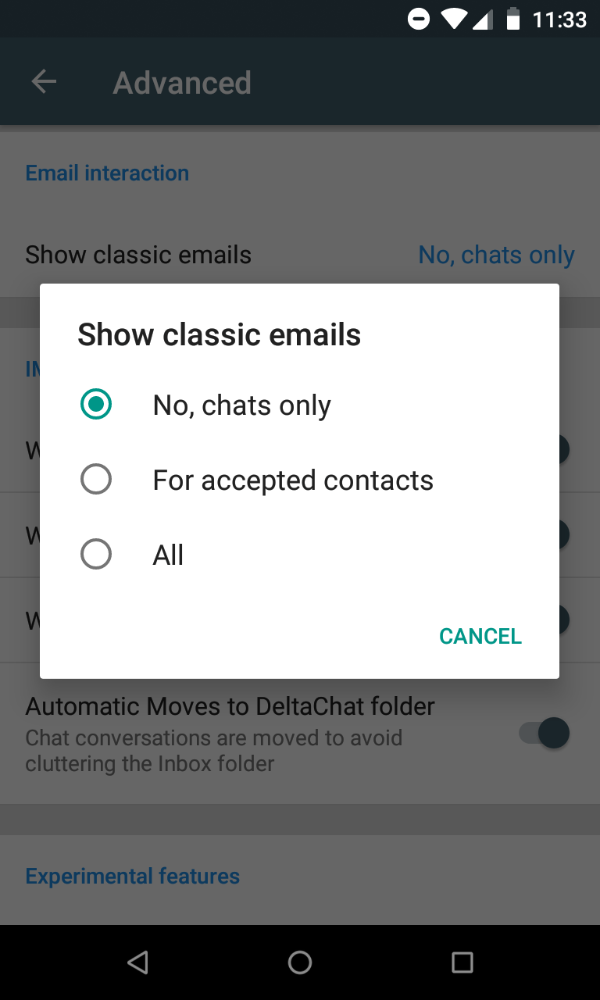

یک انتشار عمدهٔ جدید Delta Chat اندروید (0.200) [اکنون در Google Play](https://play.google.com/store/apps/details?id=chat.delta) و [به‌زودی در F-droid](https://f-droid.org/en/packages/com.b44t.messenger/) است با بهبودهای زیاد که به شکایت‌های محبوب و
درخواست‌های ویژگی می‌پردازد. Delta Chat همچنان به‌عنوان «Beta» علامت‌گذاری شده چون انتظارات
وقتی به استفاده از یک پیام‌رسان جدید می‌رسد قابل فهم است که بالا باشد.
با این حال، بسیاری از شما از استفادهٔ روزمره می‌دانید که سری بتا
هرچه بهتر کار می‌کند. لطفاً ادامه دهید یا در نظر بگیرید که با
[ارائهٔ بازخورد، مشارکت بهبودها یا کمی اهدا](https://delta.chat/en/contribute) به تکامل Delta Chat کمک کنید. اگر به کانال‌های ما بپیوندید بسیاری از
خبرهای خوب آینده را زودتر از اینجا هم می‌شنوید ;)

اما حالا به نکات برجستهٔ این انتشار!

## ورود بدون رمز برای GMail و Yandex

 

حالا می‌توانید حساب ایمیل موجودتان را بدون ارائهٔ
رمز به Delta پیکربندی کنید و دیگر نیازی به فعال‌کردن «less secure apps»
ندارید. OAuth2 در حال حاضر برای gmail.com، googlemail.com،
yandex.ru، yandex.com و yandex.ua پشتیبانی می‌شود. دیگر نیازی نیست
«Less secure apps» را جایی عمیق در تنظیمات فعال کنید. OAuth2 را مستقل
از کتابخانه‌های گوگل پیاده کرده‌ایم. مجوزدهی فقط مرورگرهای سیستم را باز می‌کند و
البته هنوز انتخاب دارید که از OAuth2 استفاده نکنید.

این یعنی فقط باید آدرس ایمیلتان را بدهید و GMail/Yandex
سپس از شما می‌خواهد تأیید کنید دسترسی به حساب ایمیلتان را بدهید تا Delta
بتواند پیام‌های چت را ارسال و نمایش دهد. لطفاً به یاد داشته باشید که **Delta Chat بدون سرور است**
همچنین. همهٔ اپ‌های Delta Chat متن‌بازند و می‌توان تأیید کرد که
اطلاعات آدرس/حساب شما را جایی جز
ارائه‌دهندهٔ ایمیل انتخابی‌تان ارسال نمی‌کنند.

## درخواست‌های مخاطب ساده‌شده

 

با Delta Chat اگر آدرس ایمیل کسی را بدانید می‌توانید به او پیام دهید.
آن‌ها می‌توانند با اپ ایمیل استاندارد خود بخوانند و پاسخ دهند بدون
ثبت‌نام جایی یا نصب چیزی. با این حال، بالاخره به
شکایت محبوبی دربارهٔ این‌که کدام ایمیل‌ها به‌عنوان درخواست مخاطب نشان داده می‌شوند پرداختیم.
حالا به‌طور پیش‌فرض فقط ایمیل‌هایی را به‌عنوان درخواست مخاطب می‌بینید اگر طرف مقابل
پیام Delta Chat فرستاده باشد. ایمیل‌های غیرچت ظاهر نمی‌شوند مگر این‌که
پاسخ مستقیم به پیام چتی باشند که قبلاً فرستاده‌اید.

اگر می‌خواهید هم چت و هم ایمیل‌های عادی از یک مخاطب پذیرفته‌شده را ببینید،
می‌توانید آن را در «تنظیمات پیشرفته» فعال کنید. بعضی‌ها هم دوست دارند همهٔ
ایمیل‌شان را با delta chat بخوانند و می‌توانند دیدن «همه» پیام‌ها
را به‌عنوان درخواست مخاطب فعال کنند.

## انتقال بهتر پیام‌های چت به پوشهٔ DeltaChat

الگوریتمی را که به‌طور خودکار پیام‌های چت را
به پوشهٔ IMAP DeltaChat منتقل می‌کند مقاوم‌تر کردیم. حالا باید
شلوغی کمتری در INBOX با اپ ایمیل معمولی‌تان ببینید. بحث‌های
اجتماعی زیادی در سال گذشته پیرامون این موضوع بود و امیدواریم بالاخره
راهی پیدا کرده باشیم که مقاوم و فهمیدنش آسان باشد. همهٔ پیام‌های چت
خودکار به پوشهٔ DeltaChat منتقل می‌شوند.
همچنین هر پاسخی که به پیام چتی که
قبلاً به یک کاربر ایمیل معمولی فرستاده‌اید بگیرید.

## پیکربندی بهتر ارائه‌دهنده، اندازهٔ پیام، اشتراک فایل

مشکلاتی با چندین ارائه‌دهنده را درست کردیم، از جمله
«Nauta.cu» کوبایی. اگر نمی‌دانستید، Delta Chat
استقبال قابل‌توجهی نزد کاربران کوبایی داشت چون هر ترافیکی که جزیره را ترک کند
گران است در حالی که استفاده از سرور میل «اینترانت کوبایی»
با طرح‌های دادهٔ موبایل نسبتاً مقرون‌به‌صرفه است. Whatsapp عملاً
آنجا در دسترس نیست — واقعیتی نه چندان نادر که بخش‌های بزرگی از
جهان غرب در #facebookdown چند روز پیش تجربه کردند.

همچنین اندازهٔ پیام برای چت‌های گروهی را با دیگر gossip نکردن
کلیدهای رمزنگاری با هر پیام چت کاهش دادیم. همچنین گزینه‌های
فشرده‌سازی بالاتر برای تصاویر هست.

پشتیبانی بهتر برای اشتراک فایل‌ها از اپ‌های دیگر
از طریق کانال‌های Delta Chat هست.

## جزئیات دربارهٔ این انتشار، چه کسانی انجام دادند؟

[ورودی changelog اندروید v0.200.0](https://github.com/deltachat/deltachat-android/blob/master/CHANGELOG.md#v02000) و [ورودی changelog Core v.0.41.0](https://github.com/deltachat/deltachat-core/blob/master/CHANGELOG.md#v0410) جزئیات بیشتری دارند. مشارکت‌کنندگان زیر در issueها و commitهای انتشار دخیل بودند: Alexandex، Angelo Fuchs، Asiel Díaz Benítez، Björn Petersen، Besnik، Christian Klump، cyBerta، Daniel Böhrs، Enrico B.، ferhad.necef، Florian Haar، Floris Bruynooghe، Friedel Ziegelmayer، Heimen Stoffels، Holger Krekel، Iskatel Istiny، Lech Rowerski، Moo، Ole Carlsen، violoncelloCH.
