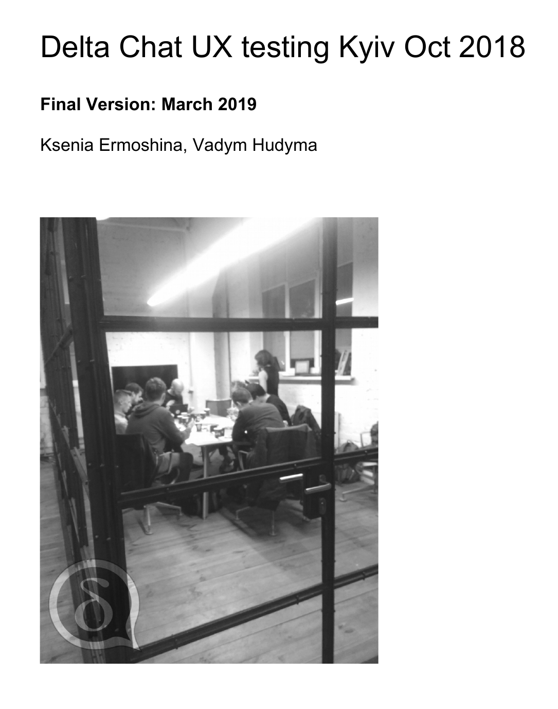

[اولین گزارش آزمایش کاربر](../assets/blog/Delta-Chat-UX-test-report1.pdf) ما منتشر شد.
آزمایش کاربر اواخر اکتبر ۲۰۱۸ در کی‌یف برگزار شد و شامل ۱۲ آزمایش‌کننده بود،
۱۰ نفر از گروه‌های کاربری روزنامه‌نگاری و فعال NGO، و ۲ نفر
علاقه‌مند فناوری محلی. گزارش هفت یافتهٔ کلیدی را برجسته می‌کند و
به بخشی از کاری که از زمان آزمایش تاکنون انجام شده ارجاع می‌دهد.

