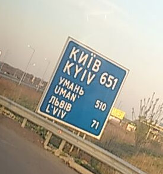 
در چند هفتهٔ گذشته، موقعیت عمیقاً برای Delta Chat، پیام‌رسان «چت روی ایمیل»،
اهمیت داشت. فرق می‌کند اگر توسعهٔ نرم‌افزار در یک استارباکس
در سان‌فرانسیسکو باشد یا دور یک اتوبوس قهوهٔ بازسازی‌شده در کی‌یف، پایتخت اوکراین فقط ۲۰۰ کیلومتر دور
هم از منطقهٔ جنگ و هم از چرنوبیل. بعضی‌ها از قبل ظاهر شدن
«جریان موقعیت بر حسب تقاضا» در تنظیمات پیشرفتهٔ اپ اندروید را متوجه شده‌اند. این ویژگی منحصربه‌فرد
فقط بی‌سروصدا پیش از گردهمایی «Xyiv» ما که هفتهٔ آخر آوریل ۲۰۱۹ رخ داد منتشر شد. این پست
نمایی از آنچه آن هفته رخ داد می‌دهد — با پیش‌نمایی از *Rustocalypse* آینده
و نگاه‌های جدید در حال تکامل به درهم‌تنیدن فعالیت‌های UX، رمزنگاری و پیاده‌سازی در فضای گسترده‌تر غیرمتمرکزسازی.
<a href="../assets/blog/xyiv-coffeebus.jpg">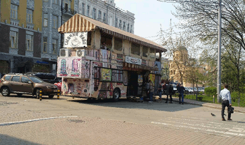 </a>

با وجود این‌که این پست کمی طولانی است، خیلی چیزها را اینجا ذکر نمی‌کنیم. بالاخره، حدود ۲۵ نفر
برای «Xyiv» رسیدند، بعضی با ماشین و قطار، و بعضی با هواپیما از آن سوی سیاره (هاوایی). سن‌ها از
۸ سال تا خیلی بالاتر از ۵۰ بود. مردم همیشه به زیرگروه‌ها منشعب می‌شدند و حتی در basecamp،
محل اصلی گردهمایی ۱۶۰ متر مربعی ما، معمولاً ۳–۵ گروه مختلف درگیر یک موضوع یا دیگری بودند.

## جریان موقعیت بر حسب تقاضا

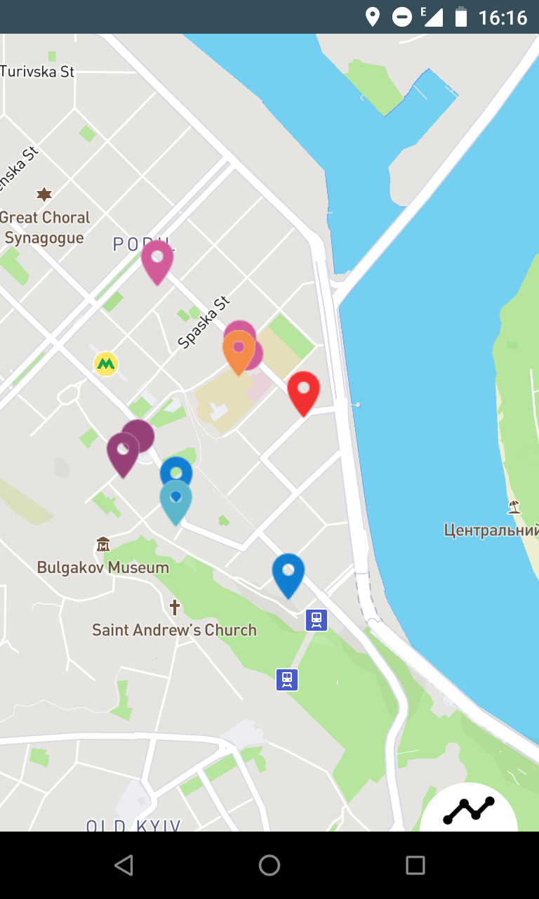 

توسعه‌یافته پس از [بحث‌های UX ما در گردهمایی «Delta Xi» در ۲۰۱۸](https://delta.chat/en/2018-11-17-deltaxi#new-planned-features-for-at-risk-and-other-users)، جریان موقعیت اجازه می‌دهد دادهٔ موقعیت ارسال شود و پیام‌ها و عکس‌های ورودی از کسانی که دادهٔ موقعیت می‌فرستند روی نقشه در یک چت نشان داده شود. برای
سناریوهای استفادهٔ *نامتقارن* است که «basecamp» کاربرانی در معرض خطر
بازداشت و آدم‌ربایی را پایش می‌کند. با این حال می‌تواند بین
دوستان هم استفاده شود و در واقع توسط توسعه‌دهندگان با یکدیگر در زمان
منتهی به گردهمایی آوریل آزمایش شد. پس از فعال‌کردن «جریان موقعیت بر حسب تقاضا» در «تنظیمات پیشرفته» می‌توانید
در هر چت روی دکمهٔ «پیوست» کلیک کنید و «location» را انتخاب کنید.
سپس انتخاب می‌گیرید که چقدر می‌خواهید دادهٔ موقعیت را جریان دهید.
این موقعیت‌های GPS را به همهٔ پیام‌ها، از جمله عکس‌ها و رسانهٔ دیگر، پیوست می‌کند.
همهٔ موقعیت‌ها و پیام‌ها معمولاً end-to-end رمزنگاری شده‌اند و دادهٔ موقعیت
با اشخاص ثالث به اشتراک گذاشته نمی‌شود — یعنی اگر گوشی‌تان عموماً طوری پیکربندی شده
که دادهٔ موقعیت را با گوگل یا طرف‌های دیگر به اشتراک نگذارد.

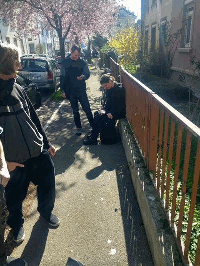 
در حالی که Bjoern و Richy به‌شدت سمت اندروید جریان موقعیت را
در هفته‌های اخیر آماده می‌کردند، Nico به‌خوبی سمت دسکتاپ را پیش می‌برد
که هنوز منتشر نشده اما از قبل در توسعهٔ اصلی «master» ادغام شده.
تصور می‌کنیم کاربران «basecamp» بیشتر از نسخهٔ دسکتاپ
برای هماهنگی استفاده کنند چون فضای صفحهٔ بیشتری می‌دهد. این *سناریوی نامتقارن* همچنین
در یک بازی ویژه در خیابان‌های محلهٔ Podil و
بندر کی‌یف بازی شد ... اما بیشتر در پایان این پست ;)

Delta Chat در حال حاضر از [کتابخانه‌های متن‌باز mapbox](https://docs.mapbox.com/android/maps/overview/) استفاده می‌کند و دادهٔ نقشه را از سرورهای mapbox می‌گیرد، اما موقعیت دقیق را با
سرورهای mapbox *به اشتراک نمی‌گذارد*. توجه کنید که یک مشارکت‌کنندهٔ دقیق سریع [نشت‌های دادهٔ ناخواسته را متوجه شد](https://support.delta.chat/t/mapbox-sends-too-many-data-to-their-servers/393) که سریع درست کردیم و
به GPlay و F-droid منتشر کردیم. در بلندمدت می‌خواهیم سرورهای نقشهٔ
غیرمتمرکز مناسب ادغام کنیم و با substack توطئه می‌کنیم که در طول Xyiv هم
[راه‌های جدید ذخیره، محاسبه و اشتراک دادهٔ نقشه](https://github.com/peermaps/eyros) را پیش می‌برد، با نگاهی به ادغام بعدی با Delta
Chat. در این میان mapbox کار را انجام می‌دهد و برای ادغام
روی اندروید و دسکتاپ به‌اندازهٔ کافی راحت بود.

## Rustocalypse آیندهٔ Delta Chat

 
خطی از فعالیت‌های سنگین در هفته‌های اخیر پیرامون
[RPGP](https://github.com/rpgp/rpgp)، اولین پیاده‌سازی کامل Rust
در جهان از OpenPGP از [Friedel Ziegelmayer](https://github.com/dignifiedquire/) رخ داد.
کتابخانهٔ جدید Rust او از ابتدایی‌های Autocrypt 1.1 پشتیبانی می‌کند و به ما اجازه می‌دهد از RSA
به کلیدهای کوتاه‌تر و مدرن‌تر ED25519 برای رمزنگاری ایمیل در
انتشارهای بعدی برویم. RPGP از قبل در buildهای توسعه کار می‌کند.
روی گرفتن یک بازبینی امنیتی کد مستقل از RPGP کار می‌کنیم.

برای کسانی که نشنیده‌اند: Rust یک زبان
برنامه‌نویسی سیستم جدید از Mozilla است. به‌طور گسترده برای
ویژگی‌های امنیت و استحکامش ستایش می‌شود، مثلاً [Diane Hosfelt
تحلیل کرده](https://hacks.mozilla.org/2019/02/rewriting-a-browser-component-in-rust/):
«*در طول عمرش، ۶۹ باگ امنیتی در
کامپوننت style فایرفاکس بوده. اگر ماشین زمان داشتیم و می‌توانستیم
این کامپوننت را از اول با Rust بنویسیم، ۵۱ (۷۳٫۹٪) از این باگ‌ها
ممکن نبودند.*»

 
«X» در Xyiv را می‌توان نماد «ناشناخته»، مسیرهای پیچ‌درپیچ و تاب‌دار
توسعه‌هایی دانست که نه می‌توان پیش‌بینی کرد نه انتظار داشت. و غیرمنتظره در طول
گردهمایی کی‌یف ما رسید. Friedel با [C2Rust](https://c2rust.com/) بازی کرد،
ابزاری جدید برای تبدیل کد C به Rust و با اعمال چند افسون جادویی دیگر، موفق شد
یک نسخهٔ rough Rust از هستهٔ Delta Chat (DCC) تولید کند. کد جدید حتی خوانا ماند و تقریباً کامپایل شد!
پس از چندین بحث و جلسهٔ هک شبانه‌روزی، به نظر می‌رسد Rustocalypse
نزدیک می‌شود، با [هستهٔ جدید Rust Delta Chat](https://github.com/deltachat/deltachat-core-rust/) که آمادهٔ تبدیل‌شدن به پایهٔ جدید همهٔ اپ‌های Delta Chat است. ترجمهٔ C2Rust
فقط ممکن بود چون DCC با C ساده نوشته شده — در مقابل، کد C++
نمی‌تواند این‌طور ترجمه شود.

با این حال، حالا قطعات کد زیادی — به زبان پارسی Rust — *unsafe* هست.
این قطعات کد unsafe در واقع به‌اندازهٔ کد C فعلی امن‌اند. رفتن به
Rust پس باعث افت نمی‌شود. برای کوتاه‌کردن داستان بلند،
چندین توسعه‌دهندهٔ Delta Chat حالا Rust را از [Community
Rust Book](https://doc.rust-lang.org/stable/book/) یاد می‌گیرند و
توسعه‌های DCC-Rust را نزدیک دنبال می‌کنند. شاید بعضی از شما به سرگرمی بپیوندید و
Pull Request بزنید تا [هستهٔ جدید DCC Rust امن‌تر شود؟](https://github.com/deltachat/deltachat-core-rust/)

## جلسات آزمایش UX با روزنامه‌نگاران و فعالان

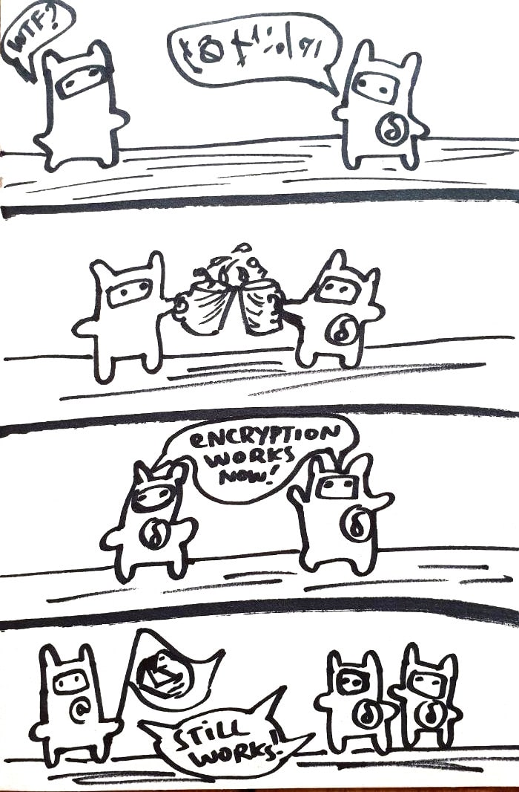 
گردهمایی Xyiv با **دو جلسهٔ آزمایش کاربر با روزنامه‌نگاران و فعالان** شروع شد،
که Xenia و Vadym انجام دادند که در مارس یافته‌هایشان دربارهٔ [دور اول آزمایش‌های UX در ۲۰۱۸](https://delta.chat/en/2019-03-30-uxreport) را منتشر کرده بودند. Delta Chat پروژه‌ای عمیقاً UX-محور است
و برخلاف بسیاری از آزمایش‌های «اتفاقی» در مناسبت‌های مختلف، و از بازخورد در [انجمن پشتیبانی](https://support.delta.chat) پرجنب‌وجوش، آزمایش‌های UX کی‌یف ما به شیوه‌ای نظام‌مندتر و علمی‌تر انجام می‌شوند. یک وظیفهٔ گرم‌کردن تفسیر نقاشی‌های نمونهٔ اولیه برای توضیح چگونگی کار رمزنگاری Autocrypt بود. نقاشی‌ها بخشی از تلاش برای آموزش با تصاویر دیگر غیر از «قفل‌های» نسبتاً انتزاعی و رساندن این است که رمزنگاری Autocrypt فرصت‌طلبانه برقرار می‌شود، نه «از پیش». اولین سردرگمی در اولین پنل نقاشی پیش آمد: مردم فکر کردند پیام اول از قبل رمزنگاری شده (به‌خاطر «کاراکترهای عجیب») — این در واقع گمراه‌کننده است، پس سعی می‌کنیم به عبارتی «متن واضح» مثل «hey, let's party» تغییر دهیم. دوم، کسانی که مشروب نمی‌خوردند استعارهٔ به هم زدن لیوان‌ها را نفهمیدند، با این حال دیگران این استعاره را خیلی دوست داشتند، یک آزمایش‌کننده گفت «وقتی به اسکاتلند می‌آیم اول حس می‌کنم انگلیسی‌شان را نمی‌فهمم، اما بعد از اولین ویسکی همه چیز را می‌فهمم». فاز دوم آزمایش‌ها شامل این بود که آزمایش‌کنندگان سه دقیقه دقیق به اسکرین‌شات‌های Delta Chat نگاه کنند و بگویند چه دیدند و فهمیدند.

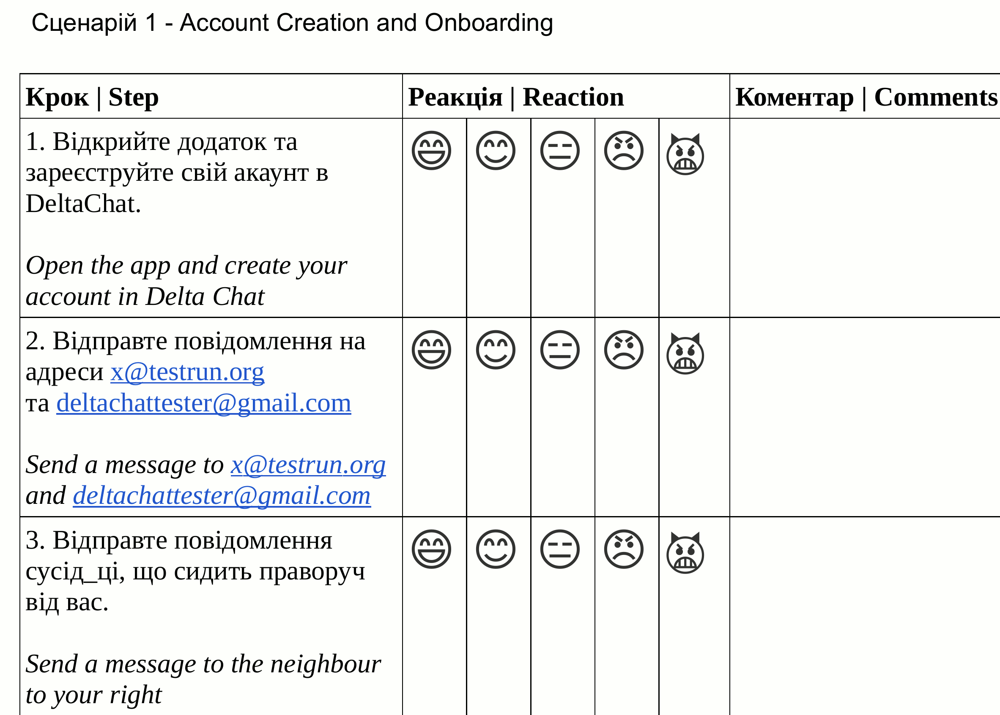 
پس از این دو وظیفهٔ گرم‌کردن، آزمایش‌کنندگان باید وظایف آماده‌شده را در
چهار دسته انجام و ارزیابی می‌کردند:

- ایجاد حساب و Onboarding
- ایجاد چت گروهی و مدیریت گروه
- گروه‌های تأییدشده و مدیریت گروه تأییدشده
- جریان موقعیت

بازخورد زیادی دربارهٔ این وظایف بود که گزارش آزمایش UX آینده بحث و ارزیابی می‌کند. اینجا یک بازخورد کلی را ذکر کنیم که به‌ویژه جالب یافتیم: کاربران گفتند Delta Chat را دوست دارند اما می‌خواهند دقیقاً بدانند چه چیزی دربارهٔ آن متفاوت است، در مقایسه با پیام‌رسان‌های دیگر. گفتند «پیام‌های خوش‌آمد» (پیام‌های onboarding) نسبتاً عجیب بودند و شبیه بازاریابی اپ‌های دیگر به نظر می‌رسیدند («بهتر / سریع‌تر / قوی‌تر»). به‌جای امنیت پیشنهاد کردند روی غیرمتمرکزسازی / فدراسیون، و جامعه پشت این پروژه تمرکز شود.

## جلسات بسیار بسیار دیگر Xyiv

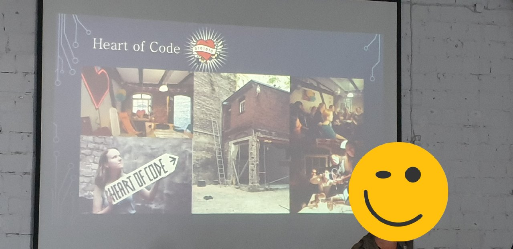 
چندین نفر مرتبط با هکراسپیس Heart of Code در برلین در رویدادهای Xyiv شرکت کردند. در کنفرانس آزاد، Cat و Martha آخرین سال‌های فعالیت‌های متنوع هکراسپیس زنان در آلمان را ارائه و بحث کردند. در کی‌یف، فعلاً اصلاً هکراسپیس نیست. تکامل یک ساختار جمعی برای باز کردن فضاهای خودسازمان‌یافته پر از چالش است. بعضی از گروه Xyiv می‌خواهند دربارهٔ کمک به راه‌اندازی چنین فضایی در بهار ۲۰۲۰ ببینند، وقتی Delta Chat احتمالاً برای گردهمایی بزرگ‌تری به کی‌یف برمی‌گردد. Donna از Syster Servers دربارهٔ ۲۰ سال ادارهٔ زیرساخت و دادن کارگاه برای زنان گفت، و همچنین در بحث‌های گوناگون دیگر پیرامون Delta Chat و رخدادهای sysadmin شرکت کرد.

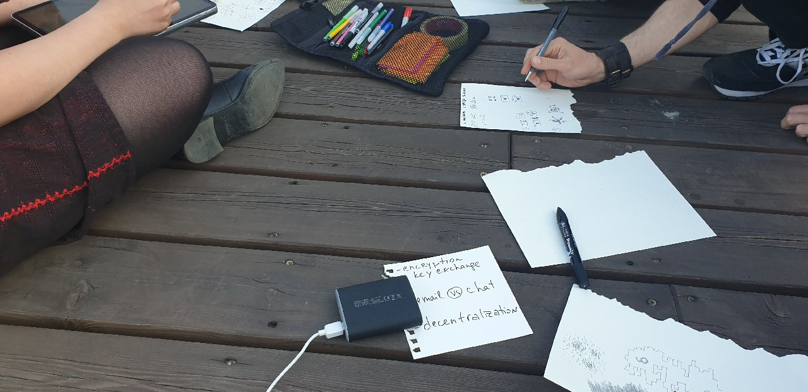 
یافتن راه‌های خوب برای توضیح و پالایش «تبادل کلید غیرمتمرکز» Delta Chat موضوع
جلسات UX در کنفرانس آزاد بود. ادغام نقاشی‌های توضیحی موضوعی در حال انتظار
با Delta Chat و بخشی از تلاش‌ها برای [بهبود FAQ](https://delta.chat/en/help#what-is-delta-chat) است. بحث‌های زیادی در طول Xyiv پیرامون بازگشت فرصت‌طلبانهٔ Delta Chat به پیام‌های متن‌واضح می‌چرخید. وقتی «منطق Autocrypt» تشخیص دهد که برخی اعضای چت در غیر این صورت ممکن است نتوانند پیام‌ها را بخوانند رخ می‌دهد. هنوز زیاد شناخته‌شده و خوب توضیح داده نشده، می‌توانید «گروه‌های تأییدشده» بسازید که e2e-encryption را اجبار می‌کنند و [توسط پژوهشگران اتحادیه اروپا امن در برابر حتی حملات فعال شبکه یا ارائه‌دهنده تشخیص داده شده‌اند](https://countermitm.readthedocs.io/en/latest/new.html).

 
بعضی افراد با تجربه در ادارهٔ زیرساخت ایمیل جمعی جلسه‌هایی
پیرامون تکامل [testrun.org](https://testrun.org)، یک سرور ایمیل آزمایشی استفاده‌شده
برای آزمایش‌های UX با Delta Chat، داشتند. از چهار کشور و به همان اندازه زمینهٔ مختلف آمده بودند،
تجربیاتشان و چگونگی ادارهٔ امن و سادهٔ سرورهای ایمیل جدید را بحث کردند،
بدون نیاز به ابزار cloud-scale.
از این بینش شروع شد که اگر نمی‌خواهید یا نیاز ندارید
فراتر از ۱۰ هزار کاربر scale up کنید، نیازی نیست با ابزار
و زیرساختی درگیر شوید که معمولاً میلیون‌ها کاربر را هدف دارد.
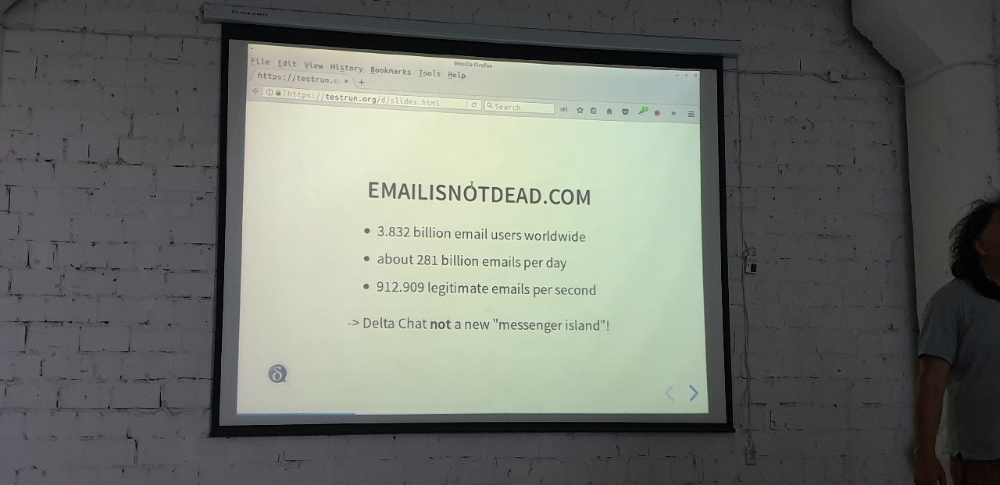 
جلسات sysadmin شامل فکر کردن دربارهٔ چگونگی اشتراک آسان اسرار (DNS،
میزبانی، ssh-keys)، چگونگی version کردن فایل‌های پیکربندی سیستم، و چگونگی
تکامل یک سرویس *بلندمدت* بود که زنده ماندن افراد خارج‌شونده و
پیوندنده به پروژه را تاب آورد. یک ایدهٔ راهنما رسیدن به رویه‌های
«کم‌تلاش» است چون ادارهٔ زیرساخت جمعی معمولاً اغلب
«در کنار» انجام می‌شود نه به‌عنوان شغل اختصاصی. ایدهٔ راهنمای دیگر
دیدن این است که Delta Chat چگونه می‌تواند از چنین فعالیت‌هایی پشتیبانی کند. برای آن
هدف، یک گروه e2e-رمزنگاری‌شدهٔ تأییدشده راه‌اندازی شد که گفت‌وگو ادامه دارد ...
نسبتاً امن در برابر ارائه‌دهندگان ایمیل در معرض خطر یا مهاجمان شبکه که فعالانه
سعی در شنود دارند.

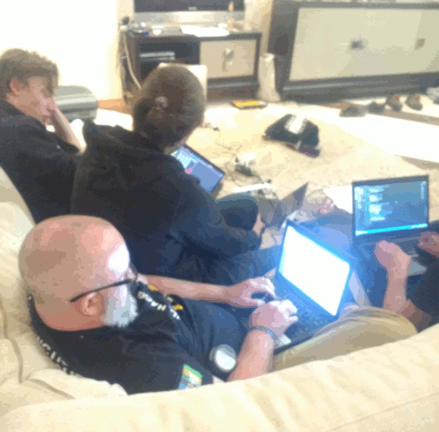 
در طول هفتهٔ Xyiv، Jikstra، Magnus، Nico، Floris و Karissa چندین بهبود
برای Delta Chat Desktop کار کردند. حالا برای distroهای لینوکس ممکن است نصب system wide
از Delta Chat با چندین نمونهٔ Desktop per-user داشته باشند. مدیریت وابستگی برای Mac بهبود یافت
و چندین بهبود معماری (برای سرعت)، و همچنین توانایی «تگ» کردن یک مکان
روی نقشهٔ جریان موقعیت. Karissa [شروع به بازی (DELTAR!)](https://github.com/karissa/deltar/) با معماری جدید Webview/Rust کرد که بالقوه می‌تواند Electron را حذف کند و
اندازهٔ دانلود را به ۱۰ مگابایت یا کمتر، روی همهٔ پلتفرم‌های دسکتاپ کاهش دهد. باینری‌های کوچک
از مرورگر سیستم استفاده می‌کنند و با یک هستهٔ Rust بسته‌بندی می‌شوند که همهٔ شبکه،
ماندگاری و رمزنگاری را انجام می‌دهد.

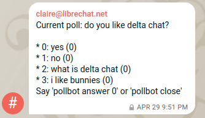 
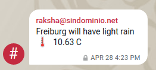 
Kali و Karissa همچنین با پیاده‌سازی Chat Botها به ترتیب در Python و
Javascript خوش می‌گذراندند. نوشتن و اجرای بات‌های Delta Chat نسبتاً آسان است.
همهٔ چیزی که نیاز دارید یک حساب استاندارد SMTP/IMAP جایی و توانایی اجرای
یک فرآیند سبک و بلندمدت روی یک ماشین است. با این حال، همهٔ بات‌ها تاکنون، از جمله
یکی از Simon که IRC را با Delta Chat پل می‌زند، نمونهٔ اولیه هستند و فقط نگاهی به
آینده. منتظر خبرهایی دیرتر در ۲۰۱۹ باشید وقتی بات‌ها برای شما می‌آیند،
سوار بر امواج Rustocalypse آینده.

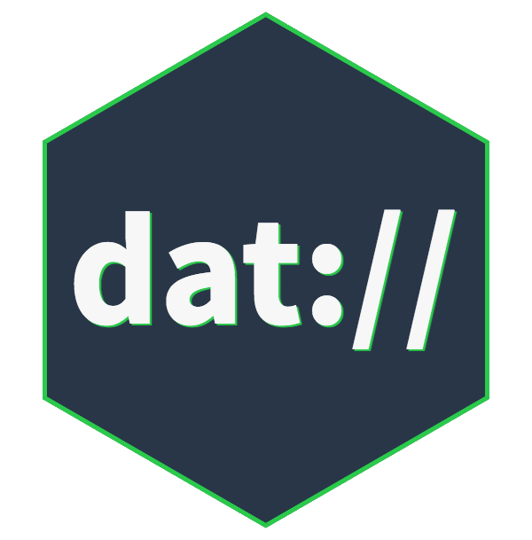 
از Rust که بگذریم، Sid، Franz و Matze پیوسته با کارشان روی [Arso](https://arso.xyz/)، یک پروژهٔ آرشیو غیرمتمرکز بر پایهٔ [پروتکل‌های P2P DAT](https://datproject.org/) پیش می‌رفتند. چندین گفت‌وگو پیرامون ادغام‌های بالقوهٔ بات‌های Delta Chat با این تلاش‌های آرشیو غیرمتمرکز می‌چرخید. گفت‌وگوها دربارهٔ ادغام رویکردهای غیرمتمرکز است نه تلاش برای ساخت پروژه‌های پلتفرم «جایگزین‌جهان» که سعی می‌کنند دیگران را قانع کنند همه چیز را روی پلتفرم‌شان استفاده و پایه کنند. می‌توان گفت پروژه‌های غیرمتمرکزسازی اغلب بیش از حد روی غیرمتمرکزسازی فنی متمرکزند اما پلتفرم‌های جزیره‌ای تولید می‌کنند که با یکدیگر ادغام نمی‌شوند. آیندهٔ غیرمتمرکزسازی شاید بیشتر روی **ادغام‌ها در سطح UX** باشد تا کاربران واقعاً بتوانند از ثروت پروژه‌های جالب غیرمتمرکزسازی استفاده کنند — نه افزودن الگوریتم‌های فنی زیرکانهٔ بیشتر به هر پروژهٔ واحد.

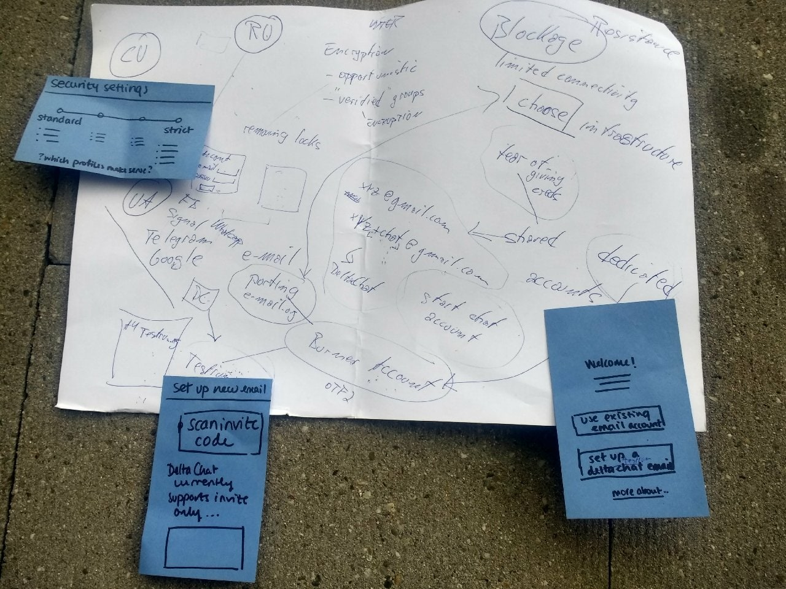 
دربارهٔ آینده که بگوییم، Eileen از [SimplySecure](https://simplysecure.org/) را با خود داشتیم
که کمک کرد جلسات UX/Dev پیرامون برنامه‌ریزی تلاش‌های آینده را تسهیل کند. با Bjoern، Xenia، Holger، Vadym و Evgenia، مشترکاً دو جلسهٔ بلندتر sketching و برنامه‌ریزی کردند، که پیشرفت‌های فنی فعلی، بینش‌های آزمایش UX و پرداختن به نیازهای فعالان پرخطر در مأموریت‌های حقوق بشر را گرد آورد. در میان چیزهای دیگر، چند نقطهٔ فروش منحصربه‌فرد Delta Chat برای کاربران اروپای شرقی (و بسیاری جاهای دیگر) کار کردیم:

- **آزادی انتخاب** ارائه‌دهندگان ایمیل سازگار با استاندارد

- **سرورهای ایمیل سخت برای مسدود کردن** به‌خاطر آسیب جانبی به کسب‌وکارها و دولت‌ها

- **گروه‌های تأییدشدهٔ e2e-رمزنگاری‌شده**، امن در برابر حملات فعال شبکه

- **توسعه‌های فنی UX-محور (جریان موقعیت و غیره)** چون
  امنیت بهتر است به‌عنوان نتیجه برای افراد تحت تهدید در نظر گرفته شود،
  نه فقط به‌عنوان ویژگی پروتکل‌های رمزنگاری.

شاید ارزش یادآوری داشته باشد که همهٔ forward secrecy و رمزنگاری زیرکانه کمکتان نمی‌کند
اگر کسی تهدید کند انگشتانتان را (یا بدتر) بشکند تا دسترسی به دستگاهتان را بدهید.
در آن موقعیت‌هاست که مثلاً جریان موقعیت ویژگی امنیتی مهم‌تری می‌شود
تا الگوریتم رمزنگاری چون آن‌وقت حامیانتان می‌دانند کجایید و
بهتر می‌توانند برای کمک ترتیب دهند.

## بازی با غیرمتمرکزسازی

<a href="../assets/blog/xyiv-cards1.jpg">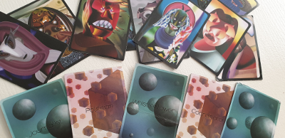</a>

بازی یکشنبه، که مخفیانه توسط Xenia با گرافیک از Demian آماده شده بود، نوعی اوج
هفته‌ای از قبل پررویداد را رقم زد. شرکت‌کنندگان، از جمله محلی‌ها، در دو گروه «Cubes» و «Spheres» قرار گرفتند. بازیکنان از هر دو تیم کارتی می‌کشیدند و نقشی بازی می‌کردند — روزنامه‌نگار، افشاگر، جاسوس، سیاستمدار با هر طرف که توسط یک نفر روی دسکتاپ Delta Chat در محل «basecamp» هماهنگ می‌شد. بازیکنان جریان موقعیت را روشن می‌کردند و باید مجموعهٔ پیچیده‌ای از وظایف همزمان را انجام می‌دادند، با پویایی و سردرگمی سرگرم‌کنندهٔ زیاد. امتیاز ویژه وقتی به دست می‌آمد که یک طرف موفق می‌شد سیاستمدار یا روزنامه‌نگار طرف دیگر را «زندان» کند.

تصادفاً، یکشنبه همچنین اوج مذهبی بود چون روز اصلی عید پاک ارتدکس بود که همه بیرون در خیابان‌ها و کلیساها هستند.
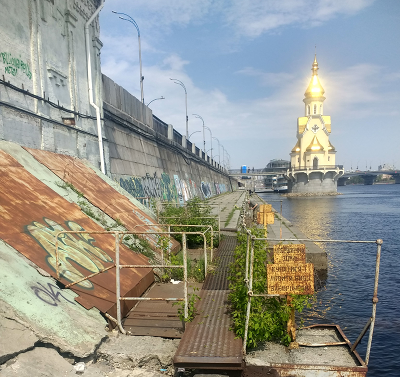 
<a href="../assets/blog/xyiv-dc4.jpg">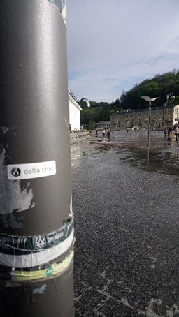</a>
پس یکی از وظایف ad-hoc گرفتن عکس از داخل کلیسا شد. یک وظیفهٔ کلیدی
شکار «dead drop»ها در ۱۲ مکان آماده‌شده داخل شهر بود. Dead dropها وظایف بیشتری داشتند که شامل یافتن و گذاشتن استیکر بود. Dead dropها به‌عنوان «Points of interests» به نقشه‌هایی اضافه شدند که بازیکنان در طول بازی می‌توانستند دسترسی داشته باشند. این ویژگی «add POI» خودش فقط یک روز پیش از بازی اضافه شده بود.

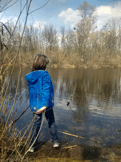 
بازی‌کردن شامل ویژگی‌های زیاد Delta Chat بود. هر دو گروه سریع
«گروه‌های تأییدشده» راه‌اندازی کردند چون راه آسانی برای آوردن همه به گروه سریع فراهم می‌کند.
همچنین شامل خیلی از ویژگی کاملاً جدید جریان موقعیت بود و بازیکنانی که یکدیگر را
از شهر تعقیب می‌کردند. یک «سیاستمدار» جوان با کت آبی
پیدا شد که در جاهای عجیب پنهان شده ... قطعاً گویا بود که چگونه مشکلات
و سردرگمی از استرس کلی تلاش برای فهمیدن
چه اتفاقی می‌افتد، قطع اتصال، دستگاه‌های «ربوده‌شده» و غیره تشدید شد. نگاهی دست‌اول
به پیچیدگی‌های هماهنگی مأموریت‌های حقوق بشر
در موقعیت‌های سرکوبگر داد.

چندین بازیکن مشتاق تکرار و پالایش بازی در شهرهای زادگاهشان بودند. همچنین بعضی
گفت‌وگوهای مخفیانه دربارهٔ *Operation Werewolf* شنیده شد ... بگذارید بازی بیشتر شروع شود :)

## مهمانی و سپاس ویژه از ...

 
در نهایت، پس از بازی، مهمانی‌ای داشتیم آن‌قدر خوب که تقریباً کسی وقت
گرفتن عکس نداشت. شایعاتی هست که در یک زیرزمین رخ داد و
کدینگ گرافیک زندهٔ پروجکت‌شده در جریان بود، و همچنین کمبود و وفور الکل و این‌که بعضی‌ها فقط
خیلی بعد از طلوع آفتاب توانستند برگردند .... اما در هر صورت سپاس ویژه به Anna که
پشتیبانی محلی ما برای ترتیب و مراقبت از بیشتر زیرساخت‌ها و مکان‌های ذکرشده در این پست بود.

## انتشارهای تثبیت آینده ...

پس از این مخلوط وحشی تصاویر و پیشرفت‌ها، شاید خیالتان راحت شود که بشنوید تیم هستهٔ Delta
Chat همچنین توافق کرد حالا اول از همه روی تحویل انتشارهای پایدار DC در
ماه‌های آینده تمرکز کند. این همچنین بخشی از چیزی است که به [OpenTechFund](https://opentechfund.com) که بسیاری از تلاش‌های توصیف‌شده در این پست را تأمین مالی می‌کند وعده داده‌ایم. جلسات sync هفتگی در کانال IRC #deltachat freenode، چهارشنبه ۹ شب CEST، برای همگام‌سازی تلاش‌های انتشار برگزار می‌شود. اگر می‌خواهید جهت‌گیری کنید و بالقوه در ظرفیتی کمک کنید [کانال‌ها و مخازن](https://delta.chat/en/contribute) ما را ببینید.

در نهایت، از همه ممنون که به Xyiv آمدند ... همه را امیدواریم به‌زودی در مناسبت‌هایی با نام متفاوت اما به همان اندازه شاد و پربار ببینیم!
