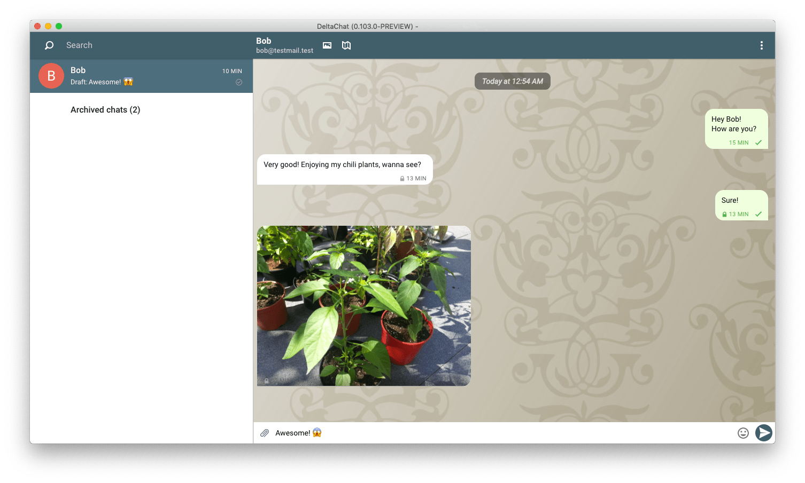
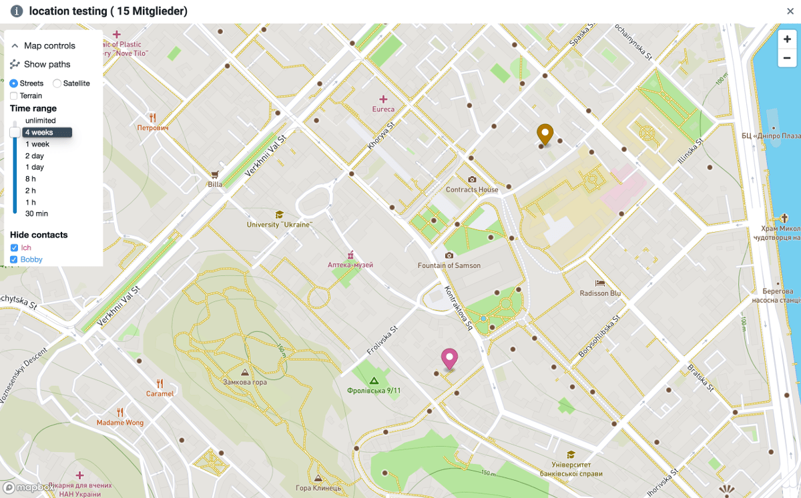

 
انتشارهای جدید دسکتاپ (0.104.0) با موتور رمزنگاری جدید مبتنی بر Rust، [RPGP](https://github.com/rpgp/rpgp)، بسته‌بندی بهتر انتشار Mac و Linux و چندین بهبود UX دیگر هست که
پایین‌تر جزئیات می‌دهیم. «Assets» را در [صفحهٔ انتشارهای github](https://github.com/deltachat/deltachat-desktop/releases/tag/v0.104.0) برای دانلودهای مربوطهٔ دسکتاپ ببینید.

**نکات مهم دربارهٔ این انتشار**:

- **می‌توانید دسکتاپ را به‌عنوان تنها اپ Delta Chat خود استفاده کنید، موبایل لازم نیست.**

- **اگر از قبل Delta Chat را روی موبایل استفاده می‌کنید، بهتر راه‌اندازی‌تان را با
  دسکتاپ همگام کنید!**: اگر Delta Chat دسکتاپ را کنار
  یک نسخهٔ موبایل موجود Delta Chat نصب کنید باید راه‌اندازی‌ها را همگام کنید.
  پس از پیکربندی Delta Chat Desktop، در اندروید «Send Autocrypt Setup message» را در
  تنظیمات پیشرفته فعال کنید، کمی صبر کنید و پیام Setup ورودی را در دسکتاپ بپذیرید. پس از وارد کردن صحیح
  شمارهٔ امنیتی/تأیید (روی موبایل نشان داده می‌شود، در دسکتاپ تایپ می‌شود) پیام‌های
  خروجی و ورودی را روی هر دو دستگاه می‌بینید — همگام‌سازی باید نسبتاً فوری باشد.

- **Delta Chat Desktop به‌خوبی قابل‌استفاده است اما همهٔ ویژگی‌های UX
  اندروید را ندارد**. بیش از خوش‌آمدید که [اصلاحات/ویژگی‌ها در github](https://github.com/deltachat/deltachat-desktop) مشارکت کنید اما توجه کنید که بحث ویژگی معمولاً اول
  در [انجمن پشتیبانی](https://support.delta.chat) رخ می‌دهد. برای شروع، فرآیند onboarding
  برای کاربران موجود Android/iOS Delta Chat می‌تواند قشنگ‌تر باشد ;)

- Delta Chat برای ویندوز در راه است، برای کسانی که می‌خواهند کمک کنند یک پیش‌انتشار آزمایشی هست
  [DeltaChat.Setup.0.105.0-pre1.exe](https://github.com/deltachat/deltachat-desktop/releases/download/v0.105.0-pre1/DeltaChat.Setup.0.105.0-pre1.exe)، با مسئولیت خودتان استفاده کنید ;)

- اگر با این انتشار مشکل دارید ممکن است [بخش Desktop
  در انجمن ما](https://support.delta.chat/c/desktop) را بررسی کنید یا هر یک از
  [کانال‌های مشارکت/ارتباط](https://delta.chat/en/contribute) در حال تکامل دیگر ما را ببینید.

## تعویض موتور رمزنگاری به RPGP، پیاده‌سازی کامل Rust از OpenPGP

حالا از [RPGP](https://github.com/rpgp/rpgp)، اولین
پیاده‌سازی کامل Rust از OpenPGP، قالب رمزنگاری زیربنایی
که Delta Chat استفاده می‌کند، استفاده می‌کنیم. این کتابخانهٔ جدید Rust از ابتدایی‌های [Autocrypt 1.1](https://autocrypt.org)
پشتیبانی می‌کند و اجازه می‌دهد به کلیدهای ED25519 برای رمزنگاری ایمیل
در دو انتشار بعدی برویم. انتشارهای دسکتاپ اولین
نشانهٔ ملموس [Rustocalypse](https://delta.chat/en/2019-05-08-xyiv#the-coming-delta-chat-rustocalypse) آینده هستند. سپاس فراوان از Friedel برای پافشاری‌اش روی RPGP و
همهٔ پشتیبانی با ادغام‌ها!

## جریان موقعیت: نقشه‌برداری شرکای چت موبایل

پشتیبانی سمت دسکتاپ [جریان
موقعیت](https://delta.chat/en/2019-05-08-xyiv#on-demand-location-streaming) را ادغام کردیم.
دسکتاپ می‌تواند نقشه‌ای برای یک گروه و آخرین موقعیت(های) شرکت‌کنندگانش را نشان دهد
اگر جریان موقعیت را فعال کنند. دستگاه‌های اندروید می‌توانند موقعیت را از طریق «attach location» گزارش کنند
پس از این‌که «on-demand-location streaming» را در بخش ویژگی‌های آزمایشی تنظیمات فعال کردید.
می‌توانید نقاط مورد علاقه برای یک گروه تنظیم کنید و از بازهٔ زمانی دادهٔ تاریخی
برای نگاه کردن استفاده کنید. سپاس فراوان از Nico که این ویژگی را عمده‌ای
در هفته‌های اخیر پیش برد تا بتوانیم از آن [در بازی](https://deploy-preview-162--deltachat.netlify.com/en/2019-05-08-xyiv#gaming-with-decentralization) استفاده کنیم.
 

## بسته‌بندی جدید برای Ubuntu، Mac، Arch

[بسته‌بندی بهبودیافتهٔ زیاد دسکتاپ](download)، عمده‌ای پیش‌برده
توسط Jikstra و treefit در هفته‌های اخیر: حالا **انتشارهای امضاشده برای Mac** هست
که اجازه می‌دهد Delta Chat Desktop را بدون دست‌کاری
تنظیمات امنیتی نصب کنید. همچنین openssl و همهٔ وابستگی‌های دیگر
در فایل نصب dmg گنجانده شده‌اند. این یعنی دیگر `brew install ...` برای کاربران مک نیست!

حالا **آرشیوهای .deb برای همهٔ نسخه‌های عمدهٔ Ubuntu** هست
هر کدام همهٔ وابستگی‌های لازم برای نسخه‌های خاص Ubuntu را می‌کشند،
پس نیازی نیست وابستگی‌ها را دستی نصب کنید.

خبر خوب برای کاربران ArchLinux هم: **بستهٔ به‌روزشدهٔ deltachat-desktop-git AUR
حالا از RPGP هم استفاده می‌کند**.

## چندین اصلاح UX و کارکردی

علاوه بر این، بسیاری از ویژگی‌ها و اصلاحات کوچک‌تر با این انتشار دسکتاپ آمدند:

- پیش‌نویس پیام‌های جدید حالا بر اساس هر چت ذخیره می‌شود

- برخی اصلاحات عملکرد که UI را روان‌تر می‌کند (بیشتر در راه!)

- وارد و صادر کردن کلیدها دوباره کار می‌کند

- بازآرایی زیادی از backend/state handling انجام شد،
  برای ساده‌کردن تغییرات و نگهداری آینده.

- انتشار دسکتاپ حالا از markdown ساده پشتیبانی می‌کند. امتحان کنید!

اینجا [changelog نسبت‌داده‌شدهٔ 0.103.0](https://github.com/deltachat/deltachat-desktop/releases/tag/v0.103.0) و [0.104.0](https://github.com/deltachat/deltachat-desktop/releases/tag/v0.104.0) برای جزئیات بیشتر.
