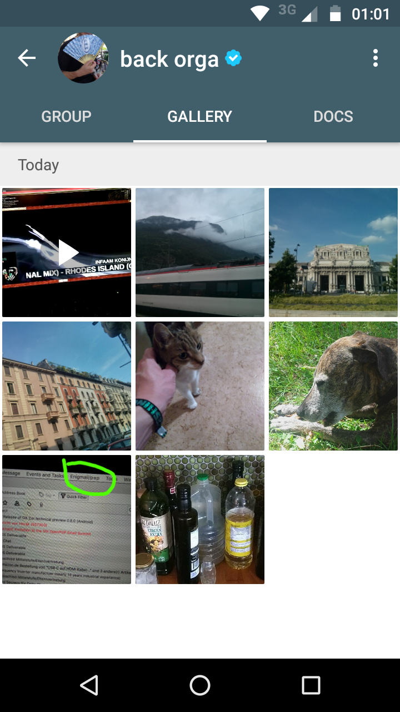
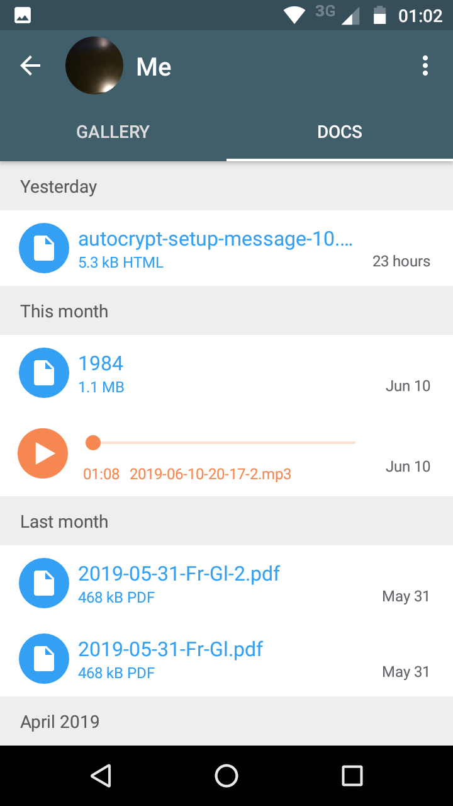
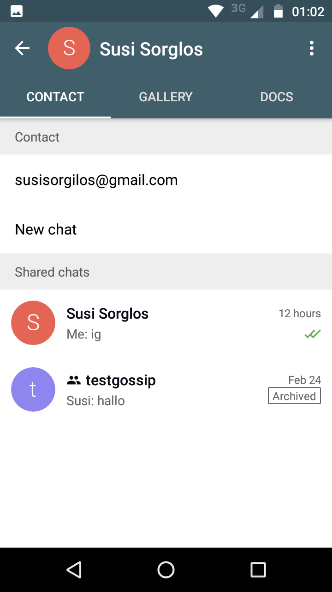
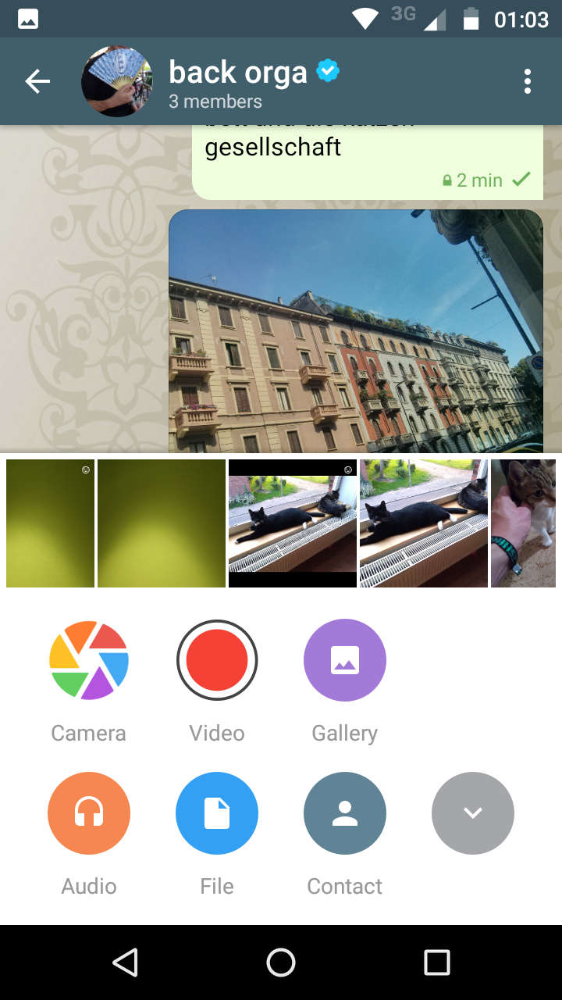
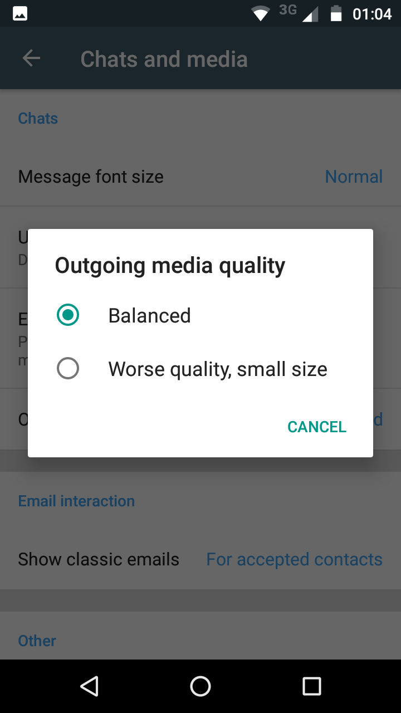
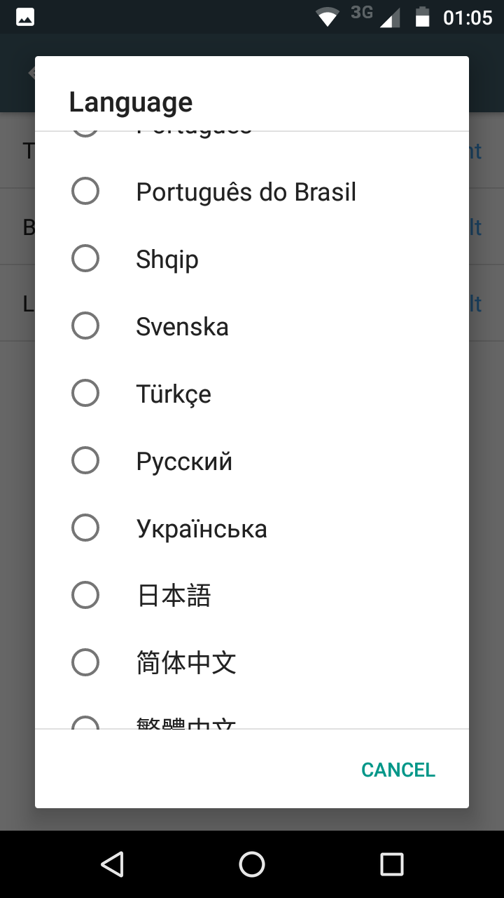

نسخهٔ اندروید جدید و بسیار بهبودیافته (0.500.0) منتشر شده و در
Google-Play و به‌زودی F-droid موجود است. این غنی‌ترین از نظر ویژگی، پالایش‌شده از نظر UX و مقاوم‌ترین
نسخهٔ Delta Chat تا به امروز است و حالا ترجمه‌های چینی را هم شامل می‌شود، همراه
با به‌روزرسانی به ۱۹ بومی‌سازی دیگر. حالا یک **نمای پروفایل چت بازنگری‌شده** هست
که گالری، سند، تنظیمات و فهرست اعضا را
در یک چیدمان تب جدید ترکیب می‌کند، جدا از امکان دیدن «چت‌های مشترک» با مخاطبین فردی.

 
 
 

دیگر نکات برجستهٔ عمده:

- **ضبط ویدئو**، شامل کدگذاری خودکار به اندازهٔ کوچک‌تر
- **forward/share** اجازهٔ ایجاد چت‌های جدید، جستجو، اشتراک مستقیم و بیشتر
- مدیریت بهبودیافتهٔ **اعلان**، حالا باید شهودی‌تر رفتار کند
- **ui** بهبودیافته: لمس‌دوست، ظاهر بهتر
- **پشتیبانی بهبودیافته برای گوشی‌های قدیمی‌تر**

[changelog اندروید](https://raw.githubusercontent.com/deltachat/deltachat-android/HEAD/CHANGELOG.md) را برای نمای دقیق‌تر ببینید — و همچنین فهرست همهٔ کسانی که به این نسخه **مشارکت** کرده‌اند را توجه کنید،
**هزار بار ممنون!**

 

در [صفحهٔ دانلود](download) همچنین [انتشارهای Delta Chat Desktop](https://delta.chat/en/2019-06-25-desktop) دیروز را می‌یابید. Delta Chat چنددستگاهی است.

بسیار خوش‌آمدید که [PR یا گزارش باگ مختصر](https://github.com/deltachat/deltachat-android) مشارکت کنید اما توجه کنید که بحث ویژگی معمولاً اول در [انجمن پشتیبانی](https://support.delta.chat) رخ می‌دهد.
