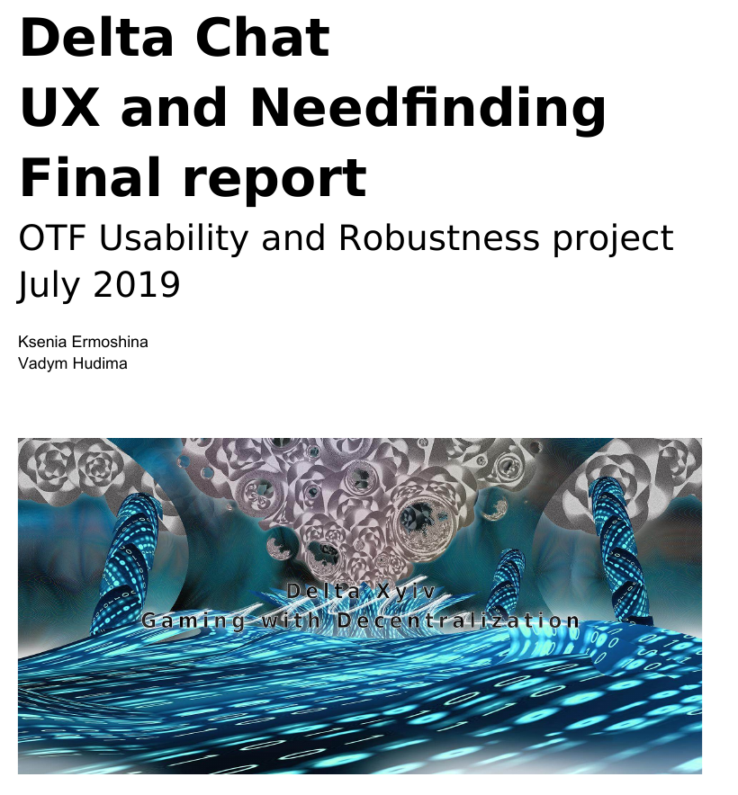

[گزارش نهایی آزمایش کاربر](../assets/blog/Delta-Chat-UX-final-report-july2019.pdf) ما منتشر شد.
یک سال پژوهش با فعالیت‌های needfinding و آزمایش UX را خلاصه می‌کند و
پایان پروژهٔ یک‌سالهٔ «OTF Robustness and Usability» ما با بودجهٔ [OTF](https://www.opentech.fund/results/supported-projects/delta-chat/) را رقم می‌زند.

