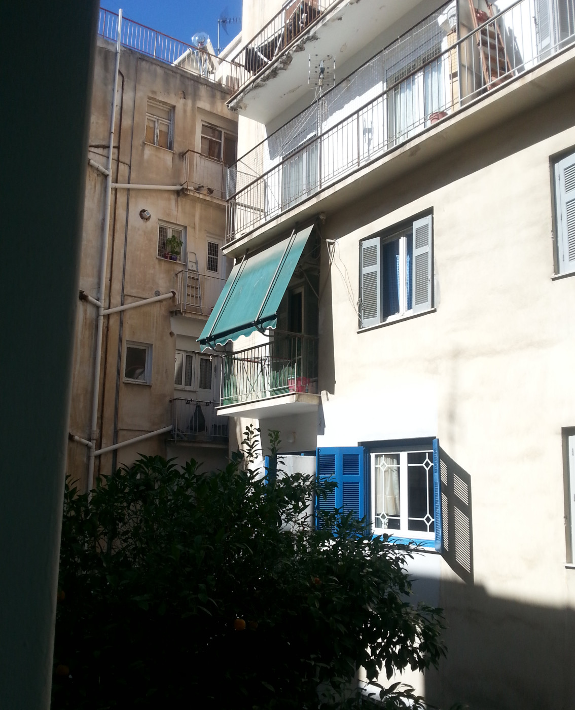

اخیراً فرصت داشتم در [Eclectic Tech Carnival
(/ETC)](https://eclectictechcarnival.org) در آتن شرکت کنم؛ رویدادی فمینیستی درباره
فناوری. پر از یادگیری خودسازمان‌یافته بود و برای زنان،
افراد غیردوگانگی، ترنس و اینترسکس که دوست داشتند فناوری را در
فضایی دور از فرهنگ بیگانه‌ساز IT کشف کنند، باز بود.

بیشتر شرکت‌کنندگان زن و غیردوگانگی بودند و مهارت‌های گوناگونی
با خود آورده بودند که می‌توانستند با هم به اشتراک بگذارند. من به نخبه‌گرایی فرهنگ نِرد عادت داشتم -
تضادش باورنکردنی بود. هرگز چنین فضای یادگیری‌ای ندیده بودم که
همه بتوانند از هم بیاموزند، بدون ترس از اینکه اعتراف کنند همه چیز را
نمی‌دانند.

Donna و Juga آنجا کارگاهی درباره نصب و نگهداری سرورهای
ایمیل برگزار کردند - موضوعی خیلی جالب برای من؛ اولین سرور ایمیل خودم را
فقط چند هفته پیش نصب کرده بودم. کارگاه بخشی از تلاش برای تبدیل [حساب‌های ایمیل
موقتی (burner)](https://delta.chat/en/2018-11-17-deltaxi#new-planned-features-for-at-risk-and-other-users)
به قابلیتی رایج روی سرورهای ایمیل بیشتر بود. اما هدف اصلی آموزش این بود که
مدیریت سرور جادوگری نیست (البته که حرفی هم علیه جادوگری نیست).

*برخی از شرکت‌کنندگان /ETC - خیلی سرگرم‌کننده بود.* [(عکس:
/ETC)](https://eclectictechcarnival.org/etc/2019/athens/communications/group-photo/)

## Delta Chat چگونه می‌تواند به فمینیست‌ها کمک کند

۱۴ نفر آمدند تا بیشتر درباره سرورهای ایمیل بیاموزند. به هم کمک کردیم
و تجربه‌مان با Delta Chat و سرورهای ایمیل را به اشتراک گذاشتیم.

اول، Donna نمای کلی از Delta Chat ارائه داد. بحثی درباره
امکانات یک پیام‌رسان در شبکه غیرمتمرکز ایمیل شکل گرفت، به‌ویژه
اینکه می‌توان با کسانی که از برنامه‌های ایمیل دیگر استفاده می‌کنند ارتباط برقرار کرد.
همچنین توانستیم نقاط قوت Autocrypt را به‌عنوان استاندارد رمزنگاری نشان دهیم که
با کلاینت‌های دیگر هم سازگار است.

تأکید دیگر روی حساب‌های burner بود. بسیاری از شرکت‌کنندگان فعال بودند و
نه فقط یک‌بار باید به محافظت از هویت‌شان فکر می‌کردند. کار (کوئیر-)فمینیستی
می‌تواند خطرناک باشد؛ خواه با شریک خشونت‌گر سروکار داشته باشید،
خواه با شبه‌نظامیان راست‌گرا، یا حمایت عاطفی حساس از نظر حریم خصوصی.

*در جایی آرام در آتن ماندیم، با حیاط پشتی زیبایی.*

## سرورهای ایمیل Burner در یک کارگاه

بعد از بخش نظری، نوبت به تمرین بیشتر رسید. Donna هفت
تکه کاغذ با اطلاعات ورود توزیع کرد، برای سرورهای خصوصی مجازی (VPS) که
از قبل ساخته بود. همه شروع کردند به ورود از طریق SSH (خط فرمان از راه دور)،
فهمیدن نحوه کار دستور SSH، و دست‌وپنجه نرم کردن با وای‌فای بد اسکوات.

Juga از آنجا ادامه داد تا به همه یاد بدهد چطور سرور ایمیل نصب کنند و
به چه چیزهایی باید توجه کنند. من با یک دوست برای شروع تیم شدم، بقیه
هم تیم تشکیل دادند. می‌توانستیم دستورالعمل‌ها را در یک پد ببینیم برای نحوه
نصب و پیکربندی سرور postfix SMTP - نرم‌افزاری که مسئول
ارسال ایمیل‌ها و دریافت ایمیل از سرورهای ایمیل دیگر در
اینترنت است.

بعد از اینکه همه یک سرور SMTP در حال اجرا داشتند، بخش جالب آمد - استفاده از آن برای
ارتباط با هم! با استفاده از Mutt روی خط فرمان سرور،
برای هم ایمیل فرستادیم تا ثابت کنیم کار می‌کند. واقعاً خوب بود دیدن اینکه
واقعاً کار کرد؛ انتظار نداشتم برای همه این‌قدر سریع جواب بدهد.

اما سرور SMTP فقط نصف یک سرور ایمیل خوب است - همچنین به یک
سرور IMAP نیاز دارید تا Delta Chat بتواند ایمیل‌های دریافتی را از سرور دانلود کند. پس
dovecot را هم نصب کردیم تا بتوانیم سرور ایمیل را با Delta Chat استفاده کنیم.

در پایان کمی بیشتر با آن بازی کردیم. نگاهی به لاگ‌ها انداختیم تا
با نگهداری سرور هم تمرین کنیم. نصب بخش سریع
است، اما سرورهای ایمیل هم البته نیاز به نگهداری دارند.

*یادگیری نحوه نگاه کردن به پروسه‌های در حال اجرا در طول کارگاه.*

## پس دفعه بعد چه می‌شود؟

متأسفانه وقت کافی نبود تا مستقیماً سرور ایمیل را با
Delta Chat امتحان کنیم. اما با بازخوردی که کارگاه گرفت، شاید دفعه بعد
به آن برسیم - کارگاه قطعاً بیشتر برگزار خواهد شد، مثلاً در
[Chaos Communication Congress](https://events.ccc.de) بعدی.

وقتی در کارگاه بعدی وقت بیشتری داشته باشیم، قطعاً می‌خواهیم
API حساب‌های burner را هم راه‌اندازی کنیم. این بخشی از سرور ایمیل است که به
افراد اجازه می‌دهد با یک درخواست واحد یک حساب ایمیل موقت بسازند. یعنی
در مقطعی فقط کافی است در Delta Chat روی یک دکمه بزنید تا
حساب بسازید.

حالا چند فمینیست دیگر می‌دانند که نصب سرور ایمیل
کار زیادی نیست! اولین قدم‌هایشان را روی خط فرمان برداشتند، و دیدن آن خیلی
زیبا بود.

متأسفانه سرورها بعداً باید حذف می‌شدند - اما این فقط
انگیزه بیشتری است تا سرورهای خودمان را خودمان راه‌اندازی کنیم، جایی که کنترل در دست خودمان است ;)
و این بخش مهم تمرکززدایی و توانمندسازی است.

*در کارگاه دیگری توانستیم کیف‌های فارادی خودمان را بسازیم. در اصل یک
حالت پرواز سخت‌افزاری‌اند و خیلی باحال به نظر می‌رسند.*
