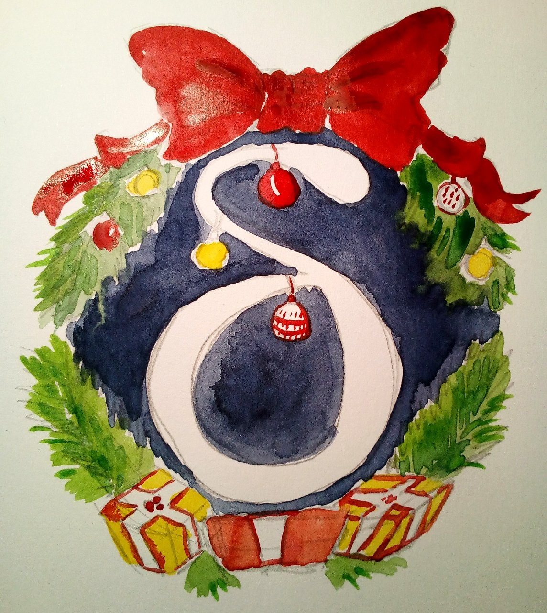
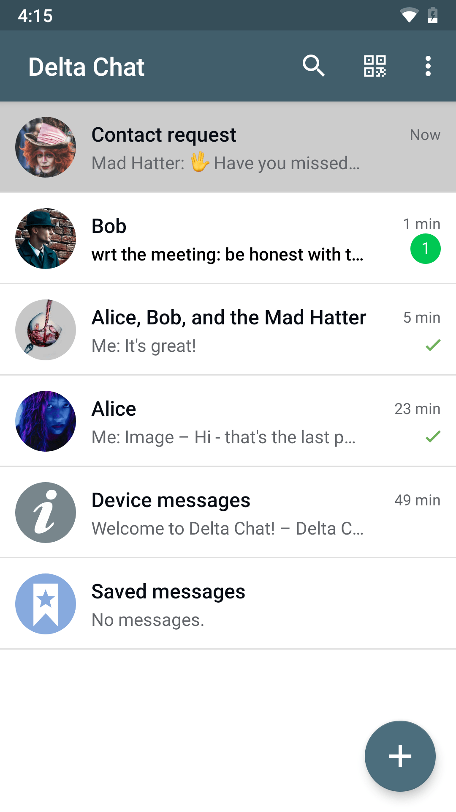
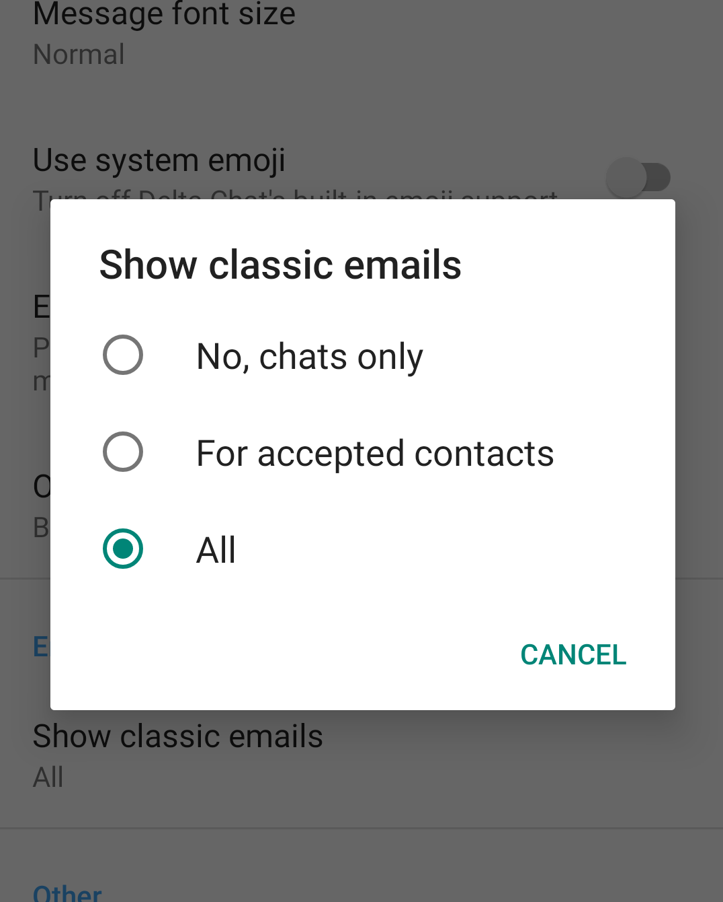
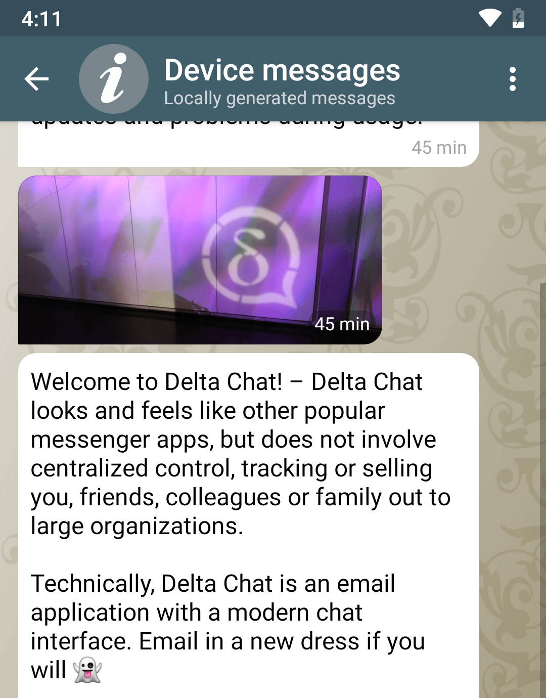

 
**پس از ماه‌ها کار سخت، تازه سری انتشارهای [Delta Chat 1.0
برای فروشگاه Google Play](https://play.google.com/store/apps/details?id=chat.delta) را
آغاز کردیم، با بهبودهای ملموس فراوان. سپاس از بسیاری از توسعه‌دهندگان، آزمایش‌کنندگان، مترجمان و
مشارکت‌کنندگانی که این را ممکن کردند! جزئیات همه تغییرات خوب را در ادامه ببینید.**

توجه کنید که F-Droid فعلاً هنوز نسخه قدیمی‌تر 0.510.1 را ارائه می‌دهد. بالاخره
به آن می‌رسیم، اما اگر کسی می‌خواهد کمک کند، [issue مربوط به F-droid 1.0.x](https://github.com/deltachat/deltachat-android/issues/1177) را ببینید.

## تصاویر پروفایل

 

یکی از چیزهایی که Delta Chat را خیلی زیباتر می‌کند **تصاویر پروفایل** است. یا دست‌کم
آن را به زیبایی کاربرانش می‌کند ;) حالا می‌توانید در تنظیمات یک
تصویر آواتار تنظیم کنید، و مخاطبینتان آن را وقتی که
به آن‌ها پیام می‌دهید یا وقتی از طریق QR-code «راه‌اندازی مخاطب» می‌کنید، می‌بینند.

مثل همه قابلیت‌های اصلی دیگر Delta Chat، هیچ
سرور اضافه‌ای (به زبان رایج: «کلود») درگیر نیست، غیر از ارائه‌دهنده ایمیل
شما برای ارسال و دریافت پیام‌ها. توجه کنید که همه آواتارها
به ۱۹۲×۱۹۲ پیکسل کاهش می‌یابند تا پهنای باند همه صرفه‌جویی شود.

به دلایل حریم خصوصی، تا وقتی به کسی پیام ننویسید، کسی تصویر پروفایلتان را
نمی‌بیند. به این ترتیب بدون هیچ تعامل اضافه‌ای کنترل می‌کنید چه کسی
تصویرتان را ببیند. این خیلی نمونه رویکرد Delta در حریم خصوصی به‌صورت پیش‌فرض است.

## نمایش ایمیل‌های کلاسیک به‌عنوان درخواست مخاطب

 

بسیاری از کاربران Delta از پیام‌رسان برای همه ایمیل‌هایشان استفاده می‌کنند، نه فقط برای چت.
در تنظیمات می‌توانند «نمایش ایمیل‌های کلاسیک» را روی «همه» بگذارند. آن‌وقت
ایمیل‌های عادی را هم می‌بینند، نه فقط پیام‌های Delta.

با نسخه 1.0، اگر «نمایش ایمیل‌های کلاسیک» را روی «همه» گذاشته باشید، ایمیل‌های افراد
جدید به‌صورت درخواست مخاطب ظاهر می‌شوند - مستقیم در فهرست چت‌تان. به این
ترتیب هرگز ایمیلی را از دست نمی‌دهید. اگر نمی‌خواهید با اپ Delta Chat
گفتگو داشته باشید، کافی است درخواست مخاطب را رد کنید.

## چت دستگاه - اطلاعات Delta مستقیم روی گوشی شما

 

با نسخه جدید اندروید برای فروشگاه Google Play، کاربران اطلاعات مهم را
مستقیم به‌صورت چت دریافت می‌کنند.

چت دستگاه بیشتر برای اطلاعات درباره به‌روزرسانی‌ها، یا اگر
مشکل و هشداری باشد، استفاده می‌شود. خلاصه - برای همه چیزهای کسل‌کننده‌ای که
توسعه‌دهندگان می‌خواهند بدانید.

قبل از 1.0، Delta Chat برای هشدارها پاپ‌آپ نشان می‌داد، مثل همان
معروف درباره بهینه‌سازی باتری. داریم همه این پیام‌ها را به
چت دستگاه منتقل می‌کنیم تا راحت‌تر بتوانید به عقب برگردید. حرف از بهینه‌سازی باتری شد --
Delta Chat در استفاده از منابع سیستم خیلی کارآمد است و معمولاً
اشکالی ندارد که اجازه دهید در پس‌زمینه اجرا شود. با این حال، همان‌طور که در
[Don't kill my app](https://dontkillmyapp.com/) بحث شده، Google همیشه این اجازه را به ما نمی‌دهد.

## مقاومت، سرعت و امنیت بهتر

 

سیستم هسته‌ای که همه اپ‌های Delta Chat استفاده می‌کنند حالا
با زبان «Rust» نوشته شده که به‌طور گسترده به‌عنوان مقاوم‌ترین و امن‌ترین
زبان برنامه‌نویسی سیستمی ستایش می‌شود. این همچنین دریافت و تحویل
پیام را سریع‌تر کرده. همچنین اندروید ۹ از نظر اعلان‌ها
و پشتیبانی ۶۴بیتی بهتر پشتیبانی می‌شود.

برای رمزنگاری سرتاسری از [rPGP](https://github.com/rpgp/rpgp) استفاده می‌کنیم،
که اوایل ۲۰۱۹ از یک بررسی امنیتی عبور کرد. برای رمزنگاری لایه انتقال
(TLS) از کتابخانه‌های بومی سیستم روی هر پلتفرم استفاده می‌کنیم. برای محافظت
در برابر حملات فعال، پروتکل‌های [CounterMITM
](https://countermitm.readthedocs.io/en/latest/new.html) را پیاده‌سازی و پالایش کرده‌ایم که به نوبه خود
از rPGP استفاده می‌کنند.

## ویدئوی معرفی جدید Delta Chat

در آخرین گردهمایی‌مان یک ویدئوی معرفی کوتاه برای Delta Chat ساختیم.
این حالا ویدئوی جلوی Delta Chat در Google Play هم هست.
امیدواریم از آن لذت ببرید یا هنگام صحبت با دوستان مفیدش بیابید :)

<iframe src="https://invidio.us/embed/yPEjYpE_kvc" frameborder="0" allow="accelerometer; autoplay; encrypted-media; gyroscope; picture-in-picture" allowfullscreen style="margin: 10px;display: block;" ></iframe>

## سپاس از ده‌ها نفری که کمک کردند!

بازنویسی کامل با Rust و این انتشار یک تلاش عظیم جمعی بود.
سپاس از همه مشارکت‌کنندگان، آزمایش‌کنندگان، مترجمان، کسانی که mate و غذا
آوردند و/یا در گردهمایی‌ها آشپزی کردند، pull requestها را بررسی کردند، سپاس از
سرورهای CIمان، و هر کس دیگری که اینجا فراموش کردیم.

آه، و اگر گوشی اندروید ندارید، مشکلی نیست - Delta Chat در
نسخه‌های پیش‌نمایش برای Windows، MacOS، Linux و iOS در دسترس است. آن نسخه‌ها
همه در مرحله بتا هستند اما از همین حالا خوب قابل استفاده‌اند:

[همین حالا Delta Chat را بگیرید!](https://get.delta.chat)

اگر می‌خواهید از نصب F-Droid مهاجرت کنید، می‌توانید یک پشتیبان صادر کنید،
اپ را نصب کنید، و پشتیبان را در اپ جدید وارد کنید.

خیلی چیزها زیر پوست عوض شده. امیدواریم تجربه ارتقا برای همه
خوب باشد. اگر نبود، لطفاً یک [issue اندروید
جدید](https://github.com/deltachat/deltachat-android/issues) ثبت کنید یا به
[انجمن پشتیبانی](https://support.delta.chat) سر بزنید.
