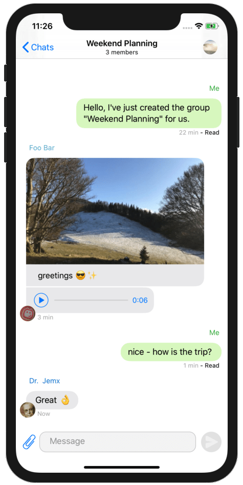
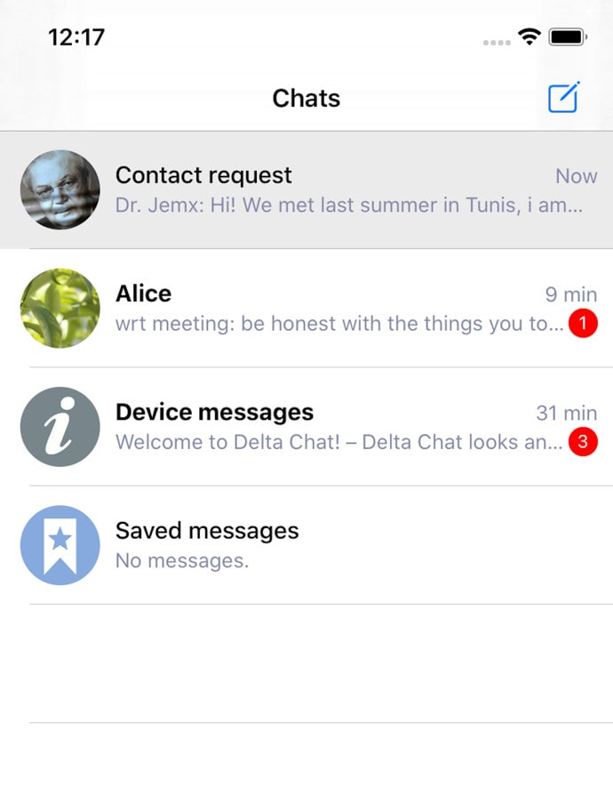
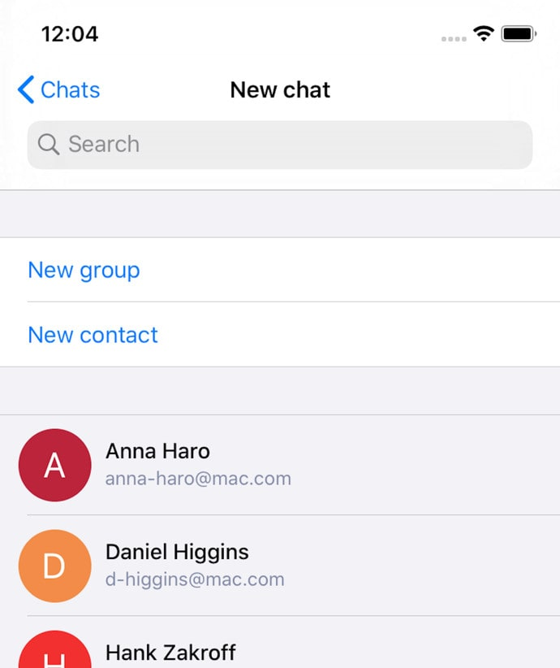

 
**تا دیروز فقط می‌توانستید از Delta Chat روی Android، Windows، MacOS
و Linux استفاده کنید. حالا می‌توانید تجربه Delta را روی همه پلتفرم‌های اصلی داشته باشید!**

با Delta Chat می‌توانید با هر کسی که آدرس ایمیل دارد بنویسید. اما اگر
هر دو نفر از Delta Chat استفاده کنند، حتی راحت‌تر است؛ آن‌وقت می‌توانید از بسیاری
قابلیت‌های دیگر Delta هم استفاده کنید.

فهرستی کوتاه و ناقص از کارهایی که با اپ می‌توانید انجام دهید:

- **رمزنگاری سرتاسری** با دیگر کاربران Delta، از پیام دوم به بعد
- **چت‌های گروهی** با دوستان و خانواده
- ضبط و گوش دادن به **پیام‌های صوتی** و دیگر فایل‌های صوتی
- چت دستگاه برای اعلان‌های فنی
- حالت تاریک

قابلیت‌های بیشتری در ماه‌های آینده می‌آید.

## دوستانتان را اضافه کنید!

اگر می‌خواهید به مخاطبینتان بنویسید، چند راه وجود دارد:

- فقط آدرس ایمیلشان را وارد کنید و شروع به پیام دادن کنید
- کاربران دیگر Delta را با اسکن کد QR روی دستگاهشان اضافه کنید
- آدرس ایمیلتان را به دیگران بدهید - وقتی از افراد جدید
  ایمیل دریافت کنید، درخواست مخاطب می‌گیرید.

پس به دوستانتان بگویید Delta Chat را هم دانلود کنند، چه روی iOS باشند چه
نه! اپ iOS را از اینجا می‌توانید بگیرید:

 

## بعد چه می‌شود؟

برخی قابلیت‌ها هنوز در نسخه iOS نیست - در ماه‌های
آینده می‌آیند. چند مثال: اشتراک‌گذاری
فایل با Delta Chat، و جستجو در پیام‌هایتان.

منتظر انتشارهای جدید باشید!

## انتقال راه‌اندازی از دسکتاپ به iOS

اگر از قبل Delta Chat را روی دستگاه‌های دیگر استفاده می‌کنید، می‌توانید
راه‌اندازی رمزنگاری‌تان را با «پیام راه‌اندازی Autocrypt» منتقل کنید. آن را در
تنظیمات پیدا می‌کنید. به این ترتیب می‌توانید **پیام‌های رمزنگاری‌شده را روی همه دستگاه‌هایتان بخوانید.**

پیام راه‌اندازی Autocrypt فقط کلیدهای رمزنگاری‌تان را منتقل می‌کند. برای
**انتقال کل تاریخچه چت**، باید روی دسکتاپ یک پشتیبان صادر کنید
و آن را روی iOS وارد کنید. این گزینه را در تنظیمات پیدا می‌کنید.

اگر با اپ مشکل دارید، لطفاً یک [issue
iOS جدید](https://github.com/deltachat/deltachat-ios/issues) ثبت کنید یا به [انجمن
پشتیبانی](https://support.delta.chat) سر بزنید.

 
