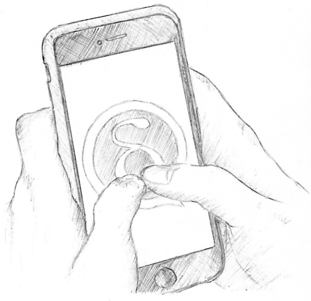
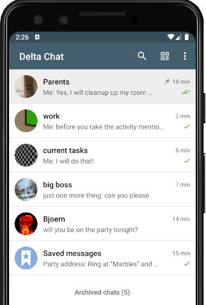
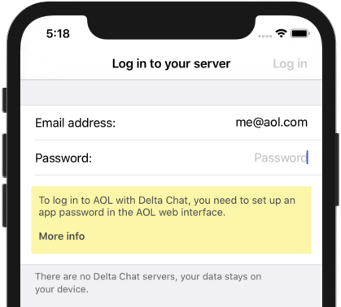

 
در ماه‌های اول امسال خیلی روی رفع باگ‌ها،
اضافه کردن قابلیت‌ها و بیرون دادن انتشارها تمرکز کردیم - و کمی کمتر روی وبلاگ‌نویسی و بازاریابی.

شاید این بهینه نباشد، با این حال احساس می‌کنم بهتر از حالت برعکس است :)

به هر حال، اینجاییم:

### از نظر قابلیت در Delta Chat 1.1 و 1.2 چه خبر است؟

**هرگز فراموش نکنید چه چیزی _واقعاً_ مهم است:** Delta Chat حالا اجازه می‌دهد هر چتی را «سنجاق» کنید،
تا همیشه بالای فهرست چت‌ها دیده شود.
در ترکیب با تابع «بایگانی چت‌ها»، ابزارهای خوبی برای مرتب نگه داشتن کارها دارید.

**_خیلی_ بهبودهای صرفه‌جویی در ترافیک،** آن‌قدر زیاد که در این پست وبلاگ جا نمی‌شود.
بنابراین جزئیات را در پستی جداگانه می‌گوییم.

**راه‌اندازی فوری مخاطب با کد QR** - Delta Chat از کدهای QR برای راه‌اندازی آسان مخاطب استفاده می‌کند -
نیازی به تایپ آدرس‌های ایمیل پیچیده یا مقایسه اثرانگشت‌های حتی پیچیده‌تر نیست.
- _در گذشته_ کمی طول می‌کشید چون هر دو دستگاه باید آنلاین می‌بودند و باید منتظر تمام شدن دست‌دادن می‌ماندید.  
- _حالا_ دست‌دادن در پس‌زمینه اجرا می‌شود و نیازی به انتظار نیست.
حالا حتی اگر یکی یا هر دو دستگاه آفلاین باشند می‌توانید تایپ اولین پیامتان را شروع کنید!

**راهنما و پرسش‌های پرتکرار داخلی** فقط برای وقتی که به کمک نیاز دارید؛ حالا فقط یک لمس انگشت فاصله دارد.

**بدانید هنگام ورود به ارائه‌دهنده ایمیلتان چه کنید:** همان‌طور که احتمالاً می‌دانید،
Delta Chat سرورهای خودش را ندارد؛ پیام‌ها با ارائه‌دهنده انتخابی شما ارسال می‌شوند.
به هر دلیلی، بعضی ارائه‌دهندگان قبل از اینکه واقعاً بتوانید ازشان استفاده کنید از شما می‌خواهند کارهایی انجام دهید.
این تقصیر Delta Chat نیست -
اما اگر از این چیزها خبر داشته باشیم، حالا روی صفحه ورود چند راهنمایی نشان می‌دهیم.

مثل بیشتر چیزها در Delta Chat، پایگاه داده ارائه‌دهنده و راهنمای داخلی هم **درون اپ یکپارچه**‌اند.
اطلاعات را از سرورهای بیرونی بارگذاری نمی‌کنند، ردیابی‌تان نمی‌کنند، و در شبکه‌های بد نمی‌توانند دردسر بسازند.

این فقط یک نمای کلی خام است؛ خیلی چیزهای بیشتر هست،
برای جزئیات [changelog](https://delta.chat/en/download#changelogs)های مختلف را ببینید.

### دیگر چه؟

**ترجمه‌های جدید** زیادی از سوی جامعه شروع شد -
مثلاً Bokmål، کرواتی، اسپرانتو، کره‌ای، صربی، تامیل و تلوگو تازه به اپ‌ها اضافه شدند.
همه از همین حالا نسبتاً قابل استفاده‌اند، اما اگر می‌خواهید در ترجمه تکه‌های جاافتاده کمک کنید،
در <https://www.transifex.com/delta-chat/> خیلی خوش‌آمدید.

### به‌روزرسانی‌ها را بگیرید!

قابلیت‌های جدید به‌زودی به‌صورت به‌روزرسانی در فروشگاه‌های شناخته‌شده در دسترس خواهند بود
یا همین امروز در <https://get.delta.chat> - برای Android، iOS و تا حدی از همین حالا برای Desktop.
