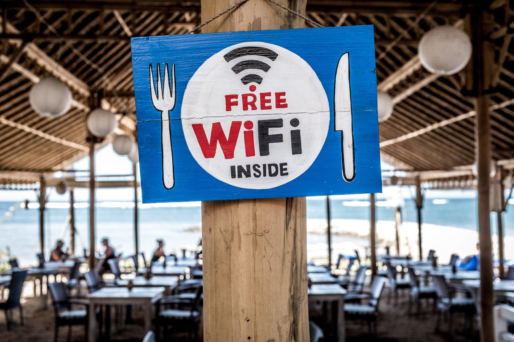

**در ماه‌های گذشته، توسعه‌دهندگان Delta Chat خیلی روی صرفه‌جویی در
ترافیک تمرکز کردند. نتیجه: انتشارهای فعلی موبایل Delta Chat حالا داده خیلی کمتری مصرف می‌کنند.**

فراموش کردن آسان است که بسیاری هنوز بسته‌های داده را گیگابایتی می‌پردازند - ترافیک
داده‌شان **گران، محدود و کند** است. برای خیلی‌ها حتی مسئله
پول است؛ ترافیک اینترنت می‌تواند کاملاً گران باشد. در چنین لحظاتی،
این می‌تواند تفاوت حیاتی باشد: آیا اصلاً یک اپ قابل استفاده است، یا
بیش از حد ترافیک مصرف می‌کند؟

*چون خیلی‌ها می‌خواهند در بسته داده‌شان صرفه‌جویی کنند، وای‌فای رایگان یکی از
اصلی‌ترین پیشنهادهای کافه‌ها و رستوران‌ها شد.*

## کدام بهبودها بیشترین ترافیک را صرفه‌جویی می‌کنند؟

چند چیز که برای کاهش مصرف ترافیک داده تغییر کرد:

- Delta حالا از دانلود پیام‌هایی که نمایش نمی‌دهد اجتناب می‌کند. این
  ترافیک زیادی از پیام‌های مخاطبین مسدودشده، و پیوست‌های بزرگ
  ایمیل‌های معمولی صرفه‌جویی می‌کند.
- یک اثر جانبی خوب این است که وقتی با صندوق ورودی شلوغ آنلاین می‌شوید
  کندی کمتری دارید.
- ترافیک در حالت بیکار، وقتی اپ استفاده نمی‌شود، را بهینه کردیم. در ۱۰ دقیقه،
  قبلاً ۶ کیلوبایت مصرف می‌کرد - [این تا ۱۰۷ بایت کاهش یافت.](https://github.com/deltachat/deltachat-core-rust/issues/506)
- رسیدهای خوانده‌شدن را وقتی در یک لحظه ارسال می‌شوند در یک پیام ترکیب کردیم.
  قبل‌تر، برای هر رسید خوانده‌شدن یک ایمیل بود.

### تغییر کلیدهای PGP به کلیدهای منحنی بیضوی ed25519

کلیدهای PGP تازه‌تولیدشده را به الگوریتم جدید ed25519 تغییر دادیم - آن کلیدها
خیلی کوچک‌ترند. این خیلی مهم است، چون کلیدها فعلاً در هر
پیام ارسال می‌شوند.

*سمت چپ، کلید RSA قدیمی‌ام؛ حتی روی صفحه جا نمی‌شود. سمت راست،
یک کلید ed25519 جدید.*

می‌خواستیم زودتر این راه را برویم، اما باید از مسائل سازگاری اجتناب می‌کردیم.
شاید متوجه شده باشید که حدود شش ماه نسخه‌های F-Droid را به‌روز نکردیم؛
با همه نسخه‌های قدیمی Delta در اطراف، نمی‌توانستیم تغییراتی مثل
این را بدون ریسک سازگاری معرفی کنیم.

توجه کنید که انتشارهای فعلی هنوز به‌طور پیش‌فرض کلیدهای RSA2048 تولید می‌کنند، چون
آزمایش Delta Chat ناسازگاری‌ای کشف کرد که در
انتشارهای فعلی رفع شد. بعد از انتشار بعدی Desktop بالاخره باید بتوانیم
به‌طور پیش‌فرض به تولید کلیدهای ed25519 برویم.

## دیگر چه ممکن است؟ نگاهی به آینده

موارد بالا از همین حالا ترافیک Delta Chat را خیلی کم می‌کند. توسعه‌دهندگان
چند ایده دیگر را در نظر دارند. اگر به جزئیات علاقه‌مندید، نگاهی به
[برچسب save-traffic در issue tracker هسته](https://github.com/deltachat/deltachat-core-rust/issues?q=is%3Aissue+is%3Aopen+label%3Asave-traffic) بیندازید.
