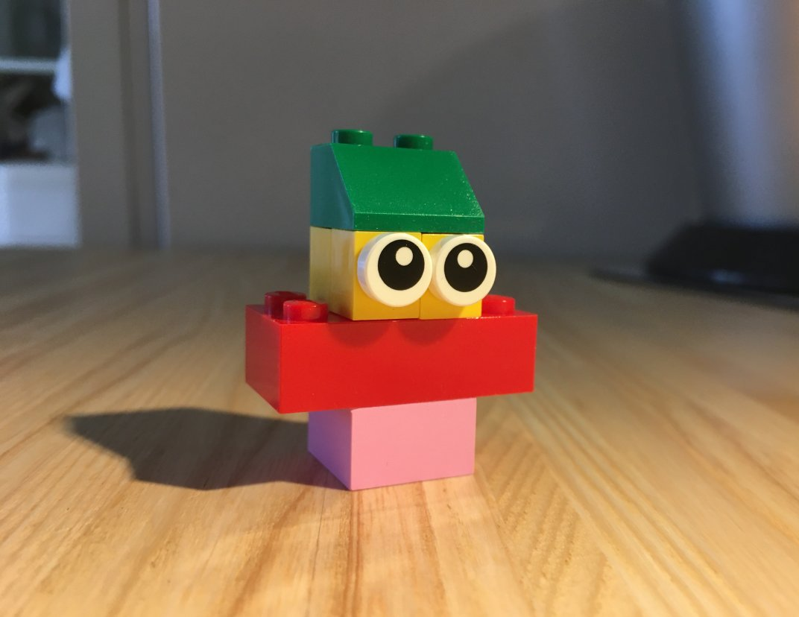
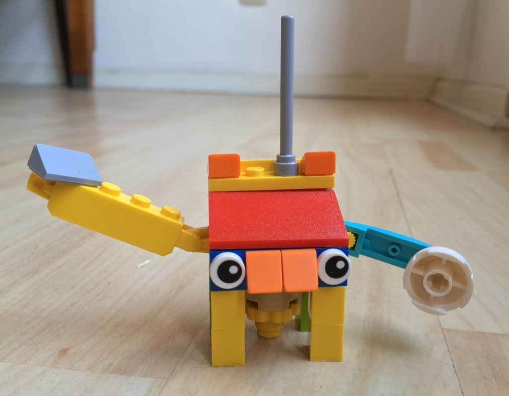

 
*در اصل ساختن و اجرای بات‌های Delta Chat از مدتی پیش ممکن بوده. اما آسان یا خوب مستند نبود.
در هفته‌های گذشته کمی این را عوض کردیم، و می‌خواهیم با این مطلب آغاز یک اکوسیستم بات‌های Delta Chat را به میدان بیاوریم!*

بات‌ها به‌طور کلی و بات‌های Delta Chat به‌طور خاص می‌توانند خیلی همه‌کاره باشند — از بازی‌های آزمون تا کانال‌های خبری، از ارسال یادآورهای روزانه تا مدیریت گروه‌های عمومی بزرگ و فراتر، خیلی کارها می‌شود کرد.

تعامل با وب هم ممکن است: شاید بعضی‌هایتان گزینه ورود به [انجمن ما](https://support.delta.chat/) با اپ موبایل Delta Chat را دیده باشید. این را [discourse-login-bot](https://github.com/deltachat-bot/discourse-login-bot) که نوشتیم فراهم می‌کند.

ما به‌عنوان تیم توسعه به ساختن و استفاده از بات‌ها برای گسترش امکانات Delta Chat ادامه می‌دهیم.

اما همچنین می‌خواهیم *شما* بات‌های Delta Chat بسازید و استفاده کنید.

برای کمک به شروع، یک وب‌سایت کوچک ساختیم: **[bots.delta.chat](https://bots.delta.chat) یک نمای کلی ارائه می‌دهد**، لینک به مستندات API و اتصال‌های زبانی، و کمی جزئیات پس‌زمینه درباره موتور هسته Delta Chat توضیح می‌دهد.

علاوه بر این یک **[دسته انجمن برای بات‌ها](https://support.delta.chat/c/bots/9) بعضی بات‌های موجود را نمایش می‌دهد**، و برای ایده‌ها، سؤال‌ها و بحث باز است.

بات‌سازی خوش بگذرد! 🤖

 
