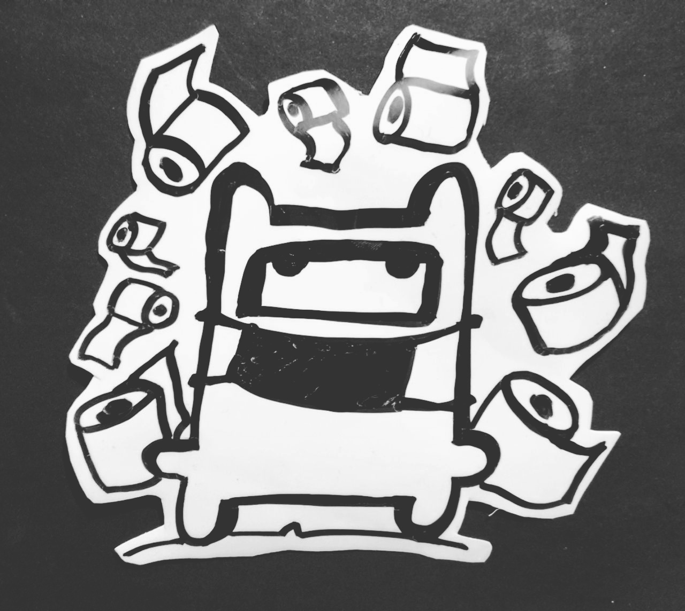
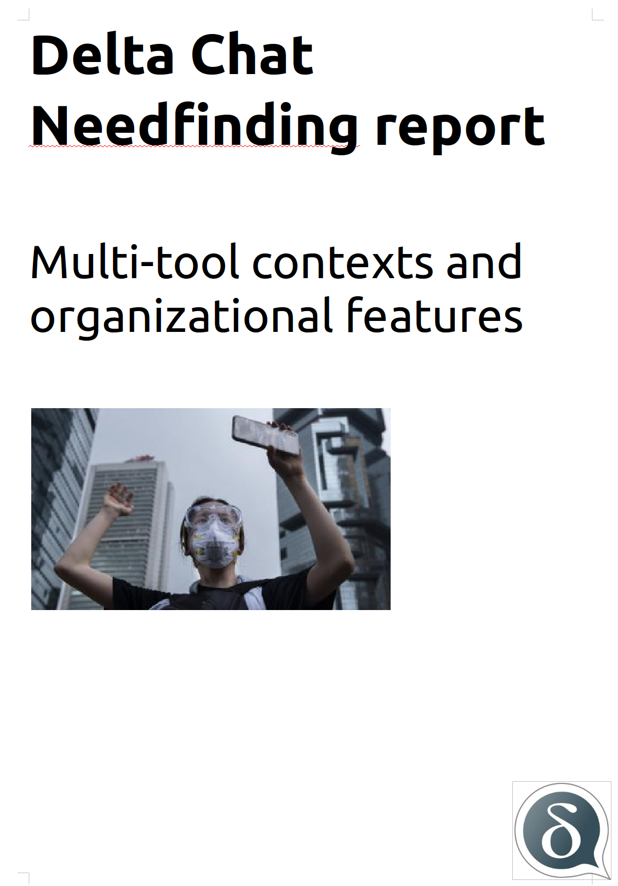

یک مطالعه UX جدید Delta Chat [منتشر شده](../assets/blog/2020-03-multitool-needfinding.pdf)،
بر پایه مصاحبه‌های Xenia با افرادی درگیر مأموریت‌های حقوق بشر در بلاروس،
روسیه، اوکراین، ایران، تایوان و هنگ‌کنگ. تمرکزش روی این است که Delta
Chat چگونه می‌تواند یا از همین حالا می‌تواند خوب در کنار ابزارها و
اپ‌های دیگر، و برای محیط‌های سازمانی کار کند.

پشتیبانی از استفاده سازمانی از
پیام‌رسانی برای Delta Chat مناسب است چون از سیستم ایمیل
استفاده می‌کند که به نوبه خود ابزار ارتباطی اصلی سازمان‌ها
تقریباً همه‌جاست. مطالعه تمرکز خاصی روی سناریوهای استفاده *نامتقارن*
دارد که در آن «پایگاه اصلی» کاربرانی را که در خطر بازداشت و
ربایش‌اند پایش می‌کند. همچنین اهداف توسعه گذشته و آینده ما را برای
پرداختن به نیازهای شناسایی‌شده برجسته می‌کند.

<a href="../assets/blog/2020-03-multitool-needfinding.pdf">
     
    <b>دانلود</b> 2020-03-multitool-needfinding.pdf
</a>
