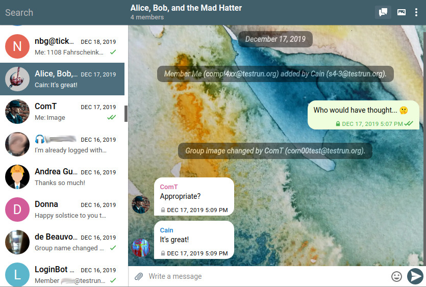
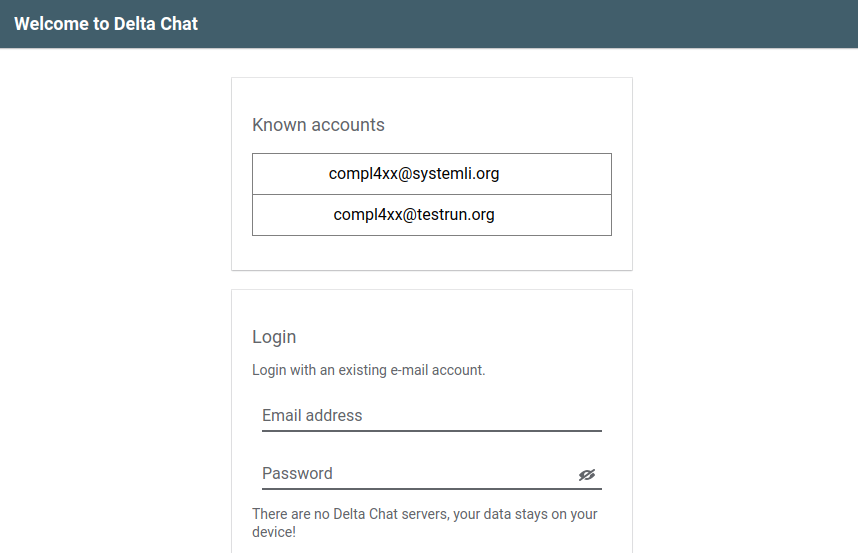
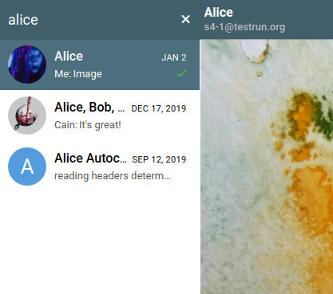
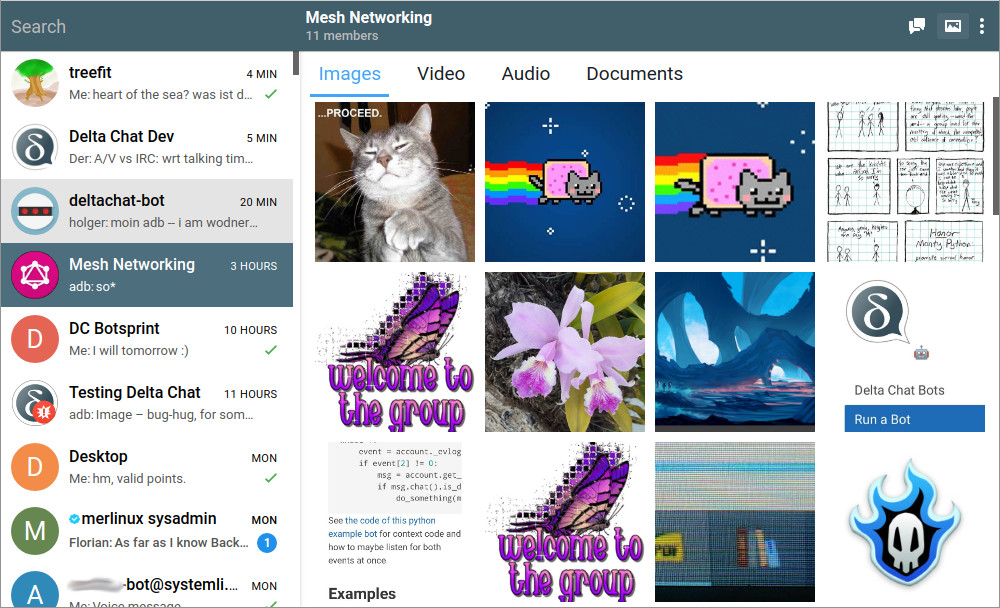

 
**کلاینت دسکتاپ Delta Chat حالا نه فقط روی همه پلتفرم‌های اصلی خوب کار می‌کند. بلکه
پشتیبانی چندحسابی هم دارد، و حتی بدون دستگاه موبایل قابل استفاده است. اگر آن را همراه با
انتشارهای فروشگاه اپ برای Android یا iOS استفاده کنید، می‌توانید تجربه چنددستگاهی مناسبی داشته باشید.**

برای بسیاری از پیام‌رسان‌های دیگر به شماره تلفن، یا دست‌کم یک دستگاه موبایل نیاز دارید -
اما نه برای Delta Chat. حتی اگر گوشی یا تبلت ندارید، می‌توانید از کلاینت
دسکتاپ به‌تنهایی استفاده کنید.

علاوه بر این، بیشتر پیام‌رسان‌ها این مشکل را دارند که فقط وقتی می‌توانید با دیگران چت کنید که
همان پیام‌رسان را استفاده کنند. با Delta Chat می‌توانید به هر کسی با آدرس ایمیل بنویسید.
به این ترتیب در پایگاه‌های کاربری متعلق به یک شرکت مثل WhatsApp، Signal یا Telegram قفل نمی‌شوید.

*اگر بیش از یک آدرس ایمیل دارید، می‌توانید بینشان جابه‌جا شوید.*

## خیلی قابلیت‌های جدید کلاینت دسکتاپ!

کلاینت دسکتاپ یکی از ابزارهایی است که این را ممکن می‌کند! سپاس از
بسیاری از توسعه‌دهندگان، آزمایش‌کنندگان، مترجمان و مشارکت‌کنندگانی که این انتشار را
ممکن کردند. اینجا یک نمای کلی سریع:

 
- **راهنمای درون‌اپ:** بعد از اینکه [در اندروید پیاده‌سازی شد](2020-03-06-delta-1.2)،
  حالا می‌توانید صفحه راهنما را در کلاینت دسکتاپ هم بخوانید. با فشردن
  F1 بازش می‌کنید.

- **پایگاه داده ارائه‌دهنده**: وقتی به ارائه‌دهنده ایمیلتان وارد می‌شوید، راهنمایی می‌گیرید
  که آیا نیاز به پیکربندی‌های اضافی دارید تا با Delta
  Chat کار کند.

- **میانبرهای صفحه‌کلید** جدید:
  - با Ctrl + K برای یک مخاطب یا چت گروهی جستجو کنید.
  - با کلیدهای جهت Alt + ←↓↑→ در فهرست چت‌ها جابه‌جا شوید.

- **تصاویر پس‌زمینه** زیبای جدیدی از
  [Paula](https://github.com/paulaluap) و [Nico](https://github.com/nicodh) هست -
  اما می‌توانید تصویر دلخواه هم انتخاب کنید.

- **تصاویر پروفایل** کلاینتتان را هم برای نگاه کردن زیباتر می‌کنند.

- حالا می‌توانید با راست‌کلیک روی پیامی که لینک دارد، لینک را کپی کنید.

- در اپ رسانه می‌توانید تصاویر را تمام‌صفحه ببینید.

- حالا Saved Messages و Device Chat هم هست که شاید از قبل
  از [اپ‌های موبایل](https://delta.chat/en/2019-12-18-google-play-store-release) بشناسید.

- با نسخه 1.2.0 می‌توانید اندازه فونت را در منوی سطح بالا تنظیم کنید.
  با کلیک روی «View -> Zoom Factor» انتخابش کنید.

- نام گروه حالا به‌عنوان موضوع پیام‌های خروجی استفاده می‌شود.

- بعضی‌ها با موفقیت با استفاده از Delta Chat به‌عنوان تنها
  کلاینت ایمیلشان آزمایش می‌کنند. کلاینت دسکتاپ نوشتن پیام‌های
  «چندخطی» حاوی چند پاراگراف را راحت می‌کند؛ در این حالت باید همچنین
  تنظیم «نمایش ایمیل‌های کلاسیک» را روی «همه» بگذارید تا هیچ‌کدام را از دست ندهید.

## Delta را همزمان با اپ Android یا iOS استفاده کنید!

اگر می‌خواهید یک کلاینت دسکتاپ را با اپ Delta Chat اندروید یا iOS همگام کنید، لطفاً
**یک پشتیبان کامل روی یک دستگاه صادر کنید و روی دیگری وارد کنید**.

به این ترتیب هر چیز مهمی بین دو نصب Delta Chat
همگام می‌شود: اطلاعات ورود، راه‌اندازی رمزنگاری، مخاطبین و همه
پیام‌ها و رسانه‌های چت. می‌توانید یک پشتیبان کامل را در تنظیمات صادر کنید. و هنگام
راه‌اندازی دستگاه دوم می‌توانید به‌جای وارد کردن اطلاعات ورود،
این پشتیبان را وارد کنید.

خیلی مفید است که تنظیم «ارسال رونوشت به خود» را هم فعال کنید. فقط اگر
فعال باشد، پیام‌های خودتان را روی همه دستگاه‌ها می‌بینید. این قابلیت برای
کلاینت دسکتاپ هم نسبتاً جدید است.

توجه کنید که «پیام راه‌اندازی Autocrypt» فقط در یک مورد مفید است: اگر می‌خواهید
اپ Delta Chatتان را با یک کلاینت ایمیل دیگر پشتیبانی‌کننده Autocrypt
همگام کنید. فقط اجازه انتقال راه‌اندازی رمزنگاری را می‌دهد، نه هیچ تاریخچه چت یا
مخاطبی.

## نصب Delta Chat Desktop

کلاینت دسکتاپ به‌زودی در فروشگاه‌های اپ macOS و Windows در دسترس خواهد بود؛ فعلاً
باید **آن را از [این وب‌سایت](https://get.delta.chat) دانلود کنید.**

توجه کنید که ممکن است هشداری ببینید که می‌گوید Delta Chat یک اپ رسمی نیست، چون
هنوز گواهی‌های رسمی برای فروشگاه‌های اپ نداریم.

*می‌توانید همه فایل‌های یک گفتگوی خاص را در نمای رسانه ببینید.*
