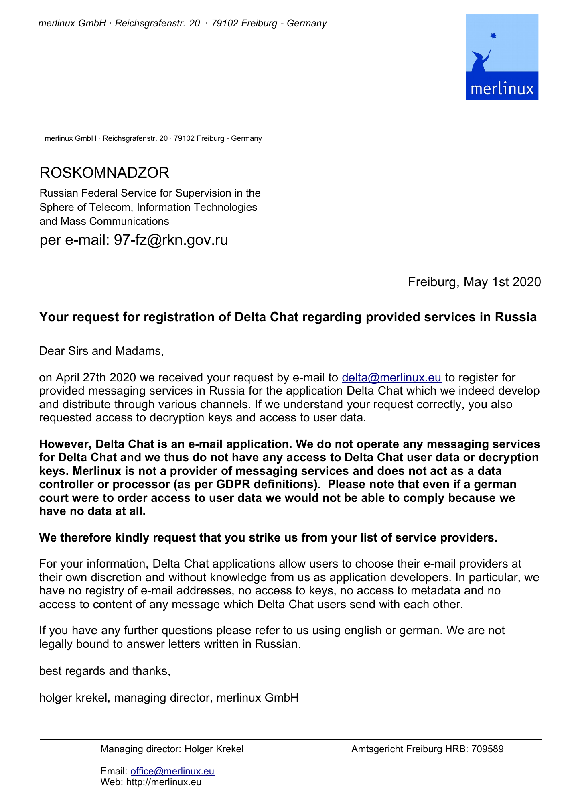

در ۲۷ آوریل نامه‌ای از <a href="http://eng.rkn.gov.ru/about/">Roskomnadzor</a>، ناظر ارتباطات و فناوری اطلاعات روسیه دریافت کردیم. از ما خواستند دسترسی به داده کاربران Delta Chat را فراهم کنیم و در فهرست ارائه‌دهندگان دولتی‌شان ثبت‌نام کنیم. <b>به این دلیل ساده رد کردیم که توسعه‌دهندگان Delta Chat اصلاً به داده کاربران دسترسی ندارند</b>.

Delta Chat یک پیام‌رسان غیرمتمرکز است و سرورهای خودش را ندارد. شما ارائه‌دهنده ایمیلی را که خودتان به آن اعتماد دارید انتخاب می‌کنید و ما از انتخاب‌هایتان خبر نداریم. علاوه بر این، حتی ارائه‌دهندگان ایمیل هم محتوای پیام‌های Delta Chat را نمی‌بینند چون پیام‌ها از طریق <a href="https://autocrypt.org">Autocrypt</a> با رمزنگاری سرتاسری محافظت می‌شوند.

درود فراوان به اکوسیستم ایمیل که جداسازی استانداردشده‌ای بین اپ‌ها (MUA) و انتقال پیام (MTA) دارد، و آن هم در مقیاسی سیاره‌ای و با بهره‌برداری متنوع ... حتی اگر کمی شلوغ و کندحرکت باشد ;)

<a href="../assets/blog/2020-roskomnadzor.pdf">
     
    <b>پاسخ رسمی به درخواست دولت روسیه برای داده کاربران Delta Chat</b>
</a>
