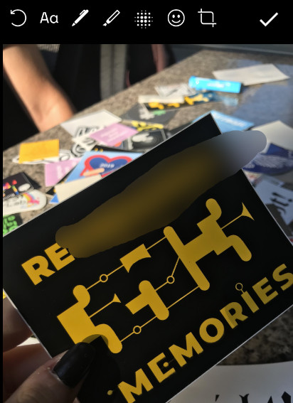
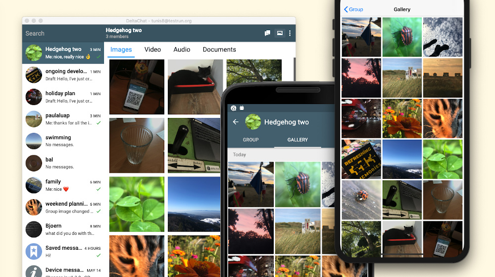

انتشارهای جدید Delta Chat همین حالا بیرون‌اند یا به‌زودی می‌آیند -
اینجا نمایی از چیزی است که از **Delta Chat 1.10** می‌توانید انتظار داشته باشید:

### سریع‌تر است!

_«وقتی هسته کتابخانه Rust Delta Chat کاملاً به Async منتقل می‌شود عقب بایستید»_
[توصیه Holger در توییتر](https://twitter.com/delta_chat/status/1261386305247690752) بود
وقتی انتقال Async شروع شد.

اما **Async از دیدگاه کاربر به چه _دردی_ می‌خورد؟**

با یک کلمه: **سرعت.**
دانلود پیام‌ها حالا خیلی سریع‌تر است،
ده‌ها پیام در همان زمانی می‌رسند که معمولاً یک پیام دانلود می‌شد.
ارسال هم سریع‌تر است.
هر چیزی که به شبکه مربوط است تقویت شده.

راستش را بخواهید، به‌عنوان یک توسعه‌دهنده قدیمی C،
خیلی شک داشتم که بهبود اصلاً محسوس باشد.
یک سال پیش، قبل از [Rustocalypse](https://delta.chat/en/2019-05-08-xyiv#the-coming-delta-chat-rustocalypse)،
Delta Chat با C نوشته شده بود — یعنی، چه چیزی می‌تواند از _آن_ سریع‌تر باشد؟

خب، خوشبختانه یاد گرفتم که _Async Rust_ می‌تواند.

سپاس فراوان از جادوگر ارشدمان _dignifiedquire_ که این را ممکن کرد ✨

### محو کردن تصاویر

 

عکسی گرفته‌اید که می‌خواهید پست کنید - اما **جزئیاتی روی عکس هست که نمی‌خواهید پخش شود؟**
یک پلاک، یک ساعت با تاریخ، علامتی روی ژاکت که شخص را شناسایی می‌کند، یک چهره؟

با ابزار جدید _blur_، در دسترس روی Android (آیکون پنجم در تصویر کناری)،
می‌توانید به‌راحتی این جزئیات را قبل از پست کردن از تصویر حذف کنید.

### هیس! 🤫

یک استراحت کنید و **روی چیزهایی که واقعاً مهم‌اند تمرکز کنید.**
حالا می‌توانید چت‌ها را روی همه پلتفرم‌ها بی‌صدا کنید، نه فقط روی Android.

### یک گالری در هر چت

Android و Desktop از مدتی پیش **گالری‌های تصویر per-chat** دارند -
با 1.10، به iOS هم رسید.

به این ترتیب می‌توانید لحظه‌ها را به‌راحتی به اشتراک بگذارید و بعداً بهشان دسترسی داشته باشید.
نکته لبه: **Saved Messages** شما هم گالری دارد - از این برای دسترسی آسان به تصاویری
که آنجا فوروارد کردید یا مستقیم با تابع دوربین گرفتید استفاده کنید.

### خیلی بیشتر

چند قابلیت دیگر در یک نگاه -
خیلی‌هایشان یک صفحه وبلاگ جداگانه را توجیه می‌کردند، اما خب، فعلاً یک خط باید کافی باشد:

- ایموجی‌های جدید روی Android
- چندحسابی حالا روی Desktop و Android در دسترس است
- اعلان‌های بازنویسی‌شده روی Android
- گزارش خطای خیلی بهتر
- تنظیم کیفیت رسانه روی iOS و Android
- نمایش مستقیم GIF متحرک روی iOS
- اشتراک‌گذاری تصاویر از اپ‌های دیگر به Delta Chat - حالا روی iOS هم
- اپ‌های دیگر می‌توانند Delta Chat را با Intent استاندارد ایمیل اندروید باز کنند
- **بزرگ‌نمایی آواتارها** روی Desktop و Android

## انتشارهای جدید را امتحان کنید!

اگر هنوز Delta Chat 1.10 را ندارید،
برای نمای کلی [get.delta.chat](https://get.delta.chat) را ببینید.
**changelog**های مفصل را هم آنجا پیدا می‌کنید.

مثل همیشه، فروشگاه‌های مختلف زمان‌های مختلفی برای به‌روزرسانی می‌گیرند — سپاس از صبرتان.
و در آخر، نه کم‌اهمیت‌ترین، سپاس از همه آزمایش‌کنندگان، مترجمان، توسعه‌دهندگان که این انتشار را ممکن کردند :)
