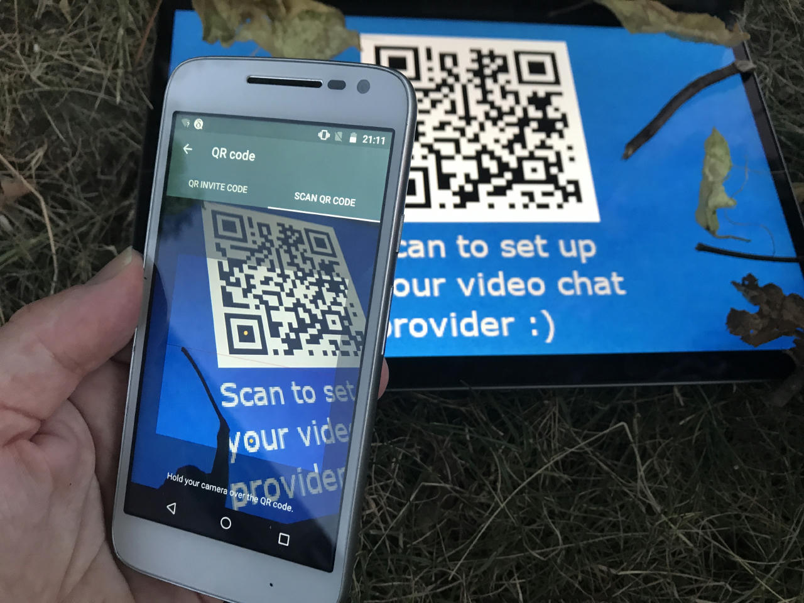
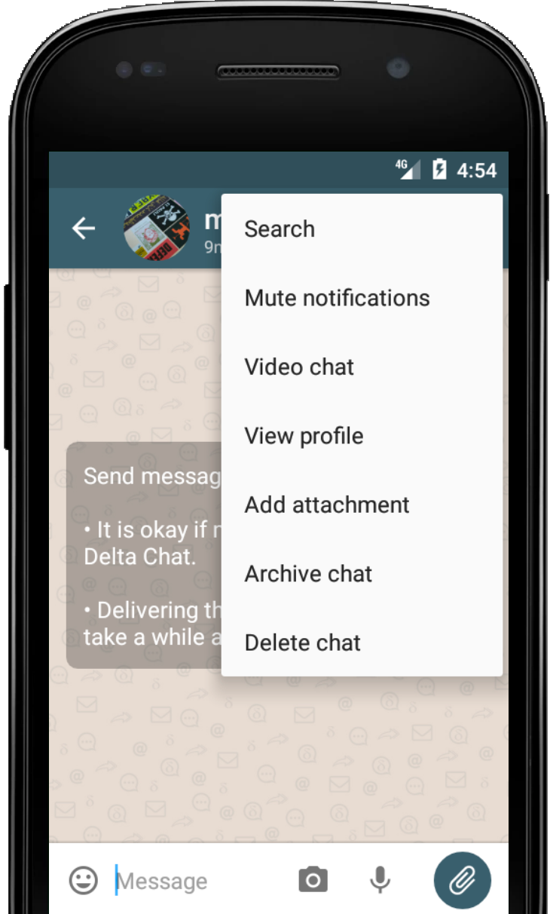
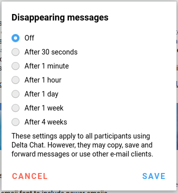

تابستان رسیده - و همچنین یک **دور جدید از انتشارهای Delta Chat**.

خوشحالیم که در هفته‌های گذشته تُن‌ها باگ را رفع کردیم،
تا تجربه کلی Delta Chat خیلی پایدارتر شود.
همچنین چیزهای کوچک‌تر اما با این حال مهمی اضافه کردیم.

- ارسال و دریافت پیام‌ها قابل‌اعتمادتر است
- فهرست پیام‌های Desktop چندین رفع طولانی‌انتظار گرفت
- Windows و Linux حالا از ایموجی‌های بیشتری پشتیبانی می‌کنند 🥳
- مدیریت دوربین روی iOS به‌روز شد
- بزرگ‌نمایی تصویر پروفایل روی iOS ↕️
- نمای پروفایل iOS به‌روزرسانی شد
- نمایش هشدار وقتی رمز عبور روی سرور عوض شود
- مدیریت خطای آفلاین بهبودیافته

علاوه بر این، خوشحالیم که
دو قابلیت مهم و پرتکرار دیگر را در Delta Chat معرفی می‌کنیم:
_پیام‌های ناپدیدشونده_ و _چت‌های ویدئویی_. در حالی که هر دو قابلیت
توسط گروه‌های مختلف کاربران زود آزمایش شده‌اند، انتظار داریم کار و
پرداخت بیشتری در ماه‌های آینده انجام شود.

### چت‌های ویدئویی

_«چطور ایمیل و چت‌های ویدئویی با هم جور درمی‌آیند؟»_

_«و اگر شخص تماس‌گرفته حتی از Delta Chat استفاده نکند چه می‌شود؟»_  
(یادتان باشد، استفاده از اپمان را به کسی تحمیل نمی‌کنیم.)

_«همچنین، این چطور با رویکرد غیرمتمرکزمان جور درمی‌آید؟»_

در سال گذشته زیاد درباره این سؤال‌ها فکر کردیم،
همراه با گروه‌های کاربری و آزمایش‌کنندگان مختلف،
و با هدایت پژوهش UX و مصاحبه‌ها.

پس - **تصمیم با کاربر است که از کدام ارائه‌دهنده چت ویدئویی استفاده کند.**

- می‌توانند آن را در **تنظیمات** وارد کنند
- ارائه‌دهنده ویدئو ممکن است از **اطلاعات ارائه‌دهنده** همراه با دیگر داده‌های سرور بیاید
(که خیلی منطقی است، با این حال فعلاً بسیاری از ارائه‌دهندگان ایمیل از آن پشتیبانی نمی‌کنند).
- در نهایت، کاربر می‌تواند یک ارائه‌دهنده چت ویدئویی را **از یک کد QR** هم اسکن کند -
به این ترتیب ارائه‌دهندگان چت ویدئویی به‌راحتی و سریع به اشتراک گذاشته می‌شوند.

Delta Chat درباره ارائه‌دهنده انتخاب‌شده خیلی سخت‌گیر نیست:
کاربر می‌تواند از هر نمونه‌ای استفاده کند که نام اتاق را در URL داشته باشد، از جمله سرویس‌های
معروفی مثل jitsi، talky.io، appear.in و خیلی‌های دیگر.

ما باور داریم تمرکززدایی گسترده سرویس‌های چت ویدئویی
برای حریم خصوصی کلی ایده خوبی است.
امکان استفاده کاربر از هر نمونه موجود یا میزبانی خودش خیلی به این رویکرد کمک می‌کند.

با این حال، وقتی تنظیم شد، **شروع یک چت ویدئویی ساده است** -
فقط در هر چت یک‌به‌یک روی «Video chat» بزنید و منتظر بمانید گیرنده بپیوندد.
(نیازی نیست گیرنده خودش ارائه‌دهنده چت ویدئویی تنظیم کند -
و همچنین گیرنده آزاد است اگر واقعاً بخواهد از
یک کلاینت غیر-Delta به چت بپیوندد :)

در نهایت، پروژه [basicWebRTC](https://github.com/cracker0dks/basicwebrtc)
هم هست که یک تجربه WebRTC باریک و سریع معرفی می‌کند.
اگر _basicWebRTC_ به‌عنوان نمونه videochat شناسایی شود،
روی دسکتاپ، تماس مستقیم درون‌اپ مدیریت می‌شود.

در کل، چت‌های ویدئویی از همین حالا نسبتاً قابل استفاده‌اند،
با این حال انتظار داریم در انتشارهای بعدی تنظیم دقیق‌تری شوند.

_چت‌های ویدئویی را می‌توان از Android 1.12 و Desktop 1.10.4 شروع کرد و
از همه کلاینت‌های موجود می‌توان به آن‌ها پیوست_

## پیام‌های ناپدیدشونده

قابلیت جدید دیگر در همه نسخه‌های اخیر Delta Chat روی همه پلتفرم‌ها
_پیام‌های ناپدیدشونده_ است، شبیه به پیشنهاد پیام‌رسان Signal.

وقتی قابلیت در تنظیمات فعال شود،
هر کاربر می‌تواند تصمیم بگیرد همه پیام‌های بعدی ناپدید شوند.

بعد از یک مهلت انتخاب‌شده،
**پیام‌ها ناپدید می‌شوند** روی همه دستگاه‌های کاربر،
روی سرور کاربر -
و علاوه بر این، روی دستگاه‌ها و سرورهای
دیگر اعضا هم اگر از Delta Chat استفاده کنند و کپی یا اسکرین‌شات نگرفته باشند.

**به طرف‌های چت اعتماد کنید** -
نمی‌توانید حذف را در برابر یک طرف چت بدخواه تضمین کنید،
نه با Delta Chat و نه با هیچ پیام‌رسان دیگری - برای شروع،
کاربران ممکن است برای حفظ پیام‌های ناپدیدشونده عکس بگیرند.

با این حال، همراه با حساب‌های burner و
حذف پیام‌های قدیمی، Delta Chat مجموعه خوبی
از قابلیت‌ها برای خلاص شدن از چیزها دارد :)

اینجا هم، در صورت نیاز، در نسخه‌های بعدی چیزها را ساده‌تر می‌کنیم
و آن‌وقت گزینه‌های پیام‌های ناپدیدشونده را به‌طور پیش‌فرض ارائه خواهیم داد.

## انتشارهای جدید را امتحان کنید!

اگر هنوز جدیدترین Delta Chat را ندارید،
برای نمای کلی [get.delta.chat](https://get.delta.chat) را ببینید.
**changelog**های مفصل را هم آنجا پیدا می‌کنید.

مثل همیشه، فروشگاه‌های مختلف زمان‌های مختلفی برای به‌روزرسانی می‌گیرند — سپاس از صبرتان.
همچنین سپاس از همه شرکت‌کنندگان پژوهش UX، آزمایش‌کنندگان، مترجمان و توسعه‌دهندگان که این انتشار را ممکن کردند :)
