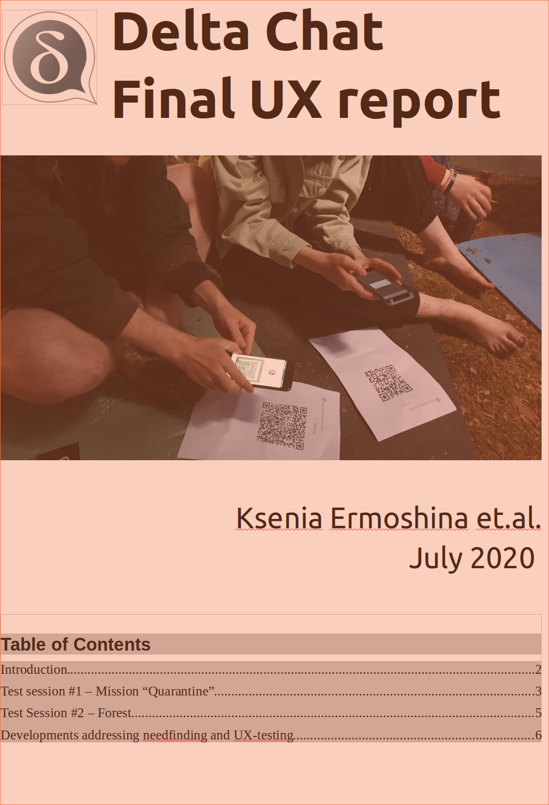

گزارش خلاصه نهایی UX مربوط به Delta Chat منتشر شده،
با خلاصه‌ای از توسعه‌هایی که به نیازهای دنیای واقعی
افراد درگیر مأموریت‌های حقوق بشر در بلاروس،
روسیه، اوکراین، ایران، تایوان و هنگ‌کنگ می‌پردازند. این کار با حمایت سپاس‌آمیز
[OpenTechFund](https://opentech.fund) انجام شد و در غیر این صورت
ممکن نبود.

<a href="../assets/blog/DC_final_ux_july_2020.pdf">
     
    <b>دانلود</b> 2020-07-final-ux.pdf
</a>
