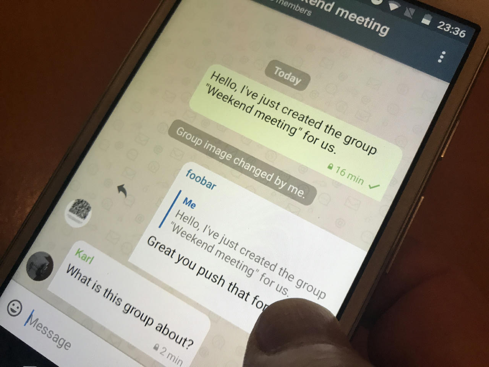
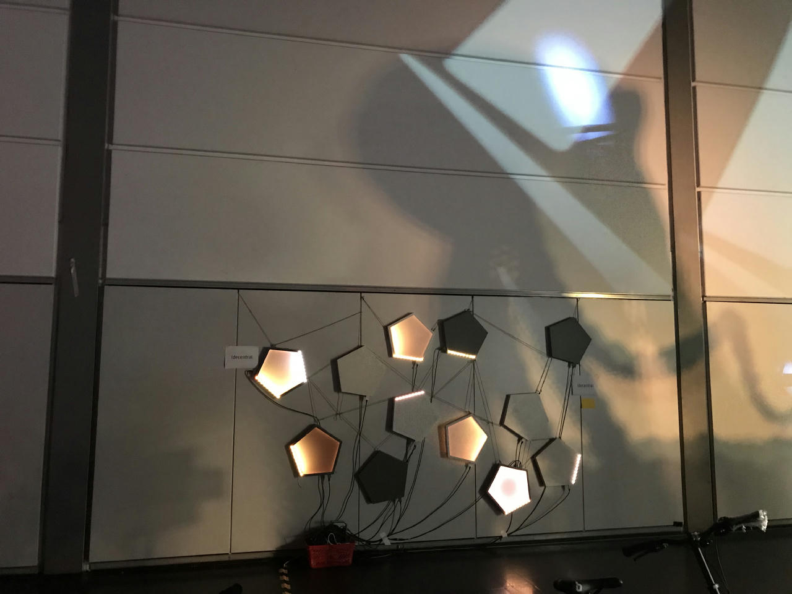
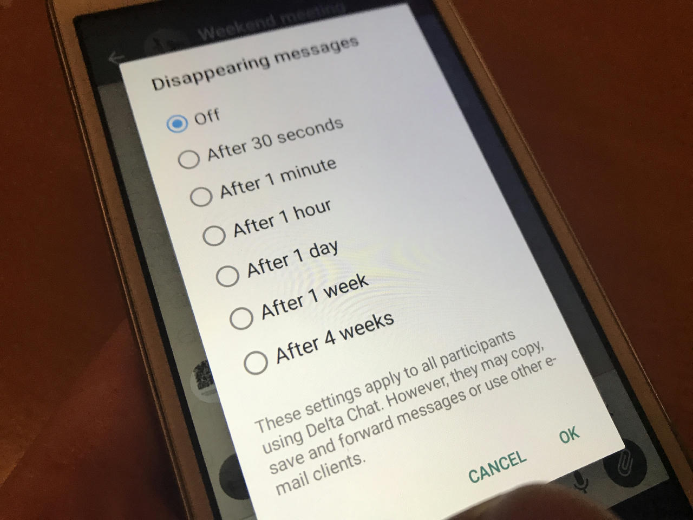

نوامبر سرد؟ نه! بعد از هفته‌ها توسعه و آزمایش،
انتشارهای اندروید رسیده و **سری انتشار جدید** را آغاز کرده‌اند.

از **Delta Chat Android 1.14** چه می‌توانید انتظار داشته باشید؟

## کشیدن برای پاسخ (Swipe to Reply)

یک قابلیت طولانی‌انتظار حالا اینجاست.
چیز زیادی برای توضیح نیست — این از اپ‌های دیگر خوب شناخته شده:

فقط **هر پیامی را به راست بکشید**
و نقل‌قولی بالای خط نوشتن می‌بینید
و می‌توانید مثل همیشه به نوشتن پیامتان ادامه دهید.

می‌توانید متن عادی را نقل کنید و با متن پاسخ دهید،
اما می‌توانید مثلاً تصاویر یا پیام‌های صوتی را هم نقل کنید
و با تصاویر یا پیام‌های صوتی پاسخ دهید :)

## از اتاق ماشین

همان‌طور که [شاید بدانید](2019-05-08-xyiv#the-coming-delta-chat-rustocalypse)،
همه پلتفرم‌های Delta Chat همان _کتابخانه هسته_ را به اشتراک می‌گذارند
که از **_واقعاً_ سخت‌ترین کارها** مراقبت می‌کند:
رمزنگاری، شبکه، پروتکل‌ها، پایگاه داده — ایده را گرفتید.

تغییرات در هسته مستقیماً برای کاربر دیده نمی‌شوند.
منطق این است:
اگر هسته را متوجه نشوید، **بهترین کاری را که می‌تواند انجام می‌دهد.**

یک مثال:  
وقتی یک **حساب جدید** راه‌اندازی می‌کنید
(ایمیل و رمز عبورتان را وارد می‌کنید)
این _حالا_ فقط **چند ثانیه** طول می‌کشد تا Delta Chat
آماده دریافت و ارسال پیام شود.

در نسخه‌های _قدیمی‌تر_، این به‌راحتی می‌توانست بیش از یک دقیقه طول بکشد!

مثال دیگر، باز هم هنگام راه‌اندازی:  
**دفترچه آدرستان حالا از پیش پر می‌شود** با آدرس‌های ایمیلی
که قبلاً با حسابی که تازه واردش می‌شوید با آن‌ها تماس گرفته‌اید.

در آخر، نه کم‌اهمیت‌ترین، هسته همه تفاوت‌های
**ارائه‌دهندگان مختلف** را مدیریت و رفع می‌کند،
که فضای ایمیل را این‌قدر متنوع و بزرگ می‌کند.

این‌ها از آن نوع کارهایی است که توسعه‌دهندگان هسته مراقبشان‌اند.
یک «متشکرم» بزرگ برای این کار باورنکردنی!

## چند چیز دیگر

چند قابلیت دیگر در یک نگاه:

* **پیام‌های ناپدیدشونده**،
  [در گذشته یک قابلیت آزمایشی](2020-07-30-summer-update#disappearing-messages)،
  حالا به‌طور پیش‌فرض در دسترس‌اند.
  هر چتی حالا می‌تواند طوری پیکربندی شود
  که پیام‌های ارسالی و دریافتی را بعد از مدتی حذف کند.

* چت‌ها در **اولین پیام ندیده‌شده** باز می‌شوند.

* ذخیره چیزها در چت **Saved messages** از مدتی پیش ممکن بوده -
  با 1.14، این کار سریع‌تر و آسان‌تر انجام می‌شود —
  فقط روی یک پیام لمس طولانی کنید و به «Saved messages» فوروارد کنید. ✔️ **ذخیره شد.**

* برای همه جزئیات باشکوه [Changelogها](download#changelogs) را ببینید :)

## Desktop و iOS چطور؟

به‌جز فصل «اتاق ماشین»،
این پست وبلاگ این بار عمدتاً درباره اندروید است.
با این حال، به‌روزرسانی‌های iOS و Desktop هم **در صف‌اند**،
منتظر اخبار آنجا باشید.

## انتشارهای جدید را امتحان کنید!

نسخه‌های جدید را در
[get.delta.chat](https://get.delta.chat) ببینید.

مثل همیشه، به‌روزرسانی‌ها در زمان‌های مختلف به فروشگاه‌های مختلف می‌رسند — سپاس از صبرتان.
و دوباره، سپاس فراوان از همه آزمایش‌کنندگان، مترجمان، توسعه‌دهندگان برای ممکن کردن این انتشار 🙏
