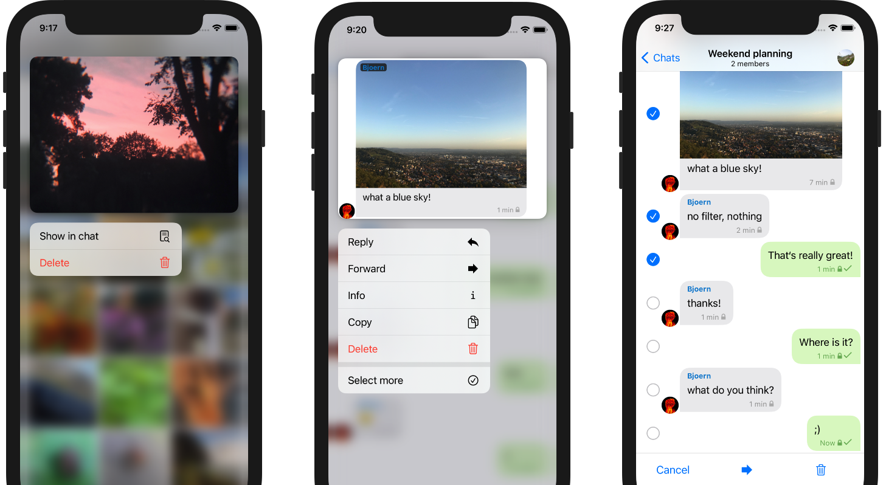
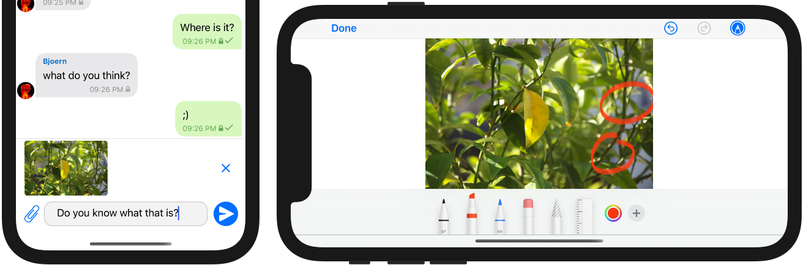

_Delta Chat iOS_
[از حدود یک سال پیش](2020-01-09-iOS-appstore-release) در دسترس است 🎉 —  
در حالی که به‌خوبی قابل استفاده و کارآمد بوده،
در مقایسه با نسخه‌های بالغ‌تر Android و Desktop،
بعضی قابلیت‌های UI از اپ iOSمان جا مانده بودند.
توجه کنید که همه پلتفرم‌ها همان
[Rust-core](https://github.com/deltachat/deltachat-core-rust) پایدار را به اشتراک می‌گذارند؛ پس می‌توانید همان کارکرد هسته و پایداری‌ای را انتظار داشته باشید که اپ‌های طولانی‌تر در حال تکامل Android و Desktopمان دارند.

با انتشارهای ماه‌های اخیر
و با **انتشار کاملاً جدید iOS 1.16**
چندین فاصله را بستیم
و **قابلیت‌های زیادی به رابط کاربری iOS اضافه کردیم:**

### منوهای زمینه و انتخاب چندتایی

- **انتخاب چندتایی برای پیام‌ها** را اضافه کردیم -
  روی یک پیام لمس طولانی کنید، «select more»
  و چند پیام را با هم فوروارد یا حذف کنید.

- تصویر زیبایی در گالری یک چت بزرگ می‌بینید -
  اما واقعاً زمینه را به یاد نمی‌آورید؟
  لمس طولانی روی تصویر و انتخاب **show in chat**
  شما را مستقیم به پیام درست در چت می‌برد
  (این قابلیت حتی اول روی iOS منتشر شد - پلتفرم‌های دیگر دنبال می‌کنند)

- وقتی از multi-select یا show-in-chat استفاده می‌کنید،
  **منوهای زمینه بهبودیافته** را متوجه می‌شوید که
  گزینه‌های موجود را مستقیم همراه با انتخاب نشان می‌دهند.
   
این منوها از iOS 13 در دسترس‌اند
و نمونه خوبی هستند از
چرا توسعه UI بومی برای اپ‌های روزمره مثل پیام‌رسان‌ها حاکم است -
فقط _بهتر به نظر می‌رسند، حس می‌شوند و کار می‌کنند_ نسبت به مصالحه‌های مستقل از پلتفرم.

### ارسال تصاویر با متن و ویرایش تصاویر

- **قبل از ارسال یک تصویر**، حالا می‌توانید **کمی متن اضافه کنید:**
  مثل همیشه از دوربین یا گالری استفاده کنید -
  تصویر بالای فیلد ورودی نشان داده می‌شود جایی که می‌توانید کمی متن اضافه کنید
  و در نهایت دکمه ارسال را بزنید.

- به همین شکل، می‌توانید کمی توضیح
  به **ویدئوها، gif، اسناد** یا **فایل‌ها** اضافه کنید

- علاوه بر این، با ضربه روی پیش‌نویس می‌توانید نگاه دقیق‌تری به آن بیندازید.
  یک **پیش‌نمایش بزرگ** باز می‌شود که به‌ویژه برای اسناد مفید است
  تا فایلی را که در شرف ارسال هستید دوباره بررسی کنید.

- پیش‌نمایش حتی ویرایش پایه را هم اجازه می‌دهد،
  مثل **کشیدن روی تصاویر** یا **بریدن ویدئوها**.
  برای فعال کردن ویرایش، از **دکمه ویرایش**
  در گوشه بالا-راست پیش‌نمایش استفاده کنید.

### دیگر چه؟

- کمی تلاش کردیم تا **دسترس‌پذیری را بهبود دهیم** -
  سپاس از جامعه‌مان که کمک کرد بعضی مسائل را هدف بگیریم.
  لطفاً اگر مسائل بیشتری دیدید به ما بگویید.
  
- قبل از 1.16، اما هرگز در یک پست وبلاگ اختصاصی iOS ذکر نشده،
  **جستجوی سراسری**، **پیام‌های ناپدیدشونده**، **کشیدن برای پاسخ**،
  **ضبط ویدئو** و **نمای پیام** بهبودیافته
  و [خیلی بیشتر](https://github.com/deltachat/deltachat-ios/blob/master/CHANGELOG.md#delta-chat-ios-changelog) را اضافه کردیم.

**فعلاً روی بهبود اعلان‌های پس‌زمینه کار می‌کنیم** -
بسته به اینکه چند وقت یک‌بار از Delta Chat استفاده می‌کنید
و بسته به اینکه چند اپ دیگر نصب کرده‌اید،
iOS اجازه نمی‌دهد برای پیام‌های جدید آن‌طور که دوست داریم چک کنیم.
این یک مسئله شناخته‌شده است و تلاش‌های جاری برای پرداختن به آن هست -- منتظر بمانید :)

در نهایت، ارزش ذکر دارد که با وجود همه این قابلیت‌های جدید
**حداقل‌های سیستم عوض نشده‌اند:**
iOS 11، iPhone 5s یا iPad 5/Air/Mini هنوز کافی‌اند.  
هرچند پشتیبانی از سیستم‌های قدیمی کار اضافی قابل توجهی است،
چندین بار در برابر وسوسه افزایش حداقل‌ها مقاومت کرده‌ایم.
پس دستگاه‌های موجود می‌توانند به نفع همه ادامه یابند
(شاید به‌جز به نفع Apple :)

## انتشارهای جدید iOS را امتحان کنید!

**مثل همیشه، نسخه جدید iOS را در
[App Store](https://apps.apple.com/us/app/delta-chat/id1459523234) اپل پیدا می‌کنید.**

شاید به آزمایش قابلیت‌های جدید علاقه دارید؟
شاید حتی خوشحال می‌شوید [باگ گزارش کنید](contribute#translations-and-bug-reports)؟
انتشارهای بتا جدید را در
[Testflight](https://testflight.apple.com/join/uEMc1NxS) اپل بررسی کنید.

در نهایت، البته، اگر از دستگاه اپل استفاده نمی‌کنید:
Delta Chat برای خیلی از [پلتفرم‌های دیگر](download) در دسترس است.
