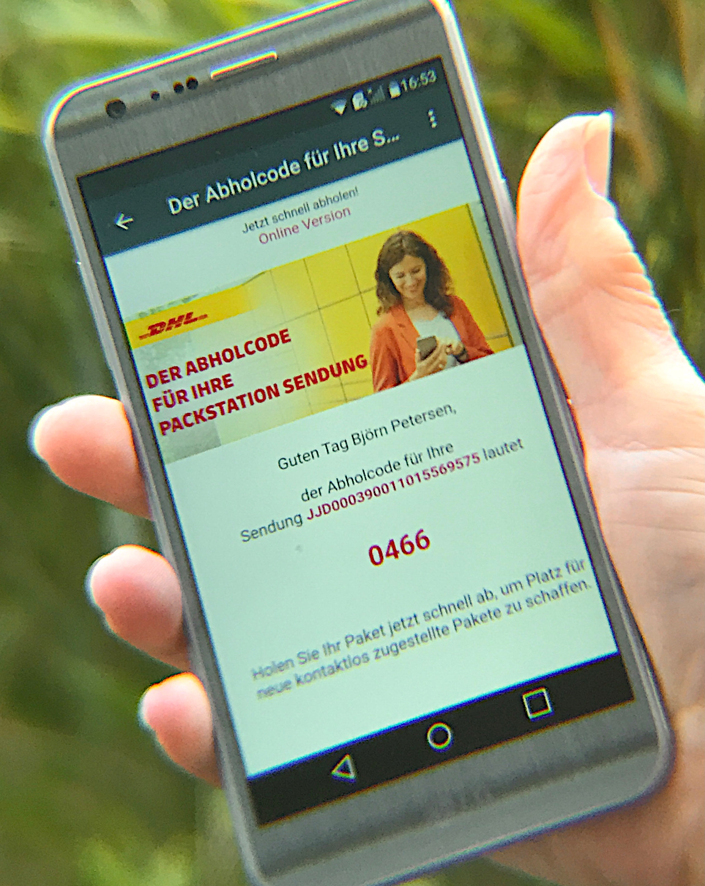

انتشارهای فعلی
تعامل با دنیای ایمیل کلاسیک را حتی روان‌تر می‌کنند
و چند قابلیت طولانی‌مدت مورد انتظار را هدف گرفته‌اند.

## ایمیل‌های HTML با قالب‌بندی غنی

_بلیط قطار گرفته‌اید؟_
_اعلانی از سرویس بسته پستی؟_
_دعوت‌نامه؟_

همه این پیام‌ها ممکن است به‌صورت **ایمیل‌های HTML با قالب‌بندی غنی** بیایند
که اکنون به‌خوبی مستقیماً داخل Delta Chat 1.20 نمایش داده می‌شوند.

برای دسترسی به آن‌ها،
فقط از دکمه **Show full message** استفاده کنید
که هر وقت لازم باشد به حباب پیام اضافه می‌شود.

## فهرست‌های پستی (Mailing lists)

Delta Chat 1.20 از **خواندن mailing list** پشتیبانی می‌کند.

Mailing listها به‌ویژه مهم‌اند چون
حتی ایمیل‌های «عادی» هم ممکن است به‌صورت mailing list بیایند —
مثلاً همان اعلان سرویس بسته پستی
حالا حتی اگر داخل یک mailing list پیچیده شده باشد هم نمایش داده می‌شود.

از آنجا که فرستنده در mailing list ممکن است توسط نرم‌افزار فهرست ناشناس شود،
با یک تیلده در ابتدا به‌صورت **~Alice** علامت‌گذاری می‌شود.

این و چند جزئیات ریز دیگر لازم بود در نظر گرفته شوند تا همه‌چیز کار کند؛
پس بالاخره از داشتن mailing list خیلی خوشحالیم —
لطفاً [اگر مشکلی دیدید گزارش دهید](https://delta.chat/en/contribute#translations-and-bug-reports)
تا به‌زودی mailing list را برای **نوشتن** هم باز کنیم.

## مدیریت بهتر آدرس‌های پشتیبانی

آدرس‌های پشتیبانی مثل **info@example.org** اغلب به چند همکار گسترش می‌یابند
که (در بهترین حالت :) یکی از آن‌ها به شما پاسخ می‌دهد.

این پاسخ‌ها ممکن است از آدرس‌های مختلف بیایند،
اما اکنون در چت درست نمایش داده می‌شوند.

## بهبودهای دیگر

[تقریباً ۱۰۰ issue هدف قرار گرفت](https://github.com/orgs/deltachat/projects/31#column-11613951)
تا سازگاری با ایمیل بهتر شود؛
چند مورد برجسته دیگر:

- پیام‌ها **زیباتر به‌نظر می‌رسند** اگر گیرنده از Delta Chat استفاده نکند —
  موضوع (subject) بهتر است و آواتار غیرمنتظره‌ای پیوست نمی‌شود

- **مدیریت بهتر پیوست‌ها**

- پشتیبانی از **Outlook.com** (و ارائه‌دهنده‌های دیگری که headerها را خراب می‌کنند ;)

- هر از گاهی **بررسی همه پوشه‌های سرور** برای پیام‌های جدید

- [ربات‌ها](https://delta.chat/en/2020-03-26-shining-some-light-on-bots) هم از چند قابلیت بهره می‌برند —
  مثلاً می‌توانند کاربران را ناشناس کنند و ایمیل HTML بفرستند.

- به‌خاطر فرستنده‌های بیشتر، **رنگ‌های بیشتر و جدید** برای آواتار مخاطبین اضافه کردیم

- به‌خاطر پیام‌های بیشتر در کل، **جستجوی سراسری را سریع‌تر** کردیم

- می‌توانید **status** (فوتر) هر مخاطب را
  در پروفایل مخاطب ببینید

## چطور کار می‌کند

از روز اول،
Delta Chat از **متنوع‌ترین و توزیع‌شده‌ترین** شبکه موجود
برای انتقال پیام‌های چت استفاده می‌کند: ایمیل.

Delta Chat در برابر وسوسه ساخت قفس دیگری روی آن مقاومت می‌کند
و خوب با **سایر ارائه‌دهنده‌ها و اپ‌ها** کار می‌کند؛
و کارش را در
جدا کردن پیام‌های چت از ایمیل‌های کلاسیک خوب انجام می‌دهد.

پس به‌طور کلی، ایمیل کلاسیک از روز اول کار می‌کند:

- می‌توانید **با هر آدرس ایمیلی چت کنید**؛
  نیازی نیست گیرنده هم از Delta Chat استفاده کند.
  در این صورت گیرنده یک ایمیل کلاسیک دریافت می‌کند
  (نه فقط یک لینک مثل بعضی اپ‌های دیگر).

- برای **دریافت ایمیل‌های کلاسیک** علاوه بر پیام‌های چت،
  باید **Settings / Chats and media / Show classic emails** را فعال کنید.

با این حال، در هر دو مورد،
به‌خاطر تنوع سیستم ایمیل،
در گذشته چند آزار جزئی وجود داشت.

همان‌طور که بالا نشان داده شد، به‌روزرسانی فعلی چند مورد از آن‌ها را هدف گرفته است :)

## آیا این برای همه است؟

مدیریت ایمیل در Delta Chat فقط یک گزینه است؛
هنوز آزادید مثل قبل از Delta Chat استفاده کنید،
در ترکیب با سایر کلاینت‌های ایمیل.

کاملاً آگاهیم که بهبودهای فعلی
فقط چند قدم به‌سوی ایمیل است و موارد بیشتری در راه است.

با این حال، Delta Chat احتمالاً همین امروز
بهترین پیام‌رسان برای مدیریت ایمیل است ;)

## دریافت به‌روزرسانی‌ها

**نسخه‌های جدید را در [get.delta.chat](https://get.delta.chat) ببینید** —
مثل همیشه، رسیدن به همه فروشگاه‌ها کمی زمان می‌برد.

نسخه‌ها چیزهای بیشتری برای کشف دارند؛
اعلان‌های بهتر در iOS، قفل ضبط صدا در اندروید
و [خیلی خیلی بیشتر](https://delta.chat/en/download#changelogs).
