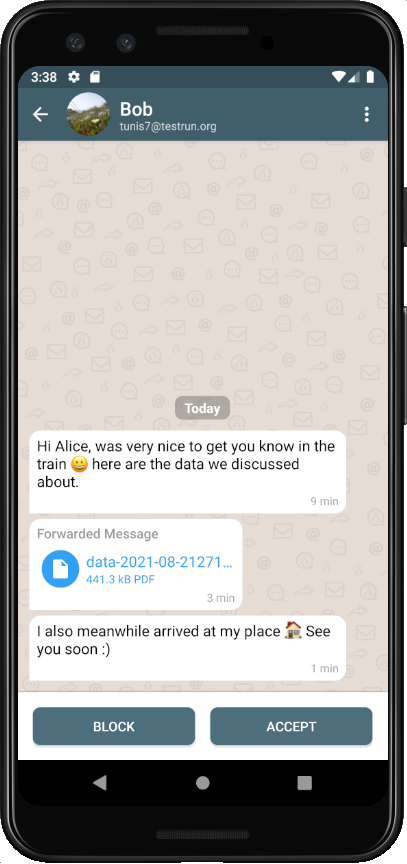
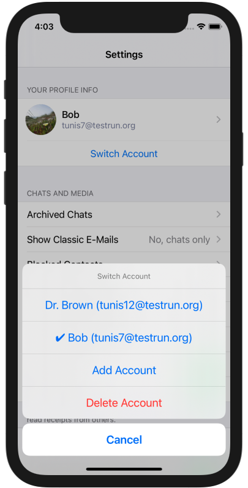
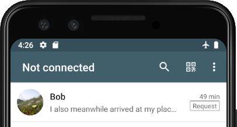
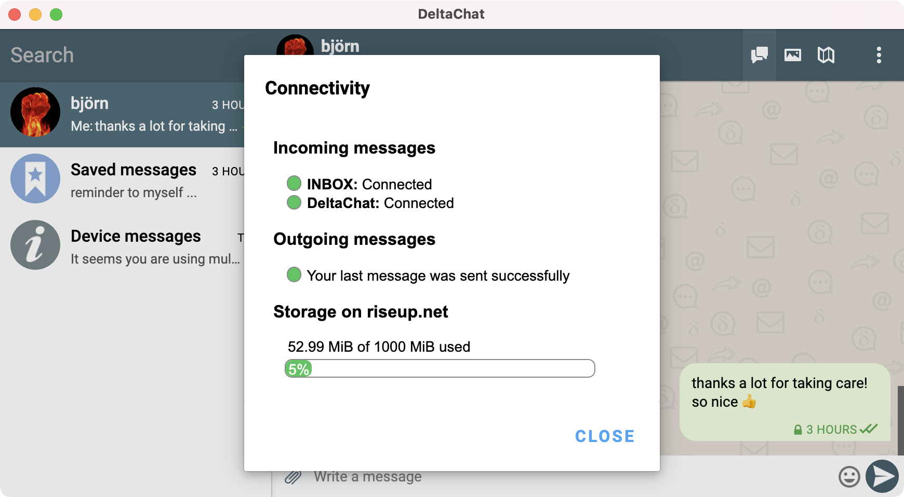

**Delta Chat 1.22** منتشر شد!
این پست مهم‌ترین تغییرات این انتشار را توضیح می‌دهد.

## درخواست‌های چت خیلی بهتر

وقتی کسی که هنوز با او در تماس نبوده‌اید برای شما می‌نویسد یا شما را به گروهی اضافه می‌کند،
حالا یک **درخواست چت (Chat Request)** می‌گیرید که مستقیماً در فهرست چت‌ها ظاهر می‌شود:

- درخواست چت با برچسب "Request" مشخص می‌شود
- همه پیام‌ها در بافت چت درست ظاهر می‌شوند؛
  می‌توانید مثل همیشه همه پیام‌ها را ببینید و بخوانید
- می‌توانید پیوست‌ها را باز کنید، تصاویر را ببینید، حتی ذخیره یا فوروارد کنید
- رسید خوانده‌شدن برای درخواست‌های چت ارسال نمی‌شود

در هر لحظه می‌توانید تصمیم بگیرید درخواست چت را **قبول (Accept)** کنید —
در این صورت درخواست چت به یک چت عادی تبدیل می‌شود.

اعمال عادی هم حالا برای درخواست‌های چت کار می‌کنند:
می‌توانید آن را **پین (Pin)** کنید تا بعداً فراموشش نکنید —
یا اگر نمی‌خواهید به آن فکر کنید **آرشیو (Archive)** کنید ;)

و البته می‌توانید درخواست را **مسدود (Block)** یا **حذف (Delete)** کنید.

نکته: اگر از نسخه قدیمی‌تر Delta Chat به‌روز می‌کنید،
درخواست‌های قدیمی‌تان را در آرشیو، در انتهای فهرست چت‌ها پیدا می‌کنید.
علاوه بر این، در اندروید و iOS، آرشیو اکنون **دسترس‌پذیرتر** است —
مستقیماً از منو (اندروید) یا از تنظیمات (iOS).

## چندحسابی اضافه یا بهبود یافته

**Delta Chat iOS** برای **اولین بار** قابلیت چندحسابی می‌گیرد —
در تنظیمات می‌توانید حساب‌های اضافی اضافه کنید
و به‌راحتی بین آن‌ها جابه‌جا شوید.

افزودن حساب **به همان سادگی** راه‌اندازی اولیه است.

در مقایسه با پیاده‌سازی‌های موجود چندحسابی در اندروید و دسکتاپ،
**جابه‌جایی حساب فوق‌العاده سریع** است.
**دیگر منتظر ماندن اجباری** هنگام انتخاب حساب دیگر
که درست بعد از جابه‌جایی پیام‌هایی برای دانلود دارد.

این را با استفاده از **کدبیس core جدید** ممکن کردیم
که اجازه می‌دهد حساب‌ها هم‌زمان اجرا شوند.
این همچنین مثلاً اجازه می‌دهد عضویت در گروه در پس‌زمینه پردازش شود —
تصور کنید به کسی کد QR برای گروه می‌دهید و درست وقتی می‌خواهد بپیوندد به حساب دیگری جابه‌جا می‌شوید.
با کدبیس جدید، این دیگر مشکل نیست.

خبر خوب برای **Delta Chat اندروید و دسکتاپ** —
آنجا هم به **همان کدبیس core** سوییچ کردیم.

داشتن همان کدبیس روی همه پلتفرم‌ها
چندین گزینه برای آینده باز می‌کند — کنجکاو بمانید :)

## اتصال و سهمیه (Quota)

بخش بزرگ سوم: **وضعیت اتصال را قابل‌مشاهده** کردیم:

**نوار عنوان** (اندروید/iOS) یا یک **اعلان toast** (دسکتاپ)
اکنون نشان می‌دهد اگر به هر دلیلی متصل نیستید؛
چه WIFI قطع شده باشد چه ارائه‌دهنده‌تان از کار افتاده باشد.

ضربه روی عنوان
**نمای جدید Connectivity** را باز می‌کند
که **اطلاعات جزئی** درباره دلیل می‌دهد —
به‌علاوه چند اطلاعات مفید دیگر، مثلاً **اطلاعات سهمیه (Quota)** اگر ارائه‌دهنده‌تان اجازه دهد.

## دریافت به‌روزرسانی‌ها

**نسخه‌های جدید را در [get.delta.chat](https://get.delta.chat) ببینید.**
مثل همیشه، رسیدن به همه فروشگاه‌ها کمی زمان می‌برد.

و مثل همیشه، نسخه‌های جدید حتی
[خیلی خیلی چیزهای بیشتری برای کشف](https://delta.chat/en/download#changelogs) دارند.
