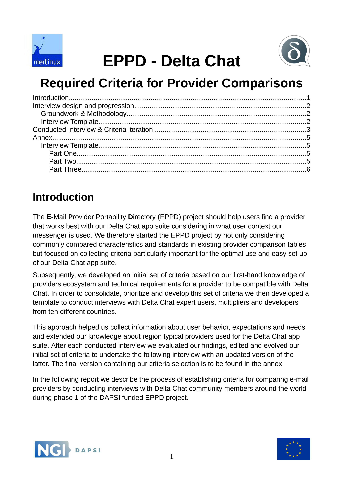

برای Delta Chat از کدام ارائه‌دهنده استفاده کنم؟ این سؤال را زیاد می‌شنویم اما پاسخ‌دادنش چندان آسان نیست. هر کس نیازها و شرایط متفاوتی دارد. پس چطور پیش برویم؟

اوایل امسال برای تأمین مالی [NGI](https://www.ngi.eu/) اتحادیه اروپا درخواست دادیم تا رویکردی جامع برای مقایسه ارائه‌دهنده‌های ایمیل بسازیم و همزمان اپ‌هایمان را هم بهبود دهیم. موفق شدیم از [کنسرسیوم DAPSI EU](https://dapsi.ngi.eu/hall-of-fame/eppd/) بودجه بگیریم تا رویکرد جامع‌تری برای مقایسه ارائه‌دهنده‌های ایمیل پشتیبانی شود. برای یافتن معیارهای مقایسه مفید، به‌صورت نظام‌مند از کاربران حرفه‌ای Delta Chat از ده کشور پرسیدیم از یک ارائه‌دهنده چه می‌خواهند — از جمله این‌که جوامعشان درباره ارائه‌دهنده‌های مختلف چه چیزهایی را دوست دارند یا ندارند. تازه گزارش را تمام کردیم و مجموعه کاری از معیارها داریم که از آن راضی هستیم.

<a href="../assets/blog/eppd_criteria_final.pdf">
     
    <b>Download</b> eppd_criteria_final.pdf
</a>

بر اساس این معیارها اکنون قرار است در ماه‌های آینده حدود ۲۰ ارائه‌دهنده را ارزیابی کنیم. سپاس فراوان از [Gerry](https://github.com/gerryfrancis) که عمدتاً در شناسایی فهرست اولیه ارائه‌دهنده‌ها و جمع‌آوری اطلاعات درباره آن‌ها کمک کرد. علاوه بر آسان‌تر کردن انتخاب ارائه‌دهنده برای کاربران Delta Chat، از این یافته‌ها برای ساده‌تر کردن استفاده از Delta Chat هم استفاده می‌کنیم. در واقع، [بهبودهای اخیر Connectivity و Quota](https://delta.chat/en/2021-08-24-updates#connectivity-and-quota) همین حالا از تلاش EPPD ما نشأت گرفته‌اند.

اگر ورودی یا سؤال بیشتری در این باره دارید لطفاً در [فروم پشتیبانی](https://support.delta.chat) با ذکر "EPPD" پست بگذارید — ضمناً می‌توانید آنجا با اپ Delta Chat از طریق اسکن QR وارد شوید :)
