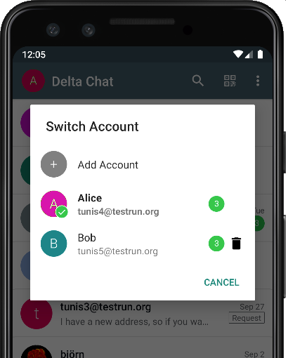
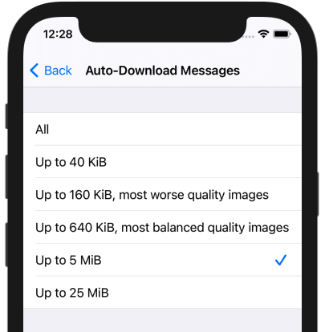
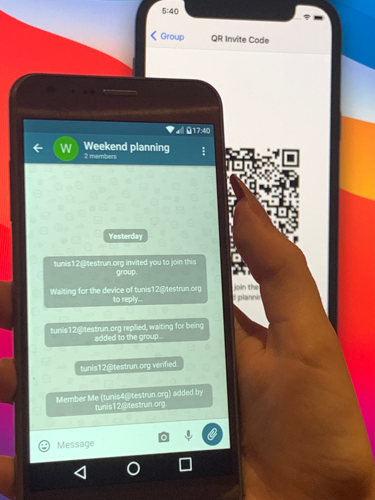

آره، Delta Chat **1.24 برای اندروید و iOS منتشر شد:**

## سوییچر حساب جدید اندروید

چند قدم دیگر در تلاش مداوممان برای بهبود چندحسابی:

- **تصویر پروفایل حساب انتخاب‌شده فعلی**
  مستقیماً بالای فهرست چت‌ها نشان داده می‌شود
  
- ضربه روی تصویر فهرست حساب‌ها را باز می‌کند و
  **جابه‌جایی سریع‌تر** به حساب دیگر را ممکن می‌کند
  
- قبل از جابه‌جایی ببینید حساب **پیام خوانده‌نشده** دارد یا نه

برای iOS، جابه‌جایی حساب در تنظیمات انجام می‌شود؛
با این حال، احتمالاً برخی از این ایده‌ها هم به iOS راه پیدا می‌کنند.

اگر پست قبلی را از دست داده‌اید:
[چندحسابی در این میان هم‌زمان اجرا می‌شود](2021-08-24-updates#multi-account-added-or-improved) —
که اساساً چیزهایی مثل _شمارنده پیام خوانده‌نشده_ را ممکن کرد :)

## دانلود در صورت تقاضا

تا به حال اذیت شده‌اید
که یک دانلود بزرگ
در شبکه بد جلوی کارهای مهم‌ترتان را بگیرد؟
یا سهمیه موبایلتان را بخورد؟

اگر بله، این قابلیت برای شماست!

به‌جای دانلود بی‌قیدوشرط همه پیام‌ها می‌توانید
به Delta Chat بگویید فقط یک جایگزین و
**دکمه "Download" برای پیام‌های بزرگ‌تر از یک آستانه** نشان دهد.

بعد می‌توانید وقتی واقعاً مناسب است **دانلود را دستی شروع کنید.**

این برای همه پیام‌ها کار می‌کند،
مهم نیست با Delta Chat فرستاده شده‌اند یا با یک برنامه ایمیل کلاسیک.

## پیوستن به گروه

وقتی کد QRی را اسکن می‌کنید که شما را به گروهی می‌برد،
حالا **فوراً** آن گروه را در فهرست چت‌هایتان می‌بینید،
مهم نیست دستگاه‌های درگیر **آنلاین باشند یا نه.**

دست‌دادن واقعی بعداً کاملاً در پس‌زمینه اجرا می‌شود،
و شما را از انجام کارهای خیلی مهم‌تر باز نمی‌دارد،
مثل انتخاب این‌که کدام ایموجی را برای دعوت تولدتان بگذارید 🎉

## جستجوی بهبودیافته

_جستجو_ در پست‌های اخیر واقعاً ذکر نشده بود،
اما در نسخه‌های اخیر هم کلی بهبود داشته.
برخی تغییرات اخیر:

- جستجوی درون‌چت حالا هم در اندروید و هم در iOS در دسترس است
  و اجازه می‌دهد **جستجوی افزایشی داخل هر چت** انجام دهید.
  از منو (اندروید) یا پروفایل چت (iOS) شروعش می‌کنید.

- با دکمه‌های **Previous و Next** می‌توانید بین نتایج بچرخید.

- جستجوی سراسری جهش یافته؛
  حالا **خیلی سریع‌تر** است.
  

##  _"همه حرف‌هایت می‌تواند درست باشد. چیز دیگری؟"_

_حرف‌های یک گربه فوق‌العاده شکاک ..._ اما خب، واقعاً چیزی مانده:

- **استیکرها** — چند علاقه‌مند ممکن کردند
  که استیکرها، **حتی انیمیشنی‌ها، روی همه پلتفرم‌ها نمایش داده شوند.**
  انتخاب‌گر استیکر داخلی وجود ندارد —
  با این حال، بسیاری از پلتفرم‌ها همین حالا یکی داخل کیبورد استاندارد دارند
  یا می‌توانید اپ‌های دیگری نصب کنید که این کار را برایتان انجام دهند
  (این احتمالاً پست وبلاگ جداگانه‌ای می‌طلبد :)
  
- **هشدار وقتی صندوق پستی پر می‌شود** — از به‌روزرسانی قبلی،
  «مصرف سهمیه» فعلی در نمای connectivity نمایش داده می‌شود.
  حالا حتی وقتی سهمیه‌تان در حال پر شدن است در چت دستگاه
  هشدار می‌گیرید — یکی در ۸۰٪ و دیگری در ۹۵٪ مصرف.

- به‌خاطر تقاضای زیاد کاربران،
  [**فهرست‌های Broadcast، مثل پیام‌رسان‌های دیگر**](https://github.com/deltachat/deltachat-android/pull/2060)
  را به‌عنوان قابلیت آزمایشی اضافه کردیم.
  همین امروز می‌توانید در "Settings / Advanced / Experimental Features" امتحانشان کنید.

- **حتی بیشتر** برای کشف
  [در changelogها](download#changelogs).
  جزئیات رفع باگ‌ها را هم آنجا پیدا می‌کنید.

## دریافت به‌روزرسانی‌ها

**نسخه‌های جدید را در [get.delta.chat](https://get.delta.chat) ببینید.**
مثل همیشه، رسیدن به همه فروشگاه‌ها کمی زمان می‌برد.
