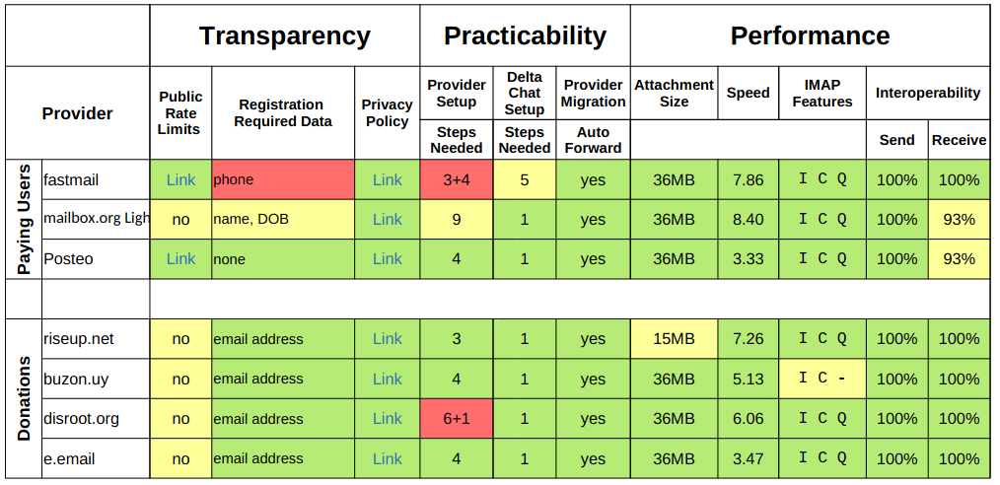

در چند ماه گذشته حدود ۲۰ ارائه‌دهنده بین‌المللی ایمیل را بر اساس [پژوهش قبلی‌مان درباره معیارهای مقایسه](https://delta.chat/en/2021-09-11-eppd-provider-criteria) مقایسه کردیم. این تلاش‌ها بخشی از پروژه [EPPD](https://dapsi.ngi.eu/hall-of-fame/eppd/) ما بود که توسط اتحادیه اروپا تأمین مالی شد.

<a href="../assets/blog/eppd-comparison-final.pdf">
     
    <b>Download</b> provider comparison table.
</a>

در جدول هم ارزیابی‌های کیفی و هم کمی را می‌بینید. صفحه سوم این PDF توضیح می‌دهد چه چیزی را اندازه‌گیری کردیم و چه چیزی می‌بینید. در مجموع، بیشتر ارائه‌دهنده‌ها برای استفاده با Delta Chat مناسب‌اند هرچند درباره آن‌هایی که قابلیت‌های پایه IMAP ندارند یا داده شخصی زیادی می‌خواهند احتیاط توصیه می‌کنیم. سرعت ارسال پیام‌های کوچک عمدتاً زیر ۱۰ ثانیه بود و بعضی ارائه‌دهنده‌ها حدود ۱–۳ ثانیه می‌مانند. اگر کندی دیدید، در انتشارهای آینده ۱.۲۸ می‌توانید با لمس طولانی "Message Info" را ببینید. آن‌وقت می‌توانید ببینید پیام از کدام hopها گذشته و کجا تأخیر داشته.

توجه کنید که آزمایش خودکار سرعت و محدودیت نرخ کار پرزحمتی از آب درآمد چون بیشتر ارائه‌دهنده‌های ایمیل به تعامل اسکریپت‌شده خودکار بسیار حساس‌اند. برای بعضی ارائه‌دهنده‌ها نتوانستیم آزمایش‌های interop را اجرا کنیم چون از حساب‌های تازه استفاده کردیم که احتمالاً حتی سخت‌گیرانه‌تر نظارت می‌شوند. با این حال برای بیشتر ارائه‌دهنده‌ها همه داده‌ها را اندازه گرفتیم. ابزار اندازه‌گیری‌مان [eppdperf را در github منتشر کردیم](https://github.com/deltachat/eppdperf) و قصد داریم بیشتر بهبودش دهیم. در همان مخزن داده‌های خام زیربنای جدول خلاصه‌مان را هم پیدا می‌کنید.

اگر بازخورد یا سؤالی دارید خوشحال می‌شویم در [پست فروم پشتیبانی](https://support.delta.chat/t/email-provider-comparison/1992) بنویسید — ضمناً می‌توانید آنجا با اپ Delta Chat از طریق اسکن QR وارد شوید :)
