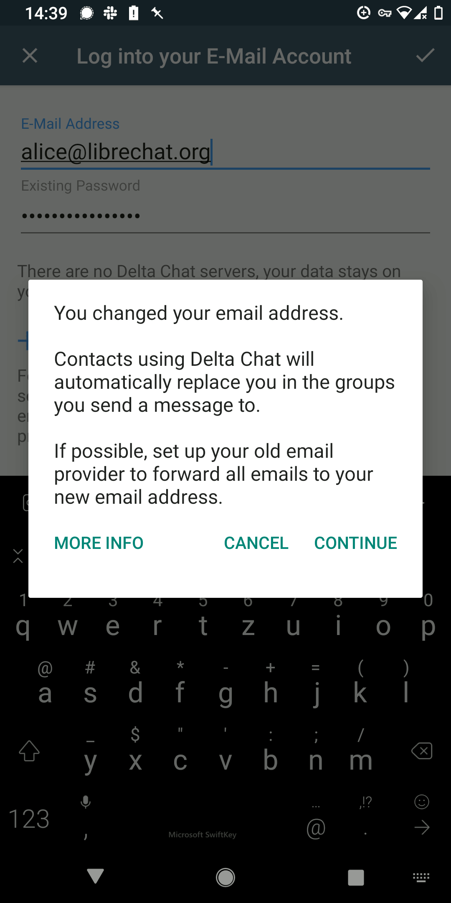
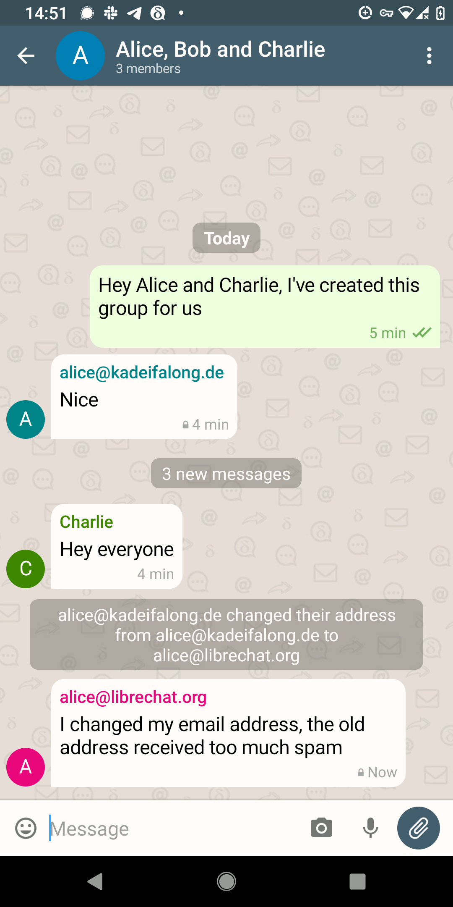

انتشارهای Delta Chat 1.32 سازوکارهای جابه‌جایی ایمیل (AEAP) را معرفی کردند. آن‌ها برای ایمیل همان کاری را ممکن می‌کنند که جابه‌جایی شماره برای ارتباطات موبایل انجام می‌دهد، یعنی تغییر آسان‌تر بین ارائه‌دهنده‌های ارتباطی.

خلاصه — چطور با Delta Chat به ارائه‌دهنده جدید مهاجرت کنید:

- آدرس را در صفحه تنظیمات "Password and Account" در Delta Chat امتحان و تغییر دهید
- ارائه‌دهنده ایمیل قدیمی‌تان را طوری تنظیم کنید که همه ایمیل‌ها را به آدرس ایمیل جدیدتان فوروارد کند
- مثل همیشه به چت ادامه دهید :)

### زیر پوسته چطور کار می‌کند

بلافاصله بعد از تغییر موفق به آدرس ایمیل جدید در صفحه تنظیمات چیزی رخ نمی‌دهد. هیچ فعالیت شبکه‌ای یا ارسال پیامی انجام نمی‌شود. شناسه داخلی و کلیدهای رمزنگاری‌تان همان می‌مانند و تغییر نمی‌کنند[^1]. مخاطبینتان هنوز نمی‌دانند آدرس را عوض کرده‌اید و به فرستادن پیام به آدرس قدیمی‌تان ادامه می‌دهند. به همین دلیل بهتر است **ارائه‌دهنده ایمیل قدیمی‌تان را طوری پیکربندی کنید که همه ایمیل‌ها را فوروارد کند** به آدرس ایمیل جدیدتان. در غیر این صورت پیام‌های فرستاده‌شده به آدرس قدیمی‌تان نمی‌رسند چون Delta Chat بعد از تغییر دیگر سعی نمی‌کند پیام‌ها را از آنجا بازیابی کند. اگر نمی‌دانید چطور فوروارد ایمیل را برای ارائه‌دهنده قدیمی‌تان راه‌اندازی کنید لطفاً در [فروم پشتیبانی](https://support.delta.chat) بپرسید.

اگر پیامی به هر چتی بفرستید، سایر اعضای چت شکایت نمی‌کنند
اگر ببینند از آدرس ایمیل جدیدتان آمده.
ممکن است "~" جلوی آدرستان ببینند و
آن‌وقت همچنان به آدرس ایمیل قدیمی‌تان پاسخ دهند.
به همین دلیل مهم است فوروارد ایمیل را روی ارائه‌دهنده قدیمی‌تان پیکربندی کنید.
با این حال، اگر پیامی به یک «گروه تأییدشده (verified group chat)» بفرستید همه‌چیز روان‌تر است
چون گیرنده‌ها آنجا به‌طور خودکار به آدرس ایمیل جدیدتان به‌روز می‌شوند
و دیگر پیام‌های چت را به آدرس ایمیل قدیمی‌تان نمی‌فرستند!
گروه‌های تأییدشده قابلیتی آزمایشی اما نسبتاً پایدار در Delta Chat هستند.
گروه‌های تأییدشده تیک آبی دارند و اعضا فقط بعد از تأیید
با یک عضو از قبل موجود می‌توانند بپیوندند. برای جزئیات بیشتر [پروتکل‌های COUNTERMITM](https://countermitm.readthedocs.io/en/latest/new.html) را ببینید.

[^1]: برای کسانی که کمی بیشتر درباره PGP می‌دانند: تغییر ندادن کلیدهای شناسایی و رمزنگاری یعنی فیلد UID کلید PGP شما تغییر نمی‌کند و همچنان آدرس قدیمی را دارد. این یک انتخاب طراحی برای ساده‌ماندن است، و ممکن است چون Autocrypt می‌گوید «محتوای بسته user id فقط تزئینی است» (<https://autocrypt.org/level1.html#openpgp-based-key-data>).

### درباره AEAP چه چیزی را می‌خواهیم بهبود دهیم؟

در انتشارهای بعدی امیدواریم بازنویسی آدرس ایمیل برای گروه‌های غیرتأییدشده هم رخ دهد. برای این کار باید [تأیید اصالت عمومی ایمیل را سخت‌تر کنیم](https://github.com/deltachat/deltachat-core-rust/issues/3507) تا AEAP برای همه گروه‌های چت رمزنگاری‌شده (تأییدشده یا نه) فعال شود.

به‌طور کلی با نگه‌دارندگان [mailcow](https://mailcow.email)، یک توزیع محبوب مبتنی بر docker برای ایمیل خودمیزبان، همکاری می‌کنیم. ممکن است راهی برای ثبت «فوروارد ایمیل» اضافه کنیم تا جابه‌جایی از یک نمونه mailcow-server به ارائه‌دهنده دیگر بی‌دردسر باشد و نیاز به گام دستی وابسته به ارائه‌دهنده برای «راه‌اندازی فوروارد ایمیل به آدرس جدیدتان» نباشد. فقط «آدرس ایمیلتان را عوض کنید» کافی باشد و به‌تدریج همه ایمیل‌های (چت) به ارائه‌دهنده جدیدتان سرازیر شوند.

بعد از کسب تجربه بیشتر، ممکن است افزوده‌هایی به [استاندارد رمزنگاری Autocrypt](https://autocrypt.org) پیشنهاد کنیم تا مهاجرت حساب توسط اپ‌های ایمیل غیر از Delta Chat هم ایمن‌تر پیاده‌سازی شود.

## سپاس ویژه از NLNET و کار Next-Generation-Internet آن‌ها

کار روی AEAP بیش از یک سال (گاهی فعال، گاهی متوقف) در جریان بوده و از طریق [بنیاد NLNET](https://nlnet.nl/project/EmailPorting/) تأمین مالی شده که خود توسط کمیسیون اروپا تأمین می‌شود. به‌ویژه از Michiel، Jos و بقیه تیم NLNET NGI برای مدیریت روان مشاوره، گزارش‌دهی و تأمین مالی سپاسگزاریم.
