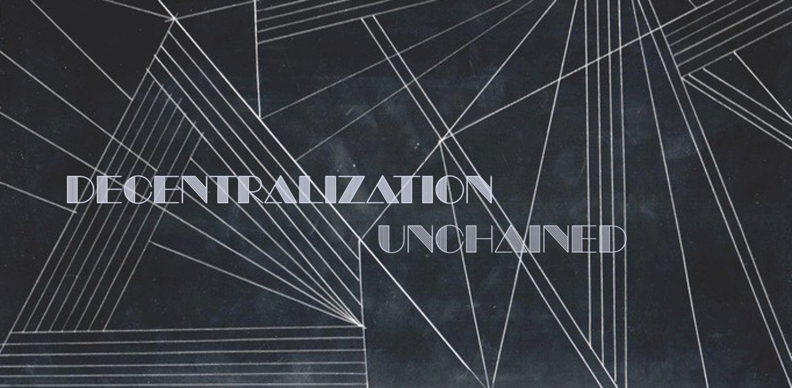
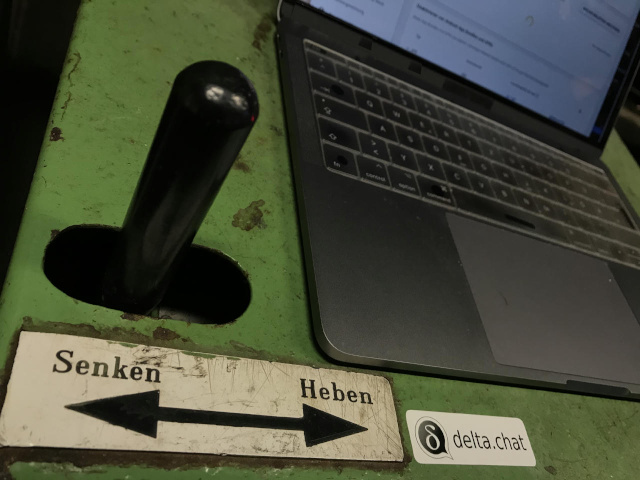
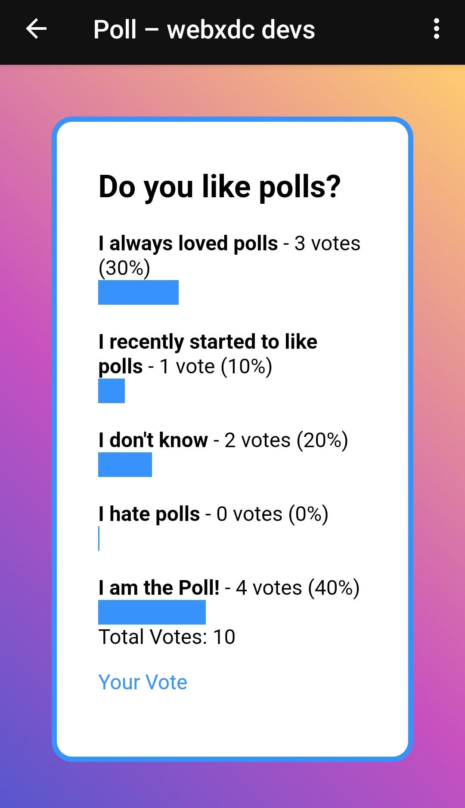
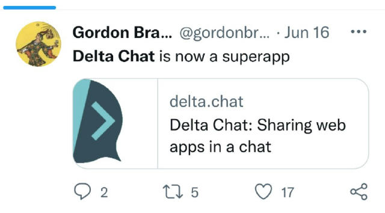
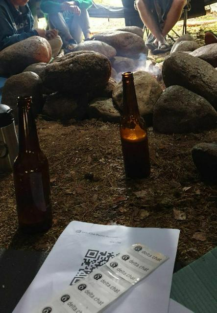
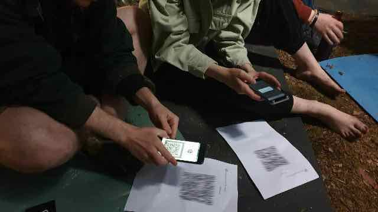
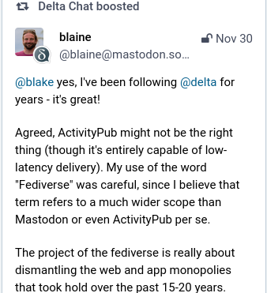
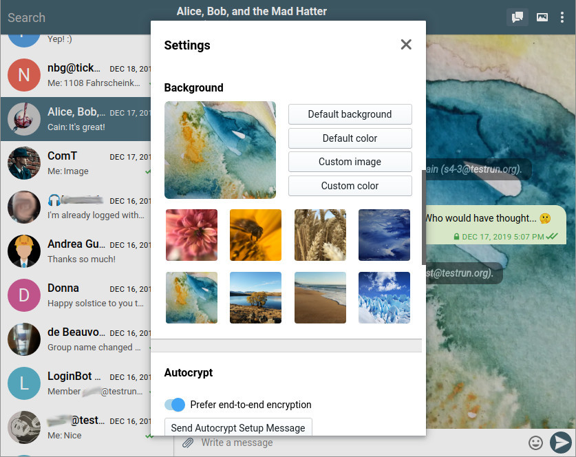
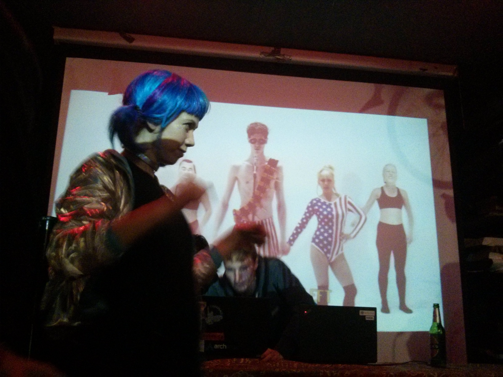
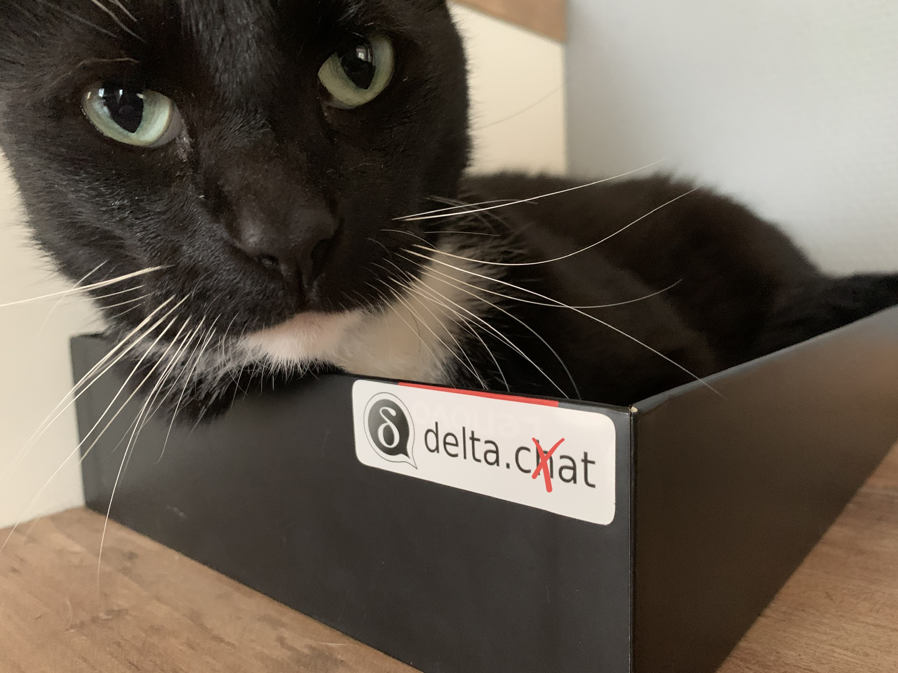

جوامع بومی در جنگل بارانی آمازون، دوستان در کوبا، خانواده‌ها در ایران، فعالان از روسیه، یک صومعه در کامبوج، و بسیاری از افراد در فدیورس چه وجه مشترکی دارند؟

حدس زدید: از Delta Chat استفاده می‌کنند یا به آن علاقه‌مندند چون:

- **انطباق‌پذیر** است: جوامع بومی
  از [روترهای خورشیدی در عمق جنگل بارانی](https://rhizomatica.org) استفاده می‌کنند،
  که چت‌های محلی سریع Wi-Fi و
  ارتباط دوربرد با بیت‌ریت پایین با آدرس‌های چت دورافتاده را ممکن می‌کنند.

- **مقاوم** است: خانواده‌ها و دوستان پراکنده در جهان در تماس می‌مانند،
  حتی وقتی WhatsApp، Signal، VPNها و Tor از کار می‌افتند.

- **حاکمیت دارد**: اعضای یک صومعه، که از نظر اخلاقی از استفاده از حساب‌های «دور» منع شده‌اند،
  سرور ایمیل خودشان را با یک پیام‌رسان چت اجرا می‌کنند که به‌عنوان هدیه می‌پذیرند (FOSS!).

- **قابل‌تعامل** است: می‌توانید با هرکسی چت کنید حتی اگر اپ را نداشته باشد
  (ایمیل!).

### چرا وقت بیشتری صرف تبلیغ نمی‌کنیم؟

از آغازهای Delta Chat در شهری کوچک شمال هامبورگ تقریباً پنج سال پیش،
کم درباره راه‌های شگفت‌انگیز و متنوعی که مردم از اپ‌هایمان استفاده می‌کنند نوشته‌ایم.
معمولاً ترجیح می‌دهیم انتشارهای تکمیل‌شده را به اشتراک بگذاریم به‌جای پیش‌اعلام
یا تلاش برای ساختن هیاهو با لاف زدن درباره کاربران و رشد.
پرهیز از محبوبیت فقط از فروتنی نیست، بلکه از واقع‌گرایی هم هست چون
فقط می‌توانیم به این مقدار بازخورد و پیشنهاد رسیدگی کنیم.
اگر ظرفیتمان پر باشد، درخواست‌های قابلیت و ایده‌ها به فشار و استرس تبدیل می‌شوند.
این پست پیش‌اعلام نیست بلکه سفری است در آنچه اکنون در حال توسعه است،
درباره چگونگی کارمان و درباره پیشنهادهای شغلی برای پیوستن به توسعه‌های UX-محورمان.

### اشتراک‌گذاری اپ‌های وب در یک چت (webxdc)

[اشتراک‌گذاری اپ‌های وب در یک چت (webxdc)](https://webxdc.org) اواسط ۲۰۲۲ منتشر شد.
ده‌ها بازی منتقل‌شده از پایین به بالا حالا هر روز در گروه‌های چت و از طریق mailing list بازی می‌شوند.
اپ‌های ابزار همکاری (نظرسنجی، چک‌لیست، تقویم، ویرایشگر) در حال تکامل‌اند.
برای ساخت و توزیع اپ‌هایتان نیازی به اجازه از ما یا هیچ فروشگاه اپی نیست.
افراد تازه‌کار در برنامه‌نویسی توانستند اپ‌های قابل‌استفاده را از طریق یک فایل zip
حاوی `index.html`، چند asset و JS/Typescript/CSS به سلیقه خود تحویل دهند.
یکی از توسعه‌دهندگان باتجربه‌تر و بازیگوش‌مان اخیراً یک اپ چت سرهم کرد
که داخل یک گروه چت اجرا می‌شود —
وقتی در نظر بگیرید یک اپ وب چت
روی یک mailing list ناشناس‌ساز اجرا شود معنی بیشتری پیدا می‌کند:
ناگهان افراد می‌توانستند روی آن ارتباطات خصوصی زودگذر با رمزنگاری سرتاسری داشته باشند 🤯

اپ نمونه [Poll](https://github.com/webxdc/poll) ما ۶ کیلوبایت است و،
مثل همه اپ‌های webxdc که در چت به اشتراک گذاشته می‌شوند،
این ویژگی‌ها و راحتی‌های UX شگفت‌انگیز را دارد:

- **رمزنگاری سرتاسری**

- **offline-first**،

- **بدون ورود یا صفحه‌های GDPR/رضایت**.

پژوهشگران UX و حریم خصوصی و هکرها از پروژه‌های متنوعی مثل CryptPad، DAT، IPFS،
Peermaps و Libreoffice موافق‌اند:
تکنولوژی وب ترکیب‌شده با چت غیرمتمرکز (معروف به «webxdc») جواهری نادر و ارزش صیقل‌دادن است.

### حرکت‌ها در جنگل و زیرزمین…

با طیف گسترده‌ای از کاربران، توسعه‌دهندگان، شرکا و پروژه‌های همکار
درباره خواسته‌ها و نیازهای زیادی حرف می‌زنیم:
پشتیبانی از واکنش‌های ایموجی، داشتن کانال‌های بزرگ‌تر به سبک تلگرام،
تکامل جوامع به سبک واتساپ،
بهبودهای رمزنگاری، راه‌اندازی بی‌درز چنددستگاهی،
و حتی جام مقدس پیام‌رسانی Peer-to-Peer.
چیز کمی باورنکردنی این است که واقعاً حول چند تا از این موضوعات پیشرفت می‌کنیم.
فقط دوست نداریم زیاد پیش‌اعلام کنیم.
این پست اینجا کمی استثناست که قاعده را ثابت می‌کند 🙂.

توسعه‌های اپ Delta Chat تلاشی usability و UX-محور است و
[پژوهشگران UX و کاربر باتجربه همراه ما هستند](https://delta.chat/en/2020-08-01-ux-final).
ملاحظات امنیتی نقش روزبه‌روز دارند.
با این حال، «امن‌ترین پروتکل» بی‌فایده است اگر کمتر کسی بتواند بفهمد یا از آن استفاده کند.
خود «امنیت قابل‌استفاده» مفهومی گریزان می‌ماند
اگر نتوانیم پیاده‌سازی‌اش را در اپ‌های واقعی تسهیل کنیم.
بین ملاحظات usability، امنیت و پیاده‌سازی
سلسله‌مراتب طبیعی‌ای وجود ندارد: هر کدام دیگران را محدود و تحت‌تأثیر قرار می‌دهد.
در ۲۰۲۳، با همکاری [TeamUSEC](https://teamusec.de/) می‌خواهیم
آزمایش‌های کاربری و میدانی نظام‌مند حول موضوعات امنیتی انجام دهیم،
تا حدی در ادامه مطالعه اغلب نقل‌قول‌شده امنیت قابل‌استفاده ["When Signal hits the fan"](https://dx.doi.org/10.14722/eurousec.2016.23012).

### اهمیت آزمایش را هرگز دست‌کم نگیرید

خوشبختانه، جامعه آزمایش فوق‌العاده‌ای داریم با مشارکت‌کنندگان کلیدی
که مسائل را با کاربران مرتب می‌کنند و با توسعه‌دهندگان بحث می‌کنند.
یکی از اتریش مدام درباره مشکلات خاص اتصال به ما یادآوری می‌کرد
حتی اگر به‌ندرت رخ دهند و بازتولیدشان سخت باشد:
مسائل هفته گذشته رفع شدند، که مقاومت را برای همه افزایش داد.
می‌دانستید بیشتر قابلیت‌های Delta Chat اول روی یک جزیره کارائیب آزمایش می‌شوند؟
بعضی‌ها اصلاً در اپ DeltaLab توسعه یافتند:
یک فورک دوستانه از Delta Chat اندروید که فقط در فروشگاه اپ کوبا در دسترس است.

### راه‌هایی بیرون و دور از مشکل وحشتناک onboarding

استفاده از حساب ایمیل از قبل موجود یکی از قابلیت‌های اصلی Delta Chat است، اما همچنین
برای بسیاری هنگام شروع با Delta Chat مانع است.
دادن آدرس ایمیل و رمز عبور برای موفقیت سریع autoconfiguration کافی است،
اما بدون مشکل نیست و هرچند ارائه‌دهنده‌های ایمیل زیادی با
Delta Chat کار می‌کنند، چندتایی محدودیت‌ها و پیچیدگی‌های غیرضروری دارند.
در حال آزمایش ثبت‌نام با یک کلیک یا مبتنی بر کد QR هستیم که
به‌سرعت یک حساب ایمیل کارآمد راه‌اندازی و با Delta Chat پیکربندی می‌کند.
یک sysadmin تازه‌پیوسته در یک ساعت سرور جدیدی راه انداخت و
چند دوست را onboard کرد، که حالا همه با خوشحالی از Delta Chat استفاده می‌کنند.

چندین تلاش مداوم برای راه‌اندازی آنچه Automatic Accounts می‌نامیم داریم:
هر کاربر Delta Chat روی هر پلتفرمی می‌تواند حساب یک‌کلیکی
با تجربه پایه چت بهینه‌شده انتخاب کند.
با ساده‌کردن مهاجرت به سایر ارائه‌دهنده‌های ایمیل از پویایی‌های پلتفرم متمرکز دوری می‌کنیم:
آزادی فقط وقتی پیش می‌آید که خروج بدون مجازات ممکن باشد (و جایی برای رفتن باشد).
وقتی پیشنهاد Automatic Account آینده‌مان به محدودیت‌هایش برسد،
باید مهاجرت کنید، و Automatic Accounts هدف طراحی‌شان این است که این کار را آسان کنند.

### مهاجرت‌های پیش رو

از مهاجرت که حرف شد، در فدیورس بیش از توییتر دنبال‌کننده داریم
و گفتگوهای جالبی در فدیورس در حال شکل‌گیری است.
آیا آدرس‌های ایمیل و آدرس‌های فدیورس به‌طرز عجیبی شبیه هم نیستند؟
آیا سرورهای ایمیل و سرورهای ActivityPub هر دو فدریت نیستند؟
آیا ActivityPub و پروتکل‌های ایمیل فرهنگ
تنوع بازیکنان و پیاده‌سازی‌های واقعی مختلف را مشترک ندارند؟
آیا رسانه اجتماعی فدریت با چت رمزنگاری‌شده سرتاسری درست پیچش قشنگی نمی‌بود؟
چه می‌شد اگر می‌توانستید با اسکن کد QR از Delta Chat به یک نمونه فدیورس وارد شوید،
و بعد تجربه یکپارچه وب/پیام‌رسانی داشته باشید؟
بافت‌های اکولوژیک و اجتماعی در حال تغییرند و مهاجرت‌های از روی نیاز یا انتخاب نیاز به حمایت دارند،
نه موانع جدید و باغ‌های دیوارکشی‌شده.

### معماری Rust-core ما (tm) و bindingهای UI آن…

Delta Chat اولین اپ چت کاملاً مبتنی بر Rust بود که
روی همه پلتفرم‌ها در دسترس بود، و شاید هنوز تنها باشد.
Rust یک زبان سطح‌سیستم memory-safe است،
که عمدتاً به‌خاطر ایمنی و کارایی‌اش ستایش می‌شود،
و به دو دهه دیدگاه محبوب که
ماشین‌های مجازی را جام مقدس تکنولوژی زبان‌های برنامه‌نویسی می‌دانست پایان می‌دهد.
Rust همکاری در مقیاس بزرگ بین توسعه‌دهندگان
روی طیف گسترده‌ای از پلتفرم‌ها بدون سربار runtime را ممکن می‌کند.
C و C++ هرگز نمی‌توانستند این را در مقیاس مشابه تحویل دهند،
هرچند زیربنایی برای وضعیت امروز چیزها بوده‌اند و هستند.
Core رستی ما همه شبکه‌سازی، پردازش پیام، رمزنگاری،
پایداری چت و مخاطب را پیاده‌سازی می‌کند و یک API مستند UX-محور برای UIها و ربات‌ها ارائه می‌دهد.
Core تحت مجوز MPL است و بنابراین آزادتر است
از توسعه‌های رابط کاربری‌مان که عمدتاً تحت GPL مجوز دارند.

اپ‌ها و ربات‌هایمان از bindingهای Rust-core برای Java، Swift، TypeScript و Python استفاده می‌کنند.
در حالی که اپ‌های موبایل از CFFI (C-Foreign-Function-Interface) طولانی‌تکامل‌یافته استفاده می‌کنند،
اپ دسکتاپ JSON-RPC (JSON Remote-Procedure-Calls) را معرفی می‌کند،
که مستقیم با core حرف می‌زند بدون لایه C.
Bindingهای ناهمزمان جدید پایتون که همه CFFI را کنار می‌گذارند این هفته شروع شدند
با اولین ربات‌هایی که به آن پورت می‌شوند.

برای mailing listها، SuperGroupها، Mastodon، اسکرین‌شات‌ها، دانلود و سایر آزمایش‌های سرگرم‌کننده،
ربات‌های مبتنی بر Rust-core هم برای سرگرمی و هم برای زمینه‌های عملی مستقر می‌شوند.
اما این پست همین حالا هم به‌قدر کافی طولانی و پیچ‌درپیچ شده پس درباره ربات‌های منتشرشده وقت دیگری…

### به‌دنبال توسعه‌دهندگان باتجربه React/Web، Java/Android و Swift/iOS هستیم

[اپ دسکتاپ](https://github.com/deltachat/deltachat-desktop) ما از تکنولوژی وب (React، TypeScript) استفاده می‌کند، فعلاً از طریق
Electron، اما شاید روزی از طریق Tauri تا نیازی به همراه کردن مرورگر کامل با اپ نباشد.
اپ دسکتاپ به‌طور منظم منتشر و
به کانال‌های توزیع ویندوز، MacOS و لینوکس فرستاده می‌شود.
چیزهای زیادی برای بهبود در یکپارچگی پلتفرم،
رفع باگ و ایجاد تعاملات UI/UX جدید یا تصفیه‌شده هست.

[اپ اندروید](https://github.com/deltachat/deltachat-android) ما فورک ۲۰۱۹ از اپ Java سیگنال است،
در بعضی حوزه‌ها واگرا شده چون خودمان را
حول رابط‌های تلگرام و واتساپ جهت‌دهی می‌کنیم.
اپ اندروید «پرچم‌دار»مان باقی می‌ماند که در فروشگاه‌های مختلف در دسترس است،
از جمله Google Play و F-Droid.
[اپ iOS](https://github.com/deltachat/deltachat-ios) ما توسعه خودمان با UIKit و bindingهای Swift به core است.
جوان‌ترین خواهر در پیشنهادهایمان است و به عشق بیشتری هم نیاز دارد.

### چه پیشنهاد می‌کنیم و چطور (کار نمی‌کنیم)

برای توسعه دسکتاپ و موبایل قراردادهای ۸۰–۱۲۰ ساعت در ماه پیشنهاد می‌کنیم.
پرداخت بد نیست، اما قطعاً آنچه بعضی نهادهای شرکتی می‌پردازند نیست.
بیشتر درباره [منابع تأمین مالی‌مان اینجا بخوانید](https://delta.chat/en/help#how-are-delta-chat-developments-funded).
خوشحال می‌شویم درباره ترتیبات و انطباق‌های موقعیتی حرف بزنیم.
مشارکت و همکاری عمدتاً از راه دور است
اما چند نفری از ما معمولاً هر چند ماه یک‌بار
در فرایبورگ (جنگل سیاه)، جای دیگر در آلمان (برلین، هامبورگ، لایپزیگ…)،
و گاهی در مکان‌های دورافتاده‌تر مثل کی‌یف یا هاوانا همدیگر را می‌بینیم.
معمولاً افراد پروژه‌های جالب یا دوست را دعوت می‌کنیم و با آن‌ها گفتگو می‌کنیم،
هم‌مکانی در فضاهای تمرکززدایی، آزادی اینترنت و fusion queer.

چند نفری از ما از پرواز پرهیز می‌کنند، و بعضی در Friday-for-Futures یا فعالیت‌های مجاور درگیرند.
اگر جایی دورافتاده جمع شویم معمولاً برای هفته‌هاست نه روزها،
و بدون جستجوی زیاد برای تبلیغات.
سعی می‌کنیم از مشغله و فوریت دائمی پرهیز کنیم چون از همکاری لذت‌بخش جلوگیری می‌کند.
هدفمان این است که خودمان را [همدلانه](https://delta.chat/en/community-standards) سامان دهیم
و برنامه‌ریزی تاریخ و زمان ساعت را به حداقل برسانیم.

فعلاً حدود دوازده committer هفتگی به مخازنمان داریم،
که کمی بیش از نیمی یا از طریق قرارداد اشتغال (اگر در آلمان) یا freelancing (اگر بین‌المللی)
بودجه می‌گیرند.
ده‌تایی دیگر از افراد و نگه‌دارندگان پروژه‌های دیگر
در بحث‌های پس‌زمینه و جلسات هک حول «بعد چه کار جالبی بکنیم، شاید با هم» درگیرند.
با افرادی روی چند قاره کار می‌کنیم، بعضی در تبعید،
بعضی مهاجران از روی انتخاب، بعضی در محیط‌های پایدارتر و غنی‌تر از منابع.

### کمک کنید UX و UI را برای همه بیشتر بهبود دهیم

اگر علاقه‌مندید با توسعه‌های زیبای فرانت‌اند به ما و کاربرانمان کمک کنید،
لطفاً از طریق ایمیل به delta@merlinux.eu با پیشینه‌ای از پروژه‌ها یا اپ‌های قبلی‌تان تماس بگیرید.
CV لازم نیست اما اگر دم دست دارید خوش‌آمد است.
اگر تناسب پایه را تشخیص دهیم، معمولاً یک ماه دوره آزمایشی پرداخت‌شده برای هر دو طرف ترتیب می‌دهیم.
یک گروه onboarding برایتان سازمان می‌دهیم و در اولین issueها و افراد درگیر راهنمایی‌تان می‌کنیم.

خودتان نمی‌توانید شغلی در نظر بگیرید اما کسی را می‌شناسید که ممکن است علاقه‌مند باشد؟
قدردان می‌شویم اگر این پست را به هر کانالی که مناسب می‌دانید فوروارد کنید.
ممنون از خواندن و کمک!

