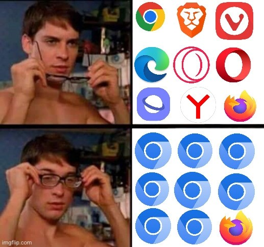

["اپ‌های وب به اشتراک‌گذاشته‌شده در چت"](https://delta.chat/en/2022-06-14-webxdcintro) دلتا چت
با وعده حریم خصوصی منحصربه‌فرد می‌آیند اما در ژانویه نشان داده شد که به خطر افتاده.
وارد مبارزه غافلگیرانه‌ای با مسائل sandboxing مرورگر وب شدیم
که چند ماه طول کشید تا از آن جلو بیفتیم.

این پست داستان پس‌زمینه این مبارزه را ارائه می‌دهد که به
سری انتشار امن‌شده Delta Chat 1.36 در آوریل ۲۰۲۳ منجر شد.

## وعده حریم خصوصی منحصربه‌فرد اپ‌های وب بدون ردیابی یا پلتفرم


برخلاف تلگرام با ربات‌هایش یا WeChat با MiniAppهایش،
Delta Chat به هرکسی اجازه می‌دهد اپ‌های وب بسازد و در چت به اشتراک بگذارد
در حالی که **قوی‌ترین وعده حریم خصوصی صنعت** را حفظ می‌کند:
توسعه‌دهندگان یا توزیع‌کنندگان اپ وب نمی‌توانند شما را ردیابی یا کنترل کنند
چون اپ‌های وب در sandbox مرورگر بدون دسترسی به اینترنت اجرا می‌شوند
و فقط می‌توانند با انتقال از طریق
[کتابخانه core رستی حسابرسی‌شده امنیتی](https://delta.chat/en/2023-03-27-third-independent-security-audit) ما
با سایر نمونه‌های اپ پیام رد و بدل کنند.
Delta Chat مرورگرها را کاملاً از انجام هر درخواست شبکه‌ای توسط خودشان منع می‌کند.

اجرای این وعده حریم خصوصی به توانایی ما برای اجرای ایمن
کد وب در یک *webview ایزوله‌شده از شبکه* بستگی دارد تا
از ایجاد ترافیک شبکه ناخواسته جلوگیری کند.
به‌طور کلی از APIهای استاندارد مرورگر و دستورات `Content-Security-Policy` استفاده می‌کنیم تا
کد وب را از دسترسی ناخواسته به شبکه منع کنیم، طوری که:

- لینک‌های خارجی کار نکنند (`href` و غیره).
- `XMLHttpRequest()` و متدهای مرتبط کار نکنند.
- دسترسی به کد یا HTML جاسازی‌نشده از طریق `src=...` و غیره ممکن نباشد.

اواسط ۲۰۲۲ یک [اپ آزمایشی webxdc](https://github.com/webxdc/webxdc-test) ساختیم
تا این ضمانت‌ها را تأیید کنیم و روی بسیاری از دستگاه‌ها آزمایش کردیم تا
مطمئن شویم می‌توانیم webview ایزوله برای کاربران اجرا کنیم.

یا این‌طور فکر می‌کردیم.

## WebRTC sandbox را می‌شکند و رفعش سخت است

در ژانویه ۲۰۲۳، یک مشارکت‌کننده جدید، [WofWca](https://github.com/WofWca)،
کشف کرد که اشیای `RTCPeerConnection`
با گزینه‌های شناخته‌شده ایزولاسیون شبکه برای webviewها
یا Content-Security-Policyهایی که سعی می‌کنند بخش‌هایی از صفحات وب را ایزوله کنند محدود نمی‌شوند.
اشیای `RTCPeerConnection` هسته برنامه‌نویسی پروتکل‌های WebRTC هستند
که ارتباطات P2P برای انتقال ویدئو یا داده را ممکن می‌کنند.

وعده حریم خصوصی ما شکسته شد و یک exploit نمونه آن را نمایش داد.


یک گروه کاری "DISABLE-WEBRTC" از تیممان و متخصصان دوست تشکیل دادیم
تا به‌طور تکراری کاهش‌ها را برای اجبار ایزولاسیون شبکه webviewها پیاده‌سازی و توسعه دهیم،
هم برای Chromium و هم برای Webkit/iOS.
حتی همه مشارکت‌کنندگان Delta Chat از کار عظیم
که پشت صحنه جریان داشت و فقط در PRهای مختلف
در مخازن عمومی ظاهر می‌شد خبر نداشتند.


## FILL500: غیرفعال‌کردن WebRTC روی Chromium

بعد از روزها خواندن کد منبع Chromium، امتحان و آزمایش،
با این قطعه کوچک آمدیم که باید قبل از شروع اپ‌های وب اجرا شود:

```javascript
// FILL500: Disable WebRTC on Chromium
for (let i = 0; i < 500; i++) {
    new RTCPeerConnection()
}
```

این خطای کپی-پیست نیست بلکه رفع واقعی است.
حالا توضیح می‌دهیم _چرا_ کار می‌کند:

- از ۲۰۱۹، Chromium [محدودیت hard-coded](https://github.com/chromium/chromium/blob/c9060dc81d2a40733b627a4f5215ff237a64c691/third_party/blink/renderer/modules/peerconnection/rtc_peer_connection.cc#L155-L156)
  ۵۰۰ *instantiation* از `RTCPeerConnection` در هر process دارد.
  شمارنده مربوطه هنگام انجام اتصالات شبکه افزایش نمی‌یابد بلکه
  به‌طور unconditional در constructor افزایش می‌یابد جایی که هیچ اتصال شبکه‌ای رخ نمی‌دهد.
  اگر ۵۰۱مین instantiation را امتحان کنید به‌طور پایدار شکست می‌خورد.

- ما `.close()` را روی `RTCPeerConnection`ها نمی‌زنیم پس
  garbage-collect نمی‌شوند (ببینید [این debug assertion](https://github.com/chromium/chromium/blob/c9060dc81d2a40733b627a4f5215ff237a64c691/third_party/blink/renderer/modules/peerconnection/rtc_peer_connection.cc#L661))،
  پس شمارنده تا وقتی صفحه باز است هرگز کم نمی‌شود.

- راهی برای کد کاربر نیست که به اشیای `RTCPeerConnection` «رهاشده» برسد
  اما آن‌ها هم garbage-collect نمی‌شوند.
  تقریباً بی‌فایده‌اند که دقیقاً هدف همین است.

هنوز مراقبت ویژه‌ای لازم بود که نه navigation و نه ساخت iframe
بتوانند استخر جدیدی از `RTCPeerConnection`ها بسازند.

جزئیات آن را رد می‌کنیم اما شامل امتحان variantهای مختلف Chromium
و پیدا کردن غافلگیری‌های بیشتری بود که نیاز به کاهش‌ها یا کنترل‌های اصلاح‌شده داشت
تا اپ‌ها از گرفتن استخر جدید `RTCPeerConnection` منع شوند.
توجه کنید که FILL500 گاهی تأخیر ۳–۵ ثانیه‌ای برای شروع اپ‌های وب روی گوشی‌های قدیمی ایجاد می‌کند. قشنگ نیست اما وعده حریم خصوصی‌مان را بنیادی‌تر می‌دانیم. متخصصان وب و Chromium از پروژه‌ها و گروه‌های مختلف نتوانستند FILL500 را بهبود دهند.

اگر کسی رفع بهتری برای جلوگیری از `RTCPeerConnection`ها دارد، لطفاً جلو بیاید. این پست وبلاگ مثل همه قدیمی‌ترها می‌تواند در فدیورس کامنت بگیرد، پایین پست را ببینید.


## غیرفعال‌کردن WebRTC در فوریه روی همه پلتفرم‌ها کار کرد اما ...

FILL500 [روی اندروید](https://github.com/deltachat/deltachat-android/blob/605008074ec122b196e65e86e7c6c9ae9789d068/res/raw/webxdc_wrapper.html#L63-L65) و [دسکتاپ مبتنی بر Electron](https://github.com/deltachat/deltachat-desktop/blob/4e40c4304b2e41ede7ec896f9ce28fd7552fbf1f/static/webxdc-preload.js#L91-L104) استفاده می‌شود. برای webkit/iOS (مورد استفاده Safari)، کاهش‌های DISABLE-WEBRTC [متفاوت کار می‌کنند](https://github.com/deltachat/deltachat-ios/blob/59ce95cf7e02e3c4799aea2ca1bfed1087506928/deltachat-ios/Controller/WebxdcViewController.swift#L135-L144): شیء `RTCPeerConnection` از namespaceهای JavaScript حذف می‌شود طوری که اپ‌های وب اصلاً نمی‌توانند به اشیای `RTCPeerConnection` ارجاع بگیرند. کاهش فقط چند خط کد هنگام ساخت web view بود.

اوایل فوریه ۲۰۲۳ اپ‌های Delta Chat روی همه پلتفرم‌ها
با کاهش‌های DISABLE-WEBRTC منتشر شدند.

در این میان [OpenTechFund](https://www.opentech.fund/) با سپاس پذیرفته بود
[Cure53](https://cure53.de) را قرارداد ببندد
تا حسابرسی امنیتی کامل از کاهش‌هایمان
و وعده‌های امنیتی و حریم خصوصی webxdc به‌طور کلی انجام دهد.
هیچ سازشی علیه کاهش‌های Disable-WebRTC ما پیدا نشد
اما متأسفانه پایان داستانی که از قبل خسته‌کننده بود نبود ...


## DNS-prefetching exploit دیگری را مشخص می‌کند


حسابرسان امنیتی Cure53 مسئله دیگری پیدا کردند
که ما را به تخته طراحی و کلی خارانیدن سر برگرداند:
Chromium «DNS-prefetching» انجام می‌دهد که هدفش سرعت‌بخشیدن به تجربه مرور
برای کاربران با انجام پرس‌وجوهای شبکه DNS قبل از کلیک کاربر روی هر لینک
یا درخواست صفحه برای یک منبع است.
حسابرسان دو exploit برای دسکتاپ و اندروید به‌ترتیب ارائه دادند
که می‌توانستند داده را از اپ‌های وب از طریق ویژگی DNS-prefetch کرومیوم خارج کنند.
متأسفانه، پیشنهاد رسمی برای
[غیرفعال‌کردن DNS-prefetch روی Chromium](https://www.chromium.org/developers/design-documents/dns-prefetching/#dns-prefetch-control) کار نمی‌کند. در کد منبع Chromium پیدا کردیم
[تست‌هایی که تنظیمات dns-prefetch "off" می‌توانند دستی override شوند](https://source.chromium.org/chromium/chromium/src/+/main:third_party/blink/web_tests/http/tests/misc/dns-prefetch-control.html;l=51?q=dns-prefetch).

برای کوتاه کردن داستان طولانی دیگر، کاهش‌های کارآمد پیدا کردیم (بخش بعدی را ببینید)
تا اپ‌های webxdc دیگر نتوانند از طریق DNS-prefetch داده نشت دهند.


## رسیدگی به چهارمین حسابرسی امنیتی برای اجرای ایمن اپ‌های وب


[حسابرسی امنیتی Cure53 درباره اپ‌های webxdc](https://public.opentech.fund/documents/XDC-01-report_2_1.pdf)
پنج مسئله «بالا» و دو مسئله «info» در انتشارهای فوریه ما شناسایی کرد.
اینجا خلاصه‌ای از مسائل و لینک به رفع‌هایمان ارائه می‌دهیم:

- (بالا) XDC-01: خارج‌سازی داده از طریق DNS-prefetch روی دسکتاپ:
  [Deltachat-desktop #3179 اکنون عموماً درخواست‌های DNS را مسدود می‌کند](https://github.com/deltachat/deltachat-desktop/pull/3179)
  در process رندر Electron،
  فقط درخواست‌های `*.mapbox.com` را اجازه می‌دهد (لازم برای
  پخش موقعیت مکانی آزمایشی opt-in). همراه با رفع‌های DISABLE-WEBRTC
  این یک اپ Electron دسکتاپ Delta Chat سخت‌شده می‌سازد
  چون هیچ کد رندر JavaScript نمی‌تواند شبکه‌سازی انجام دهد یا ایجاد کند
  جز از طریق کتابخانه core Delta Chat پیاده‌سازی‌شده با Rust ما.

- (بالا) XDC-02: دور زدن کامل CSP برای `webxdc.js` روی دسکتاپ:
  با [deltachat-desktop #3157](https://github.com/deltachat/deltachat-desktop/pull/3157) رفع شد
  (فایل `webxdc.ts` را ببینید).

- (بالا) XDC-03: خارج‌سازی داده از طریق DNS Lookup روی اندروید:
  این تا حد زیادی سخت‌ترین مسئله بود به‌خاطر تنوع
  نسخه‌های Chromium روی گوشی‌های اندروید و مشکلات بازتولید قابل‌اطمینان.
  توانستیم مشکل را روی همه دستگاه‌هایی که exploit XDC-03 قبلاً کار می‌کرد
  از طریق این رفع‌ها درست کنیم:
  [deltachat-android #2539](https://github.com/deltachat/deltachat-android/pull/2539)
  [deltachat-android #2540](https://github.com/deltachat/deltachat-android/pull/2540)
  [deltachat-core #4339](https://github.com/deltachat/deltachat-core-rust/pull/4339)

- (بالا) XDC-04: خارج‌سازی داده از طریق dev-tools:
  [با commit #649fe در deltachat-desktop رفع شد](https://github.com/deltachat/deltachat-desktop/commit/a9e5242acb2dfad132acc3dbbdacf89fb2a649fe). حالا dev tools فقط اگر تنظیم آزمایشی "Enable webxdc devtools" فعال باشد باز می‌شوند.

- (بالا) XDC-05: دور زدن کامل CSP برای PDF embed روی دسکتاپ:
  در [commit #63577c در deltachat-desktop](https://github.com/deltachat/deltachat-desktop/commit/e874c8bdb98321c12d2d972106b0143e7f63577c) رفع شد. هنگام تلاش برای بارگذاری فایل pdf در iframe، PDF حالا به‌صورت متن نمایش داده می‌شود.

- (info) XDC-06: Recommendation قابل‌جعل برای `selfAddr` در payload:
  این مسئله اجازه خارج‌سازی داده نمی‌دهد اما به کاربران مخرب
  اجازه می‌دهد اپ‌ها را از کار بیندازند یا کاربران را اشتباه شناسایی کنند.
  قرار است APIی webxdc را تکامل دهیم تا از این مسئله دوری کنیم.

- (info) XDC-07: نبود هدر CSP برای `webxdc-update.json`:
  در [deltachat-ios #1839](https://github.com/deltachat/deltachat-ios/pull/1839) رفع شد.

**همه مسائل شدت بالا با سری انتشار 1.36 رفع شده‌اند**
که از آوریل در فروشگاه‌های اپ و صفحه وب ما منتشر شده.


## درس‌های sandboxing بهتر مرورگر

کمی ساده‌لوحانه فکر می‌کردیم مرورگرهای وب و به‌ویژه sandboxهای Chromium
اجازه کنترل دسترسی شبکه روی web viewها را می‌دهند.
از طرف دیگر، با مرورگرهای وب و مدل‌های sandboxingشان که برای کلی
فعالیت تجاری و پرداخت استفاده می‌شوند، با تُن‌ها کد شخص ثالث که روی مرورگرهای کاربران اجرا می‌شود،
انتظار نداشتیم کنترل رفتار شبکه کد وب این‌قدر سخت باشد.

### مرورگرها: لطفاً دستور W3C "WEBRTC: block" را پیاده‌سازی کنید


پلتفرم‌هایی که صفحات یا اپ‌های وب سرو می‌کنند باید به کل
زنجیره تأمین وابستگی‌های JavaScript اعتماد کنند اگر نمی‌خواهند
کاربران پیشنهادهایشان از طریق WebRTC داده اپ نشت دهند.
مهم‌تر از همه، **Content-Security-Policyها فعلاً از نشت جلوگیری نمی‌کنند.**
مسئله در واقع دیرینه است، [مسئله WebRTC can be used for exfiltration از ۲۰۱۶](https://github.com/w3c/webappsec-csp/issues/92) را ببینید.

در ۲۰۲۲ W3C بالاخره روش مستقیمی برای غیرفعال‌کردن WebRTC از طریق [تنظیم WebRTC: Block CSP](https://www.w3.org/TR/CSP3/#directive-webrtc) پذیرفت اما هنوز توسط مرورگرها پیاده نشده.
WebRTC CSP به webxdc و برنامه‌ها و پلتفرم‌های web2 راه خیلی سالم‌تری
برای کنترل مرورگرها می‌دهد و برای Chromium به‌خصوص از شر هک FILL500 خلاص می‌شود.
سپاس فراوان از [ZenHack](https://github.com/zenhack) که پافشاری کرد
تا این دستور CSP جدید را بنشاند و حتی از تلاش بوروکراتیک
ثبت به‌عنوان مشارکت‌کننده مشخصات W3C برای نشاندنش گذشت.

### یادآوری: کاربران VPN ممکن است آدرس IP را از طریق WebRTC نشت دهند

همچنین مسئله شناخته‌شده‌ای هنگام استفاده از VPN است که WebRTC می‌تواند نشت آدرس IP محلی ایجاد کند.
یک [جستجو در DuckDuckGo](https://duckduckgo.com/?t=ffab&q=webrtc+vpn+&atb=v65-1&ia=web)
بسیاری از پست‌های وبلاگ قدیمی و اخیر و صفحات ارائه‌دهنده VPN را نشان می‌دهد که درباره کاهش مسئله راهنمایی می‌کنند.
با این حال، دو مجموعه گروه متخصص راهی برای غیرفعال‌کردن WebRTC روی Chromium
غیر از الگوریتم هکی FILL500 بالا پیدا نکرده‌اند و
از هیچ روش سطح‌مرورگر دیگری برای غیرفعال‌کردن قابل‌اطمینان WebRTC روی Chromium آگاه نیستیم.
بعضی راه‌اندازی‌های VPN ممکن است در جلوگیری از اتصالات WebRTC
در سطح شبکه موفق شوند اما خودتان باید با ارائه‌دهنده‌های VPNتان بپرسید.
**فکر می‌کنیم مرورگرها باید بازی‌شان را بالا ببرند و به کاربران اجازه دهند برای استفاده از WebRTC
مشابه مجوزهای دوربین/میکروفون رضایت دهند.**

اگر به استفاده از VPN وابسته هستید فعلاً شاید ایمن‌تر باشد از موتورهای مبتنی بر Firefox
(Tor هم مبتنی بر firefox است) استفاده کنید و مطمئن شوید WebRTC غیرفعال است (پایین را ببینید)
چون در غیر این صورت ممکن است آدرس IP واقعی‌تان را به وب‌سایت‌های مخربی نشت دهید
که سعی می‌کنند کاربران VPN را شناسایی کنند.


### شاید استفاده از موتورهای Firefox کمکمان کند؟



اپ‌های Delta Chat از webviewهای Firefox استفاده نمی‌کنند که می‌توانند مستقیم پیکربندی شوند
تا WebRTC را با تنظیم `media.peerconnection.enabled = false` در `about:config` غیرفعال کنند.
Firefox می‌تواند DNS-prefetching کند اما باز هم خوشبختانه به‌نظر می‌رسد
[پیکربندی‌های ساده‌ای برای غیرفعالش وجود دارد](https://support.mozilla.org/en-US/kb/how-stop-firefox-making-automatic-connections).
با این حال، اپ دسکتاپ Delta Chat از Electron استفاده می‌کند که به‌نوبه خود از Chromium استفاده می‌کند
و روی دستگاه‌های اندروید webview سیستم معمولاً یک webview Chromium است.
بررسی کردیم آیا می‌توانیم از GeckoView استفاده کنیم و آزمایش‌های اولیه تأیید می‌کنند
که مسئله WebRTC را حل می‌کند.
اما همراه کردن GeckoView داخل Delta Chat الف) هنوز کلی کار است ب)
اندازه APK را به‌طرز چشمگیری افزایش می‌دهد. با این حال به‌ویژه اگر Chromium
دستور "WebRTC: Block" را زمانی پیاده نکند آن را در نظر داریم.


### ترکیب موتور Servo رستی با core رستی Delta Chat؟


مثل بسیاری از توسعه‌دهندگان دیگر که منتقد سلطه گوگل بر مرورگرها هستند
از این‌که موزیلا تیم [Servo](https://servo.org/) خود را رها کرد ناراحت شدیم.
اما اخیراً [Servo دوباره جان می‌گیرد](https://servo.org/blog/2023/02/03/servo-2023-roadmap/)
و [Igalia می‌خواهد به احیای Servo کمک کند](https://people.igalia.com/mrego/servo/igalia-servo-tsc-2022/).
شاید زمانی یکپارچه‌سازی Servo ممکن شود؟

قطعاً، [اپ‌های webxdc](https://webxdc.org) قابلیتی جوان‌اند
که می‌خواهیم در ۲۰۲۳ بیشتر تکامل دهیم، واقعیت‌هایی را کاوش و خلق کنیم
که در آن‌ها تکنولوژی باز وب با پیام‌رسانی E2E یکپارچه می‌شود به‌جای
پلتفرم‌های متمرکز امروزی. لطفاً [صفحه donate](https://delta.chat/en/donate) ما را ببینید
اگر می‌توانید حمایت کنید یا می‌خواهید درگیر شوید. ممنون!
