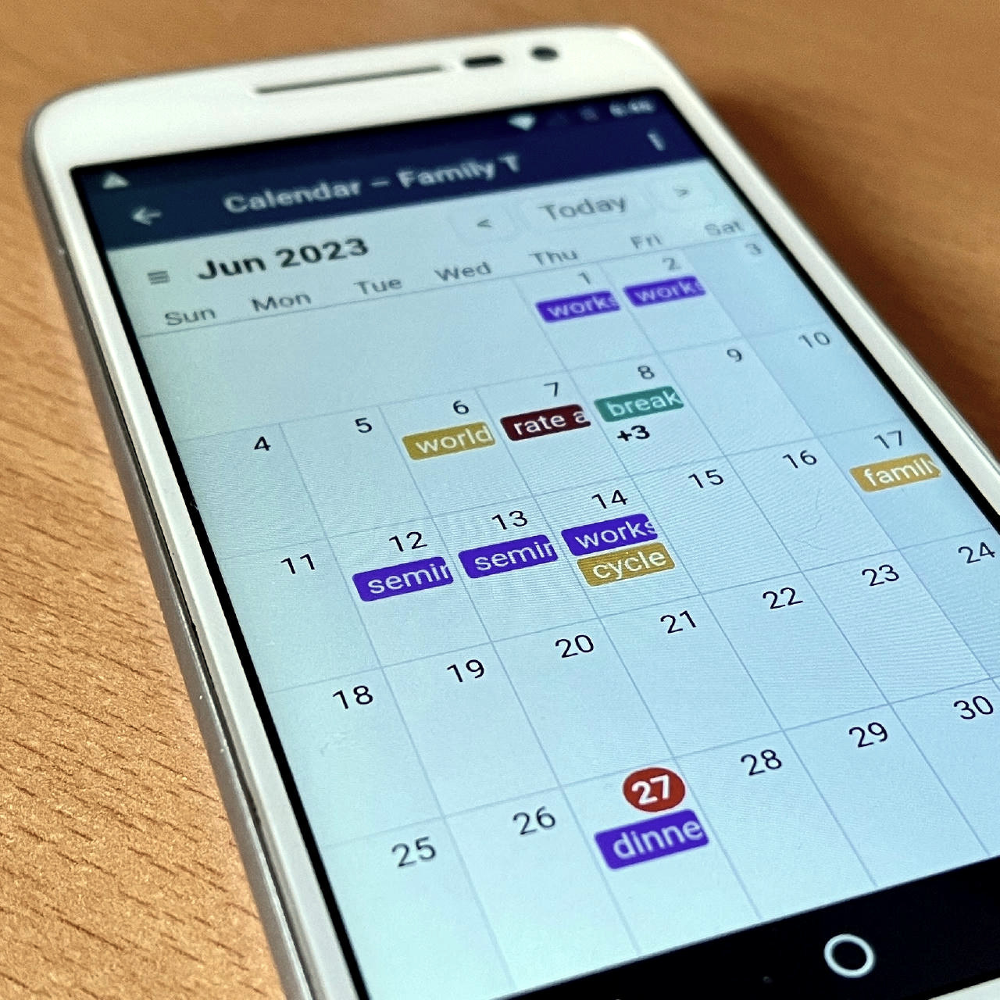
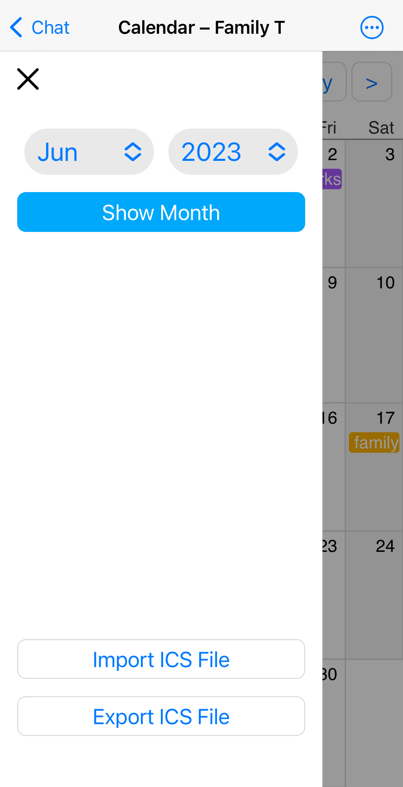
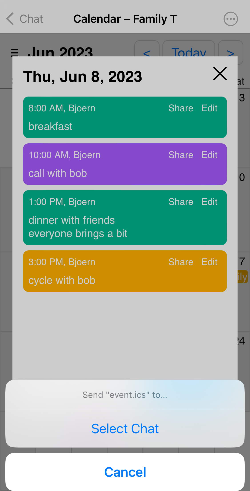
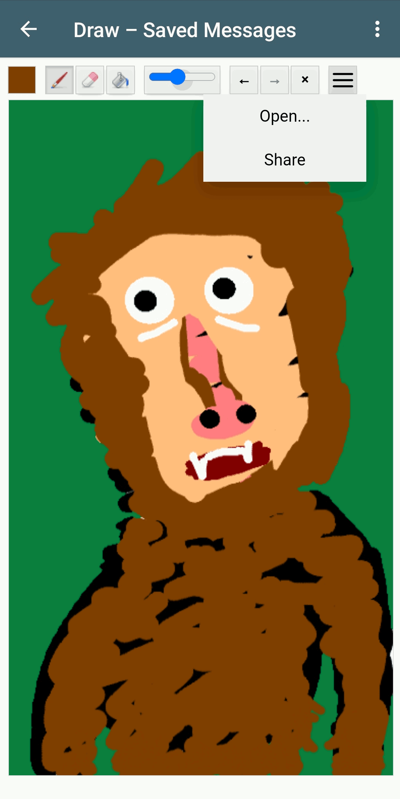
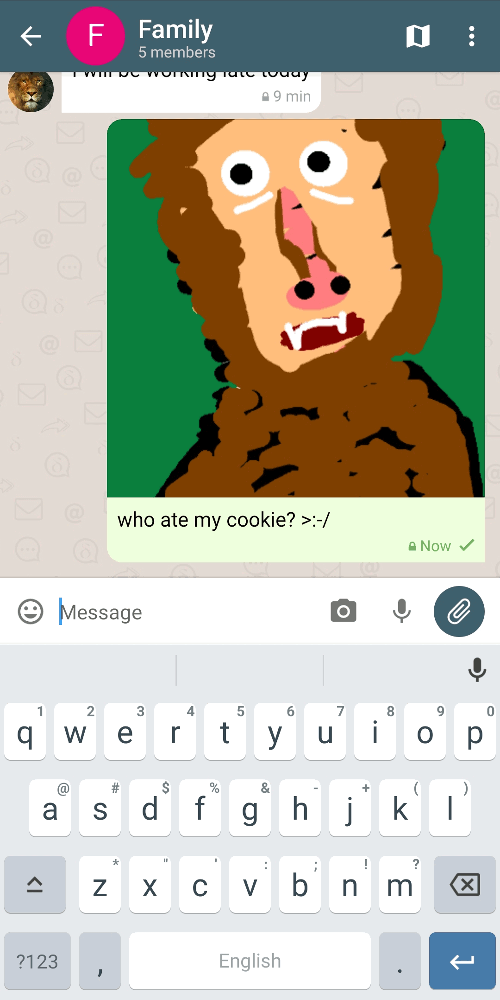
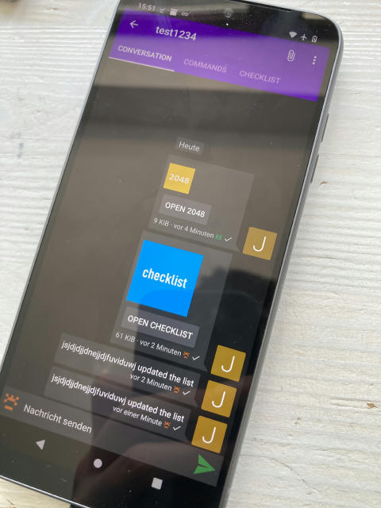

اوایل امسال سخت کار کردیم تا [حریم خصوصی اپ WebXDC](https://delta.chat/en/2023-05-22-webxdc-security) را اجبار کنیم
اما داشتن اپ‌های کاملاً خصوصی چه فایده‌ای دارد اگر راه راحتی برای رد و بدل داده با بقیه جهان نباشد؟
با انتشارهای Delta Chat 1.38 [دو API جدید WebXDC](https://docs.webxdc.org/spec.html#sendtochat)
برای **رد و بدل ایمن و راحت داده با سایر ابزارها و اپ‌ها** معرفی کردیم.

برای نمایش و طراحی APIهای جدید یک [اپ وب تقویم cross-platform](https://codeberg.org/webxdc/calendar/) کوچک ساختیم که:

- می‌تواند به‌عنوان اپ WebXDC در هر چتی به اشتراک گذاشته شود طوری که هر عضو
  بتواند رویدادهای تقویم بسازد و ببیند بدون نیاز به نصب، ورود یا میزبانی،

- اجازه می‌دهد دعوت‌ها (فایل‌های `.ics`) ساخته‌شده توسط سایر اپ‌های تقویم را import کند
  (تاکنون با Simple Calendar، Etar، Thunderbird، Google و Apple Calendar آزمایش شده)،

- اجازه می‌دهد دعوت‌ها را به چت یا مخاطب انتخاب‌شده کاربر به اشتراک بگذارد
  جایی که گیرنده(ها) می‌توانند روی فایل دریافتی بزنند
  تا دعوت را در اپ تقویم بومی موردعلاقه خودشان import کنند،

- همچنین می‌تواند بدون تغییر به‌عنوان [دمو آنلاین Calendar](https://webxdc.codeberg.page/calendar/) اجرا شود
  که البته تا فعالیت واقعی اشتراک‌گذاری در چت پیش نمی‌رود.

می‌توانید [آخرین انتشار اپ Calendar را اینجا دانلود کنید](https://codeberg.org/webxdc/calendar/releases)
و بعد فایل اپ `.xdc` دانلودشده را به چت "Saved messages"تان (مشترک بین همه دستگاه‌هایتان) یا به هر گروه چتی بفرستید تا اعضای چت هم بازی کنند.

به همین شکل، می‌توانید با یک [اپ Draw](https://github.com/webxdc/draw/releases/latest/download/draw.xdc) کوچک هم بازی کنید
که می‌تواند تصاویر را import و رسم کند و بعد در چت به اشتراک بگذارد.

لطفاً توجه کنید که هم اپ‌های Calendar و هم Draw «در حاشیه»
توسط توسعه‌دهندگان Delta Chat که تخصص‌شان اپ‌های وب نیست ساخته شدند.
در واقع اول کلی ویجت تقویم وب موجود را امتحان کردیم فقط تا بفهمیم
تقریباً همه برای استفاده دسکتاپ طراحی شده‌اند و پشتیبانی موبایل مناسب ندارند.
در حالی که اپ Calendar WebXDC نمی‌تواند کاملاً جایگزین اپ‌های تقویم بومی فعلی شود
می‌تواند راه‌حل سبک‌وزنی برای گروه‌های چت باشد تا تقویم مشترک نگه دارند
در حالی که تعامل کامل با سایر اپ‌های تقویم را ارائه می‌دهد.

## بهبود WebXDC و خروج از Github؟

اگر ظرفیت و علاقه دارید، لطفاً [به اپ‌ها یا مستندات WebXDC کمک کنید](https://github.com/webxdc/)
تا بهتر بتوانیم روی صاف کردن مسائل زیربنایی
با مجموعه اپ پیام‌رسان Delta Chat تمرکز کنیم،
و به [سایر توسعه‌دهندگان پیام‌رسان که پشتیبانی WebXDC را پیاده‌سازی می‌کنند](https://docs.webxdc.org/spec.html#messenger-implementation) کمک کنیم.

علاقه‌مندیم توسعه‌های WebXDC را از Github بیرون ببریم و
می‌توانیم کمی کمک برای انتقال روان استفاده کنیم.
بودجه محدودی هم در دسترس داریم.
تجربه دارید و می‌توانید کمک کنید؟
لطفاً [تماس بگیرید](https://delta.chat/en/contribute)
یا [cosmos.delta.chat](https://cosmos.delta.chat) را برای لینک‌های بیشتر ببینید.

## همه خوب و عالی اما پشتیبانی پیام‌رسان‌های دیگر از WebXDC چه؟

در ماه‌های اخیر با خوشحالی متوجه شدیم که
دو پیام‌رسان XMPP اندروید، [Cheogram](https://cheogram.com/) و [Monocles](https://monocles.eu/more/)،
پشتیبانی آزمایشی از اپ‌های WebXDC اضافه کردند.

امیدواریم APIهای جدید Export/Import به‌زودی آنجا هم در دسترس شوند
تا اپ‌های Calendar و Draw بدون تغییر آنجا هم فقط کار کنند.
اوایل امسال همچنین بحث‌های حضوری با توسعه‌دهندگان
از [Quiet](https://tryquiet.org)،
[Briar](https://briarproject.org/)
و [Qaul](https://qaul.net) داشتیم
که با علاقه کار WebXDC ما را دنبال می‌کنند.

## سنگ‌های پله برای یک «اینترنت نسل بعدی» E2E

کارمان روی معرفی APIهای I/O جدید برای اپ‌های WebXDC
از طریق [NLNET Zero Entrust](https://nlnet.nl/entrust/) تأمین مالی شد،
که به‌نوبه خود با تأمین مالی Next-Generation-Internet از کمیسیون اروپا پشتیبانی می‌شود.
به‌ویژه، سپاسگزار Michiel و Gerben از NLNET هستیم
که همچنان راهنمایی، نقد و پشتیبانی عالی برای تلاش‌هایمان ارائه می‌دهند.
نقاط عطف بعدی درباره ارائه توزیع و کشف غیرمتمرکز
برای اپ‌های WebXDC و ارائه اپ‌های نمونه همگام‌سازی داده P2P
و همچنین مستندات و نقاط ورود بازطراحی‌شده خواهد بود.
