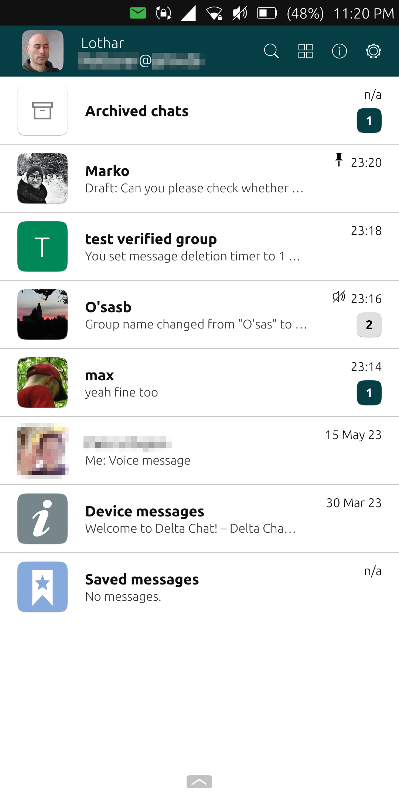
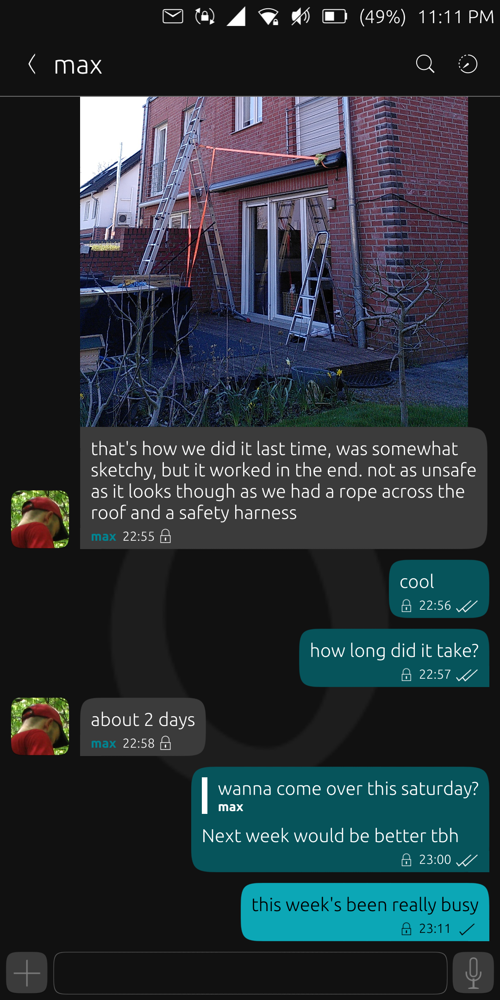
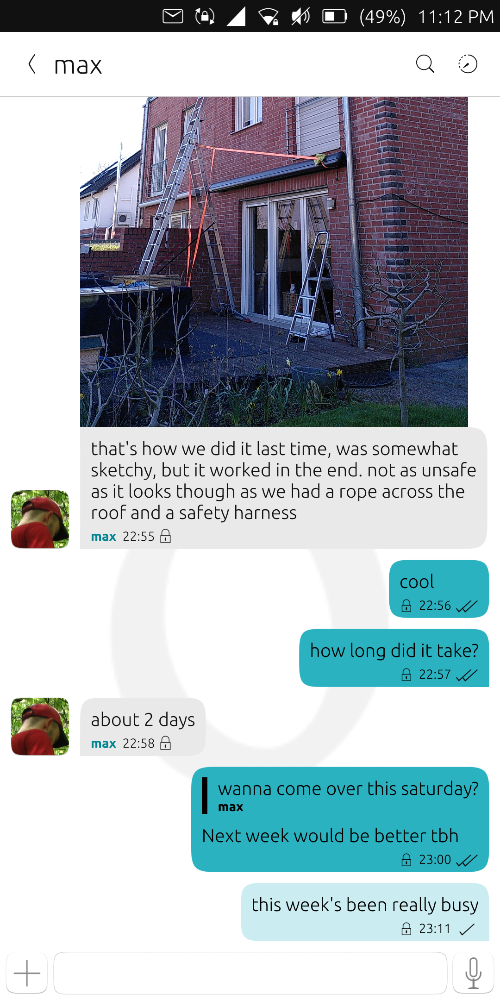
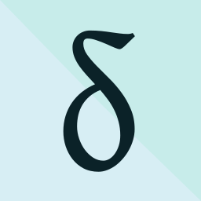

سلام، من Lothar معروف به [lk108](https://social.tchncs.de/@lk108) هستم. مهمان امروز وبلاگم و خوشحالم DeltaTouch را معرفی کنم، یک کلاینت شخص‌ثالث مبتنی بر deltachat-core-rust برای سیستم‌عامل موبایل [Ubuntu Touch](https://ubports.com) (UT). اپ تازه [در OpenStore منتشر شده](https://open-store.io/app/deltatouch.lotharketterer) برای هر دو کانال xenial و focal از UT. این‌طور به‌نظر می‌رسد:

## قابلیت‌ها

توسعه اپ با نگاه به قابلیت‌های کلاینت‌های رسمی و پیاده‌سازی یکی‌یکی آن‌ها انجام شد. اینجا چند نمونه از آنچه همین حالا هست:
* راه‌اندازی حساب‌ها با
  * ورود با نام‌کاربری/رمز عبور
  * راه‌اندازی دستگاه دوم از طریق کد QR
  * import پشتیبان
  * اسکن کد دعوت QR
* پشتیبانی چندحسابی
* ساخت و مدیریت گروه‌ها و گروه‌های تأییدشده
* پین، آرشیو، بی‌صدا کردن چت‌ها
* جستجو در چت‌ها
* نمایشگر تصویر ابتدایی
* پخش‌کننده پیام صوتی/صدا ابتدایی
* ضبط پیام‌های صوتی، پخش و تأیید قبل از ارسال
* export پشتیبان
* بیشتر تنظیمات مثل کلاینت‌های رسمی (نمایش ایمیل‌های کلاسیک، اندازه auto-download و غیره)

اعلان‌های سیستم ممکن‌اند، اما کاربر باید تعلیق پس‌زمینه را غیرفعال کند و اپ را در پس‌زمینه در حال اجرا نگه دارد. به‌طور روشمند آزمایش نکرده‌ام دومی چقدر روی عمر باتری اثر می‌گذارد، اما برداشت‌های اولیه‌ام این است که باتری را خیلی خالی نمی‌کند.

چیزهایی که هنوز نیست شامل:
* ایمیل‌های HTML
* Webxdc
* اسکن درون‌اپ کدهای QR (اسکن با اپ خارجی، کپی به کلیپ‌بورد و چسباندن در DeltaTouch کار می‌کند)
* عمل به‌عنوان دستگاه اصلی برای افزودن دستگاه دوم
* رمزنگاری دیتابیس (ممکن است برای UT مهم باشد چون فعلاً رمزنگاری در سطح OS ارائه نمی‌دهد)
* وضعیت اتصال
* نقطه سبز "Seen recently"
* پاک کردن چت

قرار است در ماه‌های آینده پیاده شوند.

## پس‌زمینه و تاریخچه

### چرا این اپ؟

لازم نیست بگویم کدام پیام‌رسان بهترین است، درست است؟ متأسفانه، برای تنها سیستم‌عامل گوشی هوشمندی که تا به حال استفاده کرده‌ام اپی نبود. البته، ممکن است بتوان اپ اندروید را از طریق waydroid اجرا کرد، اما waydroid عمر باتری را به‌شدت تحت‌تأثیر قرار می‌دهد، خواندن GPS را برای بقیه سیستم مسدود می‌کند و برای بعضی دستگاه‌ها اصلاً در دسترس نیست. بنابراین، اپ native راه درست است.

با این حال، مدت‌ها احساس می‌کردم برای توسعه اپ‌های UT صلاحیت ندارم، چه برسد به چیزی مثل کلاینت DC. درست است، هرچند ربطی به تحصیل اصلی‌ام نداشت، سال‌ها پیش توانستم در برنامه تکمیلی علوم کامپیوتر دانشگاه شرکت کنم، و مهارت‌های پایه C++ داشتم. اما هرگز با Qt/QML (چارچوب ترجیحی UT) کاری نکرده بودم، و چیزی درباره CMake یا [clickable](https://clickable-ut.dev/en/latest/index.html) (ابزار ساخت بسته‌های click مورد استفاده UT) نمی‌دانستم.

### چطور به وجود آمد

همه‌چیز در آوریل ۲۰۲۲ عوض شد وقتی در اولین جلسه توسعه [Ubuntu Teach Initiative](https://ubports.com/en/blog/ubports-news-1/tag/app-development-newsletter-13) شرکت کردم. طی چند ساعت، چند توسعه‌دهنده باتجربه UT کمک کردند پروژه‌ای راه بیندازم و اصول QML را نشانم دادند. چند هفته بعد اولین اپم وارد OpenStore شد. فقط QML است و فقط ابزار کوچکی بدون ارتباط با DC، اما دنیای توسعه اپ را برایم باز کرد.

آنجا بود که ایده ساخت کلاینت DC اول به ذهنم رسید. مثل قبل برای توسعه اپ به‌طور کلی، شک‌هایی داشتم. آیا این خیلی سخت نیست؟ شاید از پسش برنیایم. با این حال، شروع کردم به نگاه به [رابط C هسته](https://c.delta.chat/). دو چیز سریع شک‌هایم را برطرف کرد: بخش "Getting started" در ابتدای صفحه رابط C، و مستندات کلی کلاس‌ها و توابع. بعد از کامپایل libdeltachat و تکرار مثال بخش "Getting started" روی PCم، احساس کردم مفهوم را فهمیده‌ام، پس تصمیم گرفتم پیش بروم.

اولین کار سخت‌ترین از آب درآمد. برای استفاده از libdeltachat روی UT، باید برای arm64 یا armhf، در برابر نسخه libcی UT، cross-compile شود. هفته‌ها طول کشید تا بفهمم. شاید دلیلش این بود که برای کار کردن، لازم است CMake، cargo و مدیریت کتابخانه از طریق clickable هم‌تراز شوند، هر سه که هیچ تجربه‌ای با آن‌ها نداشتم. وقتی lib سر جایش بود، بیشتر بقیه به‌طرز غافلگیرانه‌ای آسان آمد. وقتی به قابلیت خاصی در کلاینت‌های رسمی نگاه می‌کردم، معمولاً از مستندات رابط C خیلی روشن بود چطور باید پیاده شود. درباره Qt/QML، باید به کار با signalها و slotها عادت می‌کردم. همچنین باید درباره کلاس‌های Qt و استفاده‌شان یاد می‌گرفتم، اما مستندات Qt هم خیلی قابل‌فهم است. البته، گاهی گیر می‌کردم و باید کمی وقت صرف پیدا کردن راه‌حل برای مشکل خاصی می‌کردم. چند مسئله جزئی هنوز حل نشده، اما هیچ‌چیز خیلی جدی که کل پروژه را مسدود کند نیست.

جنبه خیلی مهم این بود که حتی وقتی نمی‌دانستم موضوع خاصی را چطور مدیریت کنم، همیشه می‌توانستم روی جامعه Delta Chat و UT AppDev حساب کنم. فریاد سپاس به [Simon (treefit)](https://fosstodon.org/@treefit)، link2xt و [adbenitez](https://mastodon.social/@adbenitez) از Delta و Maciek، dobey و Jonatan از جامعه UT برای کمک دوستانه و شایسته‌شان، خیلی قدردانم! ممنون همچنین از [Marko](https://kanoa.de/@playforvoices) برای آزمایش و پیشنهادهای ارزشمند.

برای جمع‌بندی این سفر، حدود سپتامبر ۲۰۲۲ اولین قدم‌ها را با libdeltachat برداشتم. در تعطیلات کریسمس ۲۰۲۲، توسعه DeltaTouch واقعاً سرعت گرفت. از آن به بعد تقریباً هر روز رویش کار می‌کردم. زمان را ثبت نکردم، اما به‌طور متوسط، احتمالاً دو ساعت در روز کاری — گاهی کمتر، اما خیلی بیشتر در آخر هفته‌ها. حدس تقریبی‌ام این است که تا حالا حدود ۵۰۰ ساعت طول کشیده.

به همه شما که بیرون آنجا در همان جایی هستید که من نه چندان دور بودم: اگر می‌خواهید در توسعه درگیر شوید، اما فکر می‌کنید از پسش برنمی‌آیید — بله، کمی یادگیری و تعهد می‌طلبد، اما کاملاً شدنی است. برای کمک تردید نکنید، جامعه خیلی مایل است به سؤال‌هایتان پاسخ دهد.

## مشارکت

PRها در [https://codeberg.org/lk108/deltatouch](https://codeberg.org/lk108/deltatouch) خوش‌آمدند. اگر برنامه‌نویس نیستید، همچنان می‌توانید گزارش باگ در Codeberg بدهید. همچنین می‌توانید بازخورد درباره usability، layout و غیره بدهید. آزادید به انگلیسی یا آلمانی از طریق چت یا ایمیل کلاسیک با من تماس بگیرید — نام‌کاربری deltatouch است، دامنه mailbox به‌علاوه org.

## دانلود

