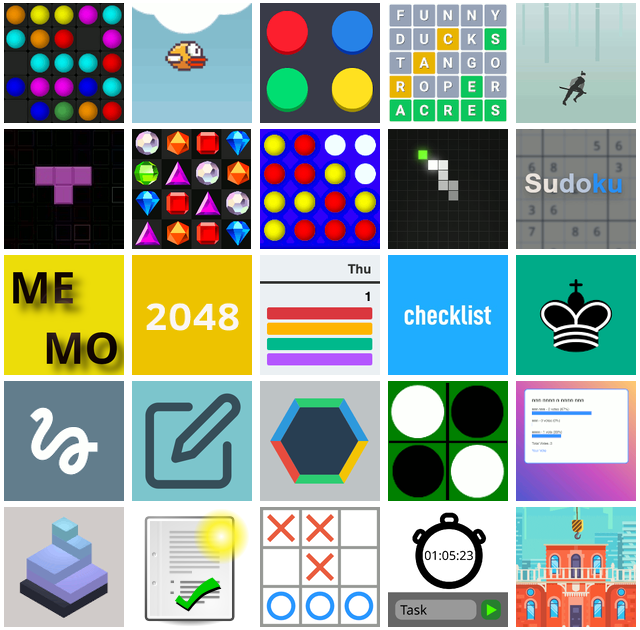
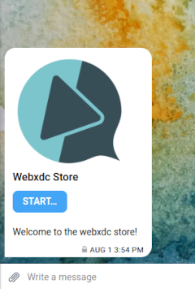
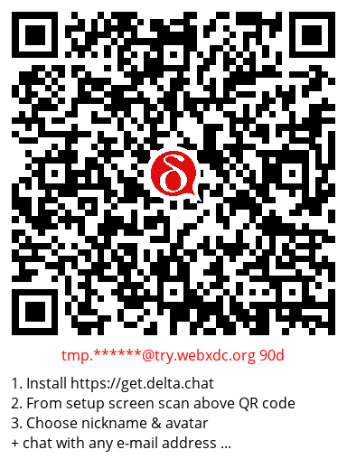
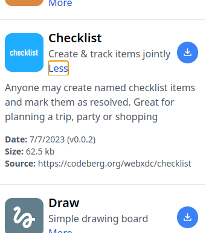

  
دیگران دست‌تکان‌دادن درباره معماری‌های به‌اصطلاح «super-app» یا «everything app» حرف می‌زنند،
اما ما ترجیح می‌دهیم فقط [تحویل دهیم](2022-06-14-webxdcintro)
و [بهبودشان دهیم](2023-06-28-webxdc-import-export).
امروز خوشحالیم راه جدیدی برای **پیدا کردن و شروع**
[اپ‌های webxdc «همه‌چیز»](https://webxdc.org) اعلام کنیم، از جمله:

- یک کلون Wordle/Reactle، 2048، و بازی‌های سرگرم‌کننده دیگر،

- ابزارهای تقویم، نظرسنجی و چک‌لیست،

- یک اپ ویرایشگر اول — فکر کنید Cryptpad اما بدون سرور.

[خیالتان راحت](2023-05-22-webxdc-security)،
هیچ‌کس جز طرف‌های چت‌تان نخواهد دانست
که با هم اپی اجرا می‌کنید.
هیچ سرور یا میزبانی خاص اپی نیست و
حتی توسعه‌دهنده اپ یا ربات xstore هم نمی‌تواند ردیابی کند چه می‌کنید.
همه تعاملات اپ به‌طور خودکار **رمزنگاری سرتاسری
و offline-first** هستند: همه در موقعیت‌های شبکه بد یا بدون شبکه ایمن کار می‌کنند.
پایین بخوانید چطور امتحان کنید،
با یا بدون Delta Chat،
با یا بدون طرف‌های چت و همچنین درباره
چگونگی ارسال اپ webxdc خودتان و
این‌که کل ماجرا چطور کار می‌کند.

## چطور شروع کنید

> **به‌روزرسانی:** حالا می‌توانید به‌سادگی اپ‌های webxdc را در اپ
> انتخاب کنید یا از <https://webxdc.org/apps/> دانلود کنید،
> پس xstore@testrun.org غیرفعال شده است.

  
با Delta Chat که از قبل کار می‌کند **شروع** فوق‌العاده ساده است:

1. به [xstore@testrun.org](mailto:xstore@testrun.org) بگویید "hi"
   و روی **Start** روی اپ فروشگاه webxdc برگشتی بزنید.

2. یک بازی یا اپ همکاری برای دانلود انتخاب کنید.

3. اپ دانلودشده را به یک چت به اشتراک بگذارید تا همه اعضا
   بتوانند اپ را بدون هیچ ورود، کوکی یا صفحه GDPR **Start** کنند.

⚠️ توجه کنید اگر نسخه Delta Chatتان قدیمی‌تر از 1.38 باشد،
اپ فروشگاه درست کار نمی‌کند؛
آن‌وقت نمی‌توانید اپ‌های webxdc دانلودشده را به چت به اشتراک بگذارید.
[لطفاً اپ Delta Chatتان را به‌روز کنید، به‌ویژه روی دسکتاپ](download).

### هنوز هیچ طرف چت Delta ندارم، باز هم می‌توانم بازی کنم؟

می‌توانید اپ‌های webxdc را فقط برای خودتان هم، بدون هیچ گروه چتی، آزمایش کنید.
اپ‌های فروشگاه را با چت "Saved Messages"تان به اشتراک بگذارید تا
گاهی بدون هیچ تبلیغ یا ردیابی بازی کنید.
یا شاید ویژگی "add second device" را هم امتحان کنید
تا حساب روی هر دو دستگاه موبایل و دسکتاپتان کار کند.
یک راه‌اندازی چنددستگاهی Delta Chat روش
ارزانی برای همگام‌سازی ایمن یادداشت‌ها،
چک‌لیست‌ها یا تقویم‌ها بین دستگاه‌هایتان فراهم می‌کند
بدون هیچ سرور یا حساب اضافی.

### هنوز Delta Chat ندارم، چطور می‌توانم با این بازی کنم؟  {#tryout}

اول، [get.delta.chat](https://get.delta.chat) را ببینید
تا از چندین فروشگاه و محل دانلود نصب کنید.

دوم، Delta Chat را شروع کنید و در صفحه راه‌اندازی یک حساب پیکربندی کنید:

- یک حساب Delta Chat با استفاده از آدرس ایمیل از قبل موجود
  و رمز عبور پیکربندی کنید.
  توجه: هیچ‌کس جز ارائه‌دهنده ایمیلتان مدارکتان را نمی‌بیند.

- روی موبایل می‌توانید [روی این لینک ساخت حساب آزمایشی بزنید](DCACCOUNT:https://mailadm.try.webxdc.org/?t=90d_f7v5c5xrtntpkqe&n=try90d)
  در مرورگر که باید اپ Delta Chat را باز کند و پیشنهاد دهد
  آواتار و نام نمایشی برای یک آدرس ایمیل جدید (تصادفی) تنظیم کنید.

- روی همه پلتفرم‌ها همچنین می‌توانید روی "Scan Invitation Code" بزنید
  و دوربین را روی لینک کد QR زیر نگه دارید؛
  روی دسکتاپ می‌توانید زیر "more options" تصویر QR را از فایل هم بارگذاری کنید.

حساب ایمیل آزمایشی فقط ۹۰ روز وجود خواهد داشت
و اجازه نمی‌دهد چت‌میل به بیشتر آدرس‌های ایمیل «خارجی» بفرستید.

## چطور می‌توانم اپ webxdc خودم را به xstore بفرستم؟

تنظیم یا نوشتن اپ‌های وب
تا به‌عنوان اپ‌های webxdc در Delta Chat کار کنند آسان است.
و با رد و بدل به‌روزرسانی‌ها بین کاربران مختلف Delta Chat،
می‌توانید آن‌ها را همکاری‌محور کنید.

برای شروع توسعه،
[مستندات](https://docs.webxdc.org/) را ببینید.
می‌توانید اپ‌های webxdc دیگر را هم به‌عنوان نمونه بگیرید؛
در xstore می‌توانید لینک به کد منبع هر اپ را
با کلیک روی "More" پیدا کنید:

اگر می‌خواهید اپ webxdc جدیدی در xstore در دسترس باشد،
با [codeberg.org](https://codeberg.org/webxdc/xdcget)
(جایگزین github)
onboard شوید تا pull request به فایل configی xdcget ما باز کنید،
مثل [این مثال](https://codeberg.org/webxdc/xdcget/pulls/50).
توجه کنید نیازی نیست اپتان روی Codeberg میزبانی git شود.
اساساً مثل F-Droid کار می‌کند،
اما با پیچیدگی کمتر
و برای همه پلتفرم‌های رایج موبایل و دسکتاپ.

### پاداش برای ۲۳ ارسال اپ بعدی 🎉

  

اگر اپ webxdc بفرستید و شامل شود،
خوشحال می‌شویم استیکرهای "delta chat" و "webxdc" را با پست برایتان بفرستیم.
همچنین، اگر کمک لازم دارید یا به حساب‌های ایمیل آزمایشی (همچنین بدون محدودیت) نیاز دارید
می‌توانید در [فروم پشتیبانی webxdc](https://support.delta.chat/c/webxdc/20)
یا [از کانال‌های دیگر](contribute) با ما تماس بگیرید.

فقط پورت کردن اپ‌های موجود هم خوب است
اما لطفاً مطمئن شوید روی هر دو پلتفرم موبایل و دسکتاپ خوب رفتار می‌کنند.
شاید ابزار npm-installable در حال تکامل [webxdc-dev](https://github.com/webxdc/webxdc-dev)
را برای آزمایش اپتان با چند دستگاه ببینید.

مشتاق مشارکت‌هایتان هستیم،
و امیدواریم به تفریح با اپ‌های webxdc بپیوندید :)

## xstore چطور کار می‌کند؟ اپ‌هایش را از کجا می‌گیرد؟

  
[xstore@testrun.org](mailto:xstore@testrun.org) یک نمونه ربات چت است.
بعد از این‌که به ربات «Hi» بفرستید،
اپ فروشگاه را دریافت و شروع می‌کنید،
که برای انتخاب و دانلود اپ‌ها
به ارتباط با ربات ادامه می‌دهد.
نمی‌توانید اپ فروشگاه را
به چت دیگری به اشتراک بگذارید.
دلیلش این است که
اپ‌های webxdc نمی‌توانند به اینترنت دسترسی داشته باشند،
اپ فروشگاه برای دانلود اپ‌ها به ربات نیاز دارد.

اگر وب‌سایت عادی از یک پلتفرم بود،
می‌توانستید بگویید
اپ فروشگاه فرانت‌اند است،
ربات فروشگاه بک‌اند.

ربات چت xstore
اپ‌های webxdc را از فهرستی از منابع مخزن «git» جمع می‌کند
و به‌طور مداوم آخرین نسخه‌های منتشرشده اپ را پیشنهاد می‌دهد.
می‌توانید ربات فروشگاه را خودمیزبان هم کنید:
دستورالعمل‌های نصب را
در [مخزن codeberg ربات](https://codeberg.org/webxdc/store/) ببینید.
خوب با [xdcget](https://codeberg.org/webxdc/xdcget/) کار می‌کند،
یک ابزار خط فرمان
که انتشارهای webxdc را
از مخازن عمومی git دانلود می‌کند.

### نکات مهم:

- اگر فروشگاه را حذف کردید یا
  "clear chat" را برای پاک‌سازی انتخاب کردید،
  هر لحظه می‌توانید فقط "hi"
  به [xstore@testrun.org](mailto:xstore@testrun.org) دوباره بفرستید،
  و فروشگاه را دوباره به چت می‌فرستد.
- فقط یک عضو چت نیاز دارد از xstore@testrun.org استفاده کند در حالی که
بقیه می‌توانند فقط اپی را که در چت دریافت می‌کنند شروع کنند،
و هرکسی می‌تواند اپ‌ها را بدون محدودیت به چت‌های دیگر فوروارد کند،
و بدون هیچ‌گونه ردیابی مرکزی.
- اگر از پیام‌رسان XMPP یعنی cheogram استفاده می‌کنید،
  xstore هنوز برایتان کار نمی‌کند؛
  اما با پشتیبانی آینده از webxdc در پل‌های XMPP/ایمیل
  ممکن است بتوانید به [xstore@testrun.org](mailto:xstore@testrun.org) پیام دهید
  و از آنجا اپ دانلود کنید.

### به‌روزرسانی نوامبر ۲۰۲۳

همچنین در حال آزمایش یک [نسخه وب](https://webxdc.org/apps) هستیم که با همان مجموعه داده xstore ما پر شده: فقط فایل `.xdc` را دانلود کنید و در چت بیندازید.

## سپاس از NLNET و NGI برای پشتیبانی و دیدگاهشان!

  
بیشتر تلاش‌های توصیف‌شده بالا از طریق پشتیبانی
[NGI0 Entrust Fund](https://nlnet.nl/entrust)،
تأسیس‌شده توسط [NLnet](https://nlnet.nl/)
با پشتیبانی مالی
برنامه [Next Generation Internet](https://ngi.eu/) کمیسیون اروپا ممکن شد.
خیلی ممنون!
