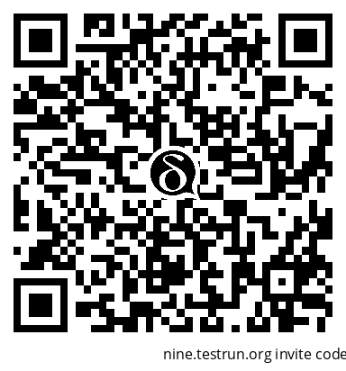
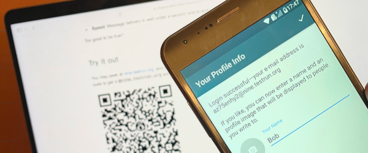
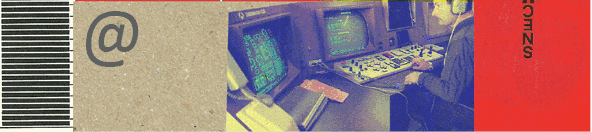

امروز **سرویس‌های chatmail** را رونمایی می‌کنیم
که onboarding با Delta Chat را آسان و با خیال راحت می‌کند:


- **راحتی**: دریافت آدرس chatmail در چند ثانیه

- **حریم خصوصی**: بدون پرسش، بدون نام، شماره یا ایمیل

- **سرعت**: تحویل پیام در کمتر از یک ثانیه، سرتاسری

خیلی خوب به نظر می‌رسد که باورنکردنی باشد؟

## امتحانش کنید

می‌توانید به [nine.testrun.org](https://nine.testrun.org) سر بزنید،
و پس از نصب اپ Delta Chat،
فقط روی کد QR زیر بزنید یا آن را اسکن کنید تا آدرس `@nine.testrun.org` بگیرید

<a href="DCACCOUNT:https://nine.testrun.org/cgi-bin/newemail.py">
    </a>

پس از تنظیم آواتار و نام،
به `echo@nine.testrun.org` پیام بدهید و پاسخ (سریع) را ببینید.



لطفاً درباره موفقیت و به‌ویژه شکست به ما بگویید
تا nine.testrun.org را روان‌تر کنیم؛
اولین سرویس عمومی chatmail
که قصد داریم به‌عنوان سرویس جامعه نگه داریم.


## چگونه اسپمرهای ایمیل را غمگین و کاربران را ایمن کنیم


`nine.testrun.org` در حال حاضر به هر کاربر اجازه می‌دهد ۶۰ پیام در دقیقه بفرستد
و می‌توانید چند آدرس ایمیل ثبت کنید.
آیا این بهشت برای سوءاستفاده‌گرانی نیست که می‌خواهند پیام‌های ناخواسته زیادی بفرستند؟
آیا این باعث نمی‌شود سرویس‌های chatmail فوراً از سوی دیگر ارائه‌دهندگان ایمیل مسدود شوند؟

خوشبختانه پیچش ساده‌ای برای جلوگیری از سوءاستفاده از حساب وجود دارد:
**یک سرویس chatmail اجازه نمی‌دهد پیام‌های رمزنگاری‌نشده
به کسی خارج از سرویس فرستاده شود.**
این اسپمرهایی را که بخواهند از آدرس‌های chatmail با ثبت‌نام باز سوءاستفاده کنند غمگین می‌کند،
چون اول باید رمزنگاری OpenPGP را با همه گیرندگان راه‌اندازی کنند؛
مسئله‌ای سخت و شناخته‌شده و در نتیجه نوعی اثبات کار قابل توجه، نه؟ :)


جدی‌تر بگوییم،
Delta Chat از استاندارد غیرمتمرکز [Autocrypt](https://autocrypt.org) استفاده می‌کند
که کلیدهای رمزنگاری را هیچ‌جا منتشر یا متمرکز نمی‌کند.
علاوه بر این، *پلتفرم‌های اینترنت امروز همه‌چیز را ردیابی می‌کنند به‌جز کلیدهای OpenPGP*
و بنابراین فقط می‌توانند آدرس‌های ایمیل پروفایل‌شده را به اسپمرها بفروشند یا لو بدهند، نه کلیدهای رمزنگاری را.
بنابراین سوءاستفاده از حساب‌های chatmail برای ارسال انبوه ایمیل ناخواسته
مبارزه‌ای بسیار سخت و از نظر اقتصادی بی‌علاقه است.

اگر این محدودیت اقتصادی عوض شود،
شاید آس‌هایی در آستین داشته باشیم
تا اسپمرها و بازیگران نظارتی را حتی ناراحت‌تر کنیم.
اما بیشتر وقتی زمانش برسد درباره آن حرف می‌زنیم.

## استفاده از رمزنگاری سرتاسری تضمین‌شده برای رسیدن به هر آدرس ایمیل


به‌طور کلی توصیه می‌کنیم از اسکن کد QR برای راه‌اندازی
[رمزنگاری سرتاسری تضمین‌شده](https://delta.chat/en/2023-11-23-jumbo-42)
با کاربران chatmail یا ایمیل دیگر استفاده کنید.
به این ترتیب می‌توانید با امنیت چت کنید
مهم نیست مخاطبین از چه سرور chatmail یا ایمیلی استفاده می‌کنند.
**راه‌اندازی رمزنگاری سرتاسری تضمین‌شده اعتمادی را که
به گردانندگان سرور chatmail یا ایمیل سنتی نیاز دارید به حداقل می‌رساند.**
گردانندگان chatmail عموماً نمی‌توانند محتوای پیام‌ها را بخوانند
و از طراحی تقریباً هیچ داده قابل شناسایی شخصی‌ای نمی‌دانند.

سرویس‌های chatmail واقعاً بیشتر به‌عنوان *روتر ایمیل* عمل می‌کنند تا پلتفرم حساب.
هر کسی می‌تواند یک جایگاه بگیرد اما فقط پیام‌های رمزنگاری‌شده سرتاسری می‌توانند آزادانه سفر کنند.


## ثبت‌نام در خبرنامه‌ها یا پلتفرم‌ها، بدون نشت حریم خصوصی

<a href="https://brettscott.substack.com/p/tech-doesnt-make-our-lives-easier">
  </a>

**به‌روزرسانی:** از آوریل ۲۰۲۵،
کاربران جدید سرور رله chatmail
دیگر نمی‌توانند پیام‌های رمزنگاری‌نشده دریافت کنند.
پس این پاراگراف منسوخ است:

~~اپ‌های Delta Chat به‌صورت پیش‌فرض از چند آدرس پشتیبانی می‌کنند.
با [nine.testrun.org](https://nine.testrun.org) همیشه می‌توانید
آدرس‌های اضافی برای دریافت خبرنامه یا ثبت‌نام در وب‌سایت‌ها بسازید.
پیام‌های ورودی اجازه دارند رمزنگاری‌نشده باشند
(این ممکن است در آینده قابل پیکربندی توسط کاربر شود)
و بنابراین برای دریافت پیام‌های ایمیل کاملاً مناسب هستند.~~

اگر دیگر به آدرس اضافی نیاز ندارید یا استفاده نمی‌کنید،
فقط آن را روی دستگاهتان حذف کنید.
خوشحالیم که می‌روید و، چه می‌دانیم،
شاید با آدرس ایمیل جدیدی دوباره بیایید، احتمالاً با Tor یا VPN؟
به این ترتیب سرور chatmail حتی آدرس اینترنت شما را هم نمی‌بیند
که به‌هرحال فقط موقتاً لاگ می‌شود و جمع‌آوری نمی‌شود.
در باب جمع‌آوری نکردن داده،
لطفاً [سیاست حریم خصوصی پیشرفته nine](https://nine.testrun.org/privacy.html)
را ببینید که توسط متخصصان حفاظت از داده و حامیان بلندمدت ما
در [lexICT.de](https://lexict.de) ساخته شده.
یکی از کلاسیک‌های آلمانی درباره «حفاظت از داده در محل کار» به‌هرحال
توسط [Fabian Schmieder](https://www.lexict.de/fabian-schmieder-en.html)
— مسئول حریم خصوصی منصوب همه سرویس‌های ایمیل [testrun.org](https://testrun.org) — هم‌نوشته شده است.

## Nine.testrun.org و اجرای خودتان سرویس‌های chatmail



[مخزن Chatmail](https://github.com/deltachat/chatmail) که تازه منتشر کردیم
شامل طرح اجرایی برای راه‌اندازی یک سرویس ایمیل مدرن است؛
که [nine.testrun.org](https://nine.testrun.org) اولین نمونه عمومی آن است.
توسط بعضی از اعضای پروژه Delta Chat، *در کنار کار*، اداره می‌شود.
این بازتاب تصور ما از اداره سرویس‌های chatmail است:
توسط گروه کوچکی یا افراد
که نیازی ندارند زیاد نگران شوند یا زمان زیادی صرف سرویس کنند،
اما ارتباط چت قابل‌اعتماد و امن را برای هزاران کاربر ممکن می‌کنند.
هنوز محدودیت‌ها را کاملاً کشف نکرده‌ایم اما `nine` قبلاً بیش از ۱۰۰ هزار حساب
و میلیون‌ها پیام را قبل از عمومی شدن سرویس داده است.
توسعه روزبه‌روز کتابخانه [deltachat-core-rust](https://github.com/deltachat/deltachat-core-rust)
حدود ۱۰ حساب جدید `@nine.testrun.org` در هر commit می‌سازد
و روزانه commitهای زیادی هست.
به عبارت دیگر، در دسترس بودن و قابلیت‌اطمینان `nine.testrun.org` به‌طور مداوم تأیید می‌شود
و از طریق مخزن عمومی Chatmail نگهداری و پالایش می‌شود.

با کمی دانش DNS، SSH و یک VPS یدکی (ارزان‌ترین را که پیدا می‌کنید بگیرید)،
می‌توانید خودتان نسبتاً سریع سرویس chatmail راه‌اندازی و ارائه کنید.
اخیراً دوستی به‌راحتی آن را روی Raspberry Pi برای پروژه مسکنش راه‌اندازی کرد.
سرورهای chatmail طوری طراحی شده‌اند که با حداقل نیاز سخت‌افزاری اجرا شوند
و حتی برای sysadminها یا برنامه‌نویسان تازه‌کار هم آسان برای تنظیم باشند.
هیچ مجوزی از سمت ما برای اجرای سرور chatmail لازم نیست.
ممکن است حتی ندانیم دارید این کار را می‌کنید چون Delta Chat هیچ ردیابی یا شمارشی ندارد.

اما بازخورد (به‌ویژه گزارش‌های باگ/موفقیت!) و مشارکت‌ها را
از طریق [مخزن Chatmail](https://github.com/deltachat/chatmail) گرم استقبال می‌کنیم
و همچنین قصد داریم کارگاه‌ها و جلساتی در
[کنگره ارتباطات Chaos 37c3](https://events.ccc.de) در پایان سال در هامبورگ
و همچنین حول [OFFDEM](https://offdem.net/)/[FOSDEM](https://fosdem.org/) در بروکسل اوایل فوریه ۲۰۲۴ برگزار کنیم.

## یک لحظه صبر کنید، تحویل زیرثانیه‌ای؟

بله، اینجا چند بنچمارک هست که روی ماشینی از راه دور در برابر `nine.testrun.org` اجرا شده،
با تأخیر شبکه ۲۰–۳۰ میلی‌ثانیه به ازای هر بسته داده اینترنت:

```
[nine.testrun.org]
benchmark name                 median    min    max
---------------------------------------------------
dc_autoconfig_and_idle_ready     1.17   1.14   1.18
dc_ping_pong                     0.46   0.43   1.05
dc_send_10_receive_10            2.22   1.77   2.22
```

`dc_ping_pong` دو تحویل پیام دستگاه‌به‌دستگاه رمزنگاری‌شده سرتاسری را اندازه می‌گیرد.
**پس یک پیام چت در یک‌چهارم ثانیه به‌صورت سرتاسری/دستگاه‌به‌دستگاه تحویل می‌شود.**

<video style="max-width: 100%" autoplay="" muted="" loop="" playsinline="">
  <source src="../assets/blog/nine-echo.mp4" type="video/mp4">
</video>

اگر باور ندارید این ضبط صفحه *سرعت واقعی* را نشان می‌دهد
لطفاً خودتان تأیید کنید و به ابتدای پست بروید :)

چرا سر و صدای پررنگ‌تری درباره احتمالاً راه‌اندازی
سریع‌ترین سرویس ایمیل روی سیاره راه نمی‌اندازیم؟
پاسخ دوگانه است:

- بحث ویژگی‌های سرعت Delta Chat و سرویس‌های ایمیل چت
  پست وبلاگ متمرکز خودش را می‌طلبد.
  داستان جالبی با چند سورپرایز بامزه و ناامیدی است :)

- بسیاری از ما فکر می‌کنیم `سرعت` بیش از حد بزرگ شده یا، همان‌طور که Brett Scott محترم
  چند روز پیش گفت،
  [فناوری زندگی‌مان را آسان‌تر نمی‌کند. آن‌ها را سریع‌تر می‌کند](
  https://brettscott.substack.com/p/tech-doesnt-make-our-lives-easier).

بله، chatmail فوق‌العاده سریع است اما این هدفی فی‌نفسه نیست.
در دسترس قرار دادن ارتباطات امن، سازگار، غیرمتمرکز و با رمزنگاری سرتاسری تضمین‌شده
برای همه، مهم‌تر از تحویل زیرثانیه‌ای است.
این مدل کسب‌وکار دیگری نیست که بتواند Whatsapp/Meta را جایگزین کند،
حداقل نه بدون تبدیل شدن به تصویر آینه‌ای آن‌ها.
فقط جوامعی که حاکمیتی زیرساخت‌های خود را اداره کنند،
از کنترل و وابستگی متمرکز بگریزند، ممکن است خود را آزاد کنند.

شبکه ایمیل فضای ریزومی وسیعی است که از قبل ما را احاطه کرده
و در مقیاس سیاره‌ای به‌صورت متنوع مستقر است.
امیدواریم بسیاری از شما به این سفر بامزه در کاوش بیشتر آن بپیوندید :)
