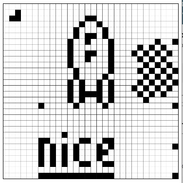
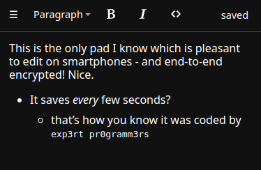
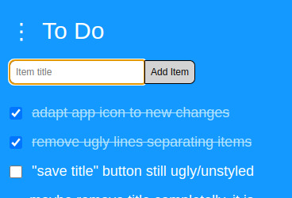
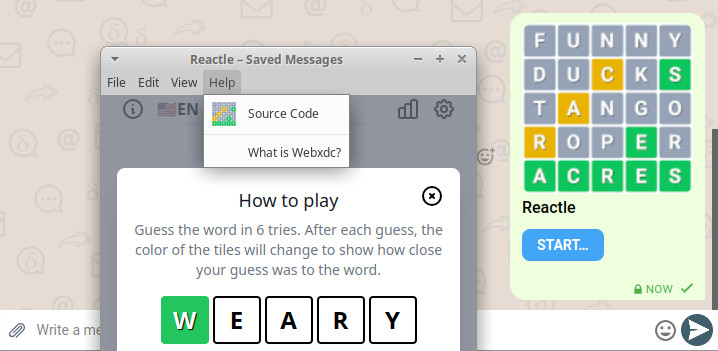

در حالی که پروژه‌های بلاکچین «غیرمتمرکزسازی» و «Web3» را به‌عنوان تغییر پارادایم ستایش کردند
و در دهه گذشته میلیاردها دلار و ساعت توسعه صرف کردند،
حتی نتوانستند مشخصات پایه‌ای برای بسته‌بندی و اجرای اپ‌های وب P2P بسازند
مثل آنچه [ما در ۲۰۲۲ با webxdc شروع کردیم](https://delta.chat/en/2022-06-14-webxdcintro).

[اپ‌های webxdc](https://webxdc.org/apps) فایل‌های کانتینر اپ HTML5 هستند
که از API ساده ارسال/دریافت ارائه‌شده توسط پیام‌رسان پشتیبان استفاده می‌کنند.
یک اپ webxdc نیازی به پیاده‌سازی ندارد و وابسته نیست به
هیچ مکانیزم انتقال یا پشته پیام‌رسان خاصی.
همچنین نیازی به پیاده‌سازی onboarding و کشف همتا ندارد
چون همه اپ‌ها در زمینه چت‌گروهی از پیش برقرار اجرا می‌شوند
و به تجربه کاربری موجود میلیاردها کاربر متصل می‌شوند.

## یادگیری برنامه‌نویسی اپ‌های P2P webxdc

توسعه اپ webxdc به‌مراتب آسان‌تر از توسعه و نگهداری
سرور HTTP همیشه-آنلاین مخصوص اپ است.
اما بی‌شک پیچیدگی‌هایی در تنظیم
حالت یکنواخت اپ وب بین دستگاه‌های کاربران وجود دارد؛
مسئله‌ای معمول برای هر سیستم شبکه‌سازی P2P.
فصل جدید [Shared Web Application State](https://webxdc.org/docs/shared_state/index.html)
شما را از نظریه و عمل
به‌اصطلاح «انواع داده تکرارشونده بدون تعارض» (CRDTها) عبور می‌دهد.
این فصل جدید متمرکز بر توسعه‌دهنده اپ
توسط [ansuz](https://social.cryptography.dog/@ansuz)
ساخته شد که همچنین برای نقش توسعه رهبری‌اش در Cryptpad
[سال‌ها](https://blog.cryptpad.org/2022/12/29/stepping-down/) شناخته می‌شود.
هم‌گرایی تخصص E2EE و P2P کمتر شگفت‌آور است اگر در نظر بگیرید
که هر اپلیکیشن با رمزنگاری سرتاسری نمی‌تواند به
یک مرجع مرکزی برای حل تعارض‌ها و «گفتن حقیقت» تکیه کند.

## Pixel: پیاده‌سازی حداقلی CRDT برای طراحی پیکسلی مشارکتی (۲٫۸ کیلوبایت)

نوشتن یک اپ webxdc که تجربه کاربری یکنواختی ارائه دهد
با کد کم و بدون وابستگی به هیچ dependency ممکن است.
اپ [Pixel](https://codeberg.org/webxdc/pixel) اجازه می‌دهد
هر کسی در چت پیکسل‌ها را تنظیم و پاک کند،
و هر تعارض همزمانی را با استفاده از «Lamport Clock» حل می‌کند.
این کار را در ۱۵۰ خط کد Javascript ساده انجام می‌دهد
و ثابت می‌کند CRDTها اساساً کمتر از آنچه فکر می‌کنید پیچیده‌اند.

## یک ویرایشگر پایه چندپلتفرمی با Prosemirror و Yjs (۱۴۸ کیلوبایت)

در حدود ۴۰۰ خط کد،
[webxdc/editor](https://codeberg.org/webxdc/editor/src/branch/main/src)
یک ویرایشگر offline-first با رمزنگاری سرتاسری پیاده‌سازی می‌کند
که می‌توانید در هر گروه چت برای ویرایش مشترک یک سند استفاده کنید.
ویرایشگر از [y-webxdc provider](https://www.npmjs.com/package/y-webxdc) استفاده می‌کند
که API ارسال/دریافت webxdc را با [Yjs](https://yjs.dev/#features) یکپارچه می‌کند؛
یک پیاده‌سازی محبوب Javascript برای انواع داده تکرارشونده بدون تعارض (CRDT).

## Checklist: اپ Javascript با automerge (۹۸ کیلوبایت)

مردم هر روز از [checklist](https://codeberg.org/webxdc/checklist)
برای لیست خرید یا آماده‌سازی سفرهای خانوادگی استفاده می‌کنند.
اپ `checklist` از automerge، یک تلاش جالب دیگر در پیاده‌سازی CRDT، استفاده می‌کند.
توجه کنید که webxdc هیچ چارچوب یا نوع داده خاصی را
برای نحوه تنظیم تجربه کاربری توزیع‌شده و یکنواخت تجویز نمی‌کند.

## اپ‌های بیشتر با «مشاهده کد منبع»

صفحه جدید [webxdc.org/apps](https://webxdc.org/apps)
رابط جستجو و دانلود سرراستی ارائه می‌دهد —
می‌توانید فایل دانلودشده را به پیام چت پیوست کنید
و اعضای گروه چت را قادر سازید اپ را اجرا کنند
بدون اینکه خودشان چیزی دانلود کنند.
یک اپ در حال اجرا گزینه «View Source» ارائه می‌دهد که مستقیماً
شما را به مخزن توسعه می‌برد. همکاری و فورک خوش‌آمد!

## ماندگاری و ساخت و استفاده بدون دردسر از اپ‌های webxdc

اپ‌های webxdc یک‌بار نوشته می‌شوند و نیازی به میزبانی، حسابداری، ثبت‌نام یا کار compliance ندارند.
آن‌ها [از طراحی و معماری خصوصی‌اند](https://delta.chat/en/2023-05-22-webxdc-security)
و بنابراین نیازی به سیاست GDPR یا رضایت کوکی ندارند.
اولین اپ‌های webxdc سال ۲۰۲۲ بدون تغییر روی پیام‌رسان‌های امروز Delta Chat و Cheogram اجرا می‌شوند،
و همچنین روی هر پروژه پیام‌رسانی بالقوه دیگری
که مشخصات سرراست [webxdc](https://webxdc.org/docs/spec/index.html) را بپذیرد؛
که اکنون نشانگرهای خوب فهرست مطالب برای آسان‌تر شدن ناوبری دارد.
اما نگران نباشید، هنوز مشخصات خیلی کوچکی است که می‌توانید در یک‌ربع ساعت بخوانید :)

## شروع توسعه اپ خودتان

صفحه پالایش‌شده [مستندات توسعه](https://webxdc.org/docs)
اکنون با صفحه «getting-started» شروع می‌شود
که اجازه می‌دهد اولین اپ وب خود را در چند دقیقه بسازید و اجرا کنید.

<video controls style="width:560px; max-width: 100%;"><source src="https://webxdc.org/assets/just-web-apps.mp4" type="video/mp4"><a href="https://www.youtube.com/watch?v=I1K4pBvb2pI">watch "just web apps" on youtube</a></video>

## هیس، علاقه‌مندید اپ‌های وب P2P را با ما پیش ببرید؟

توسعه‌های جالب webxdc زیادی برای ۲۰۲۴ در جریان است،
نه کم‌اهمیت‌ترین به‌خاطر حمایت مالی حیاتی از NLNET
که بخش زیادی از بودجه Next-Generation-Internet (NGI) اتحادیه اروپا را اداره می‌کند
و webxdc را به‌عنوان فناوری و مشخصات امیدوارکننده به رسمیت می‌شناسد.

در حالی که عموماً برنامه‌ریزی انتشارمان را از پیش اعلام نمی‌کنیم
قبلاً [Iroh](https://github.com/n0-computer/iroh) را برای پشتیبانی راه‌اندازی چنددستگاهی یکپارچه کرده‌ایم
و [شاخه‌های آزمایشی در حال تکامل](https://github.com/deltachat/deltachat-core-rust/pull/5041) داریم
تا اپ‌های webxdc از ارتباط P2P بلادرنگ به‌وسیله [Iroh.network](https://iroh.network) استفاده کنند؛
یک پورت خوب Rust از [tailscale](https://tailscale.com/) که به‌نوبه خود
پشته شبکه‌سازی P2P و holepunching اثبات‌شده و کارآمد موجود است.
Iroh را یکی از جالب‌ترین تلاش‌هایی می‌دانیم که از خاکستر Web3 برخاسته است.
توجه کنید که توسعه‌دهندگان اپ webxdc همچنان فقط از APIهای ارسال/دریافت استفاده می‌کنند
و نه وابسته هستند و نه نیاز دارند درگیر یکپارچه‌سازی
`deltachat-core-rust` و `Iroh.network` شوند.
پیام‌رسان‌های دیگر ممکن است راه‌های متفاوتی برای ارائه اتصال P2P به اپ‌ها استفاده کنند.

در حالی که توسعه‌دهندگان Delta Chat مشخصات و پیاده‌سازی‌های webxdc را هم‌تکامل می‌دهند،
معمولاً روی انتشار اپ‌های پیام‌رسان بومی Delta Chat در همه پلتفرم‌ها و فروشگاه‌ها تمرکز دارند.
توسعه خود اپ‌های webxdc فقط «در کنار» اتفاق می‌افتد.
این به معنای چیزی علیه ساختن یک اپ کوچک در کنار کار نیست!
در واقع، یک نجار حرفه‌ای در میان ما هست که تازه
HTML و Javascript یاد گرفته و قبلاً سه اپ در فروشگاه منتشر کرده :)

با این حال، تجربه و تمرکز بیشتر روی اپ‌های وب کاربرمحور،
از جمله بهبود ابزارها و اپ‌های نمونه،
پیش بردن طراحی‌های جدید API webxdc از نیازهای دنیای واقعی، کمک به تازه‌واردان و غیره
بسیار خوش‌آمد و بسیار مورد نیاز است تا به همه تلاش‌های در حال تکامل کمک کند.
اگر علاقه‌مندید، یا کسی را می‌شناسید که ممکن است علاقه‌مند باشد،
حتی در قرارداد پولی برای کمک، [پست قبلی زمینه اجتماعی بیشتری می‌دهد](https://delta.chat/en/2022-12-15-uidevjob#what-we-offer-and-how-we-dont-work).
راحت تماس بگیرید، شاید همچنین
[با ارسال یک اپ](https://codeberg.org/webxdc/xdcget/src/branch/main/SUBMIT.md)
تا نشان دهید جدی یا بازیگوش هستید — بازی‌های casual پورت‌شده هم همیشه خوش‌آمد! :)

