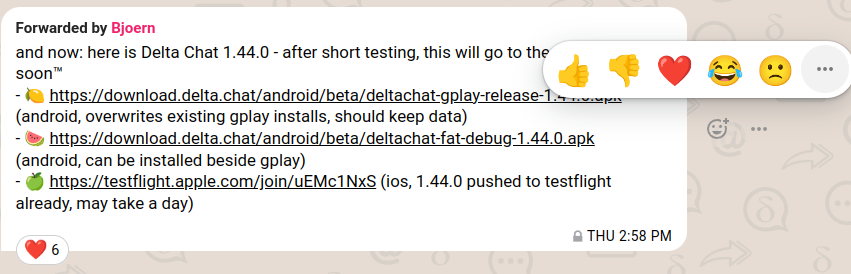
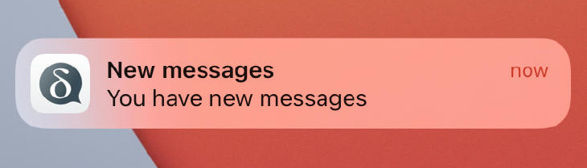
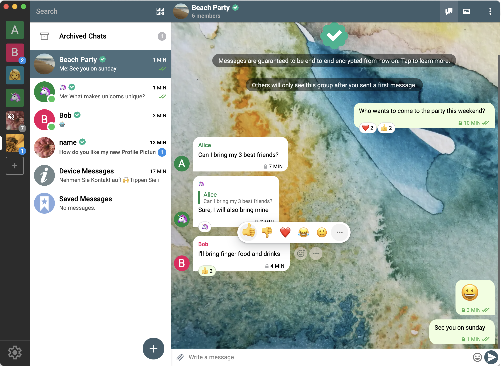
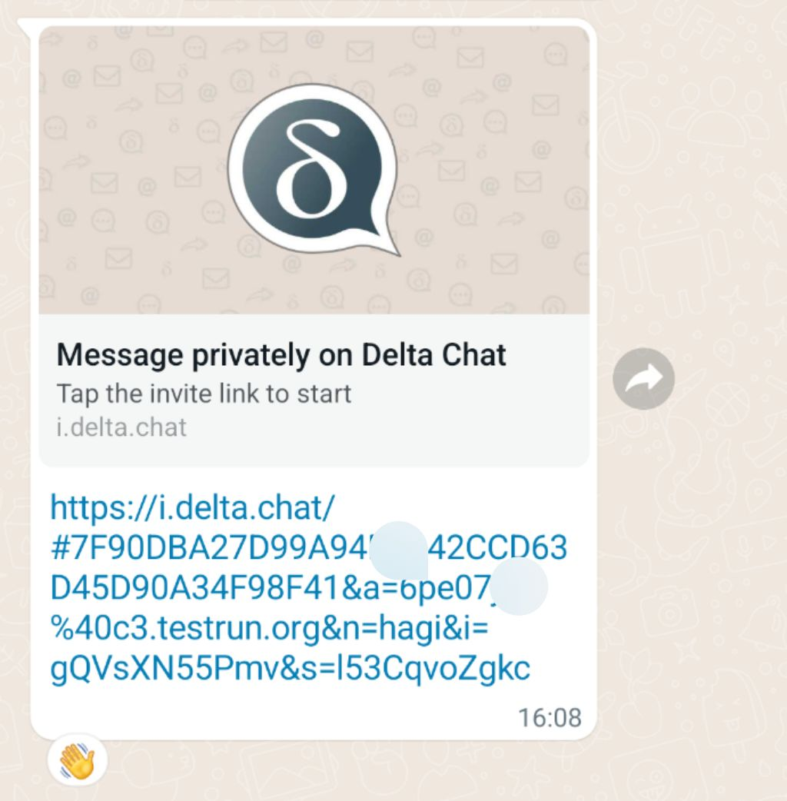
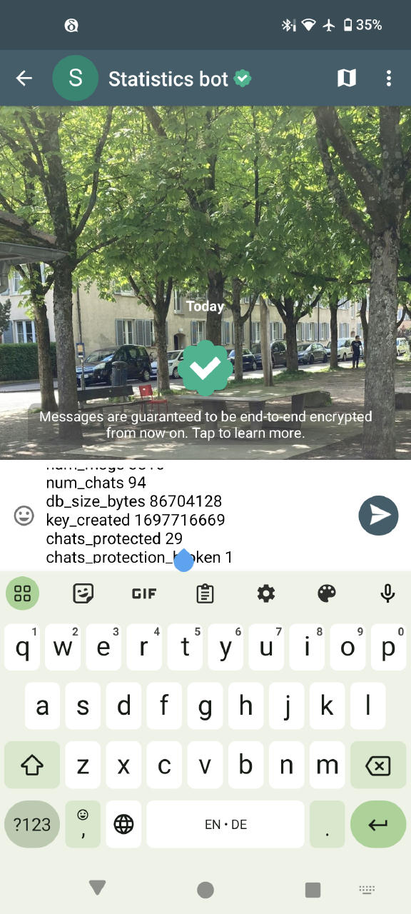
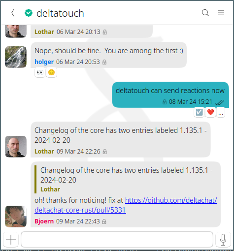

زمان تحویل!
نسخه‌های در حال انتشار Delta Chat ۱٫۴۴
چهار بهبود کاربردپذیری اغلب درخواست‌شده را می‌آورند.
به [get.delta.chat](https://get.delta.chat) سر بزنید
تا هر کسی را فوری و امن onboard و دعوت کنید،
بدون اینکه اول به آدرس ایمیل یا شماره تلفن نیاز داشته باشد.
بعضی‌ها ادعا می‌کنند امروز هیچ مجموعه پیام‌رسان دیگری به این راحتی برای onboarding و استفاده نیست.
درست یا نه؟ به‌هرحال، ما از قبل مشغول آماده‌سازی
بهبودهای کاربردپذیری بعدی هستیم تا هیچ شکی نماند :)

## واکنش‌ها اکنون روی همه پلتفرم‌ها پشتیبانی می‌شوند

کاربران Android، Desktop، iOS و UbuntuTouch اکنون می‌توانند
واکنش روی پیام‌های چت بفرستند و نمایش دهند.
حقیقت جالب: ما از استاندارد آزمایشی IETF [RFC9078](https://www.ietf.org/rfc/rfc9078.html)
برای انتقال واکنش‌ها در ایمیل استفاده می‌کنیم.
[استانداردهای Delta Chat](https://github.com/deltachat/deltachat-core-rust/blob/main/standards.md)
را برای فهرستی از مشخصات سازگاری دیگری که به آن‌ها متصل می‌شویم ببینید.

## تحویل فوری پیام روی دستگاه‌های Apple iOS

اپ جدید Delta Chat ۱٫۴۴ برای iOS تحویل فوری پیام دارد
و مسئله کاربردپذیری دیرینه
«لعنتی، پیامت را ندیدم، فقط بعد از باز کردن اپ!» را برطرف می‌کند.
توجه کنید که تحویل فوری پیام در حال حاضر
فقط اگر از آدرس [chatmail](../en/2023-12-13-chatmail) استفاده کنید در دسترس است؛
فعلاً از سه نهاد مستقل:
[nine.testrun.org](https://nine.testrun.org)،
[mailchat.pl](https://mailchat.pl) یا [mehl.cloud](https://mehl.cloud).

## نوار کناری جدید چندحسابی دسکتاپ

اپ‌های دسکتاپ روی همه پلتفرم‌ها اکنون نوار کناری دارند
که حساب‌هایتان را نشان می‌دهد و اجازه می‌دهد مستقیماً انتخاب کنید
و نمای مستقیم از پیام‌های نخوانده در همه حساب‌ها می‌دهد.
اعلان‌های سیستم اکنون برای همه حساب‌ها کار می‌کنند و می‌توانید بعضی حساب‌ها را بی‌صدا کنید.
برای دوستان انتشارهای Flathub: مسئله آزاردهنده «کرش هنگام اعلان» را رفع کردیم :)

## اشتراک‌گذاری لینک‌های دعوت برای چت‌ها و گروه‌های چت

اکنون می‌توانید لینک‌های دعوت بفرستید تا با هر کسی تماس امن برقرار کنید.
به آیکون «QR code» در صفحه اصلی بروید و برای ارسال لینک دعوت
از طریق هر کانال پیام‌رسانی شخص ثالث «share» را بزنید.
یا به پروفایل گروه چت بروید، گزینه «QR invite» را بزنید و سپس لینک را «share» کنید.
اگر گیرنده روی لینک دعوتتان بزند، برای پیوستن به
[چت با رمزنگاری سرتاسری تضمین‌شده](../en/2023-11-23-jumbo-42) راهنمایی می‌شود.

## آمار حفظ‌کننده حریم خصوصی روی اندروید

اندروید اجازه می‌دهد آمار بفرستید تا به توسعه‌دهندگان Delta Chat کمک کنید
رمزنگاری سرتاسری تضمین‌شده را به تجربه ۱۰۰٪ قابل‌اعتماد و امن،
روی همه دستگاه‌هایتان تبدیل کنند.
می‌توانید با رفتن به «Advanced Settings» و
«Send statistics to Delta Chat's developers» کمک کنید
که پیام متنی می‌سازد و می‌توانید بزنید تا به
[بات جمع‌آوری](https://github.com/deltachat/self_reporting_bot/blob/main/self_reporting_bot.py) بفرستید، البته با رمزنگاری سرتاسری تضمین‌شده.
خیالتان راحت باشد، هیچ داده قابل شناسایی شخصی جمع‌آوری نمی‌شود چون
بات جمع‌آوری فوراً گزارش را از آدرس فرستنده جدا می‌کند
و پیام «Thanks» برایتان می‌فرستد.

## Ubuntu Touch هم واکنش‌ها را پشتیبانی می‌کند و از آخرین کتابخانه هسته Rust استفاده می‌کند

[Delta Touch](../en/2023-07-02-deltatouch) هم
واکنش‌ها را معرفی کرد و از آخرین [هسته Delta Chat](https://github.com/deltachat/deltachat-core-rust/) استفاده می‌کند که زیربنای شبکه‌سازی، رمزنگاری، مدیریت مخاطب و چت
همه اپ‌های Delta Chat است.

# بهبودهای مفید دیگر با ۱٫۴۴

- Delta Android اکنون نشان می‌دهد چند پیام نخوانده در حساب‌های دیگر هست

- پیام‌های خطای بهتر و بومی‌سازی‌شده اگر بخواهید پیام‌های رمزنگاری‌نشده
  از آدرس chatmail بفرستید که فقط ایمیل‌های خروجی
  به‌صورت رمزنگاری‌شده را اجازه می‌دهد

- دیالوگ بهبودیافته «settings» دسکتاپ و بسیاری از پالایش‌های دیگر UI دسکتاپ و iOS

- ساخت مخاطبین و تغییر آواتار اکنون به همه دستگاه‌هایتان همگام می‌شود.

- رفع باگ‌های زیاد

برای فهرست کامل تغییرات ببینید:

- [تغییرات Desktop](https://github.com/deltachat/deltachat-desktop/blob/master/CHANGELOG.md)
- [تغییرات Android](https://github.com/deltachat/deltachat-android/blob/main/CHANGELOG.md)
- [تغییرات iOS](https://github.com/deltachat/deltachat-ios/blob/main/CHANGELOG.md)
- [تغییرات Core Rust](https://github.com/deltachat/deltachat-core-rust/blob/main/CHANGELOG.md)
- [تغییرات Ubuntu Touch](https://codeberg.org/lk108/deltatouch/src/branch/main/CHANGELOG)

لطفاً باگ‌ها یا مسائل بعدی را در [انجمن](https://support.delta.chat)
یا در [ردیاب issue هسته Rust](https://github.com/deltachat/deltachat-core-rust/issues) گزارش دهید.
