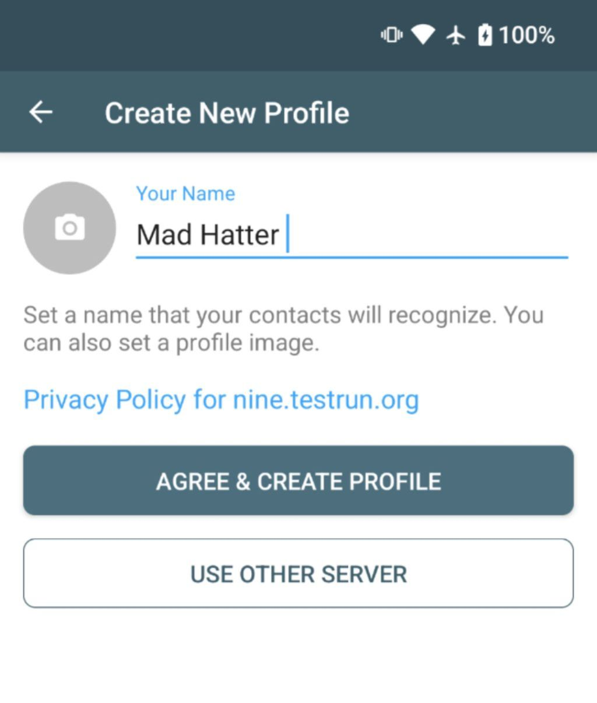
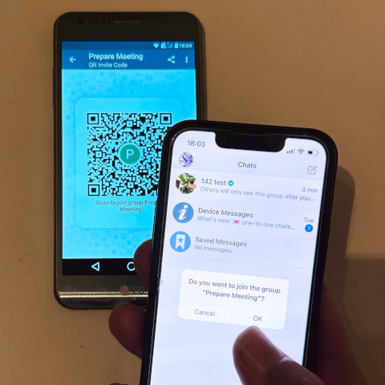
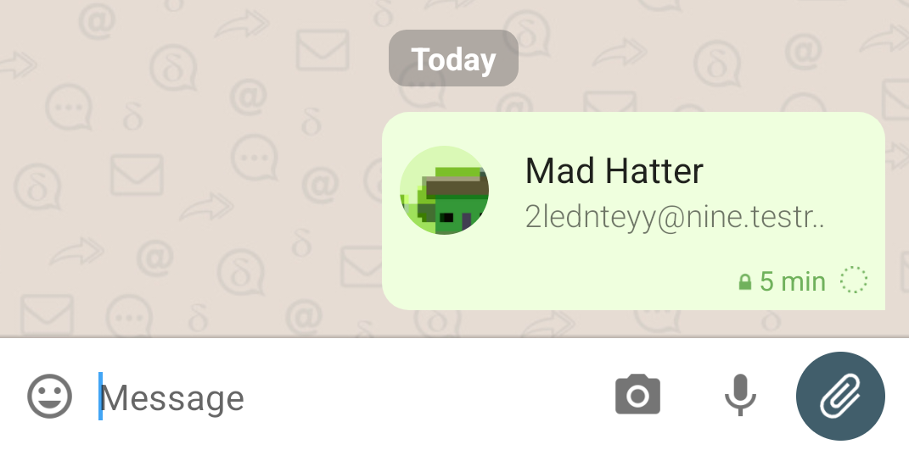
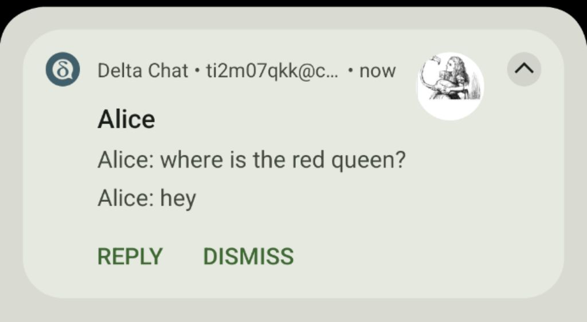

نقطه عطف مهمی در بیش از ۶ سال تاریخ پروژه ما:
با نسخه‌های در حال انتشار اپ ۱٫۴۶ می‌توانید بدون آدرس ایمیل از پیش موجود شروع به چت کنید.
فقط نامی بدهید و سپس «Agree and continue» را بزنید
تا پروفایل چت با [سرور پیش‌فرض chatmail](https://nine.testrun.org/privacy.html) بسازید.
یا به [سرورهای chatmail](../chatmail) دیگر سر بزنید و روی دعوت در صفحه اصلیشان بزنید.

عالی، پروفایل چت جدید در چند ثانیه، اما حالا چه؟

برقراری تماس با دیگران در واقع مسئله بنیادی برای هر پیام‌رسان غیراصلی است.
در دو بخش بعدی پیشنهاد می‌کنیم چگونه با بعضی بات‌ها و انسان‌ها تماس بگیرید،
سپس خبرهای بیشتر درباره سری انتشار ۱٫۴۶ را برجسته می‌کنیم،
و بخشی از فکرمان حول جهت UX و UI در Delta Chat
و سرورهای chatmail را ارائه می‌دهیم.

## برقراری تماس با بات‌های چت و «DeltaFans»

می‌توانید روی «لینک‌های دعوت» روی دستگاهی که Delta Chat نصب است بزنید مثل موارد زیر:

- برای تأیید اینکه همه‌چیز کار می‌کند، به
  <echo@nine.testrun.org> پیام بفرستید و پاسخ echo را که سریع می‌رسد ببینید.

- [بات فهرست «Public Bots»](https://i.delta.chat/#9AF055DB87EC48A1C009B6CA55E3712A6F7D346F&a=botsindex%40nine.testrun.org&n=Public%20Bots&i=QpBSronexvP&s=nAfQ0q_JomN) را بررسی کنید
  تا اپ وب کوچکی دریافت کنید برای دیدن و شروع تعامل با انتخابی از بات‌های بیشتر.
  خیالتان راحت باشد، ChatGPT داخلش نیست ;)

- اگر ماجراجوتر هستید می‌توانید با [Delta
  Fans](https://i.delta.chat/#B9311CB912B04BBD2977327C53FAAF34FDAAADF4&a=deltafans%40nine.testrun.org&n=DeltaFans&i=s-x3ZriWiET&s=qebTBni-pbN) تماس بگیرید؛ پروفایل چت «جامعه» بسیار-آزمایشی
  که اخیراً در fediverse به اشتراک گذاشته شد و روی دستگاه‌های بسیاری زندگی می‌کند.

عیب‌یابی: اگر زدن لینک دعوت چتی برایتان باز نکرد،
به وب‌سایت i.delta.chat هدایت می‌شوید
جایی که می‌توانید لینک پشت دکمه «Open Chat» را «کپی» کنید
و سپس آن را در صفحه «Scan QR Code» اپ Delta Chat بچسبانید.

## برقراری تماس با همنوعان انسانی

هنگام استفاده از ثبت‌نام پیش‌فرض با [سرورهای chatmail](/chatmail)
فقط می‌توانید پیام‌های رمزنگاری‌شده سرتاسری بفرستید.
می‌توانید [چت‌های رمزنگاری‌شده سرتاسری تضمین‌شده](https://delta.chat/en/2024-03-25-crypto-analysis-securejoin) را با این روش‌ها راه‌اندازی کنید:

- افزودن مخاطب جدید از طریق اسکن کد QR، یا

- اشتراک‌گذاری اطلاعات مخاطب خودتان به‌عنوان «لینک دعوت»
  که هر گیرنده‌ای که Delta Chat نصب کرده
  می‌تواند بزند تا چت با شما را شروع کند، یا

- اشتراک‌گذاری «دعوت گروه چت»
  که هر گیرنده‌ای که Delta Chat نصب کرده
  می‌تواند بزند تا به گروه بپیوندد، یا

- اضافه‌شدن به گروه چت امن
  که به شما اجازه می‌دهد به هر عضو گروه پیام بدهید.

توجه کنید که راه‌اندازی چت‌های امن در شبکه‌های mesh جنگل بارانی آمازون
یا در مناطقی که از اینترنت گسترده‌تر قطع شده‌اند هم کاملاً کار می‌کند.
هیچ سرور کلید مرکزی یا زیرساخت سراسری دیگری لازم نیست.

## جدید: معرفی مخاطب به طرف‌های چت

با نسخه‌های ۱٫۴۶ اکنون می‌توانید مخاطبی را به پیام چت «پیوست» کنید
و هر گیرنده‌ای می‌تواند روی آن بزند تا چت با مخاطب پیوست‌شده را شروع کند.
پیوست مخاطب فرمت [vcard](https://www.rfc-editor.org/rfc/rfc6350) دارد
و حاوی نام، آواتار، آدرس ایمیل و اطلاعات رمزنگاری شماست
تا پیام اولیه بتواند به‌صورت سرتاسری برای مخاطب رمزنگاری شود
و اجازه دهد با امنیت به سرورهای chatmail و ایمیل دیگر سفر کند.

## جدید: اعلان‌های push فوری برای اندروید

تحویل فوری پیام از طریق اعلان‌های push نه فقط
برای iOS بلکه اکنون برای دستگاه‌های اندروید هم در دسترس است،
بدون دادن هیچ دسترسی به داده کاربر به Google و Apple.
بخش جدید [پرسش‌های پرتکرار اعلان‌های push](https://delta.chat/help#instant-delivery) را برای جزئیات بیشتر ببینید.
«پیام‌ها نمی‌رسند یا با تأخیر طولانی می‌رسند»
مسئله تکرارشونده دنیای واقعی بوده که امیدواریم به‌زودی به گذشته بپیوندد.

## پروفایل‌های چت: روی دستگاهتان و در دستتان

Delta Chat داده را در سرورهای ایمیل ذخیره یا نگه نمی‌دارد
بلکه فقط از آن‌ها برای انتقال موقت پیام استفاده می‌کند.
هنگام اولین onboarding با Delta Chat یک «پروفایل چت» می‌سازید
که در ابتدا شامل نام و آواتار انتخابی شماست،
و راه‌اندازی رمزنگاری، آدرس ایمیل و گذرواژه خودکارساز.
اگر «use other server» و «manual login» را بزنید
می‌توانید آدرس ایمیل و گذرواژه موجود را دستی مشخص کنید.

به‌مرور، پروفایل چتتان
مخاطبین، گروه‌های چت، پیام‌ها و فایل‌های رسانه را جمع می‌کند.
می‌توانید پروفایل چتتان را به دستگاه دیگری منتقل یا تکثیر کنید،
یا با اسکن کد QR یا با صادر کردن به فایل
و سپس وارد کردن و استفاده روی هر دستگاه دیگر.
پروفایل‌های چت تحت‌اللفظی «در دست شما» و روی دستگاه(های) شما ذخیره هستند.
هیچ داده پروفایل چت روی هیچ سروری ذخیره نمی‌شود،
حتی به‌صورت رمزنگاری‌شده یا محافظت‌شده با PIN.
پروفایل‌های چت از سرورها فقط برای انتقال پیام رمزنگاری‌شده سرتاسری استفاده می‌کنند.

## آیا به ایمیل کلاسیک پشت کرده‌ایم؟

نه.

اول، سرورهای chatmail سرورهای ایمیل کاملاً سازگارند،
اما بررسی اسپم و محدودیت‌های نرخ غیرضروری را کنار می‌گذارند،
ثبت‌نام ناشناس بدون نیاز به هیچ داده خصوصی را اجازه می‌دهند،
و سریع‌تر و کارآمدتر از سرورهای ایمیل کلاسیک هستند.

دوم، سرورهای chatmail نرم‌افزار سرور محبوب [postfix](https://www.postfix.org)
و [dovecot](https://dovecot.org) را در پیکربندی حداقلی اجرا می‌کنند،
با تنظیمات کوچک برای onboarding، سرعت و امنیت بهینه‌شده.
هر دو سیستم نرم‌افزار آزاد و متن‌باز اثبات‌شده‌اند
که توسط ده‌ها هزار ارائه‌دهنده ایمیل برای میلیاردها پیام در روز استفاده می‌شوند.

سوم، همچنان می‌توانید از آدرس ایمیل موجودتان استفاده کنید و
[ارائه‌دهندگان](https://providers.delta.chat) زیادی هستند
که Delta Chat با آن‌ها خوب کار می‌کند،
جدا از کمبود پشتیبانی اعلان push.

در نهایت، در حالی که Delta Chat هدف دارد onboarding آسان‌تری از Whatsapp، Signal یا Telegram ارائه دهد
می‌توانید آن را به‌عنوان اپ ایمیل هم استفاده و در نظر بگیرید.
همه اپ‌های Delta Chat پشتیبانی چندپروفایلی ارائه می‌دهند
که یعنی می‌توانید پروفایلی برای پیام‌رسانی فوری چت
*و* پروفایل دیگری با آدرس ایمیل از پیش موجود برای مقاصد ایمیل کلاسیک داشته باشید.

## آیا آدرس‌های ایمیل را در رابط کاربری کم‌رنگ می‌کنیم؟

بله.

هدفمان این است که Delta Chat برای بسیاری از افراد
که به «ایمیل» اهمیت نمی‌دهند یا حتی منتقد آن هستند قابل‌دسترس‌تر شود.
احتمالاً شما آن‌ها نیستید چون این پست را اینجا می‌خوانید :)
اما احتمالاً کسانی را می‌شناسید که از شنیدن «ایمیل» خوشحال نمی‌شوند
اما ممکن است قدردان باشند که Delta Chat

- تجربه پیام‌رسانی راحت و قابل‌اعتماد ارائه می‌دهد،

- به شماره تلفن یا هیچ داده شخصی دیگری نیاز ندارد،

- حریم خصوصی، مقاومت در برابر سانسور و آزادی انتخاب سرور ارائه می‌دهد،

- بازی‌های داخل‌چت مانند 2048، شطرنج یا Hextris،
  و ابزارهای داخل‌چت مانند ویرایشگر، تقویم و checklist ارائه می‌دهد.

در پرتو همه این ویژگی‌ها، ترجیح می‌دهیم از کاربران بالقوه
اول نخواهیم بفهمند «ایمیل» چه ربطی به چیزی دارد.
همان‌طور که زنی ۲۰ ساله یک‌بار بازخورد داد: «ایمیل؟ مگر ایمیل فقط برای اسپم و کار نیست؟»
ایمیل در شکل chatmail خیلی بیشتر از آن است
اما همچنان فکر می‌کنیم خوب است که
آدرس‌های ایمیل به پس‌زمینه Delta Chat بروند
درست مثل اینکه شماره‌های تلفن معمولاً در پیام‌رسان‌های کلاسیک مبتنی بر تلفن به پس‌زمینه می‌روند.

## Chatmail ایمیل را دوباره ارزان می‌کند

با سیستم جدید onboarding فوری مبتنی بر chatmail،
آدرس‌های ایمیل مثل اوایل دهه ۲۰۰۰ ارزان و عملاً رایگان می‌شوند.
اما این بار، شرکتی نیست که ژست «evil نکن» بگیرد
همه را به سرویس مرکزی «اخلاقی» خود بکشاند و سپس به‌زودی تظاهر را رها کند.
[اجرای سرور chatmail](https://delta.chat/en/2023-12-13-chatmail) فعالیت ارزانی است
که می‌خواهیم مردم بتوانند در کنار کار
و روی سخت‌افزار سطح پایین در سراسر جهان انجام دهند.
Chatmail بهتر به‌عنوان سیستم مسیریابی پیام موقت با رمزنگاری سرتاسری
که در مقیاس اینترنت اجرا می‌شود توصیف می‌شود.

## استانداردهای اینترنت FTW یا: ایمیل ضربه متقابل می‌زند!

چند بار در دو دهه گذشته از فشارهای بازاریابی شنیده‌اید «ایمیل مرده است» یا
«این چیز کاملاً جدید برای جایگزینی ایمیل است»؟
چند بار شنیده‌اید «وب مرده و با اپ‌های موبایل جایگزین شده»
فقط برای اینکه بیشتر اپ‌های موبایل به‌هرحال یک web view نازک‌پوش باشند؟

در مقابل، Delta Chat کاملاً هم استانداردهای ایمیل و هم وب را در آغوش می‌گیرد
تا از دام‌ها و شکست‌های تلاش‌های گذشته و حال
«اختراع استاندارد جدید برای جایگزینی ایمیل / وب» اجتناب کند.
«Onboarding فوری» جدید ما به سرورهای chatmail تکیه دارد که
به‌عنوان بخشی از شبکه ایمیل به‌شدت توزیع‌شده موجود عمل می‌کنند
تا پایه سریع و امنی برای پیام‌رسانی فوری غیرمتمرکز فراهم کنند.

به عبارت دیگر،
Delta Chat پیام‌رسانی است که اساساً هشدار XKCD 927 را جدی می‌گیرد :)

<figure> <a href="https://xkcd.com/927/"><figcaption>XKCD 927</figcaption> </a></figure>
