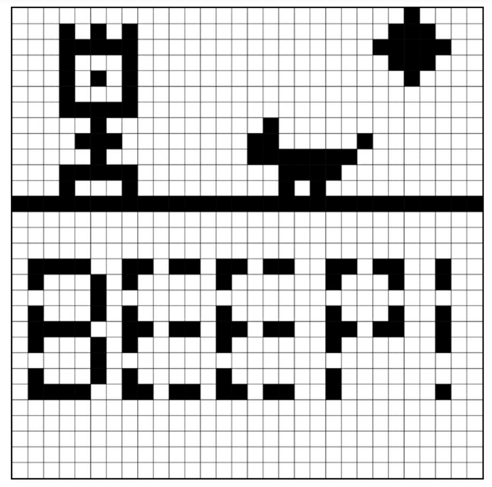
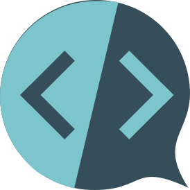
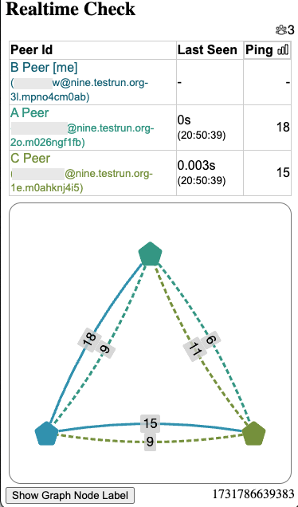

به توسعه اپلیکیشن مقاوم در برابر enshittification علاقه‌مندید؟
پس از نزدیک به دو سال همکاری
با تیم شگفت‌انگیز [Iroh](https://iroh.computer)،
و سال‌ها بحث با متخصصان متعدد در فضای غیرمتمرکزسازی،
خوشحالیم اعلام کنیم که **اپ‌های Delta Chat ۱٫۴۸ روی همه پلتفرم‌ها
پشتیبانی شبکه‌سازی Peer-to-Peer پیشرفته** دارند،
از جمله [hole punching](https://en.wikipedia.org/wiki/Hole_punching_(networking))
و [رمزنگاری سرتاسری با forward secrecy](https://en.wikipedia.org/wiki/Forward_secrecy).
به‌طور مشخص، Delta Chat اکنون شبکه‌های خصوصی Peer-to-Peer
[gossipping](https://en.wikipedia.org/wiki/Gossip_protocol)
بین کاربرانی برقرار می‌کند که [اپ webxdc](https://webxdc.org/apps) را شروع می‌کنند
که از API جدید [joinRealtimeChannel()](https://webxdc.org/docs/spec/joinRealtimeChannel.html) استفاده می‌کند.

<video controls style="width:560px; max-width: 100%;"><source src="https://merlinux.eu/webxdc-realtime-148.mp4" type="video/mp4"></video>

در بخش‌های بعدی، «اپ Pixel» نشان‌داده‌شده در ویدیو
و سایر اپ‌های نمونه بلادرنگ را بحث می‌کنیم، قبل از ارائه پس‌زمینه فنی بیشتر
و یادداشت پایانی درباره اهمیت پروتکل‌ها و مشخصات در تلاش‌هایمان.
اگر می‌خواهید هر اپ webxdc از جمله بلادرنگ‌ها را امتحان کنید:

0. Delta Chat را نصب کنید، پروفایل بسازید و چت با کسی برقرار کنید

1. [روی این لینک دعوت به بات xstore بزنید](https://i.delta.chat/#37DC2B704A2AE2F6A96235CE0C3A0EBCA4F5801D&a=xstore%40testrun.org&n=&i=-1IGtynaivZ&s=JqHsvvcDmnW)
   و صبر کنید تا اپ فروشگاه را دریافت کنید

2. اپ فروشگاه را شروع کنید، اپی برای دانلود انتخاب کنید و سپس آن را با هر چتی به اشتراک بگذارید

## اپ Pixel: کوچک، offline-first و بلادرنگ

[کد منبع اپ pixel](https://codeberg.org/webxdc/pixel/src/commit/8331769a5b3020a11ea789b311585e42c59c123b/script.js) نشان‌داده‌شده در [ویدیوی](https://merlinux.eu/webxdc-realtime-148.mp4) بالا

- شامل ۲۴۱ خط Javascript است (از جمله همه وابستگی‌ها)،

- طراحی پیکسلی مشارکتی بلادرنگ ارائه می‌دهد

- و offline-first است چون نیاز ندارد کاربران هم‌زمان آنلاین باشند.

اپ pixel اتصال ترکیبی offline-first و بلادرنگ خود را
با استفاده از دو API پیام‌رسانی جداگانه webxdc به دست می‌آورد:

- [webxdc.sendUpdate](https://webxdc.org/docs/spec/sendUpdate.html)
  برای رله «به‌روزرسانی‌های اپلیکیشن» از طریق کانال معمولی پیام‌رسان میزبان
  (ایمیل برای Delta Chat، پیام XMPP برای Cheogram و Monocles).

- [realtimeChannel.send](https://webxdc.org/docs/spec/joinRealtimeChannel.html#realtimechannelsenddata)
  برای رله پیام‌های موقت اپلیکیشن به هر شریک چت متصل‌شده P2P.

برای یادگیری نظریه پشت اینکه اپ pixel چگونه «همگام‌سازی نهایی برای همه کاربران» را به دست می‌آورد،
پیشنهاد می‌کنیم در فصل [Shared Web Application state](https://webxdc.org/docs/shared_state/index.html) غوطه‌ور شوید
و سپس [۲۴۱ خط Javascript](https://codeberg.org/webxdc/pixel/src/commit/8331769a5b3020a11ea789b311585e42c59c123b/script.js) را دوباره بخوانید با توجه خاص به «Lamport Clock» —
هیچ framework یا dependency برای استفاده از این فناوری با صدای علمی-تخیلی لازم نیست ;)

اگر می‌خواهید اپ را بهبود دهید، لطفاً فورک کنید و [نسخه خود را ارسال کنید](https://codeberg.org/webxdc/xdcget/src/branch/main/SUBMIT.md).
از قبل فورک [Color Pixel app](https://github.com/DeltaZen/pixel) وجود دارد
که در آن هر شرکت‌کننده پیکسل‌ها را با رنگ متفاوت می‌کشد.

## اپ Pong: فقط-بلادرنگ و پیاده‌سازی همگام‌سازی ساعت

<video controls style="width:150px; max-width: 50%;float:right;margin-left:5px;" autoplay muted loop playsinline><source src="../assets/blog/2024-11-pong2.mp4" type="video/mp4"></video>
[مخزن اپ pong](https://codeberg.org/webxdc/pong/src/branch/main)
پیاده‌سازی ساده دو-نفره [بازی کلاسیک pong](https://en.wikipedia.org/wiki/Pong) را ارائه می‌دهد.
از نظر UX ابتدایی است اما «همگام‌سازی ساعت» پایه را پیاده‌سازی می‌کند
که ملاحظه مهمی برای هر اپ بازی شبکه‌ای بلادرنگ است.

آیا خوب نبود نسخه‌های اصلی‌تر یا مدرن‌تری از Pong داشته باشیم؟
شاید با صدا و رنگ؟
همچنین، برای ارائه «الگوریتم rollback» ممکن است به
[نوشتار توسعه Pong مبتنی بر WebRTC شخص ثالث](https://mitxela.com/projects/webrtc-pong)
نگاه کنید تا بفهمید چه چیزی درگیر است.

به‌هرحال، اگر می‌خواهید این بازی کلاسیک کوچک Pong را بهبود دهید،
لطفاً فورک کنید و [نسخه خود را ارسال کنید](https://codeberg.org/webxdc/xdcget/src/branch/main/SUBMIT.md).

## ویرایشگر بلادرنگ: موقعیت‌های مکان‌نما و همکاری فوری

<video controls style="width:150px; max-width: 50%;float:right;margin-left:5px;" autoplay muted loop playsinline><source src="../assets/blog/2024-11-realtimeditor.mp4" type="video/mp4"></video>
[اپ ویرایشگر بلادرنگ](https://codeberg.org/jagtalon/editor)
ویرایشگر مشارکتی است که می‌تواند مکان‌نماها و تغییرات بلادرنگ را نشان دهد.
با این حال، مشابه اپ pixel بالا، به‌عنوان اپ offline-first هم رفتار می‌کند.
اگر بعداً به اپ ویرایشگر بلادرنگ اشتراک‌گذاری‌شده در چت بپیوندید،
همه تغییرات را به‌طور یکنواخت ترکیب‌شده می‌بینید.
ویرایشگر بلادرنگ فورکی از [ویرایشگر پایه webxdc](https://codeberg.org/webxdc/editor) است
اما با قابلیت‌های بلادرنگ اضافه‌شده.

آیا خوب نبود رنگ‌آمیزی ویرایش‌ها وجود داشته باشد؟
شاید اسلایدری که اجازه دهد در تاریخچه سند به عقب بروید؟
یا شاید راهی برای وارد کردن تصویر به پد بلادرنگ؟

دوباره، اگر می‌توانید این ابزار ویرایشگر را بهبود دهید بیش از خوش‌آمدید.
لطفاً فورک کنید و [نسخه خود را ارسال کنید](https://codeberg.org/webxdc/xdcget/src/branch/main/SUBMIT.md).

## اپ ترمینال Unix: بلادرنگ با بات چت

<video controls style="width:150px; max-width: 50%;float:right;margin-left:5px;" autoplay muted loop playsinline><source src="../assets/blog/2024-11-xdcterm2.mp4" type="video/mp4"></video>
[دموی اپ xdcterm](https://github.com/link2xt/xdcterm) اجازه می‌دهد
بات چت را در Javascript اجرا کنید و سپس از پروفایل چتتان با آن تماس برقرار کنید.
بات گروهی می‌سازد که می‌توانید اعضای بیشتری اضافه کنید
که همه ترمینال مشترک می‌بینند (انگار screen-sharing داخلی است).

اگر می‌خواهید با این اپ ترمینال ابتدایی بازی کنید یا بهبودش دهید،
لطفاً فورک کنید و راحت به ما بگویید.
نمی‌توانید آن را به فروشگاه اپ webxdc ارسال کنید
چون نیاز به بات چت در حال اجرا روی سرور unix-ish دارد.

## Live Chat: چت بلادرنگ داخل چت :)

<video controls style="width:150px; max-width: 50%;float:right;margin-left:5px;clear:both;margin-top:1em;" autoplay muted loop playsinline><source src="../assets/blog/2024-11-livechat2.mp4" type="video/mp4"></video>
[اپ LiveChat](https://github.com/deltazen/live-chat)
چت موقت با نشانگرهای تایپ بلادرنگ
بین هر کسی در گروه چت که live chat را شروع کند ارائه می‌دهد.
پیام‌ها پایدار نیستند و همه تاریخچه پاک می‌شود
وقتی اپ را می‌بندید.
اگر همه کاربران اپ را بسته باشند همه محتوا رفته است.
حالا دارید. چت P2P کاملاً موقت، رمزنگاری‌شده سرتاسری در نوک انگشتانتان :)

می‌توانید اپ Live Chat را در گروه چت بزرگ‌تر موجود استفاده کنید
تا «مکالمه جانبی موقت» سریعی میزبانی کنید که هیچ ترافیک شبکه‌ای
برای سایر اعضای گروه که به live chat نپیوسته‌اند ایجاد نکند.

## آماده‌اید، بازیکن دوم!

برای شروع توسعه اپ webxdc، این خواندنی‌ها را توصیه می‌کنیم:

- [شروع توسعه اپ خودتان](https://webxdc.org/docs/)

- [Shared Web Application state](https://webxdc.org/docs/shared_state/index.html)

- [Webxdc (هیس!) بازپس‌گیری فناوری وب
  Peer-to-Peer](https://delta.chat/en/2024-02-15-webxdc-m3)

- [آوردن حریم خصوصی E2E به وب: چهارمین حسابرسی امنیتی 😅](https://delta.chat/en/2023-05-22-webxdc-security)

لطفاً در تماس با حساب fediverse ما،
[دسته انجمن پشتیبانی webxdc](https://support.delta.chat/c/webxdc/20)
یا سایر آدرس‌های تماس تردید نکنید.

## پس‌زمینه فنی یکپارچه‌سازی Iroh/P2P ما

تمرکز مشترک با تیم Iroh پشتیبانی قابل‌اعتماد از همه پلتفرم‌ها بوده،
از جمله پلتفرم‌های موبایل.
نیم سال گذشته اپ‌های Delta تنظیم آزمایشی اختیاری «webxdc realtime» داشتند
که پس از آزمایش گسترده و رفع باگ، اکنون به‌طور پیش‌فرض فعال است.

### چگونه شبکه‌سازی P2P خصوصی برقرار می‌شود

فقط اگر اپی را شروع کنید که از
[API webxdc.joinRealtimeChannel()](https://webxdc.org/docs/spec/joinRealtimeChannel.html)
استفاده می‌کند،
Delta Chat مشارکت دستگاهتان در شبکه P2P را آغاز می‌کند.
Delta Chat پیام چت «سیستمی» رمزنگاری‌شده سرتاسری به گروه چت می‌فرستد
که حاوی [Iroh Ticket](https://www.iroh.computer/docs/concepts/tickets) است.
وقتی دستگاه‌های دریافت‌کننده هم به کانال بلادرنگ می‌پیوندند،
می‌توانند فوراً اتصال مستقیم برقرار کنند چون تیکت از قبل ثبت شده.
هیچ جستجویی در [جدول هش توزیع‌شده](https://en.wikipedia.org/wiki/Distributed_hash_table) سراسری
اتصال اولیه را کند یا پیچیده نمی‌کند.
**سیستم ایمیل فدرال برای bootstrap شبکه Peer-to-Peer موقت استفاده می‌شود.**

می‌توانید [اپ Realtime Check](https://apps.testrun.org/webxdc-realtime-check-v1.0.5.xdc)
را دانلود کنید
و در چت به اشتراک بگذارید تا تحلیل تأخیر شبکه بین همتاهای پیام‌رسانی بلادرنگ انجام دهید.
از قبل می‌توانید آن را در «Saved Messages» بین دو دستگاه در راه‌اندازی چنددستگاهی اجرا کنید.

برای برقراری اتصال مستقیم P2P،
دو دستگاه علاقه‌مند از [Iroh Relay](https://www.iroh.computer/docs/protocols/net#relays)
استفاده می‌کنند
که معمولاً روی هر [سرور chatmail](https://delta.chat/chatmail) اجرا می‌شود
و فدراسیون ایمیل موجود را بازتاب می‌دهد.
اگر پروفایل چتتان از سرور ایمیل کلاسیک استفاده می‌کند
آنگاه رله پیش‌فرض سراسری استفاده می‌شود که با لطف توسط تیم Iroh اداره می‌شود.

سرور رله Iroh هر دو کارکرد [STUN](https://en.wikipedia.org/wiki/STUN)
و [TURN](https://en.wikipedia.org/wiki/Traversal_Using_Relays_around_NAT) را ترکیب می‌کند
تا به همتاها اجازه دهد یکدیگر را کشف و مستقیماً متصل شوند. علاوه بر این
پیام‌ها را تا زمانی که اتصال مستقیم برقرار نشده رله می‌کند.
برای جزئیات بیشتر لطفاً
[مستندات Rust deltachat::peer_channels](https://rs.delta.chat/deltachat/peer_channels/index.html) را بررسی کنید.

### هویت در شبکه P2P موقت است و رمزنگاری forward-secret است

Delta Chat از هویت‌های رمزنگاری موقت برای هر پیام‌رسانی P2P استفاده می‌کند.
وقتی Delta Chat بسته یا توسط سیستم‌عامل متوقف شود،
هویت موقت جدیدی در شروع بعدی ساخته می‌شود.
علاوه بر این، Iroh از [QUIC](https://en.wikipedia.org/wiki/QUIC) در لایه شبکه استفاده می‌کند
که [Forward Secrecy](https://en.wikipedia.org/wiki/Forward_secrecy) را پیاده‌سازی می‌کند.

هویت‌های موقت و رمزنگاری forward-secret در برابر
مهاجمی که ترافیک شبکه رمزنگاری‌شده را جمع می‌کند
و بعداً دستگاهتان را برای تلاش رمزگشایی ترافیک گذشته ضبط‌شده به خطر می‌اندازد، محافظت می‌کنند.
نه فقط اپ Live Chat بلکه همه اپ‌های webxdc بلادرنگ از
پیام‌رسانی Peer-to-Peer موقت و رمزنگاری‌شده سرتاسری
ارائه‌شده توسط پشته Iroh و یکپارچه‌سازی Delta Chat روی همه پلتفرم‌ها بهره می‌برند.

### یادداشت حریم خصوصی درباره آدرس‌های IP

Delta Chat آدرس‌های IP را هیچ‌جا ذخیره نمی‌کند
و آدرس‌های IP را در رابط کاربری یا به اپ‌های webxdc افشا نمی‌کند.
سرورهای رله Iroh همه آدرس‌های IP
که دستگاه‌های کاربر به یکدیگر تبلیغ می‌کنند را نمی‌بینند (مثلاً رله‌ها آدرس‌های WLAN همتا را نمی‌بینند)
و رله‌ها همچنین هنگام تسهیل اتصال P2P هیچ آدرس IP را ذخیره نمی‌کنند.

با این حال، طرف‌های چت ممکن است از آدرس IP شما مطلع شوند اگر
ابزار نظارت شبکه مستقر کنند یا از نسخه اصلاح‌شده Delta Chat استفاده کنند.
اگر استفاده از اپ‌های webxdc با طرف چت بالقوه خصمانه برایتان نگرانی است
می‌توانید تنظیم «webxdc realtime» را در «advanced settings» غیرفعال کنید تا مطمئن شوید
که Delta Chat هرگز هیچ اتصال Peer-to-Peer با کسی را تلاش نمی‌کند.
فراموش نکنید بعداً هنگام کلیک روی هر لینک HTTPS در چت هم مراقب باشید
چون فرستنده خصمانه می‌تواند از آن هم برای استخراج آدرس IP شما استفاده کند.

## مشخصات، پروتکل‌ها و آزادی خروج

وقتی سایر پیام‌رسان‌های XMPP پشتیبان webxdc مانند [Cheogram](https://cheogram.com) و [Monocles](https://monocles.eu/more/) API بلادرنگ جدید webxdc را پیاده‌سازی کنند،
ملزم به استفاده از Iroh نیستند بلکه می‌توانند
از قابلیت‌های پیام‌رسانی موقت XMPP موجود دیگر استفاده کنند.

[API webxdc.joinRealtimeChannel()](https://webxdc.org/docs/spec/joinRealtimeChannel.html)
یک API سطح‌بالای حداقلی است
که استفاده از آن آسان‌تر از [API کلاسیک WebRTC Browser P2P](https://developer.mozilla.org/en-US/docs/Web/API/RTCPeerConnection) است
چون [پیاده‌کننده پیام‌رسان webxdc](https://webxdc.org/docs/spec/messenger.html)
بار مدیریت همه جنبه‌های اتصال پویا، کشف و مسیریابی شبکه را به دوش می‌کشد.

در واقع خود اپ‌های Delta Chat
می‌توانند برای استفاده از پیاده‌سازی متفاوت برای ارتباطات بلادرنگ webxdc تکامل یابند.
اخیراً در Fediverse یادداشت کرده‌ایم که [پروتکل‌ها و مشخصات آزادی خروج فراهم می‌کنند](https://chaos.social/@delta/113492052382161817)
و مشخصات API بلادرنگ جدید نمونه عملی برای آن است.

## سپاس از NLNET و NGI برای حمایت و چشم‌انداز!

معرفی API بلادرنگ webxdc ما
توسط [NLnet](https://nlnet.nl/) پشتیبانی شده،
که خود توسط برنامه [Next Generation Internet](https://ngi.eu/) کمیسیون اروپا تأمین مالی می‌شود.
