چگونه می‌توانیم اپ‌های وب را تکامل و مستقر کنیم بدون اینکه به توسعه‌دهندگان یا گردانندگان اجازه دهیم «میلیاردر در میان» شوند؟
راه‌های زیادی برای پرداختن به این چالش وجود دارد و
بعضی شامل بنیادهای پروتکل فنی اینترنت هستند.
«وب» و به‌ویژه پروتکل HTTP
استدلالاً نقش بزرگی در تولید میلیاردرهای فناوری
با تمرکز احتمالاً بی‌سابقه قدرت و پول امروز بازی کردند.

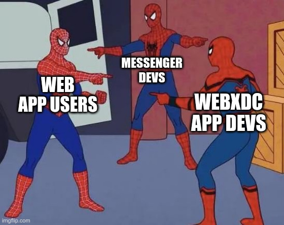
همراه با پیام‌رسان‌های XMPP [Cheogram](https://cheogram.com) و [Monocles](https://monocles.eu)،
و با حمایت بسیاری از متخصصان مشارکت‌کننده در پس‌زمینه،
ما به‌صورت بازیگوشانه به چالش پلتفرم‌های بدون-میلیاردر با
[webxdc](https://webxdc.org) می‌پردازیم؛ فرمت کانتینر و API برای «اپ‌های وب اشتراک‌گذاری‌شده در چت».
از نظر فنی، اپ‌های webxdc [اپ‌های HTML5 sandbox-شده شبکه‌ای](https://delta.chat/en/2023-05-22-webxdc-security) هستند
و به‌جای پروتکل HTTP
از [APIهای ارسال/دریافت Peer-to-Peer](https://webxdc.org/docs/spec/sendUpdate.html)
پیاده‌سازی‌شده توسط پیام‌رسان‌های سازگار با webxdc استفاده می‌کنند
و روابط بین توسعه‌دهندگان و کاربران را با گفتن این‌ها بازتعریف می‌کنند:

- **خداحافظ سرمایه‌داری نظارتی**:
  کاربران هم کد و هم داده اپ‌های وب خود را در دست دارند
  و از پیام‌رسانی رمزنگاری‌شده سرتاسری نه فقط هنگام پیام‌رسانی معمولی چت
  بلکه هنگام استفاده خصوصی از اپ وب بهره می‌برند.

- **خداحافظ پلیس‌گری کاربر (لاگین، گذرواژه، OAUTH، TOS و سیاست‌های حریم خصوصی و غیره)**:
  توسعه‌دهندگان اپ وب هرگز هیچ داده کاربر یا هویت کاربری را به دست نمی‌آورند یا لمس نمی‌کنند،
  و می‌توانند آرامش خاطر داشته باشند که مسئول هیچ داده‌ای نیستند،
  و نیازی به برنامه‌نویسی مدیریت هویت و UIهای کشف اجتماعی ندارند.
  پیام‌رسان‌ها از قبل از طریق تنظیم گروه‌های چت یا اتاق‌ها آن را فراهم می‌کنند.

- **خداحافظ وابستگی به شرکت یا سازمانی که enshittify می‌شود**:
  پیام‌رسان‌ها، به‌عنوان اجراکننده‌های غیرمتمرکز اپ‌های webxdc در گروه‌های چت،
  نمی‌توانند توسعه‌دهندگان اپ وب، کاربران یا داده‌شان را گروگان بگیرند.
  [«Ulysses Pact» از Cory Doctorow](https://pluralistic.net/2024/11/02/ulysses-pact/)
  را برای اینکه چرا این ایده خوبی است ببینید.

همه این‌ها خیلی خوب به نظر می‌رسد که باورنکردنی باشد، درست؟
اما اگر واقعیت دیگری با فقط دراز کردن دست و گرفتنش ممکن باشد چه؟

بیایید به بعضی پیشرفت‌های اخیر جامعه webxdc،
قابلیت‌های جدید اپ webxdc همراه با به‌روزرسانی‌های [مشخصات webxdc](https://webxdc.org/docs/spec/index.html)،
و در نهایت به بعضی اپ‌های webxdc تولیدشده توسط جامعه که از قبل در استفاده روزمره هستند نگاه کنیم؛
به‌عنوان تقریب‌های اولیه کارآمد از چگونگی جایگزینی کل پلتفرم‌های سرمایه‌گذاری مخاطره‌آمیز با یک فایل ZIP :)

## کشف یکپارچه و روان اپ webxdc

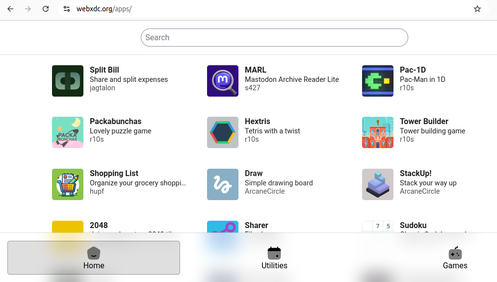
مجموعه curated از اپ‌ها در [https://webxdc.org/apps](https://webxdc.org/apps) در دسترس است که توسط Jag Talon،
طراح frontend سابق DuckDuckGo، به‌طور کامل از نظر UX/UI روان شد.
صفحه وب ایستایی است که جستجوی «tool» و «game»
با توضیحات کوتاه و URL به‌ازای هر اپ ارائه می‌دهد تا بتوانید مردم را به اپ خاصی ارجاع دهید.
منابع صفحه وب از این [فایل فهرست اپ json](https://apps.testrun.org/xdcget-lock.json) می‌آید،
تولیدشده توسط commitها به [مخزن ارسال codeberg](https://codeberg.org/webxdc/xdcget/).
هر کسی می‌تواند pipeline curation خودش را اجرا کند و [رابط وب را دوباره استفاده کند](https://github.com/webxdc/website/tree/main/website/apps).

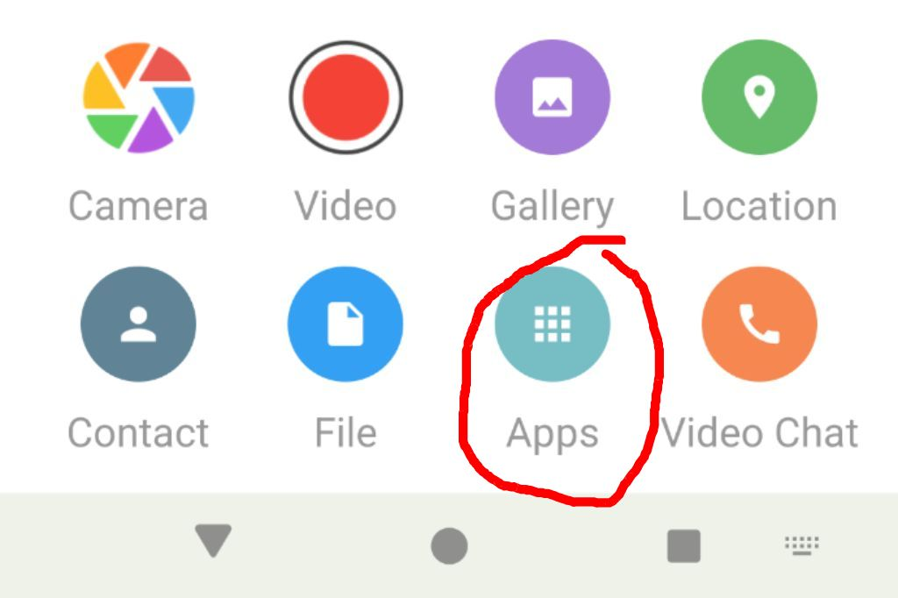
نمای وب جدید «app-store» webxdc طوری طراحی شد که خوب با
پیام‌رسان‌های پشتیبان webxdc از طریق اقدام «attach-app» فیلد ورودی پیام چت یکپارچه شود.
جدا از Cheogram، Monocles و اپ‌های اصلی Delta Chat،
همچنین [ArcaneChat (فورک نرم اندروید)](https://arcanechat.me/) و [DeltaTouch (UI مبتنی بر Lomiri برای گوشی‌های UbuntuTouch و بعضی محیط‌های دسکتاپ)](https://delta.chat/en/2023-07-02-deltatouch)
این اقدام جدید attach-app فوری را ارائه می‌دهند.
اپ‌های Delta Chat app-picker را با داده کش‌شده اجرا می‌کنند تا در زمان‌های آفلاین کار کند.
بیشتر پیام‌رسان‌ها همچنین اجازه می‌دهند URL متفاوتی برای صفحه وب app-picker جایگزین پیکربندی شود.

توجه کنید که سایت‌های فروشگاه اپ webxdc اپ‌ها را *seed* می‌کنند اما بعد از آن چیزی را کنترل نمی‌کنند.
نمی‌توانند هیچ فراداده یا داده محتوایی درباره استفاده جمع‌آوری کنند.
مثل توزیع فایل‌های `.exe` در زمان‌های گذشته است،
فقط [امن‌تر](https://delta.chat/en/2023-05-22-webxdc-security)
و راحت‌تر از طریق سایت‌های curation اپ وب بدون-مجوز و غیرمتمرکز.
متأسفیم GAFAM، نه متأسف.

## اپ‌های webxdc می‌توانند اعلان فوری ایجاد کنند

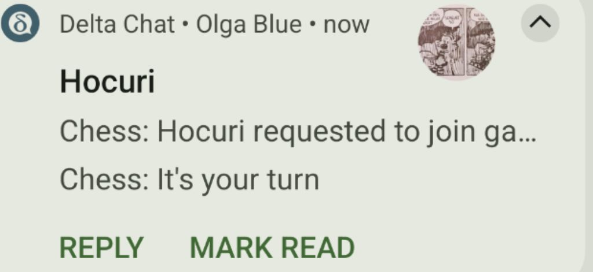

ما به‌طور جمعی مکانیزم اعلان جدید webxdc را مشخص و پیاده‌سازی کردیم تا اپ‌هایی مانند
[Chess](https://webxdc.org/apps/#arcanecircle-chess) بتوانند اعلان سطح سیستم بین کاربران اپ ایجاد کنند یعنی «نوبت توست»،
و تقویم بتواند درباره «طرف چتت تاریخ جلسه جدید اضافه کرد» اطلاع دهد.
توسعه‌دهندگان اپ webxdc از ماشینری اعلان push موجود پیام‌رسان میزبانشان دوباره استفاده می‌کنند
بدون اینکه خودشان بر بوروکراسی compliance گوگل یا اپل فریاد بزنند.
برای اینکه اپ‌های webxdc کاربران را «اعلان» کنند باید فهرستی از *هویت‌ها* را
هنگام [ارسال به‌روزرسانی‌های اپلیکیشن](https://webxdc.org/docs/spec/sendUpdate.html) مشخص کنند.
[مشخصات `webxdc.selfAddr`](https://webxdc.org/docs/spec/selfAddr_and_selfName.html#selfaddr)
جزئیات دامنه هویت جدید با دقت طراحی‌شده «به‌ازای اپ» را توصیف می‌کند.

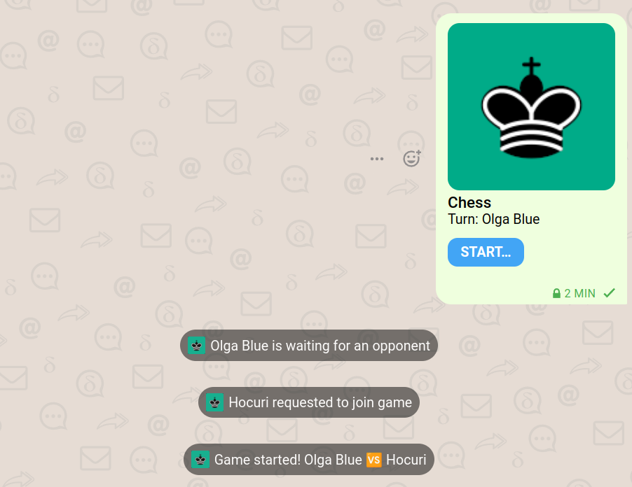

## اپ‌های webxdc می‌توانند محدودیت‌های نرخ ارسال را بپرسند

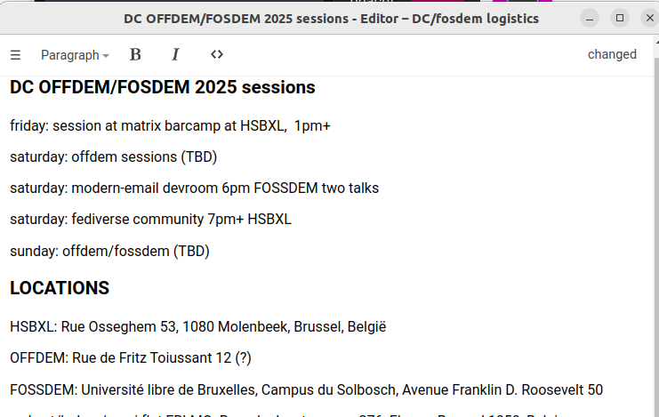
پیام‌رسان‌ها و سرورهای انتقال مختلف «محدودیت‌های نرخ ارسال» متفاوتی دارند،
یعنی چند پیام در بازه زمانی مجاز به ارسال است،
و چند بایت یک به‌روزرسانی اپلیکیشن می‌تواند حمل کند.
[اپ ویرایشگر به‌روزشده](https://webxdc.org/apps/#webxdc-editor) اکنون
[محدودیت‌های sendUpdate](https://webxdc.org/docs/spec/sendUpdate.html#messaging-layer-limits-for-sendupdate) را رعایت می‌کند
و تجربه کاربری تطبیقی‌تر با انتقال روان‌تری فراهم می‌کند.
[کانال‌های بلادرنگ webxdc اخیراً معرفی‌شده](https://delta.chat/en/2024-11-20-webxdc-realtime) محدودیت اندازه مشخص‌شده ۱۲۸ کیلوبایت برای به‌روزرسانی‌های موقت اپلیکیشن دارند.
به‌روزرسانی‌های موقت اپلیکیشن بلادرنگ
فقط بین دستگاه‌هایی توزیع می‌شوند که فعالانه اپ webxdc را اجرا می‌کنند
که [API joinRealtime](https://webxdc.org/docs/spec/joinRealtimeChannel.html) را فراخوانی کرده.

## اپ‌های webxdc می‌توانند روی صفحه اصلی موبایل قرار گیرند

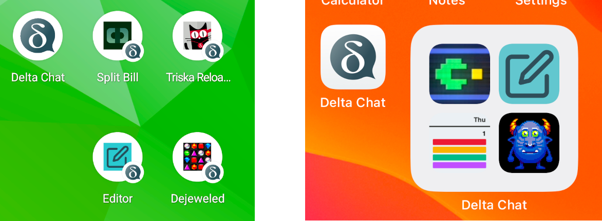

روی گوشی‌های Delta Chat Android و iOS اکنون می‌توانید اپ webxdc در حال اجرا را به صفحه اصلی اضافه کنید.
زدن اپ webxdc روی صفحه اصلی موبایل مستقیماً آن را شروع می‌کند،
و همه‌چیز حتی هنگام آفلاین پاسخگو می‌ماند.
یادتان باشد، هیچ سرور HTTP برای اپ‌های webxdc نیست.
همه حالت اپ webxdc محلی است و هر اپ webxdc به‌روزرسانی‌ها را
فقط با تعامل با «localhost» می‌فرستد و دریافت می‌کند
و همه مسیریابی شبکه واقعی را به پیام‌رسان‌ها می‌سپارد،
در حالی که خودش
[از نشت هر چیزی به اینترنت مسدود شده](https://delta.chat/en/2023-05-22-webxdc-security).

# جایگزینی پلتفرم‌های تأمین‌شده توسط VC با یک فایل ZIP ...

کمبودی از پلتفرم‌های میانجی سوخت‌شده توسط سرمایه مخاطره‌آمیز نیست که
اپ‌های وب یا موبایل «رایگان» (بیشتر اپ‌های وب در لباس مبدل)
برای میانجیگری تعاملات بین حلقه‌های خصوصی ارائه دهند.
اگر می‌توانستید چنین اپ‌هایی را در چت‌های خصوصیتان بدون نیاز به هیچ میانجی،
ثبت‌نام، لاگین و غیره اجرا کنید چه؟
اینجا چند نامزد بامزه فایل zip جایگزینی-پلتفرم-VC هست.

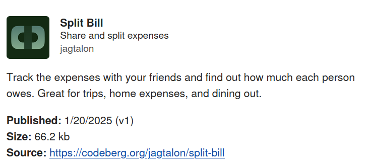

[Split Bill](https://webxdc.org/apps/#jagtalon-splitbill)
به همه در گروه چت اجازه می‌دهد «هزینه‌ها» را ثبت کنند و نمای «تراز»
از اینکه کی الان بدهکار/طلبکار است ارائه می‌دهد.
هر کسی که هزینه وارد کند بخشی از صورتحساب می‌شود اما
اگر هزینه‌ای اضافه نکنید هم می‌توانید «به صورتحساب بپیوندید».
Split Bill عمداً UI پایه ارائه می‌دهد.
اگر تمایل دارید ویژگی‌هایی مثل دکمه «settle up» اضافه کنید،
لطفاً [از مخزن codeberg split-bill](https://codeberg.org/jagtalon/split-bill/) فورک کنید،
شاید به Jag بگویید، و اپ جدیدی به مجموعه webxdc ارسال کنید.
یا شاید ایده‌ای دارید چگونه اپ split-bill را به اپ «solidarity-party»
تکامل دهید تا هنگام سازماندهی حمایت پولی برای افراد نیازمند به حسابداری کمک کند؟

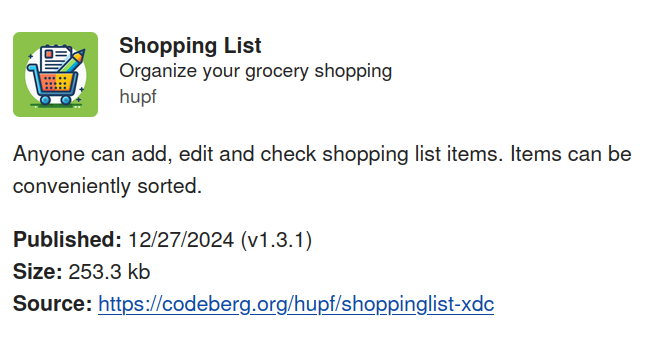

[Shopping List](https://webxdc.org/apps/#shoppinglist)
به خانواده‌ها، دوستان و سایر جمع‌ها اجازه می‌دهد به‌راحتی خرید روزانه را تنظیم کنند.
«اپ لیست خرید» نمای ساده‌ای برای وارد کردن اقلام «گم‌شده»
که وقتی کسی خرید می‌توان «تیک» زد ارائه می‌دهد.
توصیه می‌شود گروه/اتاق چت «خرید» با هدف خاص داشته باشید
تا درباره جزئیات اقلام خرید بپرسید یا روشن کنید.
حتی «حالت تاریک» و آیکونی برای غیرفعال/فعال کردن «اعلان‌های چت»
وقتی لیست-کار-خرید عوض می‌شود وجود دارد.

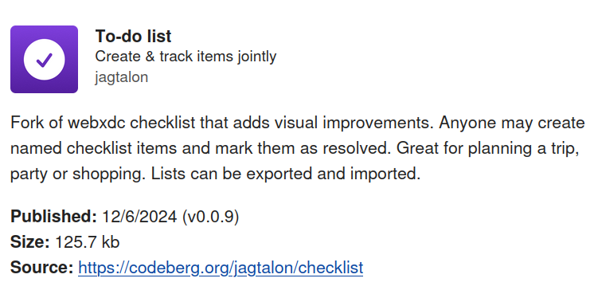

کی لیست‌کارها را دوست ندارد، بلای وجود مدرن؟
حالا می‌توانید آن‌ها را قشنگ در گروه چت انجام دهید.
یا شاید [checklist](https://webxdc.org/apps/#webxdc-checklist) کلاسیک را ترجیح دهید؛
یکی از اولین اپ‌های webxdc در ۲۰۲۳.

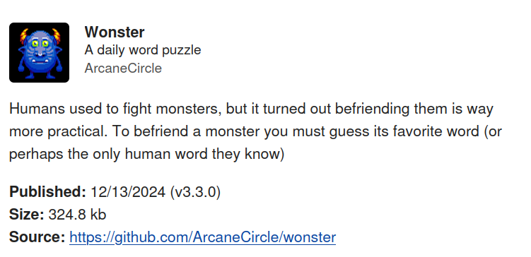

[Wonster](https://webxdc.org/apps/#arcanecircle-wonster)
چالش پازل روزانه محبوب خانوادگی است.
هر گروه چت چالش Wonster منحصربه‌فرد خودش را می‌گیرد.

## اشتراک‌گذاری «نرم‌افزار تمام‌شده» می‌تواند دوباره چیز باشد!

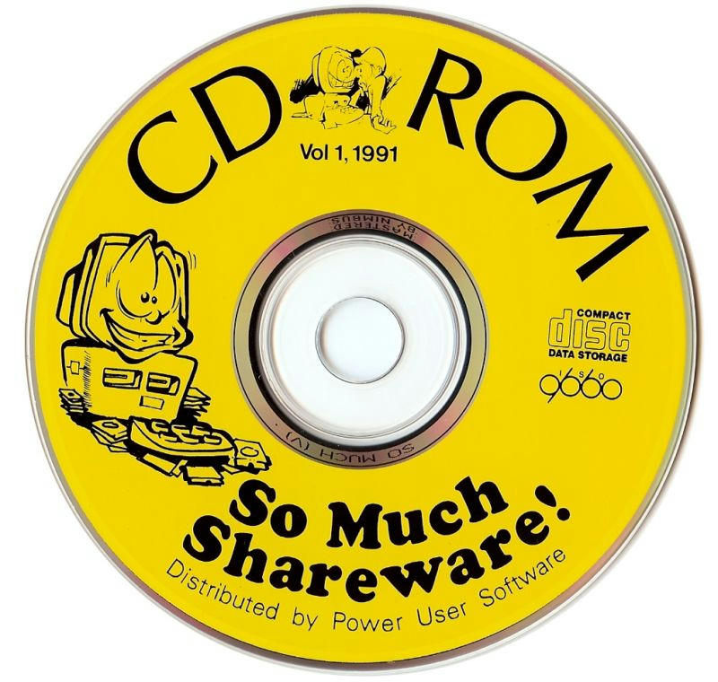

توسعه‌دهندگان اپ webxdc ممکن است اپ را به‌مرور بهبود دهند یا ممکن است روزی تمام کنند.
مشخصات webxdc هدف دارد سازگاری بلندمدت به عقب فراهم کند.
اپ‌های نوشته‌شده قرار است مدت طولانی کار کنند،
روی پیام‌رسان‌های سازگار با webxdc امروز و آینده.
خداحافظ یکپارچگی با frameworkهای پیچیده، وابستگی‌های شکسته،
«ارتقای اجباری سطح API»، toolchainهای جدید یا بوروکراسی فروشگاه مثل
«اگر انطباق با X را اعلام نکنید اپتان delist می‌شود» و غیره.
هیچ‌چیز نمی‌تواند از استفاده از اپ webxdc با دوستان جلوگیری کند اگر در دستتان
فایل zip و پیام‌رسان سازگار با webxdc با گروه/اتاق چت برای «اجرا»ی آن داشته باشید.
بدون نگرانی درباره VPS یا میزبانی وب، DNS یا گواهی SSL. آرامش!

کنجکاو و علاقه‌مند به پیوستن به کمی سرگرمی و کار «جایگزینی-VCها-با-فایل‌های-ZIP»؟
[شروع توسعه webxdc](https://webxdc.org/docs/)
مواد آموزشی و فصل‌های معرفی درباره آنچه درگیر است
وقتی HTTP را با پروتکل‌های Peer-to-Peer جایگزین می‌کنید فراهم می‌کند.

میکروفون را به [Rosano](https://rosano.ca/) شگفت‌انگیز می‌سپاریم
که مدتی پیش ویدیو معرفی مختصر ساخت.
<video controls="" style="width:560px; max-width: 100%;"><source src="https://webxdc.org/assets/just-web-apps.mp4" type="video/mp4"><a href="https://www.youtube.com/watch?v=I1K4pBvb2pI">watch "just web apps" on youtube</a></video>

## سپاس از NLNET و NGI برای حمایت و چشم‌اندازشان!

بیشتر تلاش‌های توصیف‌شده بالا ممکن شد
با چشم‌انداز و حمایت [بودجه‌های مدیریت‌شده توسط NLnet](https://nlnet.nl/)،
با حمایت مالی برنامه
[Next Generation Internet](https://ngi.eu/) کمیسیون اروپا.
